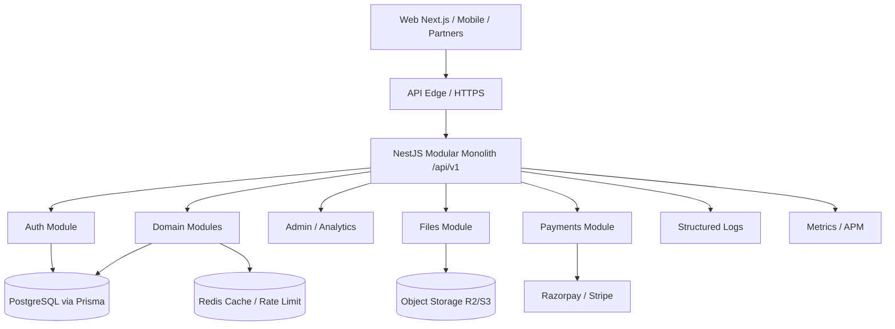
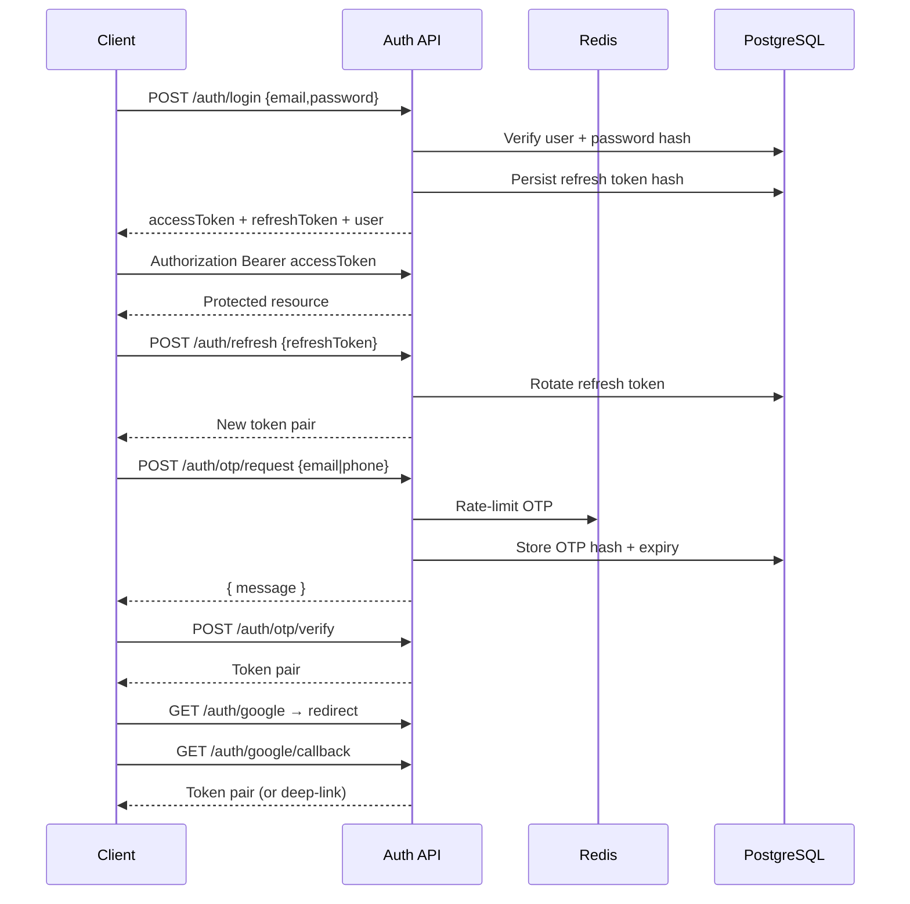
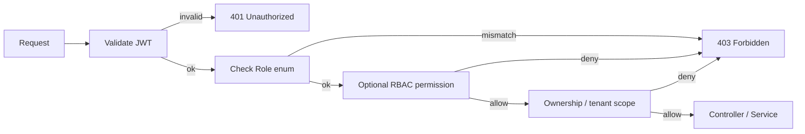
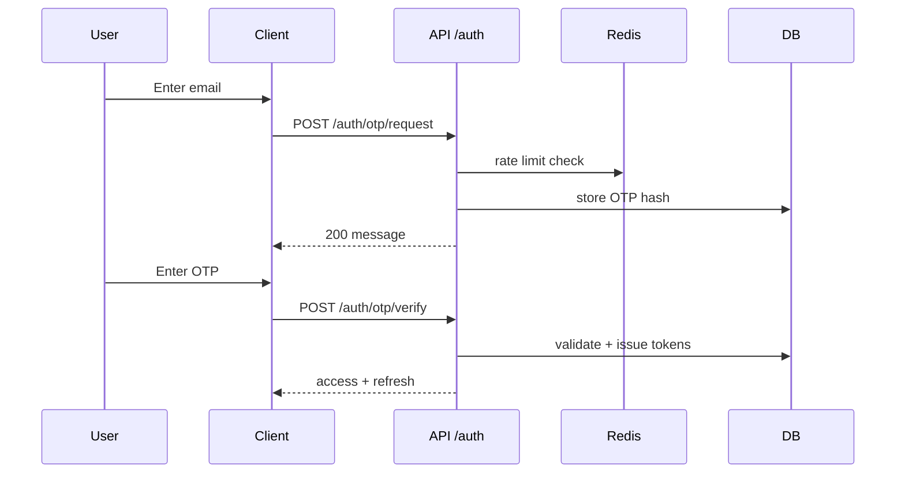
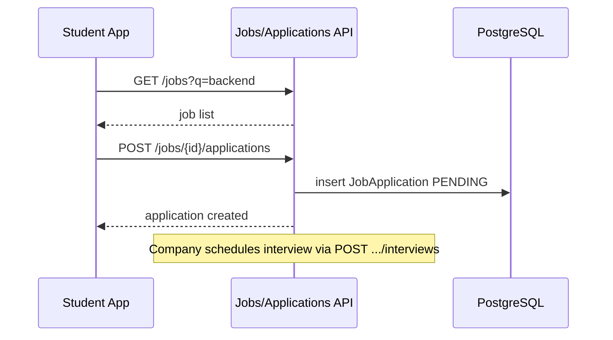
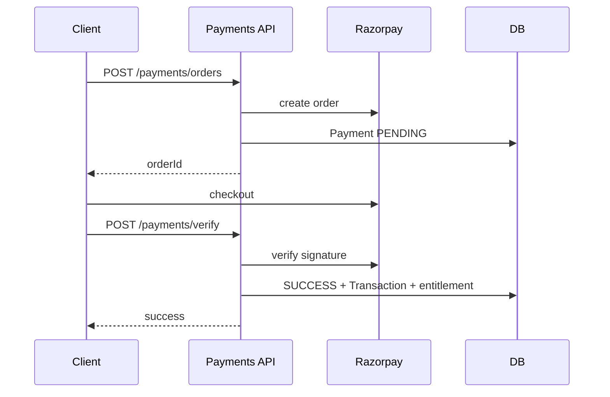
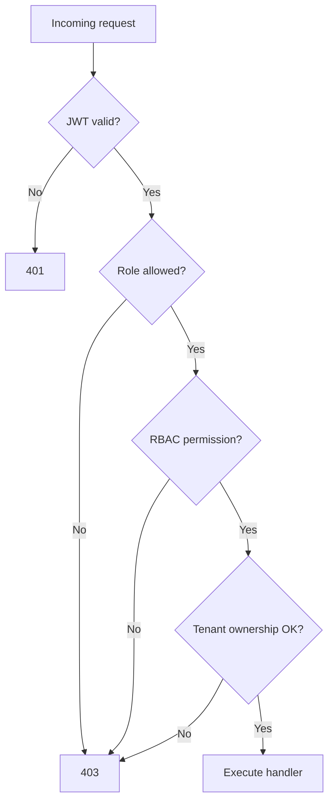

# Ellowring — Enterprise API Design & Documentation

**Ellowring Software Solutions**  
**Product:** Ellowring  
**Tagline:** Learn. Prepare. Build. Get Hired.  
**Vision:** From 11th Standard to First Job — Everything in One Platform.  
**Platform:** Enterprise SaaS Web Application  

| Field | Value |
|---|---|
| Document Type | Enterprise API Design & Integration Specification |
| Version | 1.0 (Phase 5) |
| Date | August 2026 |
| Backend | NestJS (Modular Monolith) |
| API Style | REST (JSON) · GraphQL-ready resource model |
| Auth | JWT (access + refresh) · OTP · Google OAuth 2.0 |
| Companion DB Design | `docs/Ellowring_Database_Design.md` (Phase 4) |
| OpenAPI Artefact | `docs/api/openapi.yaml` |
| Catalogue Generator | `docs/scripts/generate-api-catalogue.js` |
| Classification | Internal / Confidential |
| Audience | Backend, Frontend, Mobile, QA, DevOps, Security |

---

## Document Control

| Version | Date | Author | Change |
|---|---|---|---|
| 1.0 | Aug 2026 | Ellowring Architecture | Initial Phase-5 complete API design — implementable without further API planning |

---

## Table of Contents

1. [Executive Summary](#1-executive-summary)  
2. [API Architecture](#2-api-architecture)  
3. [REST API Standards](#3-rest-api-standards)  
4. [API Naming Convention](#4-api-naming-convention)  
5. [API Versioning](#5-api-versioning)  
6. [Authentication Flow](#6-authentication-flow)  
7. [Authorization Flow](#7-authorization-flow)  
8. [JWT Strategy](#8-jwt-strategy)  
9. [OAuth Strategy](#9-oauth-strategy)  
10. [Request Structure](#10-request-structure)  
11. [Response Structure](#11-response-structure)  
12. [Error Response Format](#12-error-response-format)  
13. [Pagination](#13-pagination)  
14. [Filtering](#14-filtering)  
15. [Sorting](#15-sorting)  
16. [Searching](#16-searching)  
17. [File Upload API](#17-file-upload-api)  
18. [Rate Limiting](#18-rate-limiting)  
19. [API Security](#19-api-security)  
20. [Validation](#20-validation)  
21. [API Logging](#21-api-logging)  
22. [Monitoring](#22-monitoring)  
23. [API Performance](#23-api-performance)  
24. [API Testing](#24-api-testing)  
25. [API Deployment](#25-api-deployment)  

**Appendices**

- [Appendix A — Complete API Catalogue](#appendix-a--complete-api-catalogue)  
- [Appendix B — API Flow & Sequence Diagrams](#appendix-b--api-flow--sequence-diagrams)  
- [Appendix C — HTTP Status & Error Codes](#appendix-c--http-status--error-codes)  
- [Appendix D — OpenAPI / Swagger](#appendix-d--openapi--swagger)  
- [Appendix E — Phase-5 Implementation Gap vs Current Code](#appendix-e--phase-5-implementation-gap-vs-current-code)  

---

# 1. Executive Summary

Ellowring exposes a **versioned REST JSON API** that powers Student, College, HR/Company, Training, Channel Partner, and Admin experiences across coaching, admissions, study abroad, courses, internships, projects, jobs, payroll, wallet, payments, certificates, notifications, analytics, and reports.

**Design thesis:** One NestJS modular monolith publishes a coherent **`/api/v1`** surface with:

| Principle | Decision |
|---|---|
| Contract | OpenAPI 3.0 (`docs/api/openapi.yaml`) as source of truth |
| AuthN | JWT access (short-lived) + refresh rotation · OTP · Google OAuth |
| AuthZ | Coarse `Role` enum + fine-grained RBAC permissions |
| Envelope | Uniform success `{ success, data, meta }` and error `{ success:false, error }` |
| Data model | Aligned 1:1 with Phase-4 Prisma entities |
| Cache | Redis for sessions secondary data, rate limits, hot catalogues |
| Partner | Optional `X-API-Key` enterprise surface under `/api/v1/enterprise` |
| GraphQL | Resource naming and ID strategy kept GraphQL-ready for Phase 6+ |

| Metric | Phase-5 Target |
|---|---|
| Documented endpoints | **193** across all roles/modules |
| Base path | `/api/v1` |
| Content type | `application/json` (multipart for uploads) |
| Default page size | 20 (max 100) |
| Access token TTL | 15 minutes |
| Refresh token TTL | 30 days (rotating) |

This document is detailed enough that Backend, Frontend, Mobile, and QA can integrate **without further API planning**.

### Current vs Phase-5

| Aspect | Current (in repo) | Phase-5 target (this doc) |
|---|---|---|
| Prefix | `/api` | `/api/v1` |
| Auth | JWT login/register/OTP | + refresh, Google, forgot/reset, logout |
| Envelope | Raw Prisma / ad-hoc | Uniform envelope |
| Swagger | None | OpenAPI 3.0 + Nest Swagger |
| Coverage | ~52 endpoints | Full role/module surface |

---

# 2. API Architecture



| Layer | Responsibility |
|---|---|
| Edge | TLS termination, WAF, CDN for static; route API to Nest |
| Nest controllers | Thin HTTP adapters; map DTOs ↔ services |
| Services | Business rules, transactions, RBAC checks |
| Prisma | Persistence against Phase-4 schema |
| Redis | Rate limits, OTP counters, hot GET caches |
| Workers (future) | Email/SMS/WhatsApp/push outbox processing |

**Module ownership (Nest):** `auth`, `students`, `colleges`, `companies`, `training`, `partners`, `coaching`, `courses`, `admissions`, `study-abroad`, `internships`, `projects`, `jobs`, `payroll`, `wallet`, `payments`, `certificates`, `notifications`, `files`, `analytics`, `admin`, `enterprise`.

---

# 3. REST API Standards

| Rule | Standard |
|---|---|
| Protocol | HTTPS only in staging/production |
| Style | Resource-oriented REST |
| Methods | `GET` read · `POST` create/action · `PATCH` partial update · `PUT` full replace (rare) · `DELETE` remove/soft-delete |
| Idempotency | `POST` payments/refunds accept `Idempotency-Key` header |
| Safe methods | `GET`/`HEAD` must not mutate |
| Content negotiation | `Accept: application/json` |
| Dates | ISO-8601 UTC (`2026-08-08T10:30:00.000Z`) |
| Money | Decimal strings in JSON (`"1499.00"`) to avoid float drift |
| IDs | `cuid` strings |
| Nulls | Omit optional response fields or return `null` consistently per resource |
| HATEOAS | Not required; OpenAPI + stable paths instead |

---

# 4. API Naming Convention

| Element | Convention | Example |
|---|---|---|
| Base | `/api/v{major}` | `/api/v1` |
| Collections | plural kebab-case nouns | `/students`, `/job-applications` |
| Nested | parent/{id}/children | `/companies/{id}/jobs` |
| Actions | verb noun as sub-resource when not CRUD | `/auth/otp/request`, `/payments/{id}/refund` |
| Query params | camelCase | `?page=1&pageSize=20&sortBy=createdAt` |
| Path params | `{id}` or `{slug}` | `/courses/{slug}` |
| Headers | Standard + `X-*` for enterprise | `Authorization`, `X-Request-Id`, `X-API-Key` |
| Nest controllers | match resource path | `@Controller('v1/jobs')` under global `api` |

Avoid verbs in collection names (`/getJobs` ✗). Prefer nouns and HTTP verbs.

---

# 5. API Versioning

| Topic | Decision |
|---|---|
| Strategy | URI versioning `/api/v1` |
| Compatibility | Additive changes preferred within `v1` |
| Breaking change | New major `/api/v2`; run parallel ≥ 90 days |
| Deprecation | `Deprecation` + `Sunset` response headers |
| Nest | `app.setGlobalPrefix('api'); app.enableVersioning({ type: VersioningType.URI })` |
| Clients | Pin major version; never call unversioned paths in production |

Current demo code uses unversioned `/api/*`; Phase-5 migration aliases `/api/*` → `/api/v1/*` during transition.

---

# 6. Authentication Flow

Supported methods: **email/password**, **OTP**, **Google OAuth**, **refresh rotation**.



| Endpoint (summary) | Auth |
|---|---|
| Register / Login / OTP / Google / Forgot | Public |
| Refresh | Refresh token body |
| Logout / Profile / Change Password | Access JWT |

Full specs: Appendix A — Authentication.

---

# 7. Authorization Flow



| Layer | Mechanism |
|---|---|
| 1 | `JwtAuthGuard` — must be authenticated |
| 2 | `@Roles(Role.STUDENT, …)` + `RolesGuard` |
| 3 | `@Permissions('jobs.publish')` + RBAC tables (Phase 4) |
| 4 | Tenant scope — companyId / trainingCenterId / partnerId / collegeId from profile |
| 5 | Enterprise — `X-API-Key` + scoped partner policies |

**Role capabilities (summary):**

| Role | Typical permissions |
|---|---|
| STUDENT | Own profile, enrollments, applications, wallet |
| COLLEGE | Own college catalogue, applications, scholarships |
| COMPANY / HR | Own jobs/internships/projects, interviews, payroll |
| TRAINING | Own courses/batches/attendance/revenue |
| PARTNER | Own leads/referrals/commissions/payouts |
| ADMIN | Platform-wide users, CMS, payments ops, analytics |

---

# 8. JWT Strategy

| Claim / Setting | Value |
|---|---|
| Algorithm | HS256 (MVP) · RS256 recommended for multi-service |
| Access secret | `JWT_ACCESS_SECRET` |
| Access TTL | `15m` |
| Refresh secret | `JWT_REFRESH_SECRET` (different) |
| Refresh TTL | `30d` |
| Access payload | `sub` (userId), `email`, `role`, `jti` |
| Refresh storage | Hash in `refresh_tokens`; rotate on use; reuse detection revokes family |
| Transport | `Authorization: Bearer <accessToken>` |
| Clock skew | 30 seconds |

**Never** put PII beyond email/role in JWT. Revocation of access tokens relies on short TTL; sensitive actions re-check `users.isActive` and `deletedAt`.

---

# 9. OAuth Strategy

**Google Sign-In (OpenID Connect)**

| Item | Detail |
|---|---|
| Flows | Authorization Code (+ PKCE for mobile/SPA) |
| Nest | `@nestjs/passport` GoogleStrategy |
| Env | `GOOGLE_CLIENT_ID`, `GOOGLE_CLIENT_SECRET`, `GOOGLE_CALLBACK_URL` |
| Scopes | `openid email profile` |
| Account link | Match on verified Google email; else create STUDENT (or selected role) user |
| Response | Same token pair as password login |
| Failure | Redirect with `?error=` or JSON for native |

Enterprise partners may use **API keys** instead of user OAuth for M2M.

---

# 10. Request Structure

### Headers (common)

| Header | Required | Description |
|---|---|---|
| `Authorization` | Conditional | `Bearer <accessToken>` |
| `Content-Type` | Write APIs | `application/json` or `multipart/form-data` |
| `Accept` | Recommended | `application/json` |
| `X-Request-Id` | Recommended | Client correlation UUID |
| `Idempotency-Key` | Payments/refunds | UUID per logical operation |
| `X-API-Key` | Enterprise | Partner key |

### Body

- JSON objects; snake_case **not** used — **camelCase** field names matching Prisma/TS.
- Arrays allowed for bulk where documented.
- Empty body forbidden on `POST` create unless explicitly action-only.

### Path & query

- Path: resource identifiers.
- Query: pagination, filters, sort, search (sections 13–16).

---

# 11. Response Structure

### Success envelope

```json
{
  "success": true,
  "data": {},
  "meta": {
    "requestId": "req_01HZX...",
    "timestamp": "2026-08-08T10:30:00.000Z"
  }
}
```

### Collection envelope

```json
{
  "success": true,
  "data": [],
  "meta": {
    "requestId": "req_01HZX...",
    "timestamp": "2026-08-08T10:30:00.000Z",
    "pagination": {
      "page": 1,
      "pageSize": 20,
      "totalItems": 135,
      "totalPages": 7,
      "hasNext": true,
      "hasPrev": false
    }
  }
}
```

Single-resource `POST`/`PATCH` return the created/updated entity in `data`.  
`DELETE` returns `data: { id, deleted: true }` or `204` where documented (prefer envelope `200` for client uniformity).

**Nest implementation:** global `ResponseInterceptor` wrapping controller returns.

---

# 12. Error Response Format

```json
{
  "success": false,
  "error": {
    "code": "VALIDATION_ERROR",
    "message": "Request validation failed",
    "details": [
      { "field": "email", "message": "must be an email" }
    ],
    "requestId": "req_01HZX...",
    "timestamp": "2026-08-08T10:30:00.000Z"
  }
}
```

| HTTP | code (examples) |
|---|---|
| 400 | `VALIDATION_ERROR`, `BAD_REQUEST` |
| 401 | `UNAUTHORIZED`, `TOKEN_EXPIRED`, `INVALID_CREDENTIALS` |
| 403 | `FORBIDDEN`, `INSUFFICIENT_ROLE` |
| 404 | `NOT_FOUND` |
| 409 | `CONFLICT`, `DUPLICATE_EMAIL` |
| 422 | `UNPROCESSABLE_ENTITY`, `BUSINESS_RULE_VIOLATION` |
| 429 | `RATE_LIMITED` |
| 500 | `INTERNAL_ERROR` |
| 503 | `SERVICE_UNAVAILABLE` |

Do **not** return `{ error: "..." }` with HTTP 200 (current demo anti-pattern — eliminated in Phase 5).

---

# 13. Pagination

| Param | Type | Default | Max | Description |
|---|---|---|---|---|
| `page` | int ≥ 1 | 1 | — | Page number |
| `pageSize` | int | 20 | 100 | Items per page |

Cursor pagination (`cursor`, `limit`) optional for infinite feeds (notifications, audit logs).

Always return `meta.pagination` on list endpoints.

---

# 14. Filtering

| Pattern | Example |
|---|---|
| Exact | `?status=ACTIVE` |
| Multiple | `?status=ACTIVE,PENDING` (parsed as IN) |
| Range | `?createdFrom=2026-01-01&createdTo=2026-12-31` |
| Numeric | `?salaryMin=500000&salaryMax=1200000` |
| Boolean | `?isPublished=true` |
| Relation | `?companyId=clx...` |

Unknown filter keys → `400 VALIDATION_ERROR`.

---

# 15. Sorting

| Param | Example |
|---|---|
| `sortBy` | `createdAt`, `title`, `salaryMax` (whitelist per resource) |
| `sortOrder` | `asc` \| `desc` (default `desc` for time fields) |

Invalid `sortBy` → `400`. Default documented per endpoint.

---

# 16. Searching

| Param | Behavior |
|---|---|
| `q` | Case-insensitive search across whitelisted text columns |
| Length | 1–100 chars |
| Engine (future) | PostgreSQL `ILIKE` / `tsvector`; Elasticsearch optional later |

Example: `GET /api/v1/jobs?q=backend&location=Pune&sortBy=createdAt&sortOrder=desc`

---

# 17. File Upload API

| Topic | Standard |
|---|---|
| Protocol | `multipart/form-data` |
| Field name | `file` (primary) |
| Max size | Image 5 MB · PDF/Resume 10 MB · Certificate 10 MB |
| Allowed MIME | Image: jpeg/png/webp · Docs: pdf · Resume: pdf/doc/docx |
| Virus scan | Async quarantine (production) |
| Storage | Private bucket; return `fileId` + signed download URL |
| Response | `{ fileId, url, mimeType, sizeBytes, purpose }` |

Endpoints: Appendix A — File Management.

---

# 18. Rate Limiting

| Bucket | Limit (default) | Key |
|---|---|---|
| Public reads | 120 / min / IP | IP |
| Auth login | 10 / min / IP+email | IP+email |
| OTP request | 5 / 10 min / target | email/phone |
| Authenticated | 300 / min / user | userId |
| Payments | 30 / min / user | userId |
| Uploads | 20 / min / user | userId |

Response headers: `X-RateLimit-Limit`, `X-RateLimit-Remaining`, `Retry-After` on 429.  
Storage: Redis sliding window.

---

# 19. API Security

| Control | Requirement |
|---|---|
| TLS | 1.2+ |
| CORS | Explicit origin allowlist (`CORS_ORIGIN`) |
| Helmet | Security headers |
| Secrets | Env / secret manager; never in repo |
| Password | bcrypt/argon2; min length 8 Phase-5 |
| Injection | Parameterized Prisma only |
| Mass assignment | DTO whitelist (`forbidNonWhitelisted`) |
| SSRF | Validate upload/callback URLs |
| Admin | MFA recommended for ADMIN |
| Audit | Persist authz failures & money mutations to `audit_logs` |

---

# 20. Validation

| Layer | Tool |
|---|---|
| DTO | `class-validator` + `class-transformer` |
| Pipe | Global `ValidationPipe` (`whitelist`, `transform`, `forbidNonWhitelisted`) |
| Business | Service-level checks → `422 BUSINESS_RULE_VIOLATION` |
| OpenAPI | Mirror constraints in `openapi.yaml` |

Common rules: email normalized lowercase; phone E.164; money ≥ 0; enums exact; cuid path params.

---

# 21. API Logging

| Field | Example |
|---|---|
| `requestId` | From header or generated |
| `userId` | If authenticated |
| `method` / `path` | `POST /api/v1/jobs` |
| `statusCode` | 201 |
| `durationMs` | 42 |
| `ip` / `userAgent` | truncated |
| Errors | stack in non-prod only |

PII redaction: passwords, OTP, tokens, card data never logged.  
Ship to stdout JSON → aggregator (CloudWatch / Datadog).

---

# 22. Monitoring

| Signal | Target |
|---|---|
| Availability | `/api/v1/health` + `/api/v1/health/ready` |
| Latency | p50 / p95 / p99 per route |
| Error rate | 5xx < 1% |
| Saturation | DB pool, Redis, CPU |
| Business | payments success %, application funnel |

Alert on: elevated 5xx, payment provider failures, OTP spike, queue lag.

---

# 23. API Performance

| Technique | Application |
|---|---|
| Cache | Redis GET for published catalogues (courses, jobs list) TTL 30–120s |
| ETag / Cache-Control | Public catalogues |
| N+1 avoidance | Prisma `include` / `select` projection |
| Pagination | Mandatory on large lists |
| Connection pool | PgBouncer when scaled |
| Compression | gzip/br at edge |
| Async | Notifications/emails via outbox |

---

# 24. API Testing

| Layer | Practice |
|---|---|
| Unit | Services + pure validators |
| Integration | Supertest + test Postgres |
| Contract | OpenAPI spectral / schemathesis |
| E2E | Critical journeys: register → enroll → pay → apply |
| Security | Authz matrix tests per role |
| Load | k6 on login, job list, payment verify |

QA uses Appendix A examples + Postman collection exported from OpenAPI.

---

# 25. API Deployment

| Env | Base URL (example) |
|---|---|
| Local | `http://localhost:4000/api/v1` |
| Staging | `https://api-staging.ellowring.com/api/v1` |
| Production | `https://api.ellowring.com/api/v1` |

| Concern | Practice |
|---|---|
| CI | Lint → test → build → migrate → deploy |
| Migrations | Prisma migrate deploy pre-traffic |
| Secrets | Injected at runtime |
| Rollback | Previous container + DB forward-only migrations |
| Swagger UI | `/api/docs` (staging always; prod behind ADMIN or disabled) |
| Zero-downtime | Rolling deploy; readiness probe on `/health/ready` |

---

*End of narrative chapters. Complete endpoint catalogue, diagrams, status codes, and OpenAPI follow in Appendices.

---

## Appendix A — Complete API Catalogue

Base URL: `{HOST}/api/v1` (local: `http://localhost:4000/api/v1`).

Each endpoint below is Phase-5 contract. Companion machine-readable spec: `docs/api/openapi.yaml`.

### Module: Authentication

| # | Method | Path | Auth | Purpose |
|---|---|---|---|---|
| 1 | POST | `/auth/register` | Public | Register a new user and role profile; returns JWT access + refresh pair. |
| 2 | POST | `/auth/login` | Public | Email/password login; returns rotated token pair. |
| 3 | GET | `/auth/google` | Public | Start Google OAuth authorization (browser redirect). |
| 4 | GET | `/auth/google/callback` | Public | Google OAuth callback; exchanges code for Ellowring tokens. |
| 5 | POST | `/auth/otp/request` | Public | Request OTP for passwordless login or verification. |
| 6 | POST | `/auth/otp/verify` | Public | Verify OTP and issue token pair. |
| 7 | POST | `/auth/forgot-password` | Public | Start password reset; emails/SMS reset link or OTP. |
| 8 | POST | `/auth/reset-password` | Public | Complete password reset with token. |
| 9 | POST | `/auth/refresh` | Refresh token | Rotate refresh token; issue new access + refresh. |
| 10 | POST | `/auth/logout` | JWT | Logout; revoke refresh token (and optional all sessions). |
| 11 | GET | `/auth/me` | JWT | Get authenticated user profile with role extensions. |
| 12 | POST | `/auth/change-password` | JWT | Change password for authenticated user. |
| 13 | PATCH | `/auth/profile` | JWT | Update basic profile fields (name, phone, avatar). |

#### `POST /api/v1/auth/register`

**Purpose:** Register a new user and role profile; returns JWT access + refresh pair.

| Attribute | Value |
|---|---|
| Endpoint | `/api/v1/auth/register` |
| HTTP Method | `POST` |
| Authentication | Public |
| Roles | — |

**Headers**

- `Content-Type: application/json`
- `Accept: application/json`

**Request Parameters (path)**

| Name | Type / Notes |
|---|---|
| — | — |

**Request Parameters (query)**

| Name | Type / Notes |
|---|---|
| — | — |

**Request Body**

```json
{
  "email": "string",
  "password": "string(min8)",
  "name": "string",
  "phone": "string?",
  "role": "STUDENT|COLLEGE|COMPANY|TRAINING|PARTNER",
  "orgName": "string?",
  "grade": "string?",
  "stream": "string?"
}
```

**Success Response**

```json
{
  "success": true,
  "data": {
    "accessToken": "eyJ...",
    "refreshToken": "rt_...",
    "user": {
      "id": "clx...",
      "email": "student@ellowring.com",
      "name": "Asha Student",
      "role": "STUDENT"
    }
  },
  "meta": {
    "requestId": "req_01EXAMPLE",
    "timestamp": "2026-08-08T10:30:00.000Z"
  }
}
```

**Error Response**

- 400 VALIDATION_ERROR
- 401 INVALID_CREDENTIALS
- 409 CONFLICT
- 429 RATE_LIMITED
- 409 DUPLICATE_EMAIL

Standard error envelope — see Section 12.

**Validation Rules**

- email required unique lowercase
- password min 8
- name required
- role enum

**Business Rules**

- Creates User + matching profile (Student/CollegeProfile/Company/TrainingCenter/Partner)
- Issues tokens; sends verify email/OTP optionally
- Default role STUDENT

**Example Request**

```http
POST /api/v1/auth/register
{
  "email": "student@ellowring.com",
  "password": "password123",
  "name": "Asha Student",
  "role": "STUDENT",
  "grade": "12",
  "stream": "PCM"
}
```

**Example Response**

```json
{
  "success": true,
  "data": {
    "accessToken": "eyJ...",
    "refreshToken": "rt_...",
    "user": {
      "id": "clx...",
      "email": "student@ellowring.com",
      "name": "Asha Student",
      "role": "STUDENT"
    }
  },
  "meta": {
    "requestId": "req_01EXAMPLE",
    "timestamp": "2026-08-08T10:30:00.000Z"
  }
}
```

#### `POST /api/v1/auth/login`

**Purpose:** Email/password login; returns rotated token pair.

| Attribute | Value |
|---|---|
| Endpoint | `/api/v1/auth/login` |
| HTTP Method | `POST` |
| Authentication | Public |
| Roles | — |

**Headers**

- `Content-Type: application/json`
- `Accept: application/json`

**Request Parameters (path)**

| Name | Type / Notes |
|---|---|
| — | — |

**Request Parameters (query)**

| Name | Type / Notes |
|---|---|
| — | — |

**Request Body**

```json
{
  "email": "string",
  "password": "string"
}
```

**Success Response**

```json
{
  "success": true,
  "data": {
    "accessToken": "eyJ...",
    "refreshToken": "rt_...",
    "user": {
      "id": "clx...",
      "email": "student@ellowring.com",
      "role": "STUDENT"
    }
  },
  "meta": {
    "requestId": "req_01EXAMPLE",
    "timestamp": "2026-08-08T10:30:00.000Z"
  }
}
```

**Error Response**

- 400 VALIDATION_ERROR
- 401 INVALID_CREDENTIALS
- 409 CONFLICT
- 429 RATE_LIMITED

Standard error envelope — see Section 12.

**Validation Rules**

- email required
- password required

**Business Rules**

- Rejects inactive/soft-deleted users
- Updates lastLoginAt
- Creates refresh_tokens row

**Example Request**

```http
POST /api/v1/auth/login
{"email":"student@ellowring.com","password":"password123"}
```

**Example Response**

```json
{
  "success": true,
  "data": {
    "accessToken": "eyJ...",
    "refreshToken": "rt_...",
    "user": {
      "id": "clx...",
      "email": "student@ellowring.com",
      "role": "STUDENT"
    }
  },
  "meta": {
    "requestId": "req_01EXAMPLE",
    "timestamp": "2026-08-08T10:30:00.000Z"
  }
}
```

#### `GET /api/v1/auth/google`

**Purpose:** Start Google OAuth authorization (browser redirect).

| Attribute | Value |
|---|---|
| Endpoint | `/api/v1/auth/google` |
| HTTP Method | `GET` |
| Authentication | Public |
| Roles | — |

**Headers**

- `Accept: text/html`

**Request Parameters (path)**

| Name | Type / Notes |
|---|---|
| — | — |

**Request Parameters (query)**

| Name | Type / Notes |
|---|---|
| redirectUri | string? |

**Request Body**

_No request body._

**Success Response**

```json
{
  "note": "302 Redirect to Google consent screen"
}
```

**Error Response**

- 503 SERVICE_UNAVAILABLE if Google not configured

Standard error envelope — see Section 12.

**Validation Rules**

- redirectUri must be allowlisted when present

**Business Rules**

- Uses OAuth authorization code + PKCE for SPA/mobile

**Example Request**

```http
GET /api/v1/auth/google HTTP/1.1
```

**Example Response**

```json
{
  "note": "302 Redirect to Google consent screen"
}
```

#### `GET /api/v1/auth/google/callback`

**Purpose:** Google OAuth callback; exchanges code for Ellowring tokens.

| Attribute | Value |
|---|---|
| Endpoint | `/api/v1/auth/google/callback` |
| HTTP Method | `GET` |
| Authentication | Public |
| Roles | — |

**Headers**

- _(none)_

**Request Parameters (path)**

| Name | Type / Notes |
|---|---|
| — | — |

**Request Parameters (query)**

| Name | Type / Notes |
|---|---|
| code | string |
| state | string |

**Request Body**

_No request body._

**Success Response**

```json
{
  "success": true,
  "data": {
    "accessToken": "eyJ...",
    "refreshToken": "rt_...",
    "user": {
      "id": "clx...",
      "email": "user@gmail.com",
      "role": "STUDENT"
    }
  },
  "meta": {
    "requestId": "req_01EXAMPLE",
    "timestamp": "2026-08-08T10:30:00.000Z"
  }
}
```

**Error Response**

- 400 BAD_REQUEST
- 401 UNAUTHORIZED

Standard error envelope — see Section 12.

**Validation Rules**

- code required

**Business Rules**

- Links or creates user by verified Google email

**Example Request**

```http
GET /api/v1/auth/google/callback HTTP/1.1
```

**Example Response**

```json
{
  "success": true,
  "data": {
    "accessToken": "eyJ...",
    "refreshToken": "rt_...",
    "user": {
      "id": "clx...",
      "email": "user@gmail.com",
      "role": "STUDENT"
    }
  },
  "meta": {
    "requestId": "req_01EXAMPLE",
    "timestamp": "2026-08-08T10:30:00.000Z"
  }
}
```

#### `POST /api/v1/auth/otp/request`

**Purpose:** Request OTP for passwordless login or verification.

| Attribute | Value |
|---|---|
| Endpoint | `/api/v1/auth/otp/request` |
| HTTP Method | `POST` |
| Authentication | Public |
| Roles | — |

**Headers**

- `Content-Type: application/json`
- `Accept: application/json`

**Request Parameters (path)**

| Name | Type / Notes |
|---|---|
| — | — |

**Request Parameters (query)**

| Name | Type / Notes |
|---|---|
| — | — |

**Request Body**

```json
{
  "email": "string?",
  "phone": "string?",
  "purpose": "LOGIN|REGISTER|VERIFY"
}
```

**Success Response**

```json
{
  "success": true,
  "data": {
    "message": "OTP sent",
    "expiresInSeconds": 600
  },
  "meta": {
    "requestId": "req_01EXAMPLE",
    "timestamp": "2026-08-08T10:30:00.000Z"
  }
}
```

**Error Response**

- 400 VALIDATION_ERROR
- 404 NOT_FOUND
- 429 RATE_LIMITED

Standard error envelope — see Section 12.

**Validation Rules**

- email or phone required
- purpose enum

**Business Rules**

- Rate-limited in Redis
- Stores hashed OTP with expiry
- Demo may return demoOtp only in non-prod

**Example Request**

```http
POST /api/v1/auth/otp/request HTTP/1.1
```

**Example Response**

```json
{
  "success": true,
  "data": {
    "message": "OTP sent",
    "expiresInSeconds": 600
  },
  "meta": {
    "requestId": "req_01EXAMPLE",
    "timestamp": "2026-08-08T10:30:00.000Z"
  }
}
```

#### `POST /api/v1/auth/otp/verify`

**Purpose:** Verify OTP and issue token pair.

| Attribute | Value |
|---|---|
| Endpoint | `/api/v1/auth/otp/verify` |
| HTTP Method | `POST` |
| Authentication | Public |
| Roles | — |

**Headers**

- `Content-Type: application/json`
- `Accept: application/json`

**Request Parameters (path)**

| Name | Type / Notes |
|---|---|
| — | — |

**Request Parameters (query)**

| Name | Type / Notes |
|---|---|
| — | — |

**Request Body**

```json
{
  "email": "string?",
  "phone": "string?",
  "code": "string",
  "purpose": "string"
}
```

**Success Response**

```json
{
  "success": true,
  "data": {
    "accessToken": "eyJ...",
    "refreshToken": "rt_...",
    "user": {
      "id": "clx...",
      "role": "STUDENT"
    }
  },
  "meta": {
    "requestId": "req_01EXAMPLE",
    "timestamp": "2026-08-08T10:30:00.000Z"
  }
}
```

**Error Response**

- 400 VALIDATION_ERROR
- 401 UNAUTHORIZED
- 410 GONE expired

Standard error envelope — see Section 12.

**Validation Rules**

- code 4-8 digits
- purpose required

**Business Rules**

- Single-use OTP
- Marks user verified when purpose=VERIFY

**Example Request**

```http
POST /api/v1/auth/otp/verify HTTP/1.1
```

**Example Response**

```json
{
  "success": true,
  "data": {
    "accessToken": "eyJ...",
    "refreshToken": "rt_...",
    "user": {
      "id": "clx...",
      "role": "STUDENT"
    }
  },
  "meta": {
    "requestId": "req_01EXAMPLE",
    "timestamp": "2026-08-08T10:30:00.000Z"
  }
}
```

#### `POST /api/v1/auth/forgot-password`

**Purpose:** Start password reset; emails/SMS reset link or OTP.

| Attribute | Value |
|---|---|
| Endpoint | `/api/v1/auth/forgot-password` |
| HTTP Method | `POST` |
| Authentication | Public |
| Roles | — |

**Headers**

- `Content-Type: application/json`
- `Accept: application/json`

**Request Parameters (path)**

| Name | Type / Notes |
|---|---|
| — | — |

**Request Parameters (query)**

| Name | Type / Notes |
|---|---|
| — | — |

**Request Body**

```json
{
  "email": "string"
}
```

**Success Response**

```json
{
  "success": true,
  "data": {
    "message": "If the account exists, reset instructions were sent"
  },
  "meta": {
    "requestId": "req_01EXAMPLE",
    "timestamp": "2026-08-08T10:30:00.000Z"
  }
}
```

**Error Response**

- 400 VALIDATION_ERROR
- 429 RATE_LIMITED

Standard error envelope — see Section 12.

**Validation Rules**

- email required

**Business Rules**

- Always generic success to prevent enumeration
- Writes password_resets hash

**Example Request**

```http
POST /api/v1/auth/forgot-password HTTP/1.1
```

**Example Response**

```json
{
  "success": true,
  "data": {
    "message": "If the account exists, reset instructions were sent"
  },
  "meta": {
    "requestId": "req_01EXAMPLE",
    "timestamp": "2026-08-08T10:30:00.000Z"
  }
}
```

#### `POST /api/v1/auth/reset-password`

**Purpose:** Complete password reset with token.

| Attribute | Value |
|---|---|
| Endpoint | `/api/v1/auth/reset-password` |
| HTTP Method | `POST` |
| Authentication | Public |
| Roles | — |

**Headers**

- `Content-Type: application/json`
- `Accept: application/json`

**Request Parameters (path)**

| Name | Type / Notes |
|---|---|
| — | — |

**Request Parameters (query)**

| Name | Type / Notes |
|---|---|
| — | — |

**Request Body**

```json
{
  "token": "string",
  "newPassword": "string(min8)"
}
```

**Success Response**

```json
{
  "success": true,
  "data": {
    "message": "Password updated"
  },
  "meta": {
    "requestId": "req_01EXAMPLE",
    "timestamp": "2026-08-08T10:30:00.000Z"
  }
}
```

**Error Response**

- 400 VALIDATION_ERROR
- 401 UNAUTHORIZED
- 410 GONE

Standard error envelope — see Section 12.

**Validation Rules**

- token required
- newPassword min 8

**Business Rules**

- Invalidates sessions and refresh tokens for user

**Example Request**

```http
POST /api/v1/auth/reset-password HTTP/1.1
```

**Example Response**

```json
{
  "success": true,
  "data": {
    "message": "Password updated"
  },
  "meta": {
    "requestId": "req_01EXAMPLE",
    "timestamp": "2026-08-08T10:30:00.000Z"
  }
}
```

#### `POST /api/v1/auth/refresh`

**Purpose:** Rotate refresh token; issue new access + refresh.

| Attribute | Value |
|---|---|
| Endpoint | `/api/v1/auth/refresh` |
| HTTP Method | `POST` |
| Authentication | Refresh token |
| Roles | — |

**Headers**

- `Content-Type: application/json`
- `Accept: application/json`

**Request Parameters (path)**

| Name | Type / Notes |
|---|---|
| — | — |

**Request Parameters (query)**

| Name | Type / Notes |
|---|---|
| — | — |

**Request Body**

```json
{
  "refreshToken": "string"
}
```

**Success Response**

```json
{
  "success": true,
  "data": {
    "accessToken": "eyJ...",
    "refreshToken": "rt_new..."
  },
  "meta": {
    "requestId": "req_01EXAMPLE",
    "timestamp": "2026-08-08T10:30:00.000Z"
  }
}
```

**Error Response**

- 401 UNAUTHORIZED
- 401 TOKEN_REUSE_DETECTED

Standard error envelope — see Section 12.

**Validation Rules**

- refreshToken required

**Business Rules**

- Rotate and revoke old token
- Reuse detection revokes token family

**Example Request**

```http
POST /api/v1/auth/refresh HTTP/1.1
```

**Example Response**

```json
{
  "success": true,
  "data": {
    "accessToken": "eyJ...",
    "refreshToken": "rt_new..."
  },
  "meta": {
    "requestId": "req_01EXAMPLE",
    "timestamp": "2026-08-08T10:30:00.000Z"
  }
}
```

#### `POST /api/v1/auth/logout`

**Purpose:** Logout; revoke refresh token (and optional all sessions).

| Attribute | Value |
|---|---|
| Endpoint | `/api/v1/auth/logout` |
| HTTP Method | `POST` |
| Authentication | JWT |
| Roles | — |

**Headers**

- `Authorization: Bearer <accessToken>`
- `Content-Type: application/json`
- `Accept: application/json`

**Request Parameters (path)**

| Name | Type / Notes |
|---|---|
| — | — |

**Request Parameters (query)**

| Name | Type / Notes |
|---|---|
| — | — |

**Request Body**

```json
{
  "refreshToken": "string?",
  "allDevices": "boolean?"
}
```

**Success Response**

```json
{
  "success": true,
  "data": {
    "message": "Logged out"
  },
  "meta": {
    "requestId": "req_01EXAMPLE",
    "timestamp": "2026-08-08T10:30:00.000Z"
  }
}
```

**Error Response**

- 401 UNAUTHORIZED

Standard error envelope — see Section 12.

**Validation Rules**

- None beyond auth.

**Business Rules**

- Revokes provided refresh or all if allDevices

**Example Request**

```http
POST /api/v1/auth/logout HTTP/1.1
```

**Example Response**

```json
{
  "success": true,
  "data": {
    "message": "Logged out"
  },
  "meta": {
    "requestId": "req_01EXAMPLE",
    "timestamp": "2026-08-08T10:30:00.000Z"
  }
}
```

#### `GET /api/v1/auth/me`

**Purpose:** Get authenticated user profile with role extensions.

| Attribute | Value |
|---|---|
| Endpoint | `/api/v1/auth/me` |
| HTTP Method | `GET` |
| Authentication | JWT |
| Roles | — |

**Headers**

- `Authorization: Bearer <accessToken>`
- `Accept: application/json`

**Request Parameters (path)**

| Name | Type / Notes |
|---|---|
| — | — |

**Request Parameters (query)**

| Name | Type / Notes |
|---|---|
| — | — |

**Request Body**

_No request body._

**Success Response**

```json
{
  "success": true,
  "data": {
    "id": "clx...",
    "email": "student@ellowring.com",
    "name": "Asha",
    "role": "STUDENT",
    "student": {
      "id": "clx...",
      "grade": "12"
    },
    "wallet": {
      "balance": "1500.00"
    }
  },
  "meta": {
    "requestId": "req_01EXAMPLE",
    "timestamp": "2026-08-08T10:30:00.000Z"
  }
}
```

**Error Response**

- 401 UNAUTHORIZED

Standard error envelope — see Section 12.

**Validation Rules**

- None beyond auth.

**Business Rules**

- Includes role profile relations; excludes passwordHash

**Example Request**

```http
GET /api/v1/auth/me HTTP/1.1
```

**Example Response**

```json
{
  "success": true,
  "data": {
    "id": "clx...",
    "email": "student@ellowring.com",
    "name": "Asha",
    "role": "STUDENT",
    "student": {
      "id": "clx...",
      "grade": "12"
    },
    "wallet": {
      "balance": "1500.00"
    }
  },
  "meta": {
    "requestId": "req_01EXAMPLE",
    "timestamp": "2026-08-08T10:30:00.000Z"
  }
}
```

#### `POST /api/v1/auth/change-password`

**Purpose:** Change password for authenticated user.

| Attribute | Value |
|---|---|
| Endpoint | `/api/v1/auth/change-password` |
| HTTP Method | `POST` |
| Authentication | JWT |
| Roles | — |

**Headers**

- `Authorization: Bearer <accessToken>`
- `Content-Type: application/json`
- `Accept: application/json`

**Request Parameters (path)**

| Name | Type / Notes |
|---|---|
| — | — |

**Request Parameters (query)**

| Name | Type / Notes |
|---|---|
| — | — |

**Request Body**

```json
{
  "currentPassword": "string",
  "newPassword": "string(min8)"
}
```

**Success Response**

```json
{
  "success": true,
  "data": {
    "message": "Password changed"
  },
  "meta": {
    "requestId": "req_01EXAMPLE",
    "timestamp": "2026-08-08T10:30:00.000Z"
  }
}
```

**Error Response**

- 400 VALIDATION_ERROR
- 401 INVALID_CREDENTIALS

Standard error envelope — see Section 12.

**Validation Rules**

- both passwords required
- newPassword != current

**Business Rules**

- Revokes other refresh tokens

**Example Request**

```http
POST /api/v1/auth/change-password HTTP/1.1
```

**Example Response**

```json
{
  "success": true,
  "data": {
    "message": "Password changed"
  },
  "meta": {
    "requestId": "req_01EXAMPLE",
    "timestamp": "2026-08-08T10:30:00.000Z"
  }
}
```

#### `PATCH /api/v1/auth/profile`

**Purpose:** Update basic profile fields (name, phone, avatar).

| Attribute | Value |
|---|---|
| Endpoint | `/api/v1/auth/profile` |
| HTTP Method | `PATCH` |
| Authentication | JWT |
| Roles | — |

**Headers**

- `Authorization: Bearer <accessToken>`
- `Content-Type: application/json`
- `Accept: application/json`

**Request Parameters (path)**

| Name | Type / Notes |
|---|---|
| — | — |

**Request Parameters (query)**

| Name | Type / Notes |
|---|---|
| — | — |

**Request Body**

```json
{
  "name": "string?",
  "phone": "string?",
  "avatarUrl": "string?"
}
```

**Success Response**

```json
{
  "success": true,
  "data": {
    "id": "clx...",
    "name": "Asha Patel",
    "phone": "+9198..."
  },
  "meta": {
    "requestId": "req_01EXAMPLE",
    "timestamp": "2026-08-08T10:30:00.000Z"
  }
}
```

**Error Response**

- 400 VALIDATION_ERROR
- 401 UNAUTHORIZED
- 403 FORBIDDEN
- 404 NOT_FOUND
- 429 RATE_LIMITED
- 500 INTERNAL_ERROR

Standard error envelope — see Section 12.

**Validation Rules**

- phone unique if set

**Business Rules**

- Does not change role or email without verify flow

**Example Request**

```http
PATCH /api/v1/auth/profile HTTP/1.1
```

**Example Response**

```json
{
  "success": true,
  "data": {
    "id": "clx...",
    "name": "Asha Patel",
    "phone": "+9198..."
  },
  "meta": {
    "requestId": "req_01EXAMPLE",
    "timestamp": "2026-08-08T10:30:00.000Z"
  }
}
```

### Module: Student

| # | Method | Path | Auth | Purpose |
|---|---|---|---|---|
| 1 | GET | `/students/me/dashboard` | JWT | Student home KPIs: enrollments, applications, wallet, notifications. |
| 2 | GET | `/students/me` | JWT | Get student profile extension. |
| 3 | PATCH | `/students/me` | JWT | Update student profile (grade, stream, city, bio, resume). |
| 4 | GET | `/students/me/career-guidance` | JWT | List career guidance recommendations for student. |
| 5 | POST | `/students/me/career-assistant` | JWT | AI career assistant suggestion (interest + profile context). |
| 6 | GET | `/students/me/mock-tests` | JWT | List assigned/available mock tests. |
| 7 | POST | `/students/me/mock-tests/{mockTestId}/attempts` | JWT | Start mock attempt. |
| 8 | POST | `/students/me/mock-tests/attempts/{attemptId}/answers` | JWT | Submit answer. |
| 9 | POST | `/students/me/mock-tests/attempts/{attemptId}/submit` | JWT | Finalize attempt → result. |
| 10 | GET | `/students/me/question-banks` | JWT | Browsable question banks. |
| 11 | GET | `/students/me/previous-year-papers` | JWT | Previous year paper catalogue. |
| 12 | GET | `/students/me/courses` | JWT | Enrolled courses + progress. |
| 13 | POST | `/courses/{id}/enroll` | JWT | Enroll in published course (shared). |
| 14 | GET | `/students/me/certificates` | JWT | Student certificates. |
| 15 | GET | `/students/me/wallet` | JWT | Wallet balance + ledger page. |
| 16 | GET | `/students/me/bookmarks` | JWT | Bookmarks list. |
| 17 | POST | `/students/me/bookmarks` | JWT | Create bookmark {entityType, entityId}. |
| 18 | DELETE | `/students/me/bookmarks/{id}` | JWT | Remove bookmark. |
| 19 | GET | `/students/me/favorites` | JWT | Favorites list. |
| 20 | POST | `/students/me/favorites` | JWT | Add favorite. |
| 21 | GET | `/students/me/study-abroad/applications` | JWT | Own abroad applications. |
| 22 | POST | `/study-abroad/applications` | JWT | Create abroad application. |
| 23 | GET | `/students/me/admissions/applications` | JWT | Own college applications. |
| 24 | POST | `/admissions/applications` | JWT | Submit college application. |
| 25 | GET | `/students/me/internships/applications` | JWT | Own internship applications. |
| 26 | POST | `/internships/{id}/applications` | JWT | Apply to internship. |
| 27 | GET | `/students/me/projects` | JWT | Joined projects. |
| 28 | POST | `/projects/{id}/join` | JWT | Request join project team. |
| 29 | GET | `/students/me/jobs/applications` | JWT | Own job applications. |
| 30 | POST | `/jobs/{id}/applications` | JWT | Apply to job. |
| 31 | GET | `/students/me/notifications` | JWT | Student notifications inbox. |

#### `GET /api/v1/students/me/dashboard`

**Purpose:** Student home KPIs: enrollments, applications, wallet, notifications.

| Attribute | Value |
|---|---|
| Endpoint | `/api/v1/students/me/dashboard` |
| HTTP Method | `GET` |
| Authentication | JWT |
| Roles | STUDENT, ADMIN |

**Headers**

- `Authorization: Bearer <accessToken>`
- `Accept: application/json`

**Request Parameters (path)**

| Name | Type / Notes |
|---|---|
| — | — |

**Request Parameters (query)**

| Name | Type / Notes |
|---|---|
| page | 1 |
| pageSize | 20 |
| q | string? |

**Request Body**

_No request body._

**Success Response**

```json
{
  "success": true,
  "data": [],
  "meta": {
    "requestId": "req_01EXAMPLE",
    "timestamp": "2026-08-08T10:30:00.000Z",
    "pagination": {
      "page": 1,
      "pageSize": 20,
      "totalItems": 42,
      "totalPages": 3,
      "hasNext": true,
      "hasPrev": false
    }
  }
}
```

**Error Response**

- 400 VALIDATION_ERROR
- 401 UNAUTHORIZED
- 403 FORBIDDEN
- 404 NOT_FOUND
- 429 RATE_LIMITED
- 500 INTERNAL_ERROR

Standard error envelope — see Section 12.

**Validation Rules**

- JWT required
- role STUDENT (or ADMIN)
- path ids must be cuid

**Business Rules**

- Scoped to authenticated student profile
- Soft-deleted entities excluded
- Enrollment/application uniqueness enforced

**Example Request**

```http
GET /api/v1/students/me/dashboard
```

**Example Response**

```json
{
  "success": true,
  "data": [],
  "meta": {
    "requestId": "req_01EXAMPLE",
    "timestamp": "2026-08-08T10:30:00.000Z",
    "pagination": {
      "page": 1,
      "pageSize": 20,
      "totalItems": 42,
      "totalPages": 3,
      "hasNext": true,
      "hasPrev": false
    }
  }
}
```

#### `GET /api/v1/students/me`

**Purpose:** Get student profile extension.

| Attribute | Value |
|---|---|
| Endpoint | `/api/v1/students/me` |
| HTTP Method | `GET` |
| Authentication | JWT |
| Roles | STUDENT, ADMIN |

**Headers**

- `Authorization: Bearer <accessToken>`
- `Accept: application/json`

**Request Parameters (path)**

| Name | Type / Notes |
|---|---|
| — | — |

**Request Parameters (query)**

| Name | Type / Notes |
|---|---|
| page | 1 |
| pageSize | 20 |
| q | string? |

**Request Body**

_No request body._

**Success Response**

```json
{
  "success": true,
  "data": [],
  "meta": {
    "requestId": "req_01EXAMPLE",
    "timestamp": "2026-08-08T10:30:00.000Z",
    "pagination": {
      "page": 1,
      "pageSize": 20,
      "totalItems": 42,
      "totalPages": 3,
      "hasNext": true,
      "hasPrev": false
    }
  }
}
```

**Error Response**

- 400 VALIDATION_ERROR
- 401 UNAUTHORIZED
- 403 FORBIDDEN
- 404 NOT_FOUND
- 429 RATE_LIMITED
- 500 INTERNAL_ERROR

Standard error envelope — see Section 12.

**Validation Rules**

- JWT required
- role STUDENT (or ADMIN)
- path ids must be cuid

**Business Rules**

- Scoped to authenticated student profile
- Soft-deleted entities excluded
- Enrollment/application uniqueness enforced

**Example Request**

```http
GET /api/v1/students/me
```

**Example Response**

```json
{
  "success": true,
  "data": [],
  "meta": {
    "requestId": "req_01EXAMPLE",
    "timestamp": "2026-08-08T10:30:00.000Z",
    "pagination": {
      "page": 1,
      "pageSize": 20,
      "totalItems": 42,
      "totalPages": 3,
      "hasNext": true,
      "hasPrev": false
    }
  }
}
```

#### `PATCH /api/v1/students/me`

**Purpose:** Update student profile (grade, stream, city, bio, resume).

| Attribute | Value |
|---|---|
| Endpoint | `/api/v1/students/me` |
| HTTP Method | `PATCH` |
| Authentication | JWT |
| Roles | STUDENT, ADMIN |

**Headers**

- `Authorization: Bearer <accessToken>`
- `Content-Type: application/json`
- `Accept: application/json`

**Request Parameters (path)**

| Name | Type / Notes |
|---|---|
| — | — |

**Request Parameters (query)**

| Name | Type / Notes |
|---|---|
| — | — |

**Request Body**

```json
{
  "(see OpenAPI component for path)": "object"
}
```

**Success Response**

```json
{
  "success": true,
  "data": {
    "id": "clx..."
  },
  "meta": {
    "requestId": "req_01EXAMPLE",
    "timestamp": "2026-08-08T10:30:00.000Z"
  }
}
```

**Error Response**

- 400 VALIDATION_ERROR
- 401 UNAUTHORIZED
- 403 FORBIDDEN
- 404 NOT_FOUND
- 429 RATE_LIMITED
- 500 INTERNAL_ERROR

Standard error envelope — see Section 12.

**Validation Rules**

- JWT required
- role STUDENT (or ADMIN)
- path ids must be cuid

**Business Rules**

- Scoped to authenticated student profile
- Soft-deleted entities excluded
- Enrollment/application uniqueness enforced

**Example Request**

```http
PATCH /api/v1/students/me
```

**Example Response**

```json
{
  "success": true,
  "data": {
    "id": "clx..."
  },
  "meta": {
    "requestId": "req_01EXAMPLE",
    "timestamp": "2026-08-08T10:30:00.000Z"
  }
}
```

#### `GET /api/v1/students/me/career-guidance`

**Purpose:** List career guidance recommendations for student.

| Attribute | Value |
|---|---|
| Endpoint | `/api/v1/students/me/career-guidance` |
| HTTP Method | `GET` |
| Authentication | JWT |
| Roles | STUDENT, ADMIN |

**Headers**

- `Authorization: Bearer <accessToken>`
- `Accept: application/json`

**Request Parameters (path)**

| Name | Type / Notes |
|---|---|
| — | — |

**Request Parameters (query)**

| Name | Type / Notes |
|---|---|
| page | 1 |
| pageSize | 20 |
| q | string? |

**Request Body**

_No request body._

**Success Response**

```json
{
  "success": true,
  "data": [],
  "meta": {
    "requestId": "req_01EXAMPLE",
    "timestamp": "2026-08-08T10:30:00.000Z",
    "pagination": {
      "page": 1,
      "pageSize": 20,
      "totalItems": 42,
      "totalPages": 3,
      "hasNext": true,
      "hasPrev": false
    }
  }
}
```

**Error Response**

- 400 VALIDATION_ERROR
- 401 UNAUTHORIZED
- 403 FORBIDDEN
- 404 NOT_FOUND
- 429 RATE_LIMITED
- 500 INTERNAL_ERROR

Standard error envelope — see Section 12.

**Validation Rules**

- JWT required
- role STUDENT (or ADMIN)
- path ids must be cuid

**Business Rules**

- Scoped to authenticated student profile
- Soft-deleted entities excluded
- Enrollment/application uniqueness enforced

**Example Request**

```http
GET /api/v1/students/me/career-guidance
```

**Example Response**

```json
{
  "success": true,
  "data": [],
  "meta": {
    "requestId": "req_01EXAMPLE",
    "timestamp": "2026-08-08T10:30:00.000Z",
    "pagination": {
      "page": 1,
      "pageSize": 20,
      "totalItems": 42,
      "totalPages": 3,
      "hasNext": true,
      "hasPrev": false
    }
  }
}
```

#### `POST /api/v1/students/me/career-assistant`

**Purpose:** AI career assistant suggestion (interest + profile context).

| Attribute | Value |
|---|---|
| Endpoint | `/api/v1/students/me/career-assistant` |
| HTTP Method | `POST` |
| Authentication | JWT |
| Roles | STUDENT, ADMIN |

**Headers**

- `Authorization: Bearer <accessToken>`
- `Content-Type: application/json`
- `Accept: application/json`

**Request Parameters (path)**

| Name | Type / Notes |
|---|---|
| — | — |

**Request Parameters (query)**

| Name | Type / Notes |
|---|---|
| — | — |

**Request Body**

```json
{
  "(see OpenAPI component for path)": "object"
}
```

**Success Response**

```json
{
  "success": true,
  "data": {
    "id": "clx..."
  },
  "meta": {
    "requestId": "req_01EXAMPLE",
    "timestamp": "2026-08-08T10:30:00.000Z"
  }
}
```

**Error Response**

- 400 VALIDATION_ERROR
- 401 UNAUTHORIZED
- 403 FORBIDDEN
- 404 NOT_FOUND
- 429 RATE_LIMITED
- 500 INTERNAL_ERROR

Standard error envelope — see Section 12.

**Validation Rules**

- JWT required
- role STUDENT (or ADMIN)
- path ids must be cuid

**Business Rules**

- Scoped to authenticated student profile
- Soft-deleted entities excluded
- Enrollment/application uniqueness enforced

**Example Request**

```http
POST /api/v1/students/me/career-assistant
```

**Example Response**

```json
{
  "success": true,
  "data": {
    "id": "clx..."
  },
  "meta": {
    "requestId": "req_01EXAMPLE",
    "timestamp": "2026-08-08T10:30:00.000Z"
  }
}
```

#### `GET /api/v1/students/me/mock-tests`

**Purpose:** List assigned/available mock tests.

| Attribute | Value |
|---|---|
| Endpoint | `/api/v1/students/me/mock-tests` |
| HTTP Method | `GET` |
| Authentication | JWT |
| Roles | STUDENT, ADMIN |

**Headers**

- `Authorization: Bearer <accessToken>`
- `Accept: application/json`

**Request Parameters (path)**

| Name | Type / Notes |
|---|---|
| — | — |

**Request Parameters (query)**

| Name | Type / Notes |
|---|---|
| page | 1 |
| pageSize | 20 |
| q | string? |

**Request Body**

_No request body._

**Success Response**

```json
{
  "success": true,
  "data": [],
  "meta": {
    "requestId": "req_01EXAMPLE",
    "timestamp": "2026-08-08T10:30:00.000Z",
    "pagination": {
      "page": 1,
      "pageSize": 20,
      "totalItems": 42,
      "totalPages": 3,
      "hasNext": true,
      "hasPrev": false
    }
  }
}
```

**Error Response**

- 400 VALIDATION_ERROR
- 401 UNAUTHORIZED
- 403 FORBIDDEN
- 404 NOT_FOUND
- 429 RATE_LIMITED
- 500 INTERNAL_ERROR

Standard error envelope — see Section 12.

**Validation Rules**

- JWT required
- role STUDENT (or ADMIN)
- path ids must be cuid

**Business Rules**

- Scoped to authenticated student profile
- Soft-deleted entities excluded
- Enrollment/application uniqueness enforced

**Example Request**

```http
GET /api/v1/students/me/mock-tests
```

**Example Response**

```json
{
  "success": true,
  "data": [],
  "meta": {
    "requestId": "req_01EXAMPLE",
    "timestamp": "2026-08-08T10:30:00.000Z",
    "pagination": {
      "page": 1,
      "pageSize": 20,
      "totalItems": 42,
      "totalPages": 3,
      "hasNext": true,
      "hasPrev": false
    }
  }
}
```

#### `POST /api/v1/students/me/mock-tests/{mockTestId}/attempts`

**Purpose:** Start mock attempt.

| Attribute | Value |
|---|---|
| Endpoint | `/api/v1/students/me/mock-tests/{mockTestId}/attempts` |
| HTTP Method | `POST` |
| Authentication | JWT |
| Roles | STUDENT, ADMIN |

**Headers**

- `Authorization: Bearer <accessToken>`
- `Content-Type: application/json`
- `Accept: application/json`

**Request Parameters (path)**

| Name | Type / Notes |
|---|---|
| — | — |

**Request Parameters (query)**

| Name | Type / Notes |
|---|---|
| — | — |

**Request Body**

```json
{
  "(see OpenAPI component for path)": "object"
}
```

**Success Response**

```json
{
  "success": true,
  "data": {
    "id": "clx..."
  },
  "meta": {
    "requestId": "req_01EXAMPLE",
    "timestamp": "2026-08-08T10:30:00.000Z"
  }
}
```

**Error Response**

- 400 VALIDATION_ERROR
- 401 UNAUTHORIZED
- 403 FORBIDDEN
- 404 NOT_FOUND
- 429 RATE_LIMITED
- 500 INTERNAL_ERROR

Standard error envelope — see Section 12.

**Validation Rules**

- JWT required
- role STUDENT (or ADMIN)
- path ids must be cuid

**Business Rules**

- Scoped to authenticated student profile
- Soft-deleted entities excluded
- Enrollment/application uniqueness enforced

**Example Request**

```http
POST /api/v1/students/me/mock-tests/{mockTestId}/attempts
```

**Example Response**

```json
{
  "success": true,
  "data": {
    "id": "clx..."
  },
  "meta": {
    "requestId": "req_01EXAMPLE",
    "timestamp": "2026-08-08T10:30:00.000Z"
  }
}
```

#### `POST /api/v1/students/me/mock-tests/attempts/{attemptId}/answers`

**Purpose:** Submit answer.

| Attribute | Value |
|---|---|
| Endpoint | `/api/v1/students/me/mock-tests/attempts/{attemptId}/answers` |
| HTTP Method | `POST` |
| Authentication | JWT |
| Roles | STUDENT, ADMIN |

**Headers**

- `Authorization: Bearer <accessToken>`
- `Content-Type: application/json`
- `Accept: application/json`

**Request Parameters (path)**

| Name | Type / Notes |
|---|---|
| — | — |

**Request Parameters (query)**

| Name | Type / Notes |
|---|---|
| — | — |

**Request Body**

```json
{
  "(see OpenAPI component for path)": "object"
}
```

**Success Response**

```json
{
  "success": true,
  "data": {
    "id": "clx..."
  },
  "meta": {
    "requestId": "req_01EXAMPLE",
    "timestamp": "2026-08-08T10:30:00.000Z"
  }
}
```

**Error Response**

- 400 VALIDATION_ERROR
- 401 UNAUTHORIZED
- 403 FORBIDDEN
- 404 NOT_FOUND
- 429 RATE_LIMITED
- 500 INTERNAL_ERROR

Standard error envelope — see Section 12.

**Validation Rules**

- JWT required
- role STUDENT (or ADMIN)
- path ids must be cuid

**Business Rules**

- Scoped to authenticated student profile
- Soft-deleted entities excluded
- Enrollment/application uniqueness enforced

**Example Request**

```http
POST /api/v1/students/me/mock-tests/attempts/{attemptId}/answers
```

**Example Response**

```json
{
  "success": true,
  "data": {
    "id": "clx..."
  },
  "meta": {
    "requestId": "req_01EXAMPLE",
    "timestamp": "2026-08-08T10:30:00.000Z"
  }
}
```

#### `POST /api/v1/students/me/mock-tests/attempts/{attemptId}/submit`

**Purpose:** Finalize attempt → result.

| Attribute | Value |
|---|---|
| Endpoint | `/api/v1/students/me/mock-tests/attempts/{attemptId}/submit` |
| HTTP Method | `POST` |
| Authentication | JWT |
| Roles | STUDENT, ADMIN |

**Headers**

- `Authorization: Bearer <accessToken>`
- `Content-Type: application/json`
- `Accept: application/json`

**Request Parameters (path)**

| Name | Type / Notes |
|---|---|
| — | — |

**Request Parameters (query)**

| Name | Type / Notes |
|---|---|
| — | — |

**Request Body**

```json
{
  "(see OpenAPI component for path)": "object"
}
```

**Success Response**

```json
{
  "success": true,
  "data": {
    "id": "clx..."
  },
  "meta": {
    "requestId": "req_01EXAMPLE",
    "timestamp": "2026-08-08T10:30:00.000Z"
  }
}
```

**Error Response**

- 400 VALIDATION_ERROR
- 401 UNAUTHORIZED
- 403 FORBIDDEN
- 404 NOT_FOUND
- 429 RATE_LIMITED
- 500 INTERNAL_ERROR

Standard error envelope — see Section 12.

**Validation Rules**

- JWT required
- role STUDENT (or ADMIN)
- path ids must be cuid

**Business Rules**

- Scoped to authenticated student profile
- Soft-deleted entities excluded
- Enrollment/application uniqueness enforced

**Example Request**

```http
POST /api/v1/students/me/mock-tests/attempts/{attemptId}/submit
```

**Example Response**

```json
{
  "success": true,
  "data": {
    "id": "clx..."
  },
  "meta": {
    "requestId": "req_01EXAMPLE",
    "timestamp": "2026-08-08T10:30:00.000Z"
  }
}
```

#### `GET /api/v1/students/me/question-banks`

**Purpose:** Browsable question banks.

| Attribute | Value |
|---|---|
| Endpoint | `/api/v1/students/me/question-banks` |
| HTTP Method | `GET` |
| Authentication | JWT |
| Roles | STUDENT, ADMIN |

**Headers**

- `Authorization: Bearer <accessToken>`
- `Accept: application/json`

**Request Parameters (path)**

| Name | Type / Notes |
|---|---|
| — | — |

**Request Parameters (query)**

| Name | Type / Notes |
|---|---|
| page | 1 |
| pageSize | 20 |
| q | string? |

**Request Body**

_No request body._

**Success Response**

```json
{
  "success": true,
  "data": [],
  "meta": {
    "requestId": "req_01EXAMPLE",
    "timestamp": "2026-08-08T10:30:00.000Z",
    "pagination": {
      "page": 1,
      "pageSize": 20,
      "totalItems": 42,
      "totalPages": 3,
      "hasNext": true,
      "hasPrev": false
    }
  }
}
```

**Error Response**

- 400 VALIDATION_ERROR
- 401 UNAUTHORIZED
- 403 FORBIDDEN
- 404 NOT_FOUND
- 429 RATE_LIMITED
- 500 INTERNAL_ERROR

Standard error envelope — see Section 12.

**Validation Rules**

- JWT required
- role STUDENT (or ADMIN)
- path ids must be cuid

**Business Rules**

- Scoped to authenticated student profile
- Soft-deleted entities excluded
- Enrollment/application uniqueness enforced

**Example Request**

```http
GET /api/v1/students/me/question-banks
```

**Example Response**

```json
{
  "success": true,
  "data": [],
  "meta": {
    "requestId": "req_01EXAMPLE",
    "timestamp": "2026-08-08T10:30:00.000Z",
    "pagination": {
      "page": 1,
      "pageSize": 20,
      "totalItems": 42,
      "totalPages": 3,
      "hasNext": true,
      "hasPrev": false
    }
  }
}
```

#### `GET /api/v1/students/me/previous-year-papers`

**Purpose:** Previous year paper catalogue.

| Attribute | Value |
|---|---|
| Endpoint | `/api/v1/students/me/previous-year-papers` |
| HTTP Method | `GET` |
| Authentication | JWT |
| Roles | STUDENT, ADMIN |

**Headers**

- `Authorization: Bearer <accessToken>`
- `Accept: application/json`

**Request Parameters (path)**

| Name | Type / Notes |
|---|---|
| — | — |

**Request Parameters (query)**

| Name | Type / Notes |
|---|---|
| page | 1 |
| pageSize | 20 |
| q | string? |

**Request Body**

_No request body._

**Success Response**

```json
{
  "success": true,
  "data": [],
  "meta": {
    "requestId": "req_01EXAMPLE",
    "timestamp": "2026-08-08T10:30:00.000Z",
    "pagination": {
      "page": 1,
      "pageSize": 20,
      "totalItems": 42,
      "totalPages": 3,
      "hasNext": true,
      "hasPrev": false
    }
  }
}
```

**Error Response**

- 400 VALIDATION_ERROR
- 401 UNAUTHORIZED
- 403 FORBIDDEN
- 404 NOT_FOUND
- 429 RATE_LIMITED
- 500 INTERNAL_ERROR

Standard error envelope — see Section 12.

**Validation Rules**

- JWT required
- role STUDENT (or ADMIN)
- path ids must be cuid

**Business Rules**

- Scoped to authenticated student profile
- Soft-deleted entities excluded
- Enrollment/application uniqueness enforced

**Example Request**

```http
GET /api/v1/students/me/previous-year-papers
```

**Example Response**

```json
{
  "success": true,
  "data": [],
  "meta": {
    "requestId": "req_01EXAMPLE",
    "timestamp": "2026-08-08T10:30:00.000Z",
    "pagination": {
      "page": 1,
      "pageSize": 20,
      "totalItems": 42,
      "totalPages": 3,
      "hasNext": true,
      "hasPrev": false
    }
  }
}
```

#### `GET /api/v1/students/me/courses`

**Purpose:** Enrolled courses + progress.

| Attribute | Value |
|---|---|
| Endpoint | `/api/v1/students/me/courses` |
| HTTP Method | `GET` |
| Authentication | JWT |
| Roles | STUDENT, ADMIN |

**Headers**

- `Authorization: Bearer <accessToken>`
- `Accept: application/json`

**Request Parameters (path)**

| Name | Type / Notes |
|---|---|
| — | — |

**Request Parameters (query)**

| Name | Type / Notes |
|---|---|
| page | 1 |
| pageSize | 20 |
| q | string? |

**Request Body**

_No request body._

**Success Response**

```json
{
  "success": true,
  "data": [],
  "meta": {
    "requestId": "req_01EXAMPLE",
    "timestamp": "2026-08-08T10:30:00.000Z",
    "pagination": {
      "page": 1,
      "pageSize": 20,
      "totalItems": 42,
      "totalPages": 3,
      "hasNext": true,
      "hasPrev": false
    }
  }
}
```

**Error Response**

- 400 VALIDATION_ERROR
- 401 UNAUTHORIZED
- 403 FORBIDDEN
- 404 NOT_FOUND
- 429 RATE_LIMITED
- 500 INTERNAL_ERROR

Standard error envelope — see Section 12.

**Validation Rules**

- JWT required
- role STUDENT (or ADMIN)
- path ids must be cuid

**Business Rules**

- Scoped to authenticated student profile
- Soft-deleted entities excluded
- Enrollment/application uniqueness enforced

**Example Request**

```http
GET /api/v1/students/me/courses
```

**Example Response**

```json
{
  "success": true,
  "data": [],
  "meta": {
    "requestId": "req_01EXAMPLE",
    "timestamp": "2026-08-08T10:30:00.000Z",
    "pagination": {
      "page": 1,
      "pageSize": 20,
      "totalItems": 42,
      "totalPages": 3,
      "hasNext": true,
      "hasPrev": false
    }
  }
}
```

#### `POST /api/v1/courses/{id}/enroll`

**Purpose:** Enroll in published course (shared).

| Attribute | Value |
|---|---|
| Endpoint | `/api/v1/courses/{id}/enroll` |
| HTTP Method | `POST` |
| Authentication | JWT |
| Roles | STUDENT, ADMIN |

**Headers**

- `Authorization: Bearer <accessToken>`
- `Content-Type: application/json`
- `Accept: application/json`

**Request Parameters (path)**

| Name | Type / Notes |
|---|---|
| — | — |

**Request Parameters (query)**

| Name | Type / Notes |
|---|---|
| — | — |

**Request Body**

```json
{
  "(see OpenAPI component for path)": "object"
}
```

**Success Response**

```json
{
  "success": true,
  "data": {
    "id": "clx..."
  },
  "meta": {
    "requestId": "req_01EXAMPLE",
    "timestamp": "2026-08-08T10:30:00.000Z"
  }
}
```

**Error Response**

- 400 VALIDATION_ERROR
- 401 UNAUTHORIZED
- 403 FORBIDDEN
- 404 NOT_FOUND
- 429 RATE_LIMITED
- 500 INTERNAL_ERROR

Standard error envelope — see Section 12.

**Validation Rules**

- JWT required
- role STUDENT (or ADMIN)
- path ids must be cuid

**Business Rules**

- Scoped to authenticated student profile
- Soft-deleted entities excluded
- Enrollment/application uniqueness enforced

**Example Request**

```http
POST /api/v1/courses/{id}/enroll
```

**Example Response**

```json
{
  "success": true,
  "data": {
    "id": "clx..."
  },
  "meta": {
    "requestId": "req_01EXAMPLE",
    "timestamp": "2026-08-08T10:30:00.000Z"
  }
}
```

#### `GET /api/v1/students/me/certificates`

**Purpose:** Student certificates.

| Attribute | Value |
|---|---|
| Endpoint | `/api/v1/students/me/certificates` |
| HTTP Method | `GET` |
| Authentication | JWT |
| Roles | STUDENT, ADMIN |

**Headers**

- `Authorization: Bearer <accessToken>`
- `Accept: application/json`

**Request Parameters (path)**

| Name | Type / Notes |
|---|---|
| — | — |

**Request Parameters (query)**

| Name | Type / Notes |
|---|---|
| page | 1 |
| pageSize | 20 |
| q | string? |

**Request Body**

_No request body._

**Success Response**

```json
{
  "success": true,
  "data": [],
  "meta": {
    "requestId": "req_01EXAMPLE",
    "timestamp": "2026-08-08T10:30:00.000Z",
    "pagination": {
      "page": 1,
      "pageSize": 20,
      "totalItems": 42,
      "totalPages": 3,
      "hasNext": true,
      "hasPrev": false
    }
  }
}
```

**Error Response**

- 400 VALIDATION_ERROR
- 401 UNAUTHORIZED
- 403 FORBIDDEN
- 404 NOT_FOUND
- 429 RATE_LIMITED
- 500 INTERNAL_ERROR

Standard error envelope — see Section 12.

**Validation Rules**

- JWT required
- role STUDENT (or ADMIN)
- path ids must be cuid

**Business Rules**

- Scoped to authenticated student profile
- Soft-deleted entities excluded
- Enrollment/application uniqueness enforced

**Example Request**

```http
GET /api/v1/students/me/certificates
```

**Example Response**

```json
{
  "success": true,
  "data": [],
  "meta": {
    "requestId": "req_01EXAMPLE",
    "timestamp": "2026-08-08T10:30:00.000Z",
    "pagination": {
      "page": 1,
      "pageSize": 20,
      "totalItems": 42,
      "totalPages": 3,
      "hasNext": true,
      "hasPrev": false
    }
  }
}
```

#### `GET /api/v1/students/me/wallet`

**Purpose:** Wallet balance + ledger page.

| Attribute | Value |
|---|---|
| Endpoint | `/api/v1/students/me/wallet` |
| HTTP Method | `GET` |
| Authentication | JWT |
| Roles | STUDENT, ADMIN |

**Headers**

- `Authorization: Bearer <accessToken>`
- `Accept: application/json`

**Request Parameters (path)**

| Name | Type / Notes |
|---|---|
| — | — |

**Request Parameters (query)**

| Name | Type / Notes |
|---|---|
| page | 1 |
| pageSize | 20 |
| q | string? |

**Request Body**

_No request body._

**Success Response**

```json
{
  "success": true,
  "data": [],
  "meta": {
    "requestId": "req_01EXAMPLE",
    "timestamp": "2026-08-08T10:30:00.000Z",
    "pagination": {
      "page": 1,
      "pageSize": 20,
      "totalItems": 42,
      "totalPages": 3,
      "hasNext": true,
      "hasPrev": false
    }
  }
}
```

**Error Response**

- 400 VALIDATION_ERROR
- 401 UNAUTHORIZED
- 403 FORBIDDEN
- 404 NOT_FOUND
- 429 RATE_LIMITED
- 500 INTERNAL_ERROR

Standard error envelope — see Section 12.

**Validation Rules**

- JWT required
- role STUDENT (or ADMIN)
- path ids must be cuid

**Business Rules**

- Scoped to authenticated student profile
- Soft-deleted entities excluded
- Enrollment/application uniqueness enforced

**Example Request**

```http
GET /api/v1/students/me/wallet
```

**Example Response**

```json
{
  "success": true,
  "data": [],
  "meta": {
    "requestId": "req_01EXAMPLE",
    "timestamp": "2026-08-08T10:30:00.000Z",
    "pagination": {
      "page": 1,
      "pageSize": 20,
      "totalItems": 42,
      "totalPages": 3,
      "hasNext": true,
      "hasPrev": false
    }
  }
}
```

#### `GET /api/v1/students/me/bookmarks`

**Purpose:** Bookmarks list.

| Attribute | Value |
|---|---|
| Endpoint | `/api/v1/students/me/bookmarks` |
| HTTP Method | `GET` |
| Authentication | JWT |
| Roles | STUDENT, ADMIN |

**Headers**

- `Authorization: Bearer <accessToken>`
- `Accept: application/json`

**Request Parameters (path)**

| Name | Type / Notes |
|---|---|
| — | — |

**Request Parameters (query)**

| Name | Type / Notes |
|---|---|
| page | 1 |
| pageSize | 20 |
| q | string? |

**Request Body**

_No request body._

**Success Response**

```json
{
  "success": true,
  "data": [],
  "meta": {
    "requestId": "req_01EXAMPLE",
    "timestamp": "2026-08-08T10:30:00.000Z",
    "pagination": {
      "page": 1,
      "pageSize": 20,
      "totalItems": 42,
      "totalPages": 3,
      "hasNext": true,
      "hasPrev": false
    }
  }
}
```

**Error Response**

- 400 VALIDATION_ERROR
- 401 UNAUTHORIZED
- 403 FORBIDDEN
- 404 NOT_FOUND
- 429 RATE_LIMITED
- 500 INTERNAL_ERROR

Standard error envelope — see Section 12.

**Validation Rules**

- JWT required
- role STUDENT (or ADMIN)
- path ids must be cuid

**Business Rules**

- Scoped to authenticated student profile
- Soft-deleted entities excluded
- Enrollment/application uniqueness enforced

**Example Request**

```http
GET /api/v1/students/me/bookmarks
```

**Example Response**

```json
{
  "success": true,
  "data": [],
  "meta": {
    "requestId": "req_01EXAMPLE",
    "timestamp": "2026-08-08T10:30:00.000Z",
    "pagination": {
      "page": 1,
      "pageSize": 20,
      "totalItems": 42,
      "totalPages": 3,
      "hasNext": true,
      "hasPrev": false
    }
  }
}
```

#### `POST /api/v1/students/me/bookmarks`

**Purpose:** Create bookmark {entityType, entityId}.

| Attribute | Value |
|---|---|
| Endpoint | `/api/v1/students/me/bookmarks` |
| HTTP Method | `POST` |
| Authentication | JWT |
| Roles | STUDENT, ADMIN |

**Headers**

- `Authorization: Bearer <accessToken>`
- `Content-Type: application/json`
- `Accept: application/json`

**Request Parameters (path)**

| Name | Type / Notes |
|---|---|
| — | — |

**Request Parameters (query)**

| Name | Type / Notes |
|---|---|
| — | — |

**Request Body**

```json
{
  "(see OpenAPI component for path)": "object"
}
```

**Success Response**

```json
{
  "success": true,
  "data": {
    "id": "clx..."
  },
  "meta": {
    "requestId": "req_01EXAMPLE",
    "timestamp": "2026-08-08T10:30:00.000Z"
  }
}
```

**Error Response**

- 400 VALIDATION_ERROR
- 401 UNAUTHORIZED
- 403 FORBIDDEN
- 404 NOT_FOUND
- 429 RATE_LIMITED
- 500 INTERNAL_ERROR

Standard error envelope — see Section 12.

**Validation Rules**

- JWT required
- role STUDENT (or ADMIN)
- path ids must be cuid

**Business Rules**

- Scoped to authenticated student profile
- Soft-deleted entities excluded
- Enrollment/application uniqueness enforced

**Example Request**

```http
POST /api/v1/students/me/bookmarks
```

**Example Response**

```json
{
  "success": true,
  "data": {
    "id": "clx..."
  },
  "meta": {
    "requestId": "req_01EXAMPLE",
    "timestamp": "2026-08-08T10:30:00.000Z"
  }
}
```

#### `DELETE /api/v1/students/me/bookmarks/{id}`

**Purpose:** Remove bookmark.

| Attribute | Value |
|---|---|
| Endpoint | `/api/v1/students/me/bookmarks/{id}` |
| HTTP Method | `DELETE` |
| Authentication | JWT |
| Roles | STUDENT, ADMIN |

**Headers**

- `Authorization: Bearer <accessToken>`
- `Content-Type: application/json`
- `Accept: application/json`

**Request Parameters (path)**

| Name | Type / Notes |
|---|---|
| — | — |

**Request Parameters (query)**

| Name | Type / Notes |
|---|---|
| — | — |

**Request Body**

```json
{
  "(see OpenAPI component for path)": "object"
}
```

**Success Response**

```json
{
  "success": true,
  "data": {
    "id": "clx..."
  },
  "meta": {
    "requestId": "req_01EXAMPLE",
    "timestamp": "2026-08-08T10:30:00.000Z"
  }
}
```

**Error Response**

- 400 VALIDATION_ERROR
- 401 UNAUTHORIZED
- 403 FORBIDDEN
- 404 NOT_FOUND
- 429 RATE_LIMITED
- 500 INTERNAL_ERROR

Standard error envelope — see Section 12.

**Validation Rules**

- JWT required
- role STUDENT (or ADMIN)
- path ids must be cuid

**Business Rules**

- Scoped to authenticated student profile
- Soft-deleted entities excluded
- Enrollment/application uniqueness enforced

**Example Request**

```http
DELETE /api/v1/students/me/bookmarks/{id}
```

**Example Response**

```json
{
  "success": true,
  "data": {
    "id": "clx..."
  },
  "meta": {
    "requestId": "req_01EXAMPLE",
    "timestamp": "2026-08-08T10:30:00.000Z"
  }
}
```

#### `GET /api/v1/students/me/favorites`

**Purpose:** Favorites list.

| Attribute | Value |
|---|---|
| Endpoint | `/api/v1/students/me/favorites` |
| HTTP Method | `GET` |
| Authentication | JWT |
| Roles | STUDENT, ADMIN |

**Headers**

- `Authorization: Bearer <accessToken>`
- `Accept: application/json`

**Request Parameters (path)**

| Name | Type / Notes |
|---|---|
| — | — |

**Request Parameters (query)**

| Name | Type / Notes |
|---|---|
| page | 1 |
| pageSize | 20 |
| q | string? |

**Request Body**

_No request body._

**Success Response**

```json
{
  "success": true,
  "data": [],
  "meta": {
    "requestId": "req_01EXAMPLE",
    "timestamp": "2026-08-08T10:30:00.000Z",
    "pagination": {
      "page": 1,
      "pageSize": 20,
      "totalItems": 42,
      "totalPages": 3,
      "hasNext": true,
      "hasPrev": false
    }
  }
}
```

**Error Response**

- 400 VALIDATION_ERROR
- 401 UNAUTHORIZED
- 403 FORBIDDEN
- 404 NOT_FOUND
- 429 RATE_LIMITED
- 500 INTERNAL_ERROR

Standard error envelope — see Section 12.

**Validation Rules**

- JWT required
- role STUDENT (or ADMIN)
- path ids must be cuid

**Business Rules**

- Scoped to authenticated student profile
- Soft-deleted entities excluded
- Enrollment/application uniqueness enforced

**Example Request**

```http
GET /api/v1/students/me/favorites
```

**Example Response**

```json
{
  "success": true,
  "data": [],
  "meta": {
    "requestId": "req_01EXAMPLE",
    "timestamp": "2026-08-08T10:30:00.000Z",
    "pagination": {
      "page": 1,
      "pageSize": 20,
      "totalItems": 42,
      "totalPages": 3,
      "hasNext": true,
      "hasPrev": false
    }
  }
}
```

#### `POST /api/v1/students/me/favorites`

**Purpose:** Add favorite.

| Attribute | Value |
|---|---|
| Endpoint | `/api/v1/students/me/favorites` |
| HTTP Method | `POST` |
| Authentication | JWT |
| Roles | STUDENT, ADMIN |

**Headers**

- `Authorization: Bearer <accessToken>`
- `Content-Type: application/json`
- `Accept: application/json`

**Request Parameters (path)**

| Name | Type / Notes |
|---|---|
| — | — |

**Request Parameters (query)**

| Name | Type / Notes |
|---|---|
| — | — |

**Request Body**

```json
{
  "(see OpenAPI component for path)": "object"
}
```

**Success Response**

```json
{
  "success": true,
  "data": {
    "id": "clx..."
  },
  "meta": {
    "requestId": "req_01EXAMPLE",
    "timestamp": "2026-08-08T10:30:00.000Z"
  }
}
```

**Error Response**

- 400 VALIDATION_ERROR
- 401 UNAUTHORIZED
- 403 FORBIDDEN
- 404 NOT_FOUND
- 429 RATE_LIMITED
- 500 INTERNAL_ERROR

Standard error envelope — see Section 12.

**Validation Rules**

- JWT required
- role STUDENT (or ADMIN)
- path ids must be cuid

**Business Rules**

- Scoped to authenticated student profile
- Soft-deleted entities excluded
- Enrollment/application uniqueness enforced

**Example Request**

```http
POST /api/v1/students/me/favorites
```

**Example Response**

```json
{
  "success": true,
  "data": {
    "id": "clx..."
  },
  "meta": {
    "requestId": "req_01EXAMPLE",
    "timestamp": "2026-08-08T10:30:00.000Z"
  }
}
```

#### `GET /api/v1/students/me/study-abroad/applications`

**Purpose:** Own abroad applications.

| Attribute | Value |
|---|---|
| Endpoint | `/api/v1/students/me/study-abroad/applications` |
| HTTP Method | `GET` |
| Authentication | JWT |
| Roles | STUDENT, ADMIN |

**Headers**

- `Authorization: Bearer <accessToken>`
- `Accept: application/json`

**Request Parameters (path)**

| Name | Type / Notes |
|---|---|
| — | — |

**Request Parameters (query)**

| Name | Type / Notes |
|---|---|
| page | 1 |
| pageSize | 20 |
| q | string? |

**Request Body**

_No request body._

**Success Response**

```json
{
  "success": true,
  "data": [],
  "meta": {
    "requestId": "req_01EXAMPLE",
    "timestamp": "2026-08-08T10:30:00.000Z",
    "pagination": {
      "page": 1,
      "pageSize": 20,
      "totalItems": 42,
      "totalPages": 3,
      "hasNext": true,
      "hasPrev": false
    }
  }
}
```

**Error Response**

- 400 VALIDATION_ERROR
- 401 UNAUTHORIZED
- 403 FORBIDDEN
- 404 NOT_FOUND
- 429 RATE_LIMITED
- 500 INTERNAL_ERROR

Standard error envelope — see Section 12.

**Validation Rules**

- JWT required
- role STUDENT (or ADMIN)
- path ids must be cuid

**Business Rules**

- Scoped to authenticated student profile
- Soft-deleted entities excluded
- Enrollment/application uniqueness enforced

**Example Request**

```http
GET /api/v1/students/me/study-abroad/applications
```

**Example Response**

```json
{
  "success": true,
  "data": [],
  "meta": {
    "requestId": "req_01EXAMPLE",
    "timestamp": "2026-08-08T10:30:00.000Z",
    "pagination": {
      "page": 1,
      "pageSize": 20,
      "totalItems": 42,
      "totalPages": 3,
      "hasNext": true,
      "hasPrev": false
    }
  }
}
```

#### `POST /api/v1/study-abroad/applications`

**Purpose:** Create abroad application.

| Attribute | Value |
|---|---|
| Endpoint | `/api/v1/study-abroad/applications` |
| HTTP Method | `POST` |
| Authentication | JWT |
| Roles | STUDENT, ADMIN |

**Headers**

- `Authorization: Bearer <accessToken>`
- `Content-Type: application/json`
- `Accept: application/json`

**Request Parameters (path)**

| Name | Type / Notes |
|---|---|
| — | — |

**Request Parameters (query)**

| Name | Type / Notes |
|---|---|
| — | — |

**Request Body**

```json
{
  "(see OpenAPI component for path)": "object"
}
```

**Success Response**

```json
{
  "success": true,
  "data": {
    "id": "clx..."
  },
  "meta": {
    "requestId": "req_01EXAMPLE",
    "timestamp": "2026-08-08T10:30:00.000Z"
  }
}
```

**Error Response**

- 400 VALIDATION_ERROR
- 401 UNAUTHORIZED
- 403 FORBIDDEN
- 404 NOT_FOUND
- 429 RATE_LIMITED
- 500 INTERNAL_ERROR

Standard error envelope — see Section 12.

**Validation Rules**

- JWT required
- role STUDENT (or ADMIN)
- path ids must be cuid

**Business Rules**

- Scoped to authenticated student profile
- Soft-deleted entities excluded
- Enrollment/application uniqueness enforced

**Example Request**

```http
POST /api/v1/study-abroad/applications
```

**Example Response**

```json
{
  "success": true,
  "data": {
    "id": "clx..."
  },
  "meta": {
    "requestId": "req_01EXAMPLE",
    "timestamp": "2026-08-08T10:30:00.000Z"
  }
}
```

#### `GET /api/v1/students/me/admissions/applications`

**Purpose:** Own college applications.

| Attribute | Value |
|---|---|
| Endpoint | `/api/v1/students/me/admissions/applications` |
| HTTP Method | `GET` |
| Authentication | JWT |
| Roles | STUDENT, ADMIN |

**Headers**

- `Authorization: Bearer <accessToken>`
- `Accept: application/json`

**Request Parameters (path)**

| Name | Type / Notes |
|---|---|
| — | — |

**Request Parameters (query)**

| Name | Type / Notes |
|---|---|
| page | 1 |
| pageSize | 20 |
| q | string? |

**Request Body**

_No request body._

**Success Response**

```json
{
  "success": true,
  "data": [],
  "meta": {
    "requestId": "req_01EXAMPLE",
    "timestamp": "2026-08-08T10:30:00.000Z",
    "pagination": {
      "page": 1,
      "pageSize": 20,
      "totalItems": 42,
      "totalPages": 3,
      "hasNext": true,
      "hasPrev": false
    }
  }
}
```

**Error Response**

- 400 VALIDATION_ERROR
- 401 UNAUTHORIZED
- 403 FORBIDDEN
- 404 NOT_FOUND
- 429 RATE_LIMITED
- 500 INTERNAL_ERROR

Standard error envelope — see Section 12.

**Validation Rules**

- JWT required
- role STUDENT (or ADMIN)
- path ids must be cuid

**Business Rules**

- Scoped to authenticated student profile
- Soft-deleted entities excluded
- Enrollment/application uniqueness enforced

**Example Request**

```http
GET /api/v1/students/me/admissions/applications
```

**Example Response**

```json
{
  "success": true,
  "data": [],
  "meta": {
    "requestId": "req_01EXAMPLE",
    "timestamp": "2026-08-08T10:30:00.000Z",
    "pagination": {
      "page": 1,
      "pageSize": 20,
      "totalItems": 42,
      "totalPages": 3,
      "hasNext": true,
      "hasPrev": false
    }
  }
}
```

#### `POST /api/v1/admissions/applications`

**Purpose:** Submit college application.

| Attribute | Value |
|---|---|
| Endpoint | `/api/v1/admissions/applications` |
| HTTP Method | `POST` |
| Authentication | JWT |
| Roles | STUDENT, ADMIN |

**Headers**

- `Authorization: Bearer <accessToken>`
- `Content-Type: application/json`
- `Accept: application/json`

**Request Parameters (path)**

| Name | Type / Notes |
|---|---|
| — | — |

**Request Parameters (query)**

| Name | Type / Notes |
|---|---|
| — | — |

**Request Body**

```json
{
  "(see OpenAPI component for path)": "object"
}
```

**Success Response**

```json
{
  "success": true,
  "data": {
    "id": "clx..."
  },
  "meta": {
    "requestId": "req_01EXAMPLE",
    "timestamp": "2026-08-08T10:30:00.000Z"
  }
}
```

**Error Response**

- 400 VALIDATION_ERROR
- 401 UNAUTHORIZED
- 403 FORBIDDEN
- 404 NOT_FOUND
- 429 RATE_LIMITED
- 500 INTERNAL_ERROR

Standard error envelope — see Section 12.

**Validation Rules**

- JWT required
- role STUDENT (or ADMIN)
- path ids must be cuid

**Business Rules**

- Scoped to authenticated student profile
- Soft-deleted entities excluded
- Enrollment/application uniqueness enforced

**Example Request**

```http
POST /api/v1/admissions/applications
```

**Example Response**

```json
{
  "success": true,
  "data": {
    "id": "clx..."
  },
  "meta": {
    "requestId": "req_01EXAMPLE",
    "timestamp": "2026-08-08T10:30:00.000Z"
  }
}
```

#### `GET /api/v1/students/me/internships/applications`

**Purpose:** Own internship applications.

| Attribute | Value |
|---|---|
| Endpoint | `/api/v1/students/me/internships/applications` |
| HTTP Method | `GET` |
| Authentication | JWT |
| Roles | STUDENT, ADMIN |

**Headers**

- `Authorization: Bearer <accessToken>`
- `Accept: application/json`

**Request Parameters (path)**

| Name | Type / Notes |
|---|---|
| — | — |

**Request Parameters (query)**

| Name | Type / Notes |
|---|---|
| page | 1 |
| pageSize | 20 |
| q | string? |

**Request Body**

_No request body._

**Success Response**

```json
{
  "success": true,
  "data": [],
  "meta": {
    "requestId": "req_01EXAMPLE",
    "timestamp": "2026-08-08T10:30:00.000Z",
    "pagination": {
      "page": 1,
      "pageSize": 20,
      "totalItems": 42,
      "totalPages": 3,
      "hasNext": true,
      "hasPrev": false
    }
  }
}
```

**Error Response**

- 400 VALIDATION_ERROR
- 401 UNAUTHORIZED
- 403 FORBIDDEN
- 404 NOT_FOUND
- 429 RATE_LIMITED
- 500 INTERNAL_ERROR

Standard error envelope — see Section 12.

**Validation Rules**

- JWT required
- role STUDENT (or ADMIN)
- path ids must be cuid

**Business Rules**

- Scoped to authenticated student profile
- Soft-deleted entities excluded
- Enrollment/application uniqueness enforced

**Example Request**

```http
GET /api/v1/students/me/internships/applications
```

**Example Response**

```json
{
  "success": true,
  "data": [],
  "meta": {
    "requestId": "req_01EXAMPLE",
    "timestamp": "2026-08-08T10:30:00.000Z",
    "pagination": {
      "page": 1,
      "pageSize": 20,
      "totalItems": 42,
      "totalPages": 3,
      "hasNext": true,
      "hasPrev": false
    }
  }
}
```

#### `POST /api/v1/internships/{id}/applications`

**Purpose:** Apply to internship.

| Attribute | Value |
|---|---|
| Endpoint | `/api/v1/internships/{id}/applications` |
| HTTP Method | `POST` |
| Authentication | JWT |
| Roles | STUDENT, ADMIN |

**Headers**

- `Authorization: Bearer <accessToken>`
- `Content-Type: application/json`
- `Accept: application/json`

**Request Parameters (path)**

| Name | Type / Notes |
|---|---|
| — | — |

**Request Parameters (query)**

| Name | Type / Notes |
|---|---|
| — | — |

**Request Body**

```json
{
  "(see OpenAPI component for path)": "object"
}
```

**Success Response**

```json
{
  "success": true,
  "data": {
    "id": "clx..."
  },
  "meta": {
    "requestId": "req_01EXAMPLE",
    "timestamp": "2026-08-08T10:30:00.000Z"
  }
}
```

**Error Response**

- 400 VALIDATION_ERROR
- 401 UNAUTHORIZED
- 403 FORBIDDEN
- 404 NOT_FOUND
- 429 RATE_LIMITED
- 500 INTERNAL_ERROR

Standard error envelope — see Section 12.

**Validation Rules**

- JWT required
- role STUDENT (or ADMIN)
- path ids must be cuid

**Business Rules**

- Scoped to authenticated student profile
- Soft-deleted entities excluded
- Enrollment/application uniqueness enforced

**Example Request**

```http
POST /api/v1/internships/{id}/applications
```

**Example Response**

```json
{
  "success": true,
  "data": {
    "id": "clx..."
  },
  "meta": {
    "requestId": "req_01EXAMPLE",
    "timestamp": "2026-08-08T10:30:00.000Z"
  }
}
```

#### `GET /api/v1/students/me/projects`

**Purpose:** Joined projects.

| Attribute | Value |
|---|---|
| Endpoint | `/api/v1/students/me/projects` |
| HTTP Method | `GET` |
| Authentication | JWT |
| Roles | STUDENT, ADMIN |

**Headers**

- `Authorization: Bearer <accessToken>`
- `Accept: application/json`

**Request Parameters (path)**

| Name | Type / Notes |
|---|---|
| — | — |

**Request Parameters (query)**

| Name | Type / Notes |
|---|---|
| page | 1 |
| pageSize | 20 |
| q | string? |

**Request Body**

_No request body._

**Success Response**

```json
{
  "success": true,
  "data": [],
  "meta": {
    "requestId": "req_01EXAMPLE",
    "timestamp": "2026-08-08T10:30:00.000Z",
    "pagination": {
      "page": 1,
      "pageSize": 20,
      "totalItems": 42,
      "totalPages": 3,
      "hasNext": true,
      "hasPrev": false
    }
  }
}
```

**Error Response**

- 400 VALIDATION_ERROR
- 401 UNAUTHORIZED
- 403 FORBIDDEN
- 404 NOT_FOUND
- 429 RATE_LIMITED
- 500 INTERNAL_ERROR

Standard error envelope — see Section 12.

**Validation Rules**

- JWT required
- role STUDENT (or ADMIN)
- path ids must be cuid

**Business Rules**

- Scoped to authenticated student profile
- Soft-deleted entities excluded
- Enrollment/application uniqueness enforced

**Example Request**

```http
GET /api/v1/students/me/projects
```

**Example Response**

```json
{
  "success": true,
  "data": [],
  "meta": {
    "requestId": "req_01EXAMPLE",
    "timestamp": "2026-08-08T10:30:00.000Z",
    "pagination": {
      "page": 1,
      "pageSize": 20,
      "totalItems": 42,
      "totalPages": 3,
      "hasNext": true,
      "hasPrev": false
    }
  }
}
```

#### `POST /api/v1/projects/{id}/join`

**Purpose:** Request join project team.

| Attribute | Value |
|---|---|
| Endpoint | `/api/v1/projects/{id}/join` |
| HTTP Method | `POST` |
| Authentication | JWT |
| Roles | STUDENT, ADMIN |

**Headers**

- `Authorization: Bearer <accessToken>`
- `Content-Type: application/json`
- `Accept: application/json`

**Request Parameters (path)**

| Name | Type / Notes |
|---|---|
| — | — |

**Request Parameters (query)**

| Name | Type / Notes |
|---|---|
| — | — |

**Request Body**

```json
{
  "(see OpenAPI component for path)": "object"
}
```

**Success Response**

```json
{
  "success": true,
  "data": {
    "id": "clx..."
  },
  "meta": {
    "requestId": "req_01EXAMPLE",
    "timestamp": "2026-08-08T10:30:00.000Z"
  }
}
```

**Error Response**

- 400 VALIDATION_ERROR
- 401 UNAUTHORIZED
- 403 FORBIDDEN
- 404 NOT_FOUND
- 429 RATE_LIMITED
- 500 INTERNAL_ERROR

Standard error envelope — see Section 12.

**Validation Rules**

- JWT required
- role STUDENT (or ADMIN)
- path ids must be cuid

**Business Rules**

- Scoped to authenticated student profile
- Soft-deleted entities excluded
- Enrollment/application uniqueness enforced

**Example Request**

```http
POST /api/v1/projects/{id}/join
```

**Example Response**

```json
{
  "success": true,
  "data": {
    "id": "clx..."
  },
  "meta": {
    "requestId": "req_01EXAMPLE",
    "timestamp": "2026-08-08T10:30:00.000Z"
  }
}
```

#### `GET /api/v1/students/me/jobs/applications`

**Purpose:** Own job applications.

| Attribute | Value |
|---|---|
| Endpoint | `/api/v1/students/me/jobs/applications` |
| HTTP Method | `GET` |
| Authentication | JWT |
| Roles | STUDENT, ADMIN |

**Headers**

- `Authorization: Bearer <accessToken>`
- `Accept: application/json`

**Request Parameters (path)**

| Name | Type / Notes |
|---|---|
| — | — |

**Request Parameters (query)**

| Name | Type / Notes |
|---|---|
| page | 1 |
| pageSize | 20 |
| q | string? |

**Request Body**

_No request body._

**Success Response**

```json
{
  "success": true,
  "data": [],
  "meta": {
    "requestId": "req_01EXAMPLE",
    "timestamp": "2026-08-08T10:30:00.000Z",
    "pagination": {
      "page": 1,
      "pageSize": 20,
      "totalItems": 42,
      "totalPages": 3,
      "hasNext": true,
      "hasPrev": false
    }
  }
}
```

**Error Response**

- 400 VALIDATION_ERROR
- 401 UNAUTHORIZED
- 403 FORBIDDEN
- 404 NOT_FOUND
- 429 RATE_LIMITED
- 500 INTERNAL_ERROR

Standard error envelope — see Section 12.

**Validation Rules**

- JWT required
- role STUDENT (or ADMIN)
- path ids must be cuid

**Business Rules**

- Scoped to authenticated student profile
- Soft-deleted entities excluded
- Enrollment/application uniqueness enforced

**Example Request**

```http
GET /api/v1/students/me/jobs/applications
```

**Example Response**

```json
{
  "success": true,
  "data": [],
  "meta": {
    "requestId": "req_01EXAMPLE",
    "timestamp": "2026-08-08T10:30:00.000Z",
    "pagination": {
      "page": 1,
      "pageSize": 20,
      "totalItems": 42,
      "totalPages": 3,
      "hasNext": true,
      "hasPrev": false
    }
  }
}
```

#### `POST /api/v1/jobs/{id}/applications`

**Purpose:** Apply to job.

| Attribute | Value |
|---|---|
| Endpoint | `/api/v1/jobs/{id}/applications` |
| HTTP Method | `POST` |
| Authentication | JWT |
| Roles | STUDENT, ADMIN |

**Headers**

- `Authorization: Bearer <accessToken>`
- `Content-Type: application/json`
- `Accept: application/json`

**Request Parameters (path)**

| Name | Type / Notes |
|---|---|
| — | — |

**Request Parameters (query)**

| Name | Type / Notes |
|---|---|
| — | — |

**Request Body**

```json
{
  "(see OpenAPI component for path)": "object"
}
```

**Success Response**

```json
{
  "success": true,
  "data": {
    "id": "clx..."
  },
  "meta": {
    "requestId": "req_01EXAMPLE",
    "timestamp": "2026-08-08T10:30:00.000Z"
  }
}
```

**Error Response**

- 400 VALIDATION_ERROR
- 401 UNAUTHORIZED
- 403 FORBIDDEN
- 404 NOT_FOUND
- 429 RATE_LIMITED
- 500 INTERNAL_ERROR

Standard error envelope — see Section 12.

**Validation Rules**

- JWT required
- role STUDENT (or ADMIN)
- path ids must be cuid

**Business Rules**

- Scoped to authenticated student profile
- Soft-deleted entities excluded
- Enrollment/application uniqueness enforced

**Example Request**

```http
POST /api/v1/jobs/{id}/applications
```

**Example Response**

```json
{
  "success": true,
  "data": {
    "id": "clx..."
  },
  "meta": {
    "requestId": "req_01EXAMPLE",
    "timestamp": "2026-08-08T10:30:00.000Z"
  }
}
```

#### `GET /api/v1/students/me/notifications`

**Purpose:** Student notifications inbox.

| Attribute | Value |
|---|---|
| Endpoint | `/api/v1/students/me/notifications` |
| HTTP Method | `GET` |
| Authentication | JWT |
| Roles | STUDENT, ADMIN |

**Headers**

- `Authorization: Bearer <accessToken>`
- `Accept: application/json`

**Request Parameters (path)**

| Name | Type / Notes |
|---|---|
| — | — |

**Request Parameters (query)**

| Name | Type / Notes |
|---|---|
| page | 1 |
| pageSize | 20 |
| q | string? |

**Request Body**

_No request body._

**Success Response**

```json
{
  "success": true,
  "data": [],
  "meta": {
    "requestId": "req_01EXAMPLE",
    "timestamp": "2026-08-08T10:30:00.000Z",
    "pagination": {
      "page": 1,
      "pageSize": 20,
      "totalItems": 42,
      "totalPages": 3,
      "hasNext": true,
      "hasPrev": false
    }
  }
}
```

**Error Response**

- 400 VALIDATION_ERROR
- 401 UNAUTHORIZED
- 403 FORBIDDEN
- 404 NOT_FOUND
- 429 RATE_LIMITED
- 500 INTERNAL_ERROR

Standard error envelope — see Section 12.

**Validation Rules**

- JWT required
- role STUDENT (or ADMIN)
- path ids must be cuid

**Business Rules**

- Scoped to authenticated student profile
- Soft-deleted entities excluded
- Enrollment/application uniqueness enforced

**Example Request**

```http
GET /api/v1/students/me/notifications
```

**Example Response**

```json
{
  "success": true,
  "data": [],
  "meta": {
    "requestId": "req_01EXAMPLE",
    "timestamp": "2026-08-08T10:30:00.000Z",
    "pagination": {
      "page": 1,
      "pageSize": 20,
      "totalItems": 42,
      "totalPages": 3,
      "hasNext": true,
      "hasPrev": false
    }
  }
}
```

### Module: College

| # | Method | Path | Auth | Purpose |
|---|---|---|---|---|
| 1 | GET | `/colleges/me/dashboard` | JWT | College tenant dashboard KPIs. |
| 2 | GET | `/colleges/me` | JWT | College profile for logged-in college user. |
| 3 | PATCH | `/colleges/me` | JWT | Update college profile fields. |
| 4 | GET | `/colleges/me/leads` | JWT | Admission leads pipeline. |
| 5 | GET | `/colleges/me/applications` | JWT | Incoming college applications. |
| 6 | PATCH | `/colleges/me/applications/{id}` | JWT | Update application status. |
| 7 | GET | `/colleges/me/departments` | JWT | List departments. |
| 8 | POST | `/colleges/me/departments` | JWT | Create department. |
| 9 | GET | `/colleges/me/courses` | JWT | List college courses/programmes. |
| 10 | POST | `/colleges/me/courses` | JWT | Create college course. |
| 11 | PATCH | `/colleges/me/courses/{id}` | JWT | Update college course. |
| 12 | GET | `/colleges/me/scholarships` | JWT | List scholarships. |
| 13 | POST | `/colleges/me/scholarships` | JWT | Create scholarship. |
| 14 | GET | `/colleges/me/placements` | JWT | Placement cell summary. |
| 15 | GET | `/colleges/me/reports` | JWT | College operational reports. |
| 16 | GET | `/colleges/me/analytics` | JWT | College analytics snapshots. |
| 17 | GET | `/colleges` | Public | Public college catalogue. |
| 18 | GET | `/colleges/{id}` | Public | Public college detail. |

#### `GET /api/v1/colleges/me/dashboard`

**Purpose:** College tenant dashboard KPIs.

| Attribute | Value |
|---|---|
| Endpoint | `/api/v1/colleges/me/dashboard` |
| HTTP Method | `GET` |
| Authentication | JWT |
| Roles | COLLEGE, ADMIN |

**Headers**

- `Authorization: Bearer <accessToken>`
- `Accept: application/json`

**Request Parameters (path)**

| Name | Type / Notes |
|---|---|
| — | — |

**Request Parameters (query)**

| Name | Type / Notes |
|---|---|
| page | 1 |
| pageSize | 20 |
| q | string? |
| city | string? |

**Request Body**

_No request body._

**Success Response**

```json
{
  "success": true,
  "data": [],
  "meta": {
    "requestId": "req_01EXAMPLE",
    "timestamp": "2026-08-08T10:30:00.000Z",
    "pagination": {
      "page": 1,
      "pageSize": 20,
      "totalItems": 42,
      "totalPages": 3,
      "hasNext": true,
      "hasPrev": false
    }
  }
}
```

**Error Response**

- 400 VALIDATION_ERROR
- 401 UNAUTHORIZED
- 403 FORBIDDEN
- 404 NOT_FOUND
- 429 RATE_LIMITED
- 500 INTERNAL_ERROR

Standard error envelope — see Section 12.

**Validation Rules**

- Tenant collegeId derived from CollegeProfile

**Business Rules**

- COLLEGE users only mutate own college
- Status transitions follow AdmissionStatus enum

**Example Request**

```http
GET /api/v1/colleges/me/dashboard
```

**Example Response**

```json
{
  "success": true,
  "data": [],
  "meta": {
    "requestId": "req_01EXAMPLE",
    "timestamp": "2026-08-08T10:30:00.000Z",
    "pagination": {
      "page": 1,
      "pageSize": 20,
      "totalItems": 42,
      "totalPages": 3,
      "hasNext": true,
      "hasPrev": false
    }
  }
}
```

#### `GET /api/v1/colleges/me`

**Purpose:** College profile for logged-in college user.

| Attribute | Value |
|---|---|
| Endpoint | `/api/v1/colleges/me` |
| HTTP Method | `GET` |
| Authentication | JWT |
| Roles | COLLEGE, ADMIN |

**Headers**

- `Authorization: Bearer <accessToken>`
- `Accept: application/json`

**Request Parameters (path)**

| Name | Type / Notes |
|---|---|
| — | — |

**Request Parameters (query)**

| Name | Type / Notes |
|---|---|
| page | 1 |
| pageSize | 20 |
| q | string? |
| city | string? |

**Request Body**

_No request body._

**Success Response**

```json
{
  "success": true,
  "data": [],
  "meta": {
    "requestId": "req_01EXAMPLE",
    "timestamp": "2026-08-08T10:30:00.000Z",
    "pagination": {
      "page": 1,
      "pageSize": 20,
      "totalItems": 42,
      "totalPages": 3,
      "hasNext": true,
      "hasPrev": false
    }
  }
}
```

**Error Response**

- 400 VALIDATION_ERROR
- 401 UNAUTHORIZED
- 403 FORBIDDEN
- 404 NOT_FOUND
- 429 RATE_LIMITED
- 500 INTERNAL_ERROR

Standard error envelope — see Section 12.

**Validation Rules**

- Tenant collegeId derived from CollegeProfile

**Business Rules**

- COLLEGE users only mutate own college
- Status transitions follow AdmissionStatus enum

**Example Request**

```http
GET /api/v1/colleges/me
```

**Example Response**

```json
{
  "success": true,
  "data": [],
  "meta": {
    "requestId": "req_01EXAMPLE",
    "timestamp": "2026-08-08T10:30:00.000Z",
    "pagination": {
      "page": 1,
      "pageSize": 20,
      "totalItems": 42,
      "totalPages": 3,
      "hasNext": true,
      "hasPrev": false
    }
  }
}
```

#### `PATCH /api/v1/colleges/me`

**Purpose:** Update college profile fields.

| Attribute | Value |
|---|---|
| Endpoint | `/api/v1/colleges/me` |
| HTTP Method | `PATCH` |
| Authentication | JWT |
| Roles | COLLEGE, ADMIN |

**Headers**

- `Authorization: Bearer <accessToken>`
- `Content-Type: application/json`
- `Accept: application/json`

**Request Parameters (path)**

| Name | Type / Notes |
|---|---|
| — | — |

**Request Parameters (query)**

| Name | Type / Notes |
|---|---|
| — | — |

**Request Body**

```json
{
  "name": "string?",
  "status": "AdmissionStatus?",
  "seats": "number?"
}
```

**Success Response**

```json
{
  "success": true,
  "data": {
    "id": "clx..."
  },
  "meta": {
    "requestId": "req_01EXAMPLE",
    "timestamp": "2026-08-08T10:30:00.000Z"
  }
}
```

**Error Response**

- 400 VALIDATION_ERROR
- 401 UNAUTHORIZED
- 403 FORBIDDEN
- 404 NOT_FOUND
- 429 RATE_LIMITED
- 500 INTERNAL_ERROR

Standard error envelope — see Section 12.

**Validation Rules**

- Tenant collegeId derived from CollegeProfile

**Business Rules**

- COLLEGE users only mutate own college
- Status transitions follow AdmissionStatus enum

**Example Request**

```http
PATCH /api/v1/colleges/me
```

**Example Response**

```json
{
  "success": true,
  "data": {
    "id": "clx..."
  },
  "meta": {
    "requestId": "req_01EXAMPLE",
    "timestamp": "2026-08-08T10:30:00.000Z"
  }
}
```

#### `GET /api/v1/colleges/me/leads`

**Purpose:** Admission leads pipeline.

| Attribute | Value |
|---|---|
| Endpoint | `/api/v1/colleges/me/leads` |
| HTTP Method | `GET` |
| Authentication | JWT |
| Roles | COLLEGE, ADMIN |

**Headers**

- `Authorization: Bearer <accessToken>`
- `Accept: application/json`

**Request Parameters (path)**

| Name | Type / Notes |
|---|---|
| — | — |

**Request Parameters (query)**

| Name | Type / Notes |
|---|---|
| page | 1 |
| pageSize | 20 |
| q | string? |
| city | string? |

**Request Body**

_No request body._

**Success Response**

```json
{
  "success": true,
  "data": [],
  "meta": {
    "requestId": "req_01EXAMPLE",
    "timestamp": "2026-08-08T10:30:00.000Z",
    "pagination": {
      "page": 1,
      "pageSize": 20,
      "totalItems": 42,
      "totalPages": 3,
      "hasNext": true,
      "hasPrev": false
    }
  }
}
```

**Error Response**

- 400 VALIDATION_ERROR
- 401 UNAUTHORIZED
- 403 FORBIDDEN
- 404 NOT_FOUND
- 429 RATE_LIMITED
- 500 INTERNAL_ERROR

Standard error envelope — see Section 12.

**Validation Rules**

- Tenant collegeId derived from CollegeProfile

**Business Rules**

- COLLEGE users only mutate own college
- Status transitions follow AdmissionStatus enum

**Example Request**

```http
GET /api/v1/colleges/me/leads
```

**Example Response**

```json
{
  "success": true,
  "data": [],
  "meta": {
    "requestId": "req_01EXAMPLE",
    "timestamp": "2026-08-08T10:30:00.000Z",
    "pagination": {
      "page": 1,
      "pageSize": 20,
      "totalItems": 42,
      "totalPages": 3,
      "hasNext": true,
      "hasPrev": false
    }
  }
}
```

#### `GET /api/v1/colleges/me/applications`

**Purpose:** Incoming college applications.

| Attribute | Value |
|---|---|
| Endpoint | `/api/v1/colleges/me/applications` |
| HTTP Method | `GET` |
| Authentication | JWT |
| Roles | COLLEGE, ADMIN |

**Headers**

- `Authorization: Bearer <accessToken>`
- `Accept: application/json`

**Request Parameters (path)**

| Name | Type / Notes |
|---|---|
| — | — |

**Request Parameters (query)**

| Name | Type / Notes |
|---|---|
| page | 1 |
| pageSize | 20 |
| q | string? |
| city | string? |

**Request Body**

_No request body._

**Success Response**

```json
{
  "success": true,
  "data": [],
  "meta": {
    "requestId": "req_01EXAMPLE",
    "timestamp": "2026-08-08T10:30:00.000Z",
    "pagination": {
      "page": 1,
      "pageSize": 20,
      "totalItems": 42,
      "totalPages": 3,
      "hasNext": true,
      "hasPrev": false
    }
  }
}
```

**Error Response**

- 400 VALIDATION_ERROR
- 401 UNAUTHORIZED
- 403 FORBIDDEN
- 404 NOT_FOUND
- 429 RATE_LIMITED
- 500 INTERNAL_ERROR

Standard error envelope — see Section 12.

**Validation Rules**

- Tenant collegeId derived from CollegeProfile

**Business Rules**

- COLLEGE users only mutate own college
- Status transitions follow AdmissionStatus enum

**Example Request**

```http
GET /api/v1/colleges/me/applications
```

**Example Response**

```json
{
  "success": true,
  "data": [],
  "meta": {
    "requestId": "req_01EXAMPLE",
    "timestamp": "2026-08-08T10:30:00.000Z",
    "pagination": {
      "page": 1,
      "pageSize": 20,
      "totalItems": 42,
      "totalPages": 3,
      "hasNext": true,
      "hasPrev": false
    }
  }
}
```

#### `PATCH /api/v1/colleges/me/applications/{id}`

**Purpose:** Update application status.

| Attribute | Value |
|---|---|
| Endpoint | `/api/v1/colleges/me/applications/{id}` |
| HTTP Method | `PATCH` |
| Authentication | JWT |
| Roles | COLLEGE, ADMIN |

**Headers**

- `Authorization: Bearer <accessToken>`
- `Content-Type: application/json`
- `Accept: application/json`

**Request Parameters (path)**

| Name | Type / Notes |
|---|---|
| — | — |

**Request Parameters (query)**

| Name | Type / Notes |
|---|---|
| — | — |

**Request Body**

```json
{
  "name": "string?",
  "status": "AdmissionStatus?",
  "seats": "number?"
}
```

**Success Response**

```json
{
  "success": true,
  "data": {
    "id": "clx..."
  },
  "meta": {
    "requestId": "req_01EXAMPLE",
    "timestamp": "2026-08-08T10:30:00.000Z"
  }
}
```

**Error Response**

- 400 VALIDATION_ERROR
- 401 UNAUTHORIZED
- 403 FORBIDDEN
- 404 NOT_FOUND
- 429 RATE_LIMITED
- 500 INTERNAL_ERROR

Standard error envelope — see Section 12.

**Validation Rules**

- Tenant collegeId derived from CollegeProfile

**Business Rules**

- COLLEGE users only mutate own college
- Status transitions follow AdmissionStatus enum

**Example Request**

```http
PATCH /api/v1/colleges/me/applications/{id}
```

**Example Response**

```json
{
  "success": true,
  "data": {
    "id": "clx..."
  },
  "meta": {
    "requestId": "req_01EXAMPLE",
    "timestamp": "2026-08-08T10:30:00.000Z"
  }
}
```

#### `GET /api/v1/colleges/me/departments`

**Purpose:** List departments.

| Attribute | Value |
|---|---|
| Endpoint | `/api/v1/colleges/me/departments` |
| HTTP Method | `GET` |
| Authentication | JWT |
| Roles | COLLEGE, ADMIN |

**Headers**

- `Authorization: Bearer <accessToken>`
- `Accept: application/json`

**Request Parameters (path)**

| Name | Type / Notes |
|---|---|
| — | — |

**Request Parameters (query)**

| Name | Type / Notes |
|---|---|
| page | 1 |
| pageSize | 20 |
| q | string? |
| city | string? |

**Request Body**

_No request body._

**Success Response**

```json
{
  "success": true,
  "data": [],
  "meta": {
    "requestId": "req_01EXAMPLE",
    "timestamp": "2026-08-08T10:30:00.000Z",
    "pagination": {
      "page": 1,
      "pageSize": 20,
      "totalItems": 42,
      "totalPages": 3,
      "hasNext": true,
      "hasPrev": false
    }
  }
}
```

**Error Response**

- 400 VALIDATION_ERROR
- 401 UNAUTHORIZED
- 403 FORBIDDEN
- 404 NOT_FOUND
- 429 RATE_LIMITED
- 500 INTERNAL_ERROR

Standard error envelope — see Section 12.

**Validation Rules**

- Tenant collegeId derived from CollegeProfile

**Business Rules**

- COLLEGE users only mutate own college
- Status transitions follow AdmissionStatus enum

**Example Request**

```http
GET /api/v1/colleges/me/departments
```

**Example Response**

```json
{
  "success": true,
  "data": [],
  "meta": {
    "requestId": "req_01EXAMPLE",
    "timestamp": "2026-08-08T10:30:00.000Z",
    "pagination": {
      "page": 1,
      "pageSize": 20,
      "totalItems": 42,
      "totalPages": 3,
      "hasNext": true,
      "hasPrev": false
    }
  }
}
```

#### `POST /api/v1/colleges/me/departments`

**Purpose:** Create department.

| Attribute | Value |
|---|---|
| Endpoint | `/api/v1/colleges/me/departments` |
| HTTP Method | `POST` |
| Authentication | JWT |
| Roles | COLLEGE, ADMIN |

**Headers**

- `Authorization: Bearer <accessToken>`
- `Content-Type: application/json`
- `Accept: application/json`

**Request Parameters (path)**

| Name | Type / Notes |
|---|---|
| — | — |

**Request Parameters (query)**

| Name | Type / Notes |
|---|---|
| — | — |

**Request Body**

```json
{
  "name": "string?",
  "status": "AdmissionStatus?",
  "seats": "number?"
}
```

**Success Response**

```json
{
  "success": true,
  "data": {
    "id": "clx..."
  },
  "meta": {
    "requestId": "req_01EXAMPLE",
    "timestamp": "2026-08-08T10:30:00.000Z"
  }
}
```

**Error Response**

- 400 VALIDATION_ERROR
- 401 UNAUTHORIZED
- 403 FORBIDDEN
- 404 NOT_FOUND
- 429 RATE_LIMITED
- 500 INTERNAL_ERROR

Standard error envelope — see Section 12.

**Validation Rules**

- Tenant collegeId derived from CollegeProfile

**Business Rules**

- COLLEGE users only mutate own college
- Status transitions follow AdmissionStatus enum

**Example Request**

```http
POST /api/v1/colleges/me/departments
```

**Example Response**

```json
{
  "success": true,
  "data": {
    "id": "clx..."
  },
  "meta": {
    "requestId": "req_01EXAMPLE",
    "timestamp": "2026-08-08T10:30:00.000Z"
  }
}
```

#### `GET /api/v1/colleges/me/courses`

**Purpose:** List college courses/programmes.

| Attribute | Value |
|---|---|
| Endpoint | `/api/v1/colleges/me/courses` |
| HTTP Method | `GET` |
| Authentication | JWT |
| Roles | COLLEGE, ADMIN |

**Headers**

- `Authorization: Bearer <accessToken>`
- `Accept: application/json`

**Request Parameters (path)**

| Name | Type / Notes |
|---|---|
| — | — |

**Request Parameters (query)**

| Name | Type / Notes |
|---|---|
| page | 1 |
| pageSize | 20 |
| q | string? |
| city | string? |

**Request Body**

_No request body._

**Success Response**

```json
{
  "success": true,
  "data": [],
  "meta": {
    "requestId": "req_01EXAMPLE",
    "timestamp": "2026-08-08T10:30:00.000Z",
    "pagination": {
      "page": 1,
      "pageSize": 20,
      "totalItems": 42,
      "totalPages": 3,
      "hasNext": true,
      "hasPrev": false
    }
  }
}
```

**Error Response**

- 400 VALIDATION_ERROR
- 401 UNAUTHORIZED
- 403 FORBIDDEN
- 404 NOT_FOUND
- 429 RATE_LIMITED
- 500 INTERNAL_ERROR

Standard error envelope — see Section 12.

**Validation Rules**

- Tenant collegeId derived from CollegeProfile

**Business Rules**

- COLLEGE users only mutate own college
- Status transitions follow AdmissionStatus enum

**Example Request**

```http
GET /api/v1/colleges/me/courses
```

**Example Response**

```json
{
  "success": true,
  "data": [],
  "meta": {
    "requestId": "req_01EXAMPLE",
    "timestamp": "2026-08-08T10:30:00.000Z",
    "pagination": {
      "page": 1,
      "pageSize": 20,
      "totalItems": 42,
      "totalPages": 3,
      "hasNext": true,
      "hasPrev": false
    }
  }
}
```

#### `POST /api/v1/colleges/me/courses`

**Purpose:** Create college course.

| Attribute | Value |
|---|---|
| Endpoint | `/api/v1/colleges/me/courses` |
| HTTP Method | `POST` |
| Authentication | JWT |
| Roles | COLLEGE, ADMIN |

**Headers**

- `Authorization: Bearer <accessToken>`
- `Content-Type: application/json`
- `Accept: application/json`

**Request Parameters (path)**

| Name | Type / Notes |
|---|---|
| — | — |

**Request Parameters (query)**

| Name | Type / Notes |
|---|---|
| — | — |

**Request Body**

```json
{
  "name": "string?",
  "status": "AdmissionStatus?",
  "seats": "number?"
}
```

**Success Response**

```json
{
  "success": true,
  "data": {
    "id": "clx..."
  },
  "meta": {
    "requestId": "req_01EXAMPLE",
    "timestamp": "2026-08-08T10:30:00.000Z"
  }
}
```

**Error Response**

- 400 VALIDATION_ERROR
- 401 UNAUTHORIZED
- 403 FORBIDDEN
- 404 NOT_FOUND
- 429 RATE_LIMITED
- 500 INTERNAL_ERROR

Standard error envelope — see Section 12.

**Validation Rules**

- Tenant collegeId derived from CollegeProfile

**Business Rules**

- COLLEGE users only mutate own college
- Status transitions follow AdmissionStatus enum

**Example Request**

```http
POST /api/v1/colleges/me/courses
```

**Example Response**

```json
{
  "success": true,
  "data": {
    "id": "clx..."
  },
  "meta": {
    "requestId": "req_01EXAMPLE",
    "timestamp": "2026-08-08T10:30:00.000Z"
  }
}
```

#### `PATCH /api/v1/colleges/me/courses/{id}`

**Purpose:** Update college course.

| Attribute | Value |
|---|---|
| Endpoint | `/api/v1/colleges/me/courses/{id}` |
| HTTP Method | `PATCH` |
| Authentication | JWT |
| Roles | COLLEGE, ADMIN |

**Headers**

- `Authorization: Bearer <accessToken>`
- `Content-Type: application/json`
- `Accept: application/json`

**Request Parameters (path)**

| Name | Type / Notes |
|---|---|
| — | — |

**Request Parameters (query)**

| Name | Type / Notes |
|---|---|
| — | — |

**Request Body**

```json
{
  "name": "string?",
  "status": "AdmissionStatus?",
  "seats": "number?"
}
```

**Success Response**

```json
{
  "success": true,
  "data": {
    "id": "clx..."
  },
  "meta": {
    "requestId": "req_01EXAMPLE",
    "timestamp": "2026-08-08T10:30:00.000Z"
  }
}
```

**Error Response**

- 400 VALIDATION_ERROR
- 401 UNAUTHORIZED
- 403 FORBIDDEN
- 404 NOT_FOUND
- 429 RATE_LIMITED
- 500 INTERNAL_ERROR

Standard error envelope — see Section 12.

**Validation Rules**

- Tenant collegeId derived from CollegeProfile

**Business Rules**

- COLLEGE users only mutate own college
- Status transitions follow AdmissionStatus enum

**Example Request**

```http
PATCH /api/v1/colleges/me/courses/{id}
```

**Example Response**

```json
{
  "success": true,
  "data": {
    "id": "clx..."
  },
  "meta": {
    "requestId": "req_01EXAMPLE",
    "timestamp": "2026-08-08T10:30:00.000Z"
  }
}
```

#### `GET /api/v1/colleges/me/scholarships`

**Purpose:** List scholarships.

| Attribute | Value |
|---|---|
| Endpoint | `/api/v1/colleges/me/scholarships` |
| HTTP Method | `GET` |
| Authentication | JWT |
| Roles | COLLEGE, ADMIN |

**Headers**

- `Authorization: Bearer <accessToken>`
- `Accept: application/json`

**Request Parameters (path)**

| Name | Type / Notes |
|---|---|
| — | — |

**Request Parameters (query)**

| Name | Type / Notes |
|---|---|
| page | 1 |
| pageSize | 20 |
| q | string? |
| city | string? |

**Request Body**

_No request body._

**Success Response**

```json
{
  "success": true,
  "data": [],
  "meta": {
    "requestId": "req_01EXAMPLE",
    "timestamp": "2026-08-08T10:30:00.000Z",
    "pagination": {
      "page": 1,
      "pageSize": 20,
      "totalItems": 42,
      "totalPages": 3,
      "hasNext": true,
      "hasPrev": false
    }
  }
}
```

**Error Response**

- 400 VALIDATION_ERROR
- 401 UNAUTHORIZED
- 403 FORBIDDEN
- 404 NOT_FOUND
- 429 RATE_LIMITED
- 500 INTERNAL_ERROR

Standard error envelope — see Section 12.

**Validation Rules**

- Tenant collegeId derived from CollegeProfile

**Business Rules**

- COLLEGE users only mutate own college
- Status transitions follow AdmissionStatus enum

**Example Request**

```http
GET /api/v1/colleges/me/scholarships
```

**Example Response**

```json
{
  "success": true,
  "data": [],
  "meta": {
    "requestId": "req_01EXAMPLE",
    "timestamp": "2026-08-08T10:30:00.000Z",
    "pagination": {
      "page": 1,
      "pageSize": 20,
      "totalItems": 42,
      "totalPages": 3,
      "hasNext": true,
      "hasPrev": false
    }
  }
}
```

#### `POST /api/v1/colleges/me/scholarships`

**Purpose:** Create scholarship.

| Attribute | Value |
|---|---|
| Endpoint | `/api/v1/colleges/me/scholarships` |
| HTTP Method | `POST` |
| Authentication | JWT |
| Roles | COLLEGE, ADMIN |

**Headers**

- `Authorization: Bearer <accessToken>`
- `Content-Type: application/json`
- `Accept: application/json`

**Request Parameters (path)**

| Name | Type / Notes |
|---|---|
| — | — |

**Request Parameters (query)**

| Name | Type / Notes |
|---|---|
| — | — |

**Request Body**

```json
{
  "name": "string?",
  "status": "AdmissionStatus?",
  "seats": "number?"
}
```

**Success Response**

```json
{
  "success": true,
  "data": {
    "id": "clx..."
  },
  "meta": {
    "requestId": "req_01EXAMPLE",
    "timestamp": "2026-08-08T10:30:00.000Z"
  }
}
```

**Error Response**

- 400 VALIDATION_ERROR
- 401 UNAUTHORIZED
- 403 FORBIDDEN
- 404 NOT_FOUND
- 429 RATE_LIMITED
- 500 INTERNAL_ERROR

Standard error envelope — see Section 12.

**Validation Rules**

- Tenant collegeId derived from CollegeProfile

**Business Rules**

- COLLEGE users only mutate own college
- Status transitions follow AdmissionStatus enum

**Example Request**

```http
POST /api/v1/colleges/me/scholarships
```

**Example Response**

```json
{
  "success": true,
  "data": {
    "id": "clx..."
  },
  "meta": {
    "requestId": "req_01EXAMPLE",
    "timestamp": "2026-08-08T10:30:00.000Z"
  }
}
```

#### `GET /api/v1/colleges/me/placements`

**Purpose:** Placement cell summary.

| Attribute | Value |
|---|---|
| Endpoint | `/api/v1/colleges/me/placements` |
| HTTP Method | `GET` |
| Authentication | JWT |
| Roles | COLLEGE, ADMIN |

**Headers**

- `Authorization: Bearer <accessToken>`
- `Accept: application/json`

**Request Parameters (path)**

| Name | Type / Notes |
|---|---|
| — | — |

**Request Parameters (query)**

| Name | Type / Notes |
|---|---|
| page | 1 |
| pageSize | 20 |
| q | string? |
| city | string? |

**Request Body**

_No request body._

**Success Response**

```json
{
  "success": true,
  "data": [],
  "meta": {
    "requestId": "req_01EXAMPLE",
    "timestamp": "2026-08-08T10:30:00.000Z",
    "pagination": {
      "page": 1,
      "pageSize": 20,
      "totalItems": 42,
      "totalPages": 3,
      "hasNext": true,
      "hasPrev": false
    }
  }
}
```

**Error Response**

- 400 VALIDATION_ERROR
- 401 UNAUTHORIZED
- 403 FORBIDDEN
- 404 NOT_FOUND
- 429 RATE_LIMITED
- 500 INTERNAL_ERROR

Standard error envelope — see Section 12.

**Validation Rules**

- Tenant collegeId derived from CollegeProfile

**Business Rules**

- COLLEGE users only mutate own college
- Status transitions follow AdmissionStatus enum

**Example Request**

```http
GET /api/v1/colleges/me/placements
```

**Example Response**

```json
{
  "success": true,
  "data": [],
  "meta": {
    "requestId": "req_01EXAMPLE",
    "timestamp": "2026-08-08T10:30:00.000Z",
    "pagination": {
      "page": 1,
      "pageSize": 20,
      "totalItems": 42,
      "totalPages": 3,
      "hasNext": true,
      "hasPrev": false
    }
  }
}
```

#### `GET /api/v1/colleges/me/reports`

**Purpose:** College operational reports.

| Attribute | Value |
|---|---|
| Endpoint | `/api/v1/colleges/me/reports` |
| HTTP Method | `GET` |
| Authentication | JWT |
| Roles | COLLEGE, ADMIN |

**Headers**

- `Authorization: Bearer <accessToken>`
- `Accept: application/json`

**Request Parameters (path)**

| Name | Type / Notes |
|---|---|
| — | — |

**Request Parameters (query)**

| Name | Type / Notes |
|---|---|
| page | 1 |
| pageSize | 20 |
| q | string? |
| city | string? |

**Request Body**

_No request body._

**Success Response**

```json
{
  "success": true,
  "data": [],
  "meta": {
    "requestId": "req_01EXAMPLE",
    "timestamp": "2026-08-08T10:30:00.000Z",
    "pagination": {
      "page": 1,
      "pageSize": 20,
      "totalItems": 42,
      "totalPages": 3,
      "hasNext": true,
      "hasPrev": false
    }
  }
}
```

**Error Response**

- 400 VALIDATION_ERROR
- 401 UNAUTHORIZED
- 403 FORBIDDEN
- 404 NOT_FOUND
- 429 RATE_LIMITED
- 500 INTERNAL_ERROR

Standard error envelope — see Section 12.

**Validation Rules**

- Tenant collegeId derived from CollegeProfile

**Business Rules**

- COLLEGE users only mutate own college
- Status transitions follow AdmissionStatus enum

**Example Request**

```http
GET /api/v1/colleges/me/reports
```

**Example Response**

```json
{
  "success": true,
  "data": [],
  "meta": {
    "requestId": "req_01EXAMPLE",
    "timestamp": "2026-08-08T10:30:00.000Z",
    "pagination": {
      "page": 1,
      "pageSize": 20,
      "totalItems": 42,
      "totalPages": 3,
      "hasNext": true,
      "hasPrev": false
    }
  }
}
```

#### `GET /api/v1/colleges/me/analytics`

**Purpose:** College analytics snapshots.

| Attribute | Value |
|---|---|
| Endpoint | `/api/v1/colleges/me/analytics` |
| HTTP Method | `GET` |
| Authentication | JWT |
| Roles | COLLEGE, ADMIN |

**Headers**

- `Authorization: Bearer <accessToken>`
- `Accept: application/json`

**Request Parameters (path)**

| Name | Type / Notes |
|---|---|
| — | — |

**Request Parameters (query)**

| Name | Type / Notes |
|---|---|
| page | 1 |
| pageSize | 20 |
| q | string? |
| city | string? |

**Request Body**

_No request body._

**Success Response**

```json
{
  "success": true,
  "data": [],
  "meta": {
    "requestId": "req_01EXAMPLE",
    "timestamp": "2026-08-08T10:30:00.000Z",
    "pagination": {
      "page": 1,
      "pageSize": 20,
      "totalItems": 42,
      "totalPages": 3,
      "hasNext": true,
      "hasPrev": false
    }
  }
}
```

**Error Response**

- 400 VALIDATION_ERROR
- 401 UNAUTHORIZED
- 403 FORBIDDEN
- 404 NOT_FOUND
- 429 RATE_LIMITED
- 500 INTERNAL_ERROR

Standard error envelope — see Section 12.

**Validation Rules**

- Tenant collegeId derived from CollegeProfile

**Business Rules**

- COLLEGE users only mutate own college
- Status transitions follow AdmissionStatus enum

**Example Request**

```http
GET /api/v1/colleges/me/analytics
```

**Example Response**

```json
{
  "success": true,
  "data": [],
  "meta": {
    "requestId": "req_01EXAMPLE",
    "timestamp": "2026-08-08T10:30:00.000Z",
    "pagination": {
      "page": 1,
      "pageSize": 20,
      "totalItems": 42,
      "totalPages": 3,
      "hasNext": true,
      "hasPrev": false
    }
  }
}
```

#### `GET /api/v1/colleges`

**Purpose:** Public college catalogue.

| Attribute | Value |
|---|---|
| Endpoint | `/api/v1/colleges` |
| HTTP Method | `GET` |
| Authentication | Public |
| Roles | — |

**Headers**

- `Accept: application/json`

**Request Parameters (path)**

| Name | Type / Notes |
|---|---|
| — | — |

**Request Parameters (query)**

| Name | Type / Notes |
|---|---|
| page | 1 |
| pageSize | 20 |
| q | string? |
| city | string? |

**Request Body**

_No request body._

**Success Response**

```json
{
  "success": true,
  "data": [],
  "meta": {
    "requestId": "req_01EXAMPLE",
    "timestamp": "2026-08-08T10:30:00.000Z",
    "pagination": {
      "page": 1,
      "pageSize": 20,
      "totalItems": 42,
      "totalPages": 3,
      "hasNext": true,
      "hasPrev": false
    }
  }
}
```

**Error Response**

- 400 VALIDATION_ERROR
- 401 UNAUTHORIZED
- 403 FORBIDDEN
- 404 NOT_FOUND
- 429 RATE_LIMITED
- 500 INTERNAL_ERROR

Standard error envelope — see Section 12.

**Validation Rules**

- Tenant collegeId derived from CollegeProfile

**Business Rules**

- COLLEGE users only mutate own college
- Status transitions follow AdmissionStatus enum

**Example Request**

```http
GET /api/v1/colleges
```

**Example Response**

```json
{
  "success": true,
  "data": [],
  "meta": {
    "requestId": "req_01EXAMPLE",
    "timestamp": "2026-08-08T10:30:00.000Z",
    "pagination": {
      "page": 1,
      "pageSize": 20,
      "totalItems": 42,
      "totalPages": 3,
      "hasNext": true,
      "hasPrev": false
    }
  }
}
```

#### `GET /api/v1/colleges/{id}`

**Purpose:** Public college detail.

| Attribute | Value |
|---|---|
| Endpoint | `/api/v1/colleges/{id}` |
| HTTP Method | `GET` |
| Authentication | Public |
| Roles | — |

**Headers**

- `Accept: application/json`

**Request Parameters (path)**

| Name | Type / Notes |
|---|---|
| — | — |

**Request Parameters (query)**

| Name | Type / Notes |
|---|---|
| page | 1 |
| pageSize | 20 |
| q | string? |
| city | string? |

**Request Body**

_No request body._

**Success Response**

```json
{
  "success": true,
  "data": [],
  "meta": {
    "requestId": "req_01EXAMPLE",
    "timestamp": "2026-08-08T10:30:00.000Z",
    "pagination": {
      "page": 1,
      "pageSize": 20,
      "totalItems": 42,
      "totalPages": 3,
      "hasNext": true,
      "hasPrev": false
    }
  }
}
```

**Error Response**

- 400 VALIDATION_ERROR
- 401 UNAUTHORIZED
- 403 FORBIDDEN
- 404 NOT_FOUND
- 429 RATE_LIMITED
- 500 INTERNAL_ERROR

Standard error envelope — see Section 12.

**Validation Rules**

- Tenant collegeId derived from CollegeProfile

**Business Rules**

- COLLEGE users only mutate own college
- Status transitions follow AdmissionStatus enum

**Example Request**

```http
GET /api/v1/colleges/{id}
```

**Example Response**

```json
{
  "success": true,
  "data": [],
  "meta": {
    "requestId": "req_01EXAMPLE",
    "timestamp": "2026-08-08T10:30:00.000Z",
    "pagination": {
      "page": 1,
      "pageSize": 20,
      "totalItems": 42,
      "totalPages": 3,
      "hasNext": true,
      "hasPrev": false
    }
  }
}
```

### Module: HR / Company

| # | Method | Path | Auth | Purpose |
|---|---|---|---|---|
| 1 | GET | `/companies/me/dashboard` | JWT | Company/HR hiring dashboard. |
| 2 | GET | `/companies/me` | JWT | Company profile. |
| 3 | PATCH | `/companies/me` | JWT | Update company profile. |
| 4 | GET | `/companies/me/jobs` | JWT | List own job postings. |
| 5 | POST | `/jobs` | JWT | Create job posting. |
| 6 | PATCH | `/jobs/{id}` | JWT | Update job posting. |
| 7 | DELETE | `/jobs/{id}` | JWT | Soft-delete / close job. |
| 8 | GET | `/companies/me/internships` | JWT | List own internships. |
| 9 | POST | `/internships` | JWT | Create internship posting. |
| 10 | PATCH | `/internships/{id}` | JWT | Update internship. |
| 11 | GET | `/companies/me/candidates` | JWT | Candidate search across applicants. |
| 12 | GET | `/companies/me/resumes` | JWT | Resume search among applicants. |
| 13 | POST | `/job-applications/{id}/interviews` | JWT | Schedule interview. |
| 14 | PATCH | `/interviews/{id}` | JWT | Update interview / feedback. |
| 15 | POST | `/job-applications/{id}/offers` | JWT | Create offer letter. |
| 16 | PATCH | `/job-offers/{id}` | JWT | Update offer status. |
| 17 | GET | `/payroll/runs` | JWT | List payroll runs. |
| 18 | POST | `/payroll/runs` | JWT | Create payroll run. |
| 19 | GET | `/payroll/employees` | JWT | List employees. |
| 20 | GET | `/companies/me/reports` | JWT | Company reports. |
| 21 | GET | `/companies/me/analytics` | JWT | Company analytics. |
| 22 | GET | `/jobs` | Public | Public job board. |
| 23 | GET | `/jobs/{id}` | Public | Public job detail. |
| 24 | GET | `/internships` | Public | Public internship board. |
| 25 | GET | `/internships/{id}` | Public | Public internship detail. |
| 26 | POST | `/jobs` | JWT | Create a job with full salary and employment metadata (detailed contract). |

#### `GET /api/v1/companies/me/dashboard`

**Purpose:** Company/HR hiring dashboard.

| Attribute | Value |
|---|---|
| Endpoint | `/api/v1/companies/me/dashboard` |
| HTTP Method | `GET` |
| Authentication | JWT |
| Roles | COMPANY, ADMIN |

**Headers**

- `Authorization: Bearer <accessToken>`
- `Accept: application/json`

**Request Parameters (path)**

| Name | Type / Notes |
|---|---|
| — | — |

**Request Parameters (query)**

| Name | Type / Notes |
|---|---|
| page | 1 |
| pageSize | 20 |
| q | string? |
| location | string? |
| status | string? |

**Request Body**

_No request body._

**Success Response**

```json
{
  "success": true,
  "data": [],
  "meta": {
    "requestId": "req_01EXAMPLE",
    "timestamp": "2026-08-08T10:30:00.000Z",
    "pagination": {
      "page": 1,
      "pageSize": 20,
      "totalItems": 42,
      "totalPages": 3,
      "hasNext": true,
      "hasPrev": false
    }
  }
}
```

**Error Response**

- 400 VALIDATION_ERROR
- 401 UNAUTHORIZED
- 403 FORBIDDEN
- 404 NOT_FOUND
- 429 RATE_LIMITED
- 500 INTERNAL_ERROR

Standard error envelope — see Section 12.

**Validation Rules**

- Ownership: job.companyId must match caller company

**Business Rules**

- ApplicationStatus / JobOfferStatus state machines enforced
- Payroll amounts Decimal

**Example Request**

```http
GET /api/v1/companies/me/dashboard
```

**Example Response**

```json
{
  "success": true,
  "data": [],
  "meta": {
    "requestId": "req_01EXAMPLE",
    "timestamp": "2026-08-08T10:30:00.000Z",
    "pagination": {
      "page": 1,
      "pageSize": 20,
      "totalItems": 42,
      "totalPages": 3,
      "hasNext": true,
      "hasPrev": false
    }
  }
}
```

#### `GET /api/v1/companies/me`

**Purpose:** Company profile.

| Attribute | Value |
|---|---|
| Endpoint | `/api/v1/companies/me` |
| HTTP Method | `GET` |
| Authentication | JWT |
| Roles | COMPANY, ADMIN |

**Headers**

- `Authorization: Bearer <accessToken>`
- `Accept: application/json`

**Request Parameters (path)**

| Name | Type / Notes |
|---|---|
| — | — |

**Request Parameters (query)**

| Name | Type / Notes |
|---|---|
| page | 1 |
| pageSize | 20 |
| q | string? |
| location | string? |
| status | string? |

**Request Body**

_No request body._

**Success Response**

```json
{
  "success": true,
  "data": [],
  "meta": {
    "requestId": "req_01EXAMPLE",
    "timestamp": "2026-08-08T10:30:00.000Z",
    "pagination": {
      "page": 1,
      "pageSize": 20,
      "totalItems": 42,
      "totalPages": 3,
      "hasNext": true,
      "hasPrev": false
    }
  }
}
```

**Error Response**

- 400 VALIDATION_ERROR
- 401 UNAUTHORIZED
- 403 FORBIDDEN
- 404 NOT_FOUND
- 429 RATE_LIMITED
- 500 INTERNAL_ERROR

Standard error envelope — see Section 12.

**Validation Rules**

- Ownership: job.companyId must match caller company

**Business Rules**

- ApplicationStatus / JobOfferStatus state machines enforced
- Payroll amounts Decimal

**Example Request**

```http
GET /api/v1/companies/me
```

**Example Response**

```json
{
  "success": true,
  "data": [],
  "meta": {
    "requestId": "req_01EXAMPLE",
    "timestamp": "2026-08-08T10:30:00.000Z",
    "pagination": {
      "page": 1,
      "pageSize": 20,
      "totalItems": 42,
      "totalPages": 3,
      "hasNext": true,
      "hasPrev": false
    }
  }
}
```

#### `PATCH /api/v1/companies/me`

**Purpose:** Update company profile.

| Attribute | Value |
|---|---|
| Endpoint | `/api/v1/companies/me` |
| HTTP Method | `PATCH` |
| Authentication | JWT |
| Roles | COMPANY, ADMIN |

**Headers**

- `Authorization: Bearer <accessToken>`
- `Content-Type: application/json`
- `Accept: application/json`

**Request Parameters (path)**

| Name | Type / Notes |
|---|---|
| — | — |

**Request Parameters (query)**

| Name | Type / Notes |
|---|---|
| — | — |

**Request Body**

```json
{
  "title": "string?",
  "description": "string?",
  "status": "string?"
}
```

**Success Response**

```json
{
  "success": true,
  "data": {
    "id": "clx..."
  },
  "meta": {
    "requestId": "req_01EXAMPLE",
    "timestamp": "2026-08-08T10:30:00.000Z"
  }
}
```

**Error Response**

- 400 VALIDATION_ERROR
- 401 UNAUTHORIZED
- 403 FORBIDDEN
- 404 NOT_FOUND
- 429 RATE_LIMITED
- 500 INTERNAL_ERROR

Standard error envelope — see Section 12.

**Validation Rules**

- Ownership: job.companyId must match caller company

**Business Rules**

- ApplicationStatus / JobOfferStatus state machines enforced
- Payroll amounts Decimal

**Example Request**

```http
PATCH /api/v1/companies/me
```

**Example Response**

```json
{
  "success": true,
  "data": {
    "id": "clx..."
  },
  "meta": {
    "requestId": "req_01EXAMPLE",
    "timestamp": "2026-08-08T10:30:00.000Z"
  }
}
```

#### `GET /api/v1/companies/me/jobs`

**Purpose:** List own job postings.

| Attribute | Value |
|---|---|
| Endpoint | `/api/v1/companies/me/jobs` |
| HTTP Method | `GET` |
| Authentication | JWT |
| Roles | COMPANY, ADMIN |

**Headers**

- `Authorization: Bearer <accessToken>`
- `Accept: application/json`

**Request Parameters (path)**

| Name | Type / Notes |
|---|---|
| — | — |

**Request Parameters (query)**

| Name | Type / Notes |
|---|---|
| page | 1 |
| pageSize | 20 |
| q | string? |
| location | string? |
| status | string? |

**Request Body**

_No request body._

**Success Response**

```json
{
  "success": true,
  "data": [],
  "meta": {
    "requestId": "req_01EXAMPLE",
    "timestamp": "2026-08-08T10:30:00.000Z",
    "pagination": {
      "page": 1,
      "pageSize": 20,
      "totalItems": 42,
      "totalPages": 3,
      "hasNext": true,
      "hasPrev": false
    }
  }
}
```

**Error Response**

- 400 VALIDATION_ERROR
- 401 UNAUTHORIZED
- 403 FORBIDDEN
- 404 NOT_FOUND
- 429 RATE_LIMITED
- 500 INTERNAL_ERROR

Standard error envelope — see Section 12.

**Validation Rules**

- Ownership: job.companyId must match caller company

**Business Rules**

- ApplicationStatus / JobOfferStatus state machines enforced
- Payroll amounts Decimal

**Example Request**

```http
GET /api/v1/companies/me/jobs
```

**Example Response**

```json
{
  "success": true,
  "data": [],
  "meta": {
    "requestId": "req_01EXAMPLE",
    "timestamp": "2026-08-08T10:30:00.000Z",
    "pagination": {
      "page": 1,
      "pageSize": 20,
      "totalItems": 42,
      "totalPages": 3,
      "hasNext": true,
      "hasPrev": false
    }
  }
}
```

#### `POST /api/v1/jobs`

**Purpose:** Create job posting.

| Attribute | Value |
|---|---|
| Endpoint | `/api/v1/jobs` |
| HTTP Method | `POST` |
| Authentication | JWT |
| Roles | COMPANY, ADMIN |

**Headers**

- `Authorization: Bearer <accessToken>`
- `Content-Type: application/json`
- `Accept: application/json`

**Request Parameters (path)**

| Name | Type / Notes |
|---|---|
| — | — |

**Request Parameters (query)**

| Name | Type / Notes |
|---|---|
| — | — |

**Request Body**

```json
{
  "title": "string?",
  "description": "string?",
  "status": "string?"
}
```

**Success Response**

```json
{
  "success": true,
  "data": {
    "id": "clx..."
  },
  "meta": {
    "requestId": "req_01EXAMPLE",
    "timestamp": "2026-08-08T10:30:00.000Z"
  }
}
```

**Error Response**

- 400 VALIDATION_ERROR
- 401 UNAUTHORIZED
- 403 FORBIDDEN
- 404 NOT_FOUND
- 429 RATE_LIMITED
- 500 INTERNAL_ERROR

Standard error envelope — see Section 12.

**Validation Rules**

- Ownership: job.companyId must match caller company

**Business Rules**

- ApplicationStatus / JobOfferStatus state machines enforced
- Payroll amounts Decimal

**Example Request**

```http
POST /api/v1/jobs
```

**Example Response**

```json
{
  "success": true,
  "data": {
    "id": "clx..."
  },
  "meta": {
    "requestId": "req_01EXAMPLE",
    "timestamp": "2026-08-08T10:30:00.000Z"
  }
}
```

#### `PATCH /api/v1/jobs/{id}`

**Purpose:** Update job posting.

| Attribute | Value |
|---|---|
| Endpoint | `/api/v1/jobs/{id}` |
| HTTP Method | `PATCH` |
| Authentication | JWT |
| Roles | COMPANY, ADMIN |

**Headers**

- `Authorization: Bearer <accessToken>`
- `Content-Type: application/json`
- `Accept: application/json`

**Request Parameters (path)**

| Name | Type / Notes |
|---|---|
| — | — |

**Request Parameters (query)**

| Name | Type / Notes |
|---|---|
| — | — |

**Request Body**

```json
{
  "title": "string?",
  "description": "string?",
  "status": "string?"
}
```

**Success Response**

```json
{
  "success": true,
  "data": {
    "id": "clx..."
  },
  "meta": {
    "requestId": "req_01EXAMPLE",
    "timestamp": "2026-08-08T10:30:00.000Z"
  }
}
```

**Error Response**

- 400 VALIDATION_ERROR
- 401 UNAUTHORIZED
- 403 FORBIDDEN
- 404 NOT_FOUND
- 429 RATE_LIMITED
- 500 INTERNAL_ERROR

Standard error envelope — see Section 12.

**Validation Rules**

- Ownership: job.companyId must match caller company

**Business Rules**

- ApplicationStatus / JobOfferStatus state machines enforced
- Payroll amounts Decimal

**Example Request**

```http
PATCH /api/v1/jobs/{id}
```

**Example Response**

```json
{
  "success": true,
  "data": {
    "id": "clx..."
  },
  "meta": {
    "requestId": "req_01EXAMPLE",
    "timestamp": "2026-08-08T10:30:00.000Z"
  }
}
```

#### `DELETE /api/v1/jobs/{id}`

**Purpose:** Soft-delete / close job.

| Attribute | Value |
|---|---|
| Endpoint | `/api/v1/jobs/{id}` |
| HTTP Method | `DELETE` |
| Authentication | JWT |
| Roles | COMPANY, ADMIN |

**Headers**

- `Authorization: Bearer <accessToken>`
- `Content-Type: application/json`
- `Accept: application/json`

**Request Parameters (path)**

| Name | Type / Notes |
|---|---|
| — | — |

**Request Parameters (query)**

| Name | Type / Notes |
|---|---|
| — | — |

**Request Body**

```json
{
  "title": "string?",
  "description": "string?",
  "status": "string?"
}
```

**Success Response**

```json
{
  "success": true,
  "data": {
    "id": "clx..."
  },
  "meta": {
    "requestId": "req_01EXAMPLE",
    "timestamp": "2026-08-08T10:30:00.000Z"
  }
}
```

**Error Response**

- 400 VALIDATION_ERROR
- 401 UNAUTHORIZED
- 403 FORBIDDEN
- 404 NOT_FOUND
- 429 RATE_LIMITED
- 500 INTERNAL_ERROR

Standard error envelope — see Section 12.

**Validation Rules**

- Ownership: job.companyId must match caller company

**Business Rules**

- ApplicationStatus / JobOfferStatus state machines enforced
- Payroll amounts Decimal

**Example Request**

```http
DELETE /api/v1/jobs/{id}
```

**Example Response**

```json
{
  "success": true,
  "data": {
    "id": "clx..."
  },
  "meta": {
    "requestId": "req_01EXAMPLE",
    "timestamp": "2026-08-08T10:30:00.000Z"
  }
}
```

#### `GET /api/v1/companies/me/internships`

**Purpose:** List own internships.

| Attribute | Value |
|---|---|
| Endpoint | `/api/v1/companies/me/internships` |
| HTTP Method | `GET` |
| Authentication | JWT |
| Roles | COMPANY, ADMIN |

**Headers**

- `Authorization: Bearer <accessToken>`
- `Accept: application/json`

**Request Parameters (path)**

| Name | Type / Notes |
|---|---|
| — | — |

**Request Parameters (query)**

| Name | Type / Notes |
|---|---|
| page | 1 |
| pageSize | 20 |
| q | string? |
| location | string? |
| status | string? |

**Request Body**

_No request body._

**Success Response**

```json
{
  "success": true,
  "data": [],
  "meta": {
    "requestId": "req_01EXAMPLE",
    "timestamp": "2026-08-08T10:30:00.000Z",
    "pagination": {
      "page": 1,
      "pageSize": 20,
      "totalItems": 42,
      "totalPages": 3,
      "hasNext": true,
      "hasPrev": false
    }
  }
}
```

**Error Response**

- 400 VALIDATION_ERROR
- 401 UNAUTHORIZED
- 403 FORBIDDEN
- 404 NOT_FOUND
- 429 RATE_LIMITED
- 500 INTERNAL_ERROR

Standard error envelope — see Section 12.

**Validation Rules**

- Ownership: job.companyId must match caller company

**Business Rules**

- ApplicationStatus / JobOfferStatus state machines enforced
- Payroll amounts Decimal

**Example Request**

```http
GET /api/v1/companies/me/internships
```

**Example Response**

```json
{
  "success": true,
  "data": [],
  "meta": {
    "requestId": "req_01EXAMPLE",
    "timestamp": "2026-08-08T10:30:00.000Z",
    "pagination": {
      "page": 1,
      "pageSize": 20,
      "totalItems": 42,
      "totalPages": 3,
      "hasNext": true,
      "hasPrev": false
    }
  }
}
```

#### `POST /api/v1/internships`

**Purpose:** Create internship posting.

| Attribute | Value |
|---|---|
| Endpoint | `/api/v1/internships` |
| HTTP Method | `POST` |
| Authentication | JWT |
| Roles | COMPANY, ADMIN |

**Headers**

- `Authorization: Bearer <accessToken>`
- `Content-Type: application/json`
- `Accept: application/json`

**Request Parameters (path)**

| Name | Type / Notes |
|---|---|
| — | — |

**Request Parameters (query)**

| Name | Type / Notes |
|---|---|
| — | — |

**Request Body**

```json
{
  "title": "string?",
  "description": "string?",
  "status": "string?"
}
```

**Success Response**

```json
{
  "success": true,
  "data": {
    "id": "clx..."
  },
  "meta": {
    "requestId": "req_01EXAMPLE",
    "timestamp": "2026-08-08T10:30:00.000Z"
  }
}
```

**Error Response**

- 400 VALIDATION_ERROR
- 401 UNAUTHORIZED
- 403 FORBIDDEN
- 404 NOT_FOUND
- 429 RATE_LIMITED
- 500 INTERNAL_ERROR

Standard error envelope — see Section 12.

**Validation Rules**

- Ownership: job.companyId must match caller company

**Business Rules**

- ApplicationStatus / JobOfferStatus state machines enforced
- Payroll amounts Decimal

**Example Request**

```http
POST /api/v1/internships
```

**Example Response**

```json
{
  "success": true,
  "data": {
    "id": "clx..."
  },
  "meta": {
    "requestId": "req_01EXAMPLE",
    "timestamp": "2026-08-08T10:30:00.000Z"
  }
}
```

#### `PATCH /api/v1/internships/{id}`

**Purpose:** Update internship.

| Attribute | Value |
|---|---|
| Endpoint | `/api/v1/internships/{id}` |
| HTTP Method | `PATCH` |
| Authentication | JWT |
| Roles | COMPANY, ADMIN |

**Headers**

- `Authorization: Bearer <accessToken>`
- `Content-Type: application/json`
- `Accept: application/json`

**Request Parameters (path)**

| Name | Type / Notes |
|---|---|
| — | — |

**Request Parameters (query)**

| Name | Type / Notes |
|---|---|
| — | — |

**Request Body**

```json
{
  "title": "string?",
  "description": "string?",
  "status": "string?"
}
```

**Success Response**

```json
{
  "success": true,
  "data": {
    "id": "clx..."
  },
  "meta": {
    "requestId": "req_01EXAMPLE",
    "timestamp": "2026-08-08T10:30:00.000Z"
  }
}
```

**Error Response**

- 400 VALIDATION_ERROR
- 401 UNAUTHORIZED
- 403 FORBIDDEN
- 404 NOT_FOUND
- 429 RATE_LIMITED
- 500 INTERNAL_ERROR

Standard error envelope — see Section 12.

**Validation Rules**

- Ownership: job.companyId must match caller company

**Business Rules**

- ApplicationStatus / JobOfferStatus state machines enforced
- Payroll amounts Decimal

**Example Request**

```http
PATCH /api/v1/internships/{id}
```

**Example Response**

```json
{
  "success": true,
  "data": {
    "id": "clx..."
  },
  "meta": {
    "requestId": "req_01EXAMPLE",
    "timestamp": "2026-08-08T10:30:00.000Z"
  }
}
```

#### `GET /api/v1/companies/me/candidates`

**Purpose:** Candidate search across applicants.

| Attribute | Value |
|---|---|
| Endpoint | `/api/v1/companies/me/candidates` |
| HTTP Method | `GET` |
| Authentication | JWT |
| Roles | COMPANY, ADMIN |

**Headers**

- `Authorization: Bearer <accessToken>`
- `Accept: application/json`

**Request Parameters (path)**

| Name | Type / Notes |
|---|---|
| — | — |

**Request Parameters (query)**

| Name | Type / Notes |
|---|---|
| page | 1 |
| pageSize | 20 |
| q | string? |
| location | string? |
| status | string? |

**Request Body**

_No request body._

**Success Response**

```json
{
  "success": true,
  "data": [],
  "meta": {
    "requestId": "req_01EXAMPLE",
    "timestamp": "2026-08-08T10:30:00.000Z",
    "pagination": {
      "page": 1,
      "pageSize": 20,
      "totalItems": 42,
      "totalPages": 3,
      "hasNext": true,
      "hasPrev": false
    }
  }
}
```

**Error Response**

- 400 VALIDATION_ERROR
- 401 UNAUTHORIZED
- 403 FORBIDDEN
- 404 NOT_FOUND
- 429 RATE_LIMITED
- 500 INTERNAL_ERROR

Standard error envelope — see Section 12.

**Validation Rules**

- Ownership: job.companyId must match caller company

**Business Rules**

- ApplicationStatus / JobOfferStatus state machines enforced
- Payroll amounts Decimal

**Example Request**

```http
GET /api/v1/companies/me/candidates
```

**Example Response**

```json
{
  "success": true,
  "data": [],
  "meta": {
    "requestId": "req_01EXAMPLE",
    "timestamp": "2026-08-08T10:30:00.000Z",
    "pagination": {
      "page": 1,
      "pageSize": 20,
      "totalItems": 42,
      "totalPages": 3,
      "hasNext": true,
      "hasPrev": false
    }
  }
}
```

#### `GET /api/v1/companies/me/resumes`

**Purpose:** Resume search among applicants.

| Attribute | Value |
|---|---|
| Endpoint | `/api/v1/companies/me/resumes` |
| HTTP Method | `GET` |
| Authentication | JWT |
| Roles | COMPANY, ADMIN |

**Headers**

- `Authorization: Bearer <accessToken>`
- `Accept: application/json`

**Request Parameters (path)**

| Name | Type / Notes |
|---|---|
| — | — |

**Request Parameters (query)**

| Name | Type / Notes |
|---|---|
| page | 1 |
| pageSize | 20 |
| q | string? |
| location | string? |
| status | string? |

**Request Body**

_No request body._

**Success Response**

```json
{
  "success": true,
  "data": [],
  "meta": {
    "requestId": "req_01EXAMPLE",
    "timestamp": "2026-08-08T10:30:00.000Z",
    "pagination": {
      "page": 1,
      "pageSize": 20,
      "totalItems": 42,
      "totalPages": 3,
      "hasNext": true,
      "hasPrev": false
    }
  }
}
```

**Error Response**

- 400 VALIDATION_ERROR
- 401 UNAUTHORIZED
- 403 FORBIDDEN
- 404 NOT_FOUND
- 429 RATE_LIMITED
- 500 INTERNAL_ERROR

Standard error envelope — see Section 12.

**Validation Rules**

- Ownership: job.companyId must match caller company

**Business Rules**

- ApplicationStatus / JobOfferStatus state machines enforced
- Payroll amounts Decimal

**Example Request**

```http
GET /api/v1/companies/me/resumes
```

**Example Response**

```json
{
  "success": true,
  "data": [],
  "meta": {
    "requestId": "req_01EXAMPLE",
    "timestamp": "2026-08-08T10:30:00.000Z",
    "pagination": {
      "page": 1,
      "pageSize": 20,
      "totalItems": 42,
      "totalPages": 3,
      "hasNext": true,
      "hasPrev": false
    }
  }
}
```

#### `POST /api/v1/job-applications/{id}/interviews`

**Purpose:** Schedule interview.

| Attribute | Value |
|---|---|
| Endpoint | `/api/v1/job-applications/{id}/interviews` |
| HTTP Method | `POST` |
| Authentication | JWT |
| Roles | COMPANY, ADMIN |

**Headers**

- `Authorization: Bearer <accessToken>`
- `Content-Type: application/json`
- `Accept: application/json`

**Request Parameters (path)**

| Name | Type / Notes |
|---|---|
| — | — |

**Request Parameters (query)**

| Name | Type / Notes |
|---|---|
| — | — |

**Request Body**

```json
{
  "title": "string?",
  "description": "string?",
  "status": "string?"
}
```

**Success Response**

```json
{
  "success": true,
  "data": {
    "id": "clx..."
  },
  "meta": {
    "requestId": "req_01EXAMPLE",
    "timestamp": "2026-08-08T10:30:00.000Z"
  }
}
```

**Error Response**

- 400 VALIDATION_ERROR
- 401 UNAUTHORIZED
- 403 FORBIDDEN
- 404 NOT_FOUND
- 429 RATE_LIMITED
- 500 INTERNAL_ERROR

Standard error envelope — see Section 12.

**Validation Rules**

- Ownership: job.companyId must match caller company

**Business Rules**

- ApplicationStatus / JobOfferStatus state machines enforced
- Payroll amounts Decimal

**Example Request**

```http
POST /api/v1/job-applications/{id}/interviews
```

**Example Response**

```json
{
  "success": true,
  "data": {
    "id": "clx..."
  },
  "meta": {
    "requestId": "req_01EXAMPLE",
    "timestamp": "2026-08-08T10:30:00.000Z"
  }
}
```

#### `PATCH /api/v1/interviews/{id}`

**Purpose:** Update interview / feedback.

| Attribute | Value |
|---|---|
| Endpoint | `/api/v1/interviews/{id}` |
| HTTP Method | `PATCH` |
| Authentication | JWT |
| Roles | COMPANY, ADMIN |

**Headers**

- `Authorization: Bearer <accessToken>`
- `Content-Type: application/json`
- `Accept: application/json`

**Request Parameters (path)**

| Name | Type / Notes |
|---|---|
| — | — |

**Request Parameters (query)**

| Name | Type / Notes |
|---|---|
| — | — |

**Request Body**

```json
{
  "title": "string?",
  "description": "string?",
  "status": "string?"
}
```

**Success Response**

```json
{
  "success": true,
  "data": {
    "id": "clx..."
  },
  "meta": {
    "requestId": "req_01EXAMPLE",
    "timestamp": "2026-08-08T10:30:00.000Z"
  }
}
```

**Error Response**

- 400 VALIDATION_ERROR
- 401 UNAUTHORIZED
- 403 FORBIDDEN
- 404 NOT_FOUND
- 429 RATE_LIMITED
- 500 INTERNAL_ERROR

Standard error envelope — see Section 12.

**Validation Rules**

- Ownership: job.companyId must match caller company

**Business Rules**

- ApplicationStatus / JobOfferStatus state machines enforced
- Payroll amounts Decimal

**Example Request**

```http
PATCH /api/v1/interviews/{id}
```

**Example Response**

```json
{
  "success": true,
  "data": {
    "id": "clx..."
  },
  "meta": {
    "requestId": "req_01EXAMPLE",
    "timestamp": "2026-08-08T10:30:00.000Z"
  }
}
```

#### `POST /api/v1/job-applications/{id}/offers`

**Purpose:** Create offer letter.

| Attribute | Value |
|---|---|
| Endpoint | `/api/v1/job-applications/{id}/offers` |
| HTTP Method | `POST` |
| Authentication | JWT |
| Roles | COMPANY, ADMIN |

**Headers**

- `Authorization: Bearer <accessToken>`
- `Content-Type: application/json`
- `Accept: application/json`

**Request Parameters (path)**

| Name | Type / Notes |
|---|---|
| — | — |

**Request Parameters (query)**

| Name | Type / Notes |
|---|---|
| — | — |

**Request Body**

```json
{
  "title": "string?",
  "description": "string?",
  "status": "string?"
}
```

**Success Response**

```json
{
  "success": true,
  "data": {
    "id": "clx..."
  },
  "meta": {
    "requestId": "req_01EXAMPLE",
    "timestamp": "2026-08-08T10:30:00.000Z"
  }
}
```

**Error Response**

- 400 VALIDATION_ERROR
- 401 UNAUTHORIZED
- 403 FORBIDDEN
- 404 NOT_FOUND
- 429 RATE_LIMITED
- 500 INTERNAL_ERROR

Standard error envelope — see Section 12.

**Validation Rules**

- Ownership: job.companyId must match caller company

**Business Rules**

- ApplicationStatus / JobOfferStatus state machines enforced
- Payroll amounts Decimal

**Example Request**

```http
POST /api/v1/job-applications/{id}/offers
```

**Example Response**

```json
{
  "success": true,
  "data": {
    "id": "clx..."
  },
  "meta": {
    "requestId": "req_01EXAMPLE",
    "timestamp": "2026-08-08T10:30:00.000Z"
  }
}
```

#### `PATCH /api/v1/job-offers/{id}`

**Purpose:** Update offer status.

| Attribute | Value |
|---|---|
| Endpoint | `/api/v1/job-offers/{id}` |
| HTTP Method | `PATCH` |
| Authentication | JWT |
| Roles | COMPANY, ADMIN |

**Headers**

- `Authorization: Bearer <accessToken>`
- `Content-Type: application/json`
- `Accept: application/json`

**Request Parameters (path)**

| Name | Type / Notes |
|---|---|
| — | — |

**Request Parameters (query)**

| Name | Type / Notes |
|---|---|
| — | — |

**Request Body**

```json
{
  "title": "string?",
  "description": "string?",
  "status": "string?"
}
```

**Success Response**

```json
{
  "success": true,
  "data": {
    "id": "clx..."
  },
  "meta": {
    "requestId": "req_01EXAMPLE",
    "timestamp": "2026-08-08T10:30:00.000Z"
  }
}
```

**Error Response**

- 400 VALIDATION_ERROR
- 401 UNAUTHORIZED
- 403 FORBIDDEN
- 404 NOT_FOUND
- 429 RATE_LIMITED
- 500 INTERNAL_ERROR

Standard error envelope — see Section 12.

**Validation Rules**

- Ownership: job.companyId must match caller company

**Business Rules**

- ApplicationStatus / JobOfferStatus state machines enforced
- Payroll amounts Decimal

**Example Request**

```http
PATCH /api/v1/job-offers/{id}
```

**Example Response**

```json
{
  "success": true,
  "data": {
    "id": "clx..."
  },
  "meta": {
    "requestId": "req_01EXAMPLE",
    "timestamp": "2026-08-08T10:30:00.000Z"
  }
}
```

#### `GET /api/v1/payroll/runs`

**Purpose:** List payroll runs.

| Attribute | Value |
|---|---|
| Endpoint | `/api/v1/payroll/runs` |
| HTTP Method | `GET` |
| Authentication | JWT |
| Roles | COMPANY, ADMIN |

**Headers**

- `Authorization: Bearer <accessToken>`
- `Accept: application/json`

**Request Parameters (path)**

| Name | Type / Notes |
|---|---|
| — | — |

**Request Parameters (query)**

| Name | Type / Notes |
|---|---|
| page | 1 |
| pageSize | 20 |
| q | string? |
| location | string? |
| status | string? |

**Request Body**

_No request body._

**Success Response**

```json
{
  "success": true,
  "data": [],
  "meta": {
    "requestId": "req_01EXAMPLE",
    "timestamp": "2026-08-08T10:30:00.000Z",
    "pagination": {
      "page": 1,
      "pageSize": 20,
      "totalItems": 42,
      "totalPages": 3,
      "hasNext": true,
      "hasPrev": false
    }
  }
}
```

**Error Response**

- 400 VALIDATION_ERROR
- 401 UNAUTHORIZED
- 403 FORBIDDEN
- 404 NOT_FOUND
- 429 RATE_LIMITED
- 500 INTERNAL_ERROR

Standard error envelope — see Section 12.

**Validation Rules**

- Ownership: job.companyId must match caller company

**Business Rules**

- ApplicationStatus / JobOfferStatus state machines enforced
- Payroll amounts Decimal

**Example Request**

```http
GET /api/v1/payroll/runs
```

**Example Response**

```json
{
  "success": true,
  "data": [],
  "meta": {
    "requestId": "req_01EXAMPLE",
    "timestamp": "2026-08-08T10:30:00.000Z",
    "pagination": {
      "page": 1,
      "pageSize": 20,
      "totalItems": 42,
      "totalPages": 3,
      "hasNext": true,
      "hasPrev": false
    }
  }
}
```

#### `POST /api/v1/payroll/runs`

**Purpose:** Create payroll run.

| Attribute | Value |
|---|---|
| Endpoint | `/api/v1/payroll/runs` |
| HTTP Method | `POST` |
| Authentication | JWT |
| Roles | COMPANY, ADMIN |

**Headers**

- `Authorization: Bearer <accessToken>`
- `Content-Type: application/json`
- `Accept: application/json`

**Request Parameters (path)**

| Name | Type / Notes |
|---|---|
| — | — |

**Request Parameters (query)**

| Name | Type / Notes |
|---|---|
| — | — |

**Request Body**

```json
{
  "title": "string?",
  "description": "string?",
  "status": "string?"
}
```

**Success Response**

```json
{
  "success": true,
  "data": {
    "id": "clx..."
  },
  "meta": {
    "requestId": "req_01EXAMPLE",
    "timestamp": "2026-08-08T10:30:00.000Z"
  }
}
```

**Error Response**

- 400 VALIDATION_ERROR
- 401 UNAUTHORIZED
- 403 FORBIDDEN
- 404 NOT_FOUND
- 429 RATE_LIMITED
- 500 INTERNAL_ERROR

Standard error envelope — see Section 12.

**Validation Rules**

- Ownership: job.companyId must match caller company

**Business Rules**

- ApplicationStatus / JobOfferStatus state machines enforced
- Payroll amounts Decimal

**Example Request**

```http
POST /api/v1/payroll/runs
```

**Example Response**

```json
{
  "success": true,
  "data": {
    "id": "clx..."
  },
  "meta": {
    "requestId": "req_01EXAMPLE",
    "timestamp": "2026-08-08T10:30:00.000Z"
  }
}
```

#### `GET /api/v1/payroll/employees`

**Purpose:** List employees.

| Attribute | Value |
|---|---|
| Endpoint | `/api/v1/payroll/employees` |
| HTTP Method | `GET` |
| Authentication | JWT |
| Roles | COMPANY, ADMIN |

**Headers**

- `Authorization: Bearer <accessToken>`
- `Accept: application/json`

**Request Parameters (path)**

| Name | Type / Notes |
|---|---|
| — | — |

**Request Parameters (query)**

| Name | Type / Notes |
|---|---|
| page | 1 |
| pageSize | 20 |
| q | string? |
| location | string? |
| status | string? |

**Request Body**

_No request body._

**Success Response**

```json
{
  "success": true,
  "data": [],
  "meta": {
    "requestId": "req_01EXAMPLE",
    "timestamp": "2026-08-08T10:30:00.000Z",
    "pagination": {
      "page": 1,
      "pageSize": 20,
      "totalItems": 42,
      "totalPages": 3,
      "hasNext": true,
      "hasPrev": false
    }
  }
}
```

**Error Response**

- 400 VALIDATION_ERROR
- 401 UNAUTHORIZED
- 403 FORBIDDEN
- 404 NOT_FOUND
- 429 RATE_LIMITED
- 500 INTERNAL_ERROR

Standard error envelope — see Section 12.

**Validation Rules**

- Ownership: job.companyId must match caller company

**Business Rules**

- ApplicationStatus / JobOfferStatus state machines enforced
- Payroll amounts Decimal

**Example Request**

```http
GET /api/v1/payroll/employees
```

**Example Response**

```json
{
  "success": true,
  "data": [],
  "meta": {
    "requestId": "req_01EXAMPLE",
    "timestamp": "2026-08-08T10:30:00.000Z",
    "pagination": {
      "page": 1,
      "pageSize": 20,
      "totalItems": 42,
      "totalPages": 3,
      "hasNext": true,
      "hasPrev": false
    }
  }
}
```

#### `GET /api/v1/companies/me/reports`

**Purpose:** Company reports.

| Attribute | Value |
|---|---|
| Endpoint | `/api/v1/companies/me/reports` |
| HTTP Method | `GET` |
| Authentication | JWT |
| Roles | COMPANY, ADMIN |

**Headers**

- `Authorization: Bearer <accessToken>`
- `Accept: application/json`

**Request Parameters (path)**

| Name | Type / Notes |
|---|---|
| — | — |

**Request Parameters (query)**

| Name | Type / Notes |
|---|---|
| page | 1 |
| pageSize | 20 |
| q | string? |
| location | string? |
| status | string? |

**Request Body**

_No request body._

**Success Response**

```json
{
  "success": true,
  "data": [],
  "meta": {
    "requestId": "req_01EXAMPLE",
    "timestamp": "2026-08-08T10:30:00.000Z",
    "pagination": {
      "page": 1,
      "pageSize": 20,
      "totalItems": 42,
      "totalPages": 3,
      "hasNext": true,
      "hasPrev": false
    }
  }
}
```

**Error Response**

- 400 VALIDATION_ERROR
- 401 UNAUTHORIZED
- 403 FORBIDDEN
- 404 NOT_FOUND
- 429 RATE_LIMITED
- 500 INTERNAL_ERROR

Standard error envelope — see Section 12.

**Validation Rules**

- Ownership: job.companyId must match caller company

**Business Rules**

- ApplicationStatus / JobOfferStatus state machines enforced
- Payroll amounts Decimal

**Example Request**

```http
GET /api/v1/companies/me/reports
```

**Example Response**

```json
{
  "success": true,
  "data": [],
  "meta": {
    "requestId": "req_01EXAMPLE",
    "timestamp": "2026-08-08T10:30:00.000Z",
    "pagination": {
      "page": 1,
      "pageSize": 20,
      "totalItems": 42,
      "totalPages": 3,
      "hasNext": true,
      "hasPrev": false
    }
  }
}
```

#### `GET /api/v1/companies/me/analytics`

**Purpose:** Company analytics.

| Attribute | Value |
|---|---|
| Endpoint | `/api/v1/companies/me/analytics` |
| HTTP Method | `GET` |
| Authentication | JWT |
| Roles | COMPANY, ADMIN |

**Headers**

- `Authorization: Bearer <accessToken>`
- `Accept: application/json`

**Request Parameters (path)**

| Name | Type / Notes |
|---|---|
| — | — |

**Request Parameters (query)**

| Name | Type / Notes |
|---|---|
| page | 1 |
| pageSize | 20 |
| q | string? |
| location | string? |
| status | string? |

**Request Body**

_No request body._

**Success Response**

```json
{
  "success": true,
  "data": [],
  "meta": {
    "requestId": "req_01EXAMPLE",
    "timestamp": "2026-08-08T10:30:00.000Z",
    "pagination": {
      "page": 1,
      "pageSize": 20,
      "totalItems": 42,
      "totalPages": 3,
      "hasNext": true,
      "hasPrev": false
    }
  }
}
```

**Error Response**

- 400 VALIDATION_ERROR
- 401 UNAUTHORIZED
- 403 FORBIDDEN
- 404 NOT_FOUND
- 429 RATE_LIMITED
- 500 INTERNAL_ERROR

Standard error envelope — see Section 12.

**Validation Rules**

- Ownership: job.companyId must match caller company

**Business Rules**

- ApplicationStatus / JobOfferStatus state machines enforced
- Payroll amounts Decimal

**Example Request**

```http
GET /api/v1/companies/me/analytics
```

**Example Response**

```json
{
  "success": true,
  "data": [],
  "meta": {
    "requestId": "req_01EXAMPLE",
    "timestamp": "2026-08-08T10:30:00.000Z",
    "pagination": {
      "page": 1,
      "pageSize": 20,
      "totalItems": 42,
      "totalPages": 3,
      "hasNext": true,
      "hasPrev": false
    }
  }
}
```

#### `GET /api/v1/jobs`

**Purpose:** Public job board.

| Attribute | Value |
|---|---|
| Endpoint | `/api/v1/jobs` |
| HTTP Method | `GET` |
| Authentication | Public |
| Roles | — |

**Headers**

- `Accept: application/json`

**Request Parameters (path)**

| Name | Type / Notes |
|---|---|
| — | — |

**Request Parameters (query)**

| Name | Type / Notes |
|---|---|
| page | 1 |
| pageSize | 20 |
| q | string? |
| location | string? |
| status | string? |

**Request Body**

_No request body._

**Success Response**

```json
{
  "success": true,
  "data": [],
  "meta": {
    "requestId": "req_01EXAMPLE",
    "timestamp": "2026-08-08T10:30:00.000Z",
    "pagination": {
      "page": 1,
      "pageSize": 20,
      "totalItems": 42,
      "totalPages": 3,
      "hasNext": true,
      "hasPrev": false
    }
  }
}
```

**Error Response**

- 400 VALIDATION_ERROR
- 401 UNAUTHORIZED
- 403 FORBIDDEN
- 404 NOT_FOUND
- 429 RATE_LIMITED
- 500 INTERNAL_ERROR

Standard error envelope — see Section 12.

**Validation Rules**

- Ownership: job.companyId must match caller company

**Business Rules**

- ApplicationStatus / JobOfferStatus state machines enforced
- Payroll amounts Decimal

**Example Request**

```http
GET /api/v1/jobs
```

**Example Response**

```json
{
  "success": true,
  "data": [],
  "meta": {
    "requestId": "req_01EXAMPLE",
    "timestamp": "2026-08-08T10:30:00.000Z",
    "pagination": {
      "page": 1,
      "pageSize": 20,
      "totalItems": 42,
      "totalPages": 3,
      "hasNext": true,
      "hasPrev": false
    }
  }
}
```

#### `GET /api/v1/jobs/{id}`

**Purpose:** Public job detail.

| Attribute | Value |
|---|---|
| Endpoint | `/api/v1/jobs/{id}` |
| HTTP Method | `GET` |
| Authentication | Public |
| Roles | — |

**Headers**

- `Accept: application/json`

**Request Parameters (path)**

| Name | Type / Notes |
|---|---|
| — | — |

**Request Parameters (query)**

| Name | Type / Notes |
|---|---|
| page | 1 |
| pageSize | 20 |
| q | string? |
| location | string? |
| status | string? |

**Request Body**

_No request body._

**Success Response**

```json
{
  "success": true,
  "data": [],
  "meta": {
    "requestId": "req_01EXAMPLE",
    "timestamp": "2026-08-08T10:30:00.000Z",
    "pagination": {
      "page": 1,
      "pageSize": 20,
      "totalItems": 42,
      "totalPages": 3,
      "hasNext": true,
      "hasPrev": false
    }
  }
}
```

**Error Response**

- 400 VALIDATION_ERROR
- 401 UNAUTHORIZED
- 403 FORBIDDEN
- 404 NOT_FOUND
- 429 RATE_LIMITED
- 500 INTERNAL_ERROR

Standard error envelope — see Section 12.

**Validation Rules**

- Ownership: job.companyId must match caller company

**Business Rules**

- ApplicationStatus / JobOfferStatus state machines enforced
- Payroll amounts Decimal

**Example Request**

```http
GET /api/v1/jobs/{id}
```

**Example Response**

```json
{
  "success": true,
  "data": [],
  "meta": {
    "requestId": "req_01EXAMPLE",
    "timestamp": "2026-08-08T10:30:00.000Z",
    "pagination": {
      "page": 1,
      "pageSize": 20,
      "totalItems": 42,
      "totalPages": 3,
      "hasNext": true,
      "hasPrev": false
    }
  }
}
```

#### `GET /api/v1/internships`

**Purpose:** Public internship board.

| Attribute | Value |
|---|---|
| Endpoint | `/api/v1/internships` |
| HTTP Method | `GET` |
| Authentication | Public |
| Roles | — |

**Headers**

- `Accept: application/json`

**Request Parameters (path)**

| Name | Type / Notes |
|---|---|
| — | — |

**Request Parameters (query)**

| Name | Type / Notes |
|---|---|
| page | 1 |
| pageSize | 20 |
| q | string? |
| location | string? |
| status | string? |

**Request Body**

_No request body._

**Success Response**

```json
{
  "success": true,
  "data": [],
  "meta": {
    "requestId": "req_01EXAMPLE",
    "timestamp": "2026-08-08T10:30:00.000Z",
    "pagination": {
      "page": 1,
      "pageSize": 20,
      "totalItems": 42,
      "totalPages": 3,
      "hasNext": true,
      "hasPrev": false
    }
  }
}
```

**Error Response**

- 400 VALIDATION_ERROR
- 401 UNAUTHORIZED
- 403 FORBIDDEN
- 404 NOT_FOUND
- 429 RATE_LIMITED
- 500 INTERNAL_ERROR

Standard error envelope — see Section 12.

**Validation Rules**

- Ownership: job.companyId must match caller company

**Business Rules**

- ApplicationStatus / JobOfferStatus state machines enforced
- Payroll amounts Decimal

**Example Request**

```http
GET /api/v1/internships
```

**Example Response**

```json
{
  "success": true,
  "data": [],
  "meta": {
    "requestId": "req_01EXAMPLE",
    "timestamp": "2026-08-08T10:30:00.000Z",
    "pagination": {
      "page": 1,
      "pageSize": 20,
      "totalItems": 42,
      "totalPages": 3,
      "hasNext": true,
      "hasPrev": false
    }
  }
}
```

#### `GET /api/v1/internships/{id}`

**Purpose:** Public internship detail.

| Attribute | Value |
|---|---|
| Endpoint | `/api/v1/internships/{id}` |
| HTTP Method | `GET` |
| Authentication | Public |
| Roles | — |

**Headers**

- `Accept: application/json`

**Request Parameters (path)**

| Name | Type / Notes |
|---|---|
| — | — |

**Request Parameters (query)**

| Name | Type / Notes |
|---|---|
| page | 1 |
| pageSize | 20 |
| q | string? |
| location | string? |
| status | string? |

**Request Body**

_No request body._

**Success Response**

```json
{
  "success": true,
  "data": [],
  "meta": {
    "requestId": "req_01EXAMPLE",
    "timestamp": "2026-08-08T10:30:00.000Z",
    "pagination": {
      "page": 1,
      "pageSize": 20,
      "totalItems": 42,
      "totalPages": 3,
      "hasNext": true,
      "hasPrev": false
    }
  }
}
```

**Error Response**

- 400 VALIDATION_ERROR
- 401 UNAUTHORIZED
- 403 FORBIDDEN
- 404 NOT_FOUND
- 429 RATE_LIMITED
- 500 INTERNAL_ERROR

Standard error envelope — see Section 12.

**Validation Rules**

- Ownership: job.companyId must match caller company

**Business Rules**

- ApplicationStatus / JobOfferStatus state machines enforced
- Payroll amounts Decimal

**Example Request**

```http
GET /api/v1/internships/{id}
```

**Example Response**

```json
{
  "success": true,
  "data": [],
  "meta": {
    "requestId": "req_01EXAMPLE",
    "timestamp": "2026-08-08T10:30:00.000Z",
    "pagination": {
      "page": 1,
      "pageSize": 20,
      "totalItems": 42,
      "totalPages": 3,
      "hasNext": true,
      "hasPrev": false
    }
  }
}
```

#### `POST /api/v1/jobs`

**Purpose:** Create a job with full salary and employment metadata (detailed contract).

| Attribute | Value |
|---|---|
| Endpoint | `/api/v1/jobs` |
| HTTP Method | `POST` |
| Authentication | JWT |
| Roles | COMPANY, ADMIN |

**Headers**

- `Authorization: Bearer <accessToken>`
- `Content-Type: application/json`
- `Accept: application/json`

**Request Parameters (path)**

| Name | Type / Notes |
|---|---|
| — | — |

**Request Parameters (query)**

| Name | Type / Notes |
|---|---|
| — | — |

**Request Body**

```json
{
  "title": "Junior Backend Engineer",
  "description": "NestJS + PostgreSQL",
  "location": "Bengaluru",
  "employmentType": "FULL_TIME",
  "workMode": "HYBRID",
  "salaryMin": "600000.00",
  "salaryMax": "1000000.00",
  "skills": [
    "NestJS",
    "PostgreSQL"
  ],
  "expiresAt": "2026-12-31T00:00:00.000Z"
}
```

**Success Response**

```json
{
  "success": true,
  "data": {
    "id": "clxjob...",
    "title": "Junior Backend Engineer",
    "status": "ACTIVE"
  },
  "meta": {
    "requestId": "req_01EXAMPLE",
    "timestamp": "2026-08-08T10:30:00.000Z"
  }
}
```

**Error Response**

- 400 VALIDATION_ERROR
- 401 UNAUTHORIZED
- 403 FORBIDDEN
- 404 NOT_FOUND
- 429 RATE_LIMITED
- 500 INTERNAL_ERROR

Standard error envelope — see Section 12.

**Validation Rules**

- title required
- salaryMin <= salaryMax
- enums valid

**Business Rules**

- companyId from HrUser/Company profile
- Audit log JOB.CREATE

**Example Request**

```http
POST /api/v1/jobs
{...}
```

**Example Response**

```json
{
  "success": true,
  "data": {
    "id": "clxjob...",
    "title": "Junior Backend Engineer"
  },
  "meta": {
    "requestId": "req_01EXAMPLE",
    "timestamp": "2026-08-08T10:30:00.000Z"
  }
}
```

### Module: Training

| # | Method | Path | Auth | Purpose |
|---|---|---|---|---|
| 1 | GET | `/training/me/dashboard` | JWT | Training center dashboard. |
| 2 | GET | `/training/me/courses` | JWT | Manage LMS courses. |
| 3 | POST | `/training/me/courses` | JWT | Create course. |
| 4 | PATCH | `/training/me/courses/{id}` | JWT | Update course. |
| 5 | GET | `/training/me/trainers` | JWT | List trainers. |
| 6 | POST | `/training/me/trainers` | JWT | Create trainer. |
| 7 | GET | `/training/me/batches` | JWT | List batches. |
| 8 | POST | `/training/me/batches` | JWT | Create batch. |
| 9 | GET | `/training/me/batches/{id}/attendance` | JWT | Attendance records. |
| 10 | POST | `/training/me/batches/{id}/attendance` | JWT | Upsert attendance. |
| 11 | GET | `/training/me/assignments` | JWT | Batch assignments. |
| 12 | POST | `/training/me/assignments` | JWT | Create assignment. |
| 13 | GET | `/training/me/assessments` | JWT | Assessments. |
| 14 | POST | `/training/me/certificates` | JWT | Issue training certificate. |
| 15 | GET | `/training/me/revenue` | JWT | Revenue entries. |
| 16 | GET | `/training/me/reports` | JWT | Training reports. |

#### `GET /api/v1/training/me/dashboard`

**Purpose:** Training center dashboard.

| Attribute | Value |
|---|---|
| Endpoint | `/api/v1/training/me/dashboard` |
| HTTP Method | `GET` |
| Authentication | JWT |
| Roles | TRAINING, ADMIN |

**Headers**

- `Authorization: Bearer <accessToken>`
- `Accept: application/json`

**Request Parameters (path)**

| Name | Type / Notes |
|---|---|
| — | — |

**Request Parameters (query)**

| Name | Type / Notes |
|---|---|
| page | 1 |
| pageSize | 20 |

**Request Body**

_No request body._

**Success Response**

```json
{
  "success": true,
  "data": [],
  "meta": {
    "requestId": "req_01EXAMPLE",
    "timestamp": "2026-08-08T10:30:00.000Z",
    "pagination": {
      "page": 1,
      "pageSize": 20,
      "totalItems": 42,
      "totalPages": 3,
      "hasNext": true,
      "hasPrev": false
    }
  }
}
```

**Error Response**

- 400 VALIDATION_ERROR
- 401 UNAUTHORIZED
- 403 FORBIDDEN
- 404 NOT_FOUND
- 429 RATE_LIMITED
- 500 INTERNAL_ERROR

Standard error envelope — see Section 12.

**Validation Rules**

- Scoped to TrainingCenter of caller

**Business Rules**

- Batch capacity enforced
- Attendance unique per student/day

**Example Request**

```http
GET /api/v1/training/me/dashboard
```

**Example Response**

```json
{
  "success": true,
  "data": [],
  "meta": {
    "requestId": "req_01EXAMPLE",
    "timestamp": "2026-08-08T10:30:00.000Z",
    "pagination": {
      "page": 1,
      "pageSize": 20,
      "totalItems": 42,
      "totalPages": 3,
      "hasNext": true,
      "hasPrev": false
    }
  }
}
```

#### `GET /api/v1/training/me/courses`

**Purpose:** Manage LMS courses.

| Attribute | Value |
|---|---|
| Endpoint | `/api/v1/training/me/courses` |
| HTTP Method | `GET` |
| Authentication | JWT |
| Roles | TRAINING, ADMIN |

**Headers**

- `Authorization: Bearer <accessToken>`
- `Accept: application/json`

**Request Parameters (path)**

| Name | Type / Notes |
|---|---|
| — | — |

**Request Parameters (query)**

| Name | Type / Notes |
|---|---|
| page | 1 |
| pageSize | 20 |

**Request Body**

_No request body._

**Success Response**

```json
{
  "success": true,
  "data": [],
  "meta": {
    "requestId": "req_01EXAMPLE",
    "timestamp": "2026-08-08T10:30:00.000Z",
    "pagination": {
      "page": 1,
      "pageSize": 20,
      "totalItems": 42,
      "totalPages": 3,
      "hasNext": true,
      "hasPrev": false
    }
  }
}
```

**Error Response**

- 400 VALIDATION_ERROR
- 401 UNAUTHORIZED
- 403 FORBIDDEN
- 404 NOT_FOUND
- 429 RATE_LIMITED
- 500 INTERNAL_ERROR

Standard error envelope — see Section 12.

**Validation Rules**

- Scoped to TrainingCenter of caller

**Business Rules**

- Batch capacity enforced
- Attendance unique per student/day

**Example Request**

```http
GET /api/v1/training/me/courses
```

**Example Response**

```json
{
  "success": true,
  "data": [],
  "meta": {
    "requestId": "req_01EXAMPLE",
    "timestamp": "2026-08-08T10:30:00.000Z",
    "pagination": {
      "page": 1,
      "pageSize": 20,
      "totalItems": 42,
      "totalPages": 3,
      "hasNext": true,
      "hasPrev": false
    }
  }
}
```

#### `POST /api/v1/training/me/courses`

**Purpose:** Create course.

| Attribute | Value |
|---|---|
| Endpoint | `/api/v1/training/me/courses` |
| HTTP Method | `POST` |
| Authentication | JWT |
| Roles | TRAINING, ADMIN |

**Headers**

- `Authorization: Bearer <accessToken>`
- `Content-Type: application/json`
- `Accept: application/json`

**Request Parameters (path)**

| Name | Type / Notes |
|---|---|
| — | — |

**Request Parameters (query)**

| Name | Type / Notes |
|---|---|
| — | — |

**Request Body**

```json
{
  "title": "string?",
  "sessionDate": "date?",
  "status": "string?"
}
```

**Success Response**

```json
{
  "success": true,
  "data": {
    "id": "clx..."
  },
  "meta": {
    "requestId": "req_01EXAMPLE",
    "timestamp": "2026-08-08T10:30:00.000Z"
  }
}
```

**Error Response**

- 400 VALIDATION_ERROR
- 401 UNAUTHORIZED
- 403 FORBIDDEN
- 404 NOT_FOUND
- 429 RATE_LIMITED
- 500 INTERNAL_ERROR

Standard error envelope — see Section 12.

**Validation Rules**

- Scoped to TrainingCenter of caller

**Business Rules**

- Batch capacity enforced
- Attendance unique per student/day

**Example Request**

```http
POST /api/v1/training/me/courses
```

**Example Response**

```json
{
  "success": true,
  "data": {
    "id": "clx..."
  },
  "meta": {
    "requestId": "req_01EXAMPLE",
    "timestamp": "2026-08-08T10:30:00.000Z"
  }
}
```

#### `PATCH /api/v1/training/me/courses/{id}`

**Purpose:** Update course.

| Attribute | Value |
|---|---|
| Endpoint | `/api/v1/training/me/courses/{id}` |
| HTTP Method | `PATCH` |
| Authentication | JWT |
| Roles | TRAINING, ADMIN |

**Headers**

- `Authorization: Bearer <accessToken>`
- `Content-Type: application/json`
- `Accept: application/json`

**Request Parameters (path)**

| Name | Type / Notes |
|---|---|
| — | — |

**Request Parameters (query)**

| Name | Type / Notes |
|---|---|
| — | — |

**Request Body**

```json
{
  "title": "string?",
  "sessionDate": "date?",
  "status": "string?"
}
```

**Success Response**

```json
{
  "success": true,
  "data": {
    "id": "clx..."
  },
  "meta": {
    "requestId": "req_01EXAMPLE",
    "timestamp": "2026-08-08T10:30:00.000Z"
  }
}
```

**Error Response**

- 400 VALIDATION_ERROR
- 401 UNAUTHORIZED
- 403 FORBIDDEN
- 404 NOT_FOUND
- 429 RATE_LIMITED
- 500 INTERNAL_ERROR

Standard error envelope — see Section 12.

**Validation Rules**

- Scoped to TrainingCenter of caller

**Business Rules**

- Batch capacity enforced
- Attendance unique per student/day

**Example Request**

```http
PATCH /api/v1/training/me/courses/{id}
```

**Example Response**

```json
{
  "success": true,
  "data": {
    "id": "clx..."
  },
  "meta": {
    "requestId": "req_01EXAMPLE",
    "timestamp": "2026-08-08T10:30:00.000Z"
  }
}
```

#### `GET /api/v1/training/me/trainers`

**Purpose:** List trainers.

| Attribute | Value |
|---|---|
| Endpoint | `/api/v1/training/me/trainers` |
| HTTP Method | `GET` |
| Authentication | JWT |
| Roles | TRAINING, ADMIN |

**Headers**

- `Authorization: Bearer <accessToken>`
- `Accept: application/json`

**Request Parameters (path)**

| Name | Type / Notes |
|---|---|
| — | — |

**Request Parameters (query)**

| Name | Type / Notes |
|---|---|
| page | 1 |
| pageSize | 20 |

**Request Body**

_No request body._

**Success Response**

```json
{
  "success": true,
  "data": [],
  "meta": {
    "requestId": "req_01EXAMPLE",
    "timestamp": "2026-08-08T10:30:00.000Z",
    "pagination": {
      "page": 1,
      "pageSize": 20,
      "totalItems": 42,
      "totalPages": 3,
      "hasNext": true,
      "hasPrev": false
    }
  }
}
```

**Error Response**

- 400 VALIDATION_ERROR
- 401 UNAUTHORIZED
- 403 FORBIDDEN
- 404 NOT_FOUND
- 429 RATE_LIMITED
- 500 INTERNAL_ERROR

Standard error envelope — see Section 12.

**Validation Rules**

- Scoped to TrainingCenter of caller

**Business Rules**

- Batch capacity enforced
- Attendance unique per student/day

**Example Request**

```http
GET /api/v1/training/me/trainers
```

**Example Response**

```json
{
  "success": true,
  "data": [],
  "meta": {
    "requestId": "req_01EXAMPLE",
    "timestamp": "2026-08-08T10:30:00.000Z",
    "pagination": {
      "page": 1,
      "pageSize": 20,
      "totalItems": 42,
      "totalPages": 3,
      "hasNext": true,
      "hasPrev": false
    }
  }
}
```

#### `POST /api/v1/training/me/trainers`

**Purpose:** Create trainer.

| Attribute | Value |
|---|---|
| Endpoint | `/api/v1/training/me/trainers` |
| HTTP Method | `POST` |
| Authentication | JWT |
| Roles | TRAINING, ADMIN |

**Headers**

- `Authorization: Bearer <accessToken>`
- `Content-Type: application/json`
- `Accept: application/json`

**Request Parameters (path)**

| Name | Type / Notes |
|---|---|
| — | — |

**Request Parameters (query)**

| Name | Type / Notes |
|---|---|
| — | — |

**Request Body**

```json
{
  "title": "string?",
  "sessionDate": "date?",
  "status": "string?"
}
```

**Success Response**

```json
{
  "success": true,
  "data": {
    "id": "clx..."
  },
  "meta": {
    "requestId": "req_01EXAMPLE",
    "timestamp": "2026-08-08T10:30:00.000Z"
  }
}
```

**Error Response**

- 400 VALIDATION_ERROR
- 401 UNAUTHORIZED
- 403 FORBIDDEN
- 404 NOT_FOUND
- 429 RATE_LIMITED
- 500 INTERNAL_ERROR

Standard error envelope — see Section 12.

**Validation Rules**

- Scoped to TrainingCenter of caller

**Business Rules**

- Batch capacity enforced
- Attendance unique per student/day

**Example Request**

```http
POST /api/v1/training/me/trainers
```

**Example Response**

```json
{
  "success": true,
  "data": {
    "id": "clx..."
  },
  "meta": {
    "requestId": "req_01EXAMPLE",
    "timestamp": "2026-08-08T10:30:00.000Z"
  }
}
```

#### `GET /api/v1/training/me/batches`

**Purpose:** List batches.

| Attribute | Value |
|---|---|
| Endpoint | `/api/v1/training/me/batches` |
| HTTP Method | `GET` |
| Authentication | JWT |
| Roles | TRAINING, ADMIN |

**Headers**

- `Authorization: Bearer <accessToken>`
- `Accept: application/json`

**Request Parameters (path)**

| Name | Type / Notes |
|---|---|
| — | — |

**Request Parameters (query)**

| Name | Type / Notes |
|---|---|
| page | 1 |
| pageSize | 20 |

**Request Body**

_No request body._

**Success Response**

```json
{
  "success": true,
  "data": [],
  "meta": {
    "requestId": "req_01EXAMPLE",
    "timestamp": "2026-08-08T10:30:00.000Z",
    "pagination": {
      "page": 1,
      "pageSize": 20,
      "totalItems": 42,
      "totalPages": 3,
      "hasNext": true,
      "hasPrev": false
    }
  }
}
```

**Error Response**

- 400 VALIDATION_ERROR
- 401 UNAUTHORIZED
- 403 FORBIDDEN
- 404 NOT_FOUND
- 429 RATE_LIMITED
- 500 INTERNAL_ERROR

Standard error envelope — see Section 12.

**Validation Rules**

- Scoped to TrainingCenter of caller

**Business Rules**

- Batch capacity enforced
- Attendance unique per student/day

**Example Request**

```http
GET /api/v1/training/me/batches
```

**Example Response**

```json
{
  "success": true,
  "data": [],
  "meta": {
    "requestId": "req_01EXAMPLE",
    "timestamp": "2026-08-08T10:30:00.000Z",
    "pagination": {
      "page": 1,
      "pageSize": 20,
      "totalItems": 42,
      "totalPages": 3,
      "hasNext": true,
      "hasPrev": false
    }
  }
}
```

#### `POST /api/v1/training/me/batches`

**Purpose:** Create batch.

| Attribute | Value |
|---|---|
| Endpoint | `/api/v1/training/me/batches` |
| HTTP Method | `POST` |
| Authentication | JWT |
| Roles | TRAINING, ADMIN |

**Headers**

- `Authorization: Bearer <accessToken>`
- `Content-Type: application/json`
- `Accept: application/json`

**Request Parameters (path)**

| Name | Type / Notes |
|---|---|
| — | — |

**Request Parameters (query)**

| Name | Type / Notes |
|---|---|
| — | — |

**Request Body**

```json
{
  "title": "string?",
  "sessionDate": "date?",
  "status": "string?"
}
```

**Success Response**

```json
{
  "success": true,
  "data": {
    "id": "clx..."
  },
  "meta": {
    "requestId": "req_01EXAMPLE",
    "timestamp": "2026-08-08T10:30:00.000Z"
  }
}
```

**Error Response**

- 400 VALIDATION_ERROR
- 401 UNAUTHORIZED
- 403 FORBIDDEN
- 404 NOT_FOUND
- 429 RATE_LIMITED
- 500 INTERNAL_ERROR

Standard error envelope — see Section 12.

**Validation Rules**

- Scoped to TrainingCenter of caller

**Business Rules**

- Batch capacity enforced
- Attendance unique per student/day

**Example Request**

```http
POST /api/v1/training/me/batches
```

**Example Response**

```json
{
  "success": true,
  "data": {
    "id": "clx..."
  },
  "meta": {
    "requestId": "req_01EXAMPLE",
    "timestamp": "2026-08-08T10:30:00.000Z"
  }
}
```

#### `GET /api/v1/training/me/batches/{id}/attendance`

**Purpose:** Attendance records.

| Attribute | Value |
|---|---|
| Endpoint | `/api/v1/training/me/batches/{id}/attendance` |
| HTTP Method | `GET` |
| Authentication | JWT |
| Roles | TRAINING, ADMIN |

**Headers**

- `Authorization: Bearer <accessToken>`
- `Accept: application/json`

**Request Parameters (path)**

| Name | Type / Notes |
|---|---|
| — | — |

**Request Parameters (query)**

| Name | Type / Notes |
|---|---|
| page | 1 |
| pageSize | 20 |

**Request Body**

_No request body._

**Success Response**

```json
{
  "success": true,
  "data": [],
  "meta": {
    "requestId": "req_01EXAMPLE",
    "timestamp": "2026-08-08T10:30:00.000Z",
    "pagination": {
      "page": 1,
      "pageSize": 20,
      "totalItems": 42,
      "totalPages": 3,
      "hasNext": true,
      "hasPrev": false
    }
  }
}
```

**Error Response**

- 400 VALIDATION_ERROR
- 401 UNAUTHORIZED
- 403 FORBIDDEN
- 404 NOT_FOUND
- 429 RATE_LIMITED
- 500 INTERNAL_ERROR

Standard error envelope — see Section 12.

**Validation Rules**

- Scoped to TrainingCenter of caller

**Business Rules**

- Batch capacity enforced
- Attendance unique per student/day

**Example Request**

```http
GET /api/v1/training/me/batches/{id}/attendance
```

**Example Response**

```json
{
  "success": true,
  "data": [],
  "meta": {
    "requestId": "req_01EXAMPLE",
    "timestamp": "2026-08-08T10:30:00.000Z",
    "pagination": {
      "page": 1,
      "pageSize": 20,
      "totalItems": 42,
      "totalPages": 3,
      "hasNext": true,
      "hasPrev": false
    }
  }
}
```

#### `POST /api/v1/training/me/batches/{id}/attendance`

**Purpose:** Upsert attendance.

| Attribute | Value |
|---|---|
| Endpoint | `/api/v1/training/me/batches/{id}/attendance` |
| HTTP Method | `POST` |
| Authentication | JWT |
| Roles | TRAINING, ADMIN |

**Headers**

- `Authorization: Bearer <accessToken>`
- `Content-Type: application/json`
- `Accept: application/json`

**Request Parameters (path)**

| Name | Type / Notes |
|---|---|
| — | — |

**Request Parameters (query)**

| Name | Type / Notes |
|---|---|
| — | — |

**Request Body**

```json
{
  "title": "string?",
  "sessionDate": "date?",
  "status": "string?"
}
```

**Success Response**

```json
{
  "success": true,
  "data": {
    "id": "clx..."
  },
  "meta": {
    "requestId": "req_01EXAMPLE",
    "timestamp": "2026-08-08T10:30:00.000Z"
  }
}
```

**Error Response**

- 400 VALIDATION_ERROR
- 401 UNAUTHORIZED
- 403 FORBIDDEN
- 404 NOT_FOUND
- 429 RATE_LIMITED
- 500 INTERNAL_ERROR

Standard error envelope — see Section 12.

**Validation Rules**

- Scoped to TrainingCenter of caller

**Business Rules**

- Batch capacity enforced
- Attendance unique per student/day

**Example Request**

```http
POST /api/v1/training/me/batches/{id}/attendance
```

**Example Response**

```json
{
  "success": true,
  "data": {
    "id": "clx..."
  },
  "meta": {
    "requestId": "req_01EXAMPLE",
    "timestamp": "2026-08-08T10:30:00.000Z"
  }
}
```

#### `GET /api/v1/training/me/assignments`

**Purpose:** Batch assignments.

| Attribute | Value |
|---|---|
| Endpoint | `/api/v1/training/me/assignments` |
| HTTP Method | `GET` |
| Authentication | JWT |
| Roles | TRAINING, ADMIN |

**Headers**

- `Authorization: Bearer <accessToken>`
- `Accept: application/json`

**Request Parameters (path)**

| Name | Type / Notes |
|---|---|
| — | — |

**Request Parameters (query)**

| Name | Type / Notes |
|---|---|
| page | 1 |
| pageSize | 20 |

**Request Body**

_No request body._

**Success Response**

```json
{
  "success": true,
  "data": [],
  "meta": {
    "requestId": "req_01EXAMPLE",
    "timestamp": "2026-08-08T10:30:00.000Z",
    "pagination": {
      "page": 1,
      "pageSize": 20,
      "totalItems": 42,
      "totalPages": 3,
      "hasNext": true,
      "hasPrev": false
    }
  }
}
```

**Error Response**

- 400 VALIDATION_ERROR
- 401 UNAUTHORIZED
- 403 FORBIDDEN
- 404 NOT_FOUND
- 429 RATE_LIMITED
- 500 INTERNAL_ERROR

Standard error envelope — see Section 12.

**Validation Rules**

- Scoped to TrainingCenter of caller

**Business Rules**

- Batch capacity enforced
- Attendance unique per student/day

**Example Request**

```http
GET /api/v1/training/me/assignments
```

**Example Response**

```json
{
  "success": true,
  "data": [],
  "meta": {
    "requestId": "req_01EXAMPLE",
    "timestamp": "2026-08-08T10:30:00.000Z",
    "pagination": {
      "page": 1,
      "pageSize": 20,
      "totalItems": 42,
      "totalPages": 3,
      "hasNext": true,
      "hasPrev": false
    }
  }
}
```

#### `POST /api/v1/training/me/assignments`

**Purpose:** Create assignment.

| Attribute | Value |
|---|---|
| Endpoint | `/api/v1/training/me/assignments` |
| HTTP Method | `POST` |
| Authentication | JWT |
| Roles | TRAINING, ADMIN |

**Headers**

- `Authorization: Bearer <accessToken>`
- `Content-Type: application/json`
- `Accept: application/json`

**Request Parameters (path)**

| Name | Type / Notes |
|---|---|
| — | — |

**Request Parameters (query)**

| Name | Type / Notes |
|---|---|
| — | — |

**Request Body**

```json
{
  "title": "string?",
  "sessionDate": "date?",
  "status": "string?"
}
```

**Success Response**

```json
{
  "success": true,
  "data": {
    "id": "clx..."
  },
  "meta": {
    "requestId": "req_01EXAMPLE",
    "timestamp": "2026-08-08T10:30:00.000Z"
  }
}
```

**Error Response**

- 400 VALIDATION_ERROR
- 401 UNAUTHORIZED
- 403 FORBIDDEN
- 404 NOT_FOUND
- 429 RATE_LIMITED
- 500 INTERNAL_ERROR

Standard error envelope — see Section 12.

**Validation Rules**

- Scoped to TrainingCenter of caller

**Business Rules**

- Batch capacity enforced
- Attendance unique per student/day

**Example Request**

```http
POST /api/v1/training/me/assignments
```

**Example Response**

```json
{
  "success": true,
  "data": {
    "id": "clx..."
  },
  "meta": {
    "requestId": "req_01EXAMPLE",
    "timestamp": "2026-08-08T10:30:00.000Z"
  }
}
```

#### `GET /api/v1/training/me/assessments`

**Purpose:** Assessments.

| Attribute | Value |
|---|---|
| Endpoint | `/api/v1/training/me/assessments` |
| HTTP Method | `GET` |
| Authentication | JWT |
| Roles | TRAINING, ADMIN |

**Headers**

- `Authorization: Bearer <accessToken>`
- `Accept: application/json`

**Request Parameters (path)**

| Name | Type / Notes |
|---|---|
| — | — |

**Request Parameters (query)**

| Name | Type / Notes |
|---|---|
| page | 1 |
| pageSize | 20 |

**Request Body**

_No request body._

**Success Response**

```json
{
  "success": true,
  "data": [],
  "meta": {
    "requestId": "req_01EXAMPLE",
    "timestamp": "2026-08-08T10:30:00.000Z",
    "pagination": {
      "page": 1,
      "pageSize": 20,
      "totalItems": 42,
      "totalPages": 3,
      "hasNext": true,
      "hasPrev": false
    }
  }
}
```

**Error Response**

- 400 VALIDATION_ERROR
- 401 UNAUTHORIZED
- 403 FORBIDDEN
- 404 NOT_FOUND
- 429 RATE_LIMITED
- 500 INTERNAL_ERROR

Standard error envelope — see Section 12.

**Validation Rules**

- Scoped to TrainingCenter of caller

**Business Rules**

- Batch capacity enforced
- Attendance unique per student/day

**Example Request**

```http
GET /api/v1/training/me/assessments
```

**Example Response**

```json
{
  "success": true,
  "data": [],
  "meta": {
    "requestId": "req_01EXAMPLE",
    "timestamp": "2026-08-08T10:30:00.000Z",
    "pagination": {
      "page": 1,
      "pageSize": 20,
      "totalItems": 42,
      "totalPages": 3,
      "hasNext": true,
      "hasPrev": false
    }
  }
}
```

#### `POST /api/v1/training/me/certificates`

**Purpose:** Issue training certificate.

| Attribute | Value |
|---|---|
| Endpoint | `/api/v1/training/me/certificates` |
| HTTP Method | `POST` |
| Authentication | JWT |
| Roles | TRAINING, ADMIN |

**Headers**

- `Authorization: Bearer <accessToken>`
- `Content-Type: application/json`
- `Accept: application/json`

**Request Parameters (path)**

| Name | Type / Notes |
|---|---|
| — | — |

**Request Parameters (query)**

| Name | Type / Notes |
|---|---|
| — | — |

**Request Body**

```json
{
  "title": "string?",
  "sessionDate": "date?",
  "status": "string?"
}
```

**Success Response**

```json
{
  "success": true,
  "data": {
    "id": "clx..."
  },
  "meta": {
    "requestId": "req_01EXAMPLE",
    "timestamp": "2026-08-08T10:30:00.000Z"
  }
}
```

**Error Response**

- 400 VALIDATION_ERROR
- 401 UNAUTHORIZED
- 403 FORBIDDEN
- 404 NOT_FOUND
- 429 RATE_LIMITED
- 500 INTERNAL_ERROR

Standard error envelope — see Section 12.

**Validation Rules**

- Scoped to TrainingCenter of caller

**Business Rules**

- Batch capacity enforced
- Attendance unique per student/day

**Example Request**

```http
POST /api/v1/training/me/certificates
```

**Example Response**

```json
{
  "success": true,
  "data": {
    "id": "clx..."
  },
  "meta": {
    "requestId": "req_01EXAMPLE",
    "timestamp": "2026-08-08T10:30:00.000Z"
  }
}
```

#### `GET /api/v1/training/me/revenue`

**Purpose:** Revenue entries.

| Attribute | Value |
|---|---|
| Endpoint | `/api/v1/training/me/revenue` |
| HTTP Method | `GET` |
| Authentication | JWT |
| Roles | TRAINING, ADMIN |

**Headers**

- `Authorization: Bearer <accessToken>`
- `Accept: application/json`

**Request Parameters (path)**

| Name | Type / Notes |
|---|---|
| — | — |

**Request Parameters (query)**

| Name | Type / Notes |
|---|---|
| page | 1 |
| pageSize | 20 |

**Request Body**

_No request body._

**Success Response**

```json
{
  "success": true,
  "data": [],
  "meta": {
    "requestId": "req_01EXAMPLE",
    "timestamp": "2026-08-08T10:30:00.000Z",
    "pagination": {
      "page": 1,
      "pageSize": 20,
      "totalItems": 42,
      "totalPages": 3,
      "hasNext": true,
      "hasPrev": false
    }
  }
}
```

**Error Response**

- 400 VALIDATION_ERROR
- 401 UNAUTHORIZED
- 403 FORBIDDEN
- 404 NOT_FOUND
- 429 RATE_LIMITED
- 500 INTERNAL_ERROR

Standard error envelope — see Section 12.

**Validation Rules**

- Scoped to TrainingCenter of caller

**Business Rules**

- Batch capacity enforced
- Attendance unique per student/day

**Example Request**

```http
GET /api/v1/training/me/revenue
```

**Example Response**

```json
{
  "success": true,
  "data": [],
  "meta": {
    "requestId": "req_01EXAMPLE",
    "timestamp": "2026-08-08T10:30:00.000Z",
    "pagination": {
      "page": 1,
      "pageSize": 20,
      "totalItems": 42,
      "totalPages": 3,
      "hasNext": true,
      "hasPrev": false
    }
  }
}
```

#### `GET /api/v1/training/me/reports`

**Purpose:** Training reports.

| Attribute | Value |
|---|---|
| Endpoint | `/api/v1/training/me/reports` |
| HTTP Method | `GET` |
| Authentication | JWT |
| Roles | TRAINING, ADMIN |

**Headers**

- `Authorization: Bearer <accessToken>`
- `Accept: application/json`

**Request Parameters (path)**

| Name | Type / Notes |
|---|---|
| — | — |

**Request Parameters (query)**

| Name | Type / Notes |
|---|---|
| page | 1 |
| pageSize | 20 |

**Request Body**

_No request body._

**Success Response**

```json
{
  "success": true,
  "data": [],
  "meta": {
    "requestId": "req_01EXAMPLE",
    "timestamp": "2026-08-08T10:30:00.000Z",
    "pagination": {
      "page": 1,
      "pageSize": 20,
      "totalItems": 42,
      "totalPages": 3,
      "hasNext": true,
      "hasPrev": false
    }
  }
}
```

**Error Response**

- 400 VALIDATION_ERROR
- 401 UNAUTHORIZED
- 403 FORBIDDEN
- 404 NOT_FOUND
- 429 RATE_LIMITED
- 500 INTERNAL_ERROR

Standard error envelope — see Section 12.

**Validation Rules**

- Scoped to TrainingCenter of caller

**Business Rules**

- Batch capacity enforced
- Attendance unique per student/day

**Example Request**

```http
GET /api/v1/training/me/reports
```

**Example Response**

```json
{
  "success": true,
  "data": [],
  "meta": {
    "requestId": "req_01EXAMPLE",
    "timestamp": "2026-08-08T10:30:00.000Z",
    "pagination": {
      "page": 1,
      "pageSize": 20,
      "totalItems": 42,
      "totalPages": 3,
      "hasNext": true,
      "hasPrev": false
    }
  }
}
```

### Module: Channel Partner

| # | Method | Path | Auth | Purpose |
|---|---|---|---|---|
| 1 | GET | `/partners/me/dashboard` | JWT | Partner dashboard KPIs. |
| 2 | GET | `/partners/me/leads` | JWT | Partner leads. |
| 3 | POST | `/partners/me/leads` | JWT | Create lead. |
| 4 | PATCH | `/partners/me/leads/{id}` | JWT | Update lead status. |
| 5 | GET | `/partners/me/referrals/students` | JWT | Student referrals. |
| 6 | GET | `/partners/me/referrals/colleges` | JWT | College referrals. |
| 7 | GET | `/partners/me/referrals/courses` | JWT | Course referrals. |
| 8 | POST | `/partners/me/referrals` | JWT | Register referral attribution. |
| 9 | GET | `/partners/me/wallet` | JWT | Commission wallet. |
| 10 | GET | `/partners/me/commissions` | JWT | Commission ledger. |
| 11 | POST | `/partners/me/payouts` | JWT | Request payout. |
| 12 | GET | `/partners/me/payouts` | JWT | Payout history. |
| 13 | GET | `/partners/me/reports` | JWT | Partner reports. |

#### `GET /api/v1/partners/me/dashboard`

**Purpose:** Partner dashboard KPIs.

| Attribute | Value |
|---|---|
| Endpoint | `/api/v1/partners/me/dashboard` |
| HTTP Method | `GET` |
| Authentication | JWT |
| Roles | PARTNER, ADMIN |

**Headers**

- `Authorization: Bearer <accessToken>`
- `Accept: application/json`

**Request Parameters (path)**

| Name | Type / Notes |
|---|---|
| — | — |

**Request Parameters (query)**

| Name | Type / Notes |
|---|---|
| page | 1 |
| pageSize | 20 |
| status | string? |

**Request Body**

_No request body._

**Success Response**

```json
{
  "success": true,
  "data": [],
  "meta": {
    "requestId": "req_01EXAMPLE",
    "timestamp": "2026-08-08T10:30:00.000Z",
    "pagination": {
      "page": 1,
      "pageSize": 20,
      "totalItems": 42,
      "totalPages": 3,
      "hasNext": true,
      "hasPrev": false
    }
  }
}
```

**Error Response**

- 400 VALIDATION_ERROR
- 401 UNAUTHORIZED
- 403 FORBIDDEN
- 404 NOT_FOUND
- 429 RATE_LIMITED
- 500 INTERNAL_ERROR

Standard error envelope — see Section 12.

**Validation Rules**

- Amounts Decimal strings
- Payout amount <= available balance

**Business Rules**

- CommissionStatus / PayoutStatus machines
- referralCode unique attribution

**Example Request**

```http
GET /api/v1/partners/me/dashboard
```

**Example Response**

```json
{
  "success": true,
  "data": [],
  "meta": {
    "requestId": "req_01EXAMPLE",
    "timestamp": "2026-08-08T10:30:00.000Z",
    "pagination": {
      "page": 1,
      "pageSize": 20,
      "totalItems": 42,
      "totalPages": 3,
      "hasNext": true,
      "hasPrev": false
    }
  }
}
```

#### `GET /api/v1/partners/me/leads`

**Purpose:** Partner leads.

| Attribute | Value |
|---|---|
| Endpoint | `/api/v1/partners/me/leads` |
| HTTP Method | `GET` |
| Authentication | JWT |
| Roles | PARTNER, ADMIN |

**Headers**

- `Authorization: Bearer <accessToken>`
- `Accept: application/json`

**Request Parameters (path)**

| Name | Type / Notes |
|---|---|
| — | — |

**Request Parameters (query)**

| Name | Type / Notes |
|---|---|
| page | 1 |
| pageSize | 20 |
| status | string? |

**Request Body**

_No request body._

**Success Response**

```json
{
  "success": true,
  "data": [],
  "meta": {
    "requestId": "req_01EXAMPLE",
    "timestamp": "2026-08-08T10:30:00.000Z",
    "pagination": {
      "page": 1,
      "pageSize": 20,
      "totalItems": 42,
      "totalPages": 3,
      "hasNext": true,
      "hasPrev": false
    }
  }
}
```

**Error Response**

- 400 VALIDATION_ERROR
- 401 UNAUTHORIZED
- 403 FORBIDDEN
- 404 NOT_FOUND
- 429 RATE_LIMITED
- 500 INTERNAL_ERROR

Standard error envelope — see Section 12.

**Validation Rules**

- Amounts Decimal strings
- Payout amount <= available balance

**Business Rules**

- CommissionStatus / PayoutStatus machines
- referralCode unique attribution

**Example Request**

```http
GET /api/v1/partners/me/leads
```

**Example Response**

```json
{
  "success": true,
  "data": [],
  "meta": {
    "requestId": "req_01EXAMPLE",
    "timestamp": "2026-08-08T10:30:00.000Z",
    "pagination": {
      "page": 1,
      "pageSize": 20,
      "totalItems": 42,
      "totalPages": 3,
      "hasNext": true,
      "hasPrev": false
    }
  }
}
```

#### `POST /api/v1/partners/me/leads`

**Purpose:** Create lead.

| Attribute | Value |
|---|---|
| Endpoint | `/api/v1/partners/me/leads` |
| HTTP Method | `POST` |
| Authentication | JWT |
| Roles | PARTNER, ADMIN |

**Headers**

- `Authorization: Bearer <accessToken>`
- `Content-Type: application/json`
- `Accept: application/json`

**Request Parameters (path)**

| Name | Type / Notes |
|---|---|
| — | — |

**Request Parameters (query)**

| Name | Type / Notes |
|---|---|
| — | — |

**Request Body**

```json
{
  "amount": "string?",
  "note": "string?",
  "referralCode": "string?"
}
```

**Success Response**

```json
{
  "success": true,
  "data": {
    "id": "clx..."
  },
  "meta": {
    "requestId": "req_01EXAMPLE",
    "timestamp": "2026-08-08T10:30:00.000Z"
  }
}
```

**Error Response**

- 400 VALIDATION_ERROR
- 401 UNAUTHORIZED
- 403 FORBIDDEN
- 404 NOT_FOUND
- 429 RATE_LIMITED
- 500 INTERNAL_ERROR

Standard error envelope — see Section 12.

**Validation Rules**

- Amounts Decimal strings
- Payout amount <= available balance

**Business Rules**

- CommissionStatus / PayoutStatus machines
- referralCode unique attribution

**Example Request**

```http
POST /api/v1/partners/me/leads
```

**Example Response**

```json
{
  "success": true,
  "data": {
    "id": "clx..."
  },
  "meta": {
    "requestId": "req_01EXAMPLE",
    "timestamp": "2026-08-08T10:30:00.000Z"
  }
}
```

#### `PATCH /api/v1/partners/me/leads/{id}`

**Purpose:** Update lead status.

| Attribute | Value |
|---|---|
| Endpoint | `/api/v1/partners/me/leads/{id}` |
| HTTP Method | `PATCH` |
| Authentication | JWT |
| Roles | PARTNER, ADMIN |

**Headers**

- `Authorization: Bearer <accessToken>`
- `Content-Type: application/json`
- `Accept: application/json`

**Request Parameters (path)**

| Name | Type / Notes |
|---|---|
| — | — |

**Request Parameters (query)**

| Name | Type / Notes |
|---|---|
| — | — |

**Request Body**

```json
{
  "amount": "string?",
  "note": "string?",
  "referralCode": "string?"
}
```

**Success Response**

```json
{
  "success": true,
  "data": {
    "id": "clx..."
  },
  "meta": {
    "requestId": "req_01EXAMPLE",
    "timestamp": "2026-08-08T10:30:00.000Z"
  }
}
```

**Error Response**

- 400 VALIDATION_ERROR
- 401 UNAUTHORIZED
- 403 FORBIDDEN
- 404 NOT_FOUND
- 429 RATE_LIMITED
- 500 INTERNAL_ERROR

Standard error envelope — see Section 12.

**Validation Rules**

- Amounts Decimal strings
- Payout amount <= available balance

**Business Rules**

- CommissionStatus / PayoutStatus machines
- referralCode unique attribution

**Example Request**

```http
PATCH /api/v1/partners/me/leads/{id}
```

**Example Response**

```json
{
  "success": true,
  "data": {
    "id": "clx..."
  },
  "meta": {
    "requestId": "req_01EXAMPLE",
    "timestamp": "2026-08-08T10:30:00.000Z"
  }
}
```

#### `GET /api/v1/partners/me/referrals/students`

**Purpose:** Student referrals.

| Attribute | Value |
|---|---|
| Endpoint | `/api/v1/partners/me/referrals/students` |
| HTTP Method | `GET` |
| Authentication | JWT |
| Roles | PARTNER, ADMIN |

**Headers**

- `Authorization: Bearer <accessToken>`
- `Accept: application/json`

**Request Parameters (path)**

| Name | Type / Notes |
|---|---|
| — | — |

**Request Parameters (query)**

| Name | Type / Notes |
|---|---|
| page | 1 |
| pageSize | 20 |
| status | string? |

**Request Body**

_No request body._

**Success Response**

```json
{
  "success": true,
  "data": [],
  "meta": {
    "requestId": "req_01EXAMPLE",
    "timestamp": "2026-08-08T10:30:00.000Z",
    "pagination": {
      "page": 1,
      "pageSize": 20,
      "totalItems": 42,
      "totalPages": 3,
      "hasNext": true,
      "hasPrev": false
    }
  }
}
```

**Error Response**

- 400 VALIDATION_ERROR
- 401 UNAUTHORIZED
- 403 FORBIDDEN
- 404 NOT_FOUND
- 429 RATE_LIMITED
- 500 INTERNAL_ERROR

Standard error envelope — see Section 12.

**Validation Rules**

- Amounts Decimal strings
- Payout amount <= available balance

**Business Rules**

- CommissionStatus / PayoutStatus machines
- referralCode unique attribution

**Example Request**

```http
GET /api/v1/partners/me/referrals/students
```

**Example Response**

```json
{
  "success": true,
  "data": [],
  "meta": {
    "requestId": "req_01EXAMPLE",
    "timestamp": "2026-08-08T10:30:00.000Z",
    "pagination": {
      "page": 1,
      "pageSize": 20,
      "totalItems": 42,
      "totalPages": 3,
      "hasNext": true,
      "hasPrev": false
    }
  }
}
```

#### `GET /api/v1/partners/me/referrals/colleges`

**Purpose:** College referrals.

| Attribute | Value |
|---|---|
| Endpoint | `/api/v1/partners/me/referrals/colleges` |
| HTTP Method | `GET` |
| Authentication | JWT |
| Roles | PARTNER, ADMIN |

**Headers**

- `Authorization: Bearer <accessToken>`
- `Accept: application/json`

**Request Parameters (path)**

| Name | Type / Notes |
|---|---|
| — | — |

**Request Parameters (query)**

| Name | Type / Notes |
|---|---|
| page | 1 |
| pageSize | 20 |
| status | string? |

**Request Body**

_No request body._

**Success Response**

```json
{
  "success": true,
  "data": [],
  "meta": {
    "requestId": "req_01EXAMPLE",
    "timestamp": "2026-08-08T10:30:00.000Z",
    "pagination": {
      "page": 1,
      "pageSize": 20,
      "totalItems": 42,
      "totalPages": 3,
      "hasNext": true,
      "hasPrev": false
    }
  }
}
```

**Error Response**

- 400 VALIDATION_ERROR
- 401 UNAUTHORIZED
- 403 FORBIDDEN
- 404 NOT_FOUND
- 429 RATE_LIMITED
- 500 INTERNAL_ERROR

Standard error envelope — see Section 12.

**Validation Rules**

- Amounts Decimal strings
- Payout amount <= available balance

**Business Rules**

- CommissionStatus / PayoutStatus machines
- referralCode unique attribution

**Example Request**

```http
GET /api/v1/partners/me/referrals/colleges
```

**Example Response**

```json
{
  "success": true,
  "data": [],
  "meta": {
    "requestId": "req_01EXAMPLE",
    "timestamp": "2026-08-08T10:30:00.000Z",
    "pagination": {
      "page": 1,
      "pageSize": 20,
      "totalItems": 42,
      "totalPages": 3,
      "hasNext": true,
      "hasPrev": false
    }
  }
}
```

#### `GET /api/v1/partners/me/referrals/courses`

**Purpose:** Course referrals.

| Attribute | Value |
|---|---|
| Endpoint | `/api/v1/partners/me/referrals/courses` |
| HTTP Method | `GET` |
| Authentication | JWT |
| Roles | PARTNER, ADMIN |

**Headers**

- `Authorization: Bearer <accessToken>`
- `Accept: application/json`

**Request Parameters (path)**

| Name | Type / Notes |
|---|---|
| — | — |

**Request Parameters (query)**

| Name | Type / Notes |
|---|---|
| page | 1 |
| pageSize | 20 |
| status | string? |

**Request Body**

_No request body._

**Success Response**

```json
{
  "success": true,
  "data": [],
  "meta": {
    "requestId": "req_01EXAMPLE",
    "timestamp": "2026-08-08T10:30:00.000Z",
    "pagination": {
      "page": 1,
      "pageSize": 20,
      "totalItems": 42,
      "totalPages": 3,
      "hasNext": true,
      "hasPrev": false
    }
  }
}
```

**Error Response**

- 400 VALIDATION_ERROR
- 401 UNAUTHORIZED
- 403 FORBIDDEN
- 404 NOT_FOUND
- 429 RATE_LIMITED
- 500 INTERNAL_ERROR

Standard error envelope — see Section 12.

**Validation Rules**

- Amounts Decimal strings
- Payout amount <= available balance

**Business Rules**

- CommissionStatus / PayoutStatus machines
- referralCode unique attribution

**Example Request**

```http
GET /api/v1/partners/me/referrals/courses
```

**Example Response**

```json
{
  "success": true,
  "data": [],
  "meta": {
    "requestId": "req_01EXAMPLE",
    "timestamp": "2026-08-08T10:30:00.000Z",
    "pagination": {
      "page": 1,
      "pageSize": 20,
      "totalItems": 42,
      "totalPages": 3,
      "hasNext": true,
      "hasPrev": false
    }
  }
}
```

#### `POST /api/v1/partners/me/referrals`

**Purpose:** Register referral attribution.

| Attribute | Value |
|---|---|
| Endpoint | `/api/v1/partners/me/referrals` |
| HTTP Method | `POST` |
| Authentication | JWT |
| Roles | PARTNER, ADMIN |

**Headers**

- `Authorization: Bearer <accessToken>`
- `Content-Type: application/json`
- `Accept: application/json`

**Request Parameters (path)**

| Name | Type / Notes |
|---|---|
| — | — |

**Request Parameters (query)**

| Name | Type / Notes |
|---|---|
| — | — |

**Request Body**

```json
{
  "amount": "string?",
  "note": "string?",
  "referralCode": "string?"
}
```

**Success Response**

```json
{
  "success": true,
  "data": {
    "id": "clx..."
  },
  "meta": {
    "requestId": "req_01EXAMPLE",
    "timestamp": "2026-08-08T10:30:00.000Z"
  }
}
```

**Error Response**

- 400 VALIDATION_ERROR
- 401 UNAUTHORIZED
- 403 FORBIDDEN
- 404 NOT_FOUND
- 429 RATE_LIMITED
- 500 INTERNAL_ERROR

Standard error envelope — see Section 12.

**Validation Rules**

- Amounts Decimal strings
- Payout amount <= available balance

**Business Rules**

- CommissionStatus / PayoutStatus machines
- referralCode unique attribution

**Example Request**

```http
POST /api/v1/partners/me/referrals
```

**Example Response**

```json
{
  "success": true,
  "data": {
    "id": "clx..."
  },
  "meta": {
    "requestId": "req_01EXAMPLE",
    "timestamp": "2026-08-08T10:30:00.000Z"
  }
}
```

#### `GET /api/v1/partners/me/wallet`

**Purpose:** Commission wallet.

| Attribute | Value |
|---|---|
| Endpoint | `/api/v1/partners/me/wallet` |
| HTTP Method | `GET` |
| Authentication | JWT |
| Roles | PARTNER, ADMIN |

**Headers**

- `Authorization: Bearer <accessToken>`
- `Accept: application/json`

**Request Parameters (path)**

| Name | Type / Notes |
|---|---|
| — | — |

**Request Parameters (query)**

| Name | Type / Notes |
|---|---|
| page | 1 |
| pageSize | 20 |
| status | string? |

**Request Body**

_No request body._

**Success Response**

```json
{
  "success": true,
  "data": [],
  "meta": {
    "requestId": "req_01EXAMPLE",
    "timestamp": "2026-08-08T10:30:00.000Z",
    "pagination": {
      "page": 1,
      "pageSize": 20,
      "totalItems": 42,
      "totalPages": 3,
      "hasNext": true,
      "hasPrev": false
    }
  }
}
```

**Error Response**

- 400 VALIDATION_ERROR
- 401 UNAUTHORIZED
- 403 FORBIDDEN
- 404 NOT_FOUND
- 429 RATE_LIMITED
- 500 INTERNAL_ERROR

Standard error envelope — see Section 12.

**Validation Rules**

- Amounts Decimal strings
- Payout amount <= available balance

**Business Rules**

- CommissionStatus / PayoutStatus machines
- referralCode unique attribution

**Example Request**

```http
GET /api/v1/partners/me/wallet
```

**Example Response**

```json
{
  "success": true,
  "data": [],
  "meta": {
    "requestId": "req_01EXAMPLE",
    "timestamp": "2026-08-08T10:30:00.000Z",
    "pagination": {
      "page": 1,
      "pageSize": 20,
      "totalItems": 42,
      "totalPages": 3,
      "hasNext": true,
      "hasPrev": false
    }
  }
}
```

#### `GET /api/v1/partners/me/commissions`

**Purpose:** Commission ledger.

| Attribute | Value |
|---|---|
| Endpoint | `/api/v1/partners/me/commissions` |
| HTTP Method | `GET` |
| Authentication | JWT |
| Roles | PARTNER, ADMIN |

**Headers**

- `Authorization: Bearer <accessToken>`
- `Accept: application/json`

**Request Parameters (path)**

| Name | Type / Notes |
|---|---|
| — | — |

**Request Parameters (query)**

| Name | Type / Notes |
|---|---|
| page | 1 |
| pageSize | 20 |
| status | string? |

**Request Body**

_No request body._

**Success Response**

```json
{
  "success": true,
  "data": [],
  "meta": {
    "requestId": "req_01EXAMPLE",
    "timestamp": "2026-08-08T10:30:00.000Z",
    "pagination": {
      "page": 1,
      "pageSize": 20,
      "totalItems": 42,
      "totalPages": 3,
      "hasNext": true,
      "hasPrev": false
    }
  }
}
```

**Error Response**

- 400 VALIDATION_ERROR
- 401 UNAUTHORIZED
- 403 FORBIDDEN
- 404 NOT_FOUND
- 429 RATE_LIMITED
- 500 INTERNAL_ERROR

Standard error envelope — see Section 12.

**Validation Rules**

- Amounts Decimal strings
- Payout amount <= available balance

**Business Rules**

- CommissionStatus / PayoutStatus machines
- referralCode unique attribution

**Example Request**

```http
GET /api/v1/partners/me/commissions
```

**Example Response**

```json
{
  "success": true,
  "data": [],
  "meta": {
    "requestId": "req_01EXAMPLE",
    "timestamp": "2026-08-08T10:30:00.000Z",
    "pagination": {
      "page": 1,
      "pageSize": 20,
      "totalItems": 42,
      "totalPages": 3,
      "hasNext": true,
      "hasPrev": false
    }
  }
}
```

#### `POST /api/v1/partners/me/payouts`

**Purpose:** Request payout.

| Attribute | Value |
|---|---|
| Endpoint | `/api/v1/partners/me/payouts` |
| HTTP Method | `POST` |
| Authentication | JWT |
| Roles | PARTNER, ADMIN |

**Headers**

- `Authorization: Bearer <accessToken>`
- `Content-Type: application/json`
- `Accept: application/json`

**Request Parameters (path)**

| Name | Type / Notes |
|---|---|
| — | — |

**Request Parameters (query)**

| Name | Type / Notes |
|---|---|
| — | — |

**Request Body**

```json
{
  "amount": "string?",
  "note": "string?",
  "referralCode": "string?"
}
```

**Success Response**

```json
{
  "success": true,
  "data": {
    "id": "clx..."
  },
  "meta": {
    "requestId": "req_01EXAMPLE",
    "timestamp": "2026-08-08T10:30:00.000Z"
  }
}
```

**Error Response**

- 400 VALIDATION_ERROR
- 401 UNAUTHORIZED
- 403 FORBIDDEN
- 404 NOT_FOUND
- 429 RATE_LIMITED
- 500 INTERNAL_ERROR

Standard error envelope — see Section 12.

**Validation Rules**

- Amounts Decimal strings
- Payout amount <= available balance

**Business Rules**

- CommissionStatus / PayoutStatus machines
- referralCode unique attribution

**Example Request**

```http
POST /api/v1/partners/me/payouts
```

**Example Response**

```json
{
  "success": true,
  "data": {
    "id": "clx..."
  },
  "meta": {
    "requestId": "req_01EXAMPLE",
    "timestamp": "2026-08-08T10:30:00.000Z"
  }
}
```

#### `GET /api/v1/partners/me/payouts`

**Purpose:** Payout history.

| Attribute | Value |
|---|---|
| Endpoint | `/api/v1/partners/me/payouts` |
| HTTP Method | `GET` |
| Authentication | JWT |
| Roles | PARTNER, ADMIN |

**Headers**

- `Authorization: Bearer <accessToken>`
- `Accept: application/json`

**Request Parameters (path)**

| Name | Type / Notes |
|---|---|
| — | — |

**Request Parameters (query)**

| Name | Type / Notes |
|---|---|
| page | 1 |
| pageSize | 20 |
| status | string? |

**Request Body**

_No request body._

**Success Response**

```json
{
  "success": true,
  "data": [],
  "meta": {
    "requestId": "req_01EXAMPLE",
    "timestamp": "2026-08-08T10:30:00.000Z",
    "pagination": {
      "page": 1,
      "pageSize": 20,
      "totalItems": 42,
      "totalPages": 3,
      "hasNext": true,
      "hasPrev": false
    }
  }
}
```

**Error Response**

- 400 VALIDATION_ERROR
- 401 UNAUTHORIZED
- 403 FORBIDDEN
- 404 NOT_FOUND
- 429 RATE_LIMITED
- 500 INTERNAL_ERROR

Standard error envelope — see Section 12.

**Validation Rules**

- Amounts Decimal strings
- Payout amount <= available balance

**Business Rules**

- CommissionStatus / PayoutStatus machines
- referralCode unique attribution

**Example Request**

```http
GET /api/v1/partners/me/payouts
```

**Example Response**

```json
{
  "success": true,
  "data": [],
  "meta": {
    "requestId": "req_01EXAMPLE",
    "timestamp": "2026-08-08T10:30:00.000Z",
    "pagination": {
      "page": 1,
      "pageSize": 20,
      "totalItems": 42,
      "totalPages": 3,
      "hasNext": true,
      "hasPrev": false
    }
  }
}
```

#### `GET /api/v1/partners/me/reports`

**Purpose:** Partner reports.

| Attribute | Value |
|---|---|
| Endpoint | `/api/v1/partners/me/reports` |
| HTTP Method | `GET` |
| Authentication | JWT |
| Roles | PARTNER, ADMIN |

**Headers**

- `Authorization: Bearer <accessToken>`
- `Accept: application/json`

**Request Parameters (path)**

| Name | Type / Notes |
|---|---|
| — | — |

**Request Parameters (query)**

| Name | Type / Notes |
|---|---|
| page | 1 |
| pageSize | 20 |
| status | string? |

**Request Body**

_No request body._

**Success Response**

```json
{
  "success": true,
  "data": [],
  "meta": {
    "requestId": "req_01EXAMPLE",
    "timestamp": "2026-08-08T10:30:00.000Z",
    "pagination": {
      "page": 1,
      "pageSize": 20,
      "totalItems": 42,
      "totalPages": 3,
      "hasNext": true,
      "hasPrev": false
    }
  }
}
```

**Error Response**

- 400 VALIDATION_ERROR
- 401 UNAUTHORIZED
- 403 FORBIDDEN
- 404 NOT_FOUND
- 429 RATE_LIMITED
- 500 INTERNAL_ERROR

Standard error envelope — see Section 12.

**Validation Rules**

- Amounts Decimal strings
- Payout amount <= available balance

**Business Rules**

- CommissionStatus / PayoutStatus machines
- referralCode unique attribution

**Example Request**

```http
GET /api/v1/partners/me/reports
```

**Example Response**

```json
{
  "success": true,
  "data": [],
  "meta": {
    "requestId": "req_01EXAMPLE",
    "timestamp": "2026-08-08T10:30:00.000Z",
    "pagination": {
      "page": 1,
      "pageSize": 20,
      "totalItems": 42,
      "totalPages": 3,
      "hasNext": true,
      "hasPrev": false
    }
  }
}
```

### Module: Admin

| # | Method | Path | Auth | Purpose |
|---|---|---|---|---|
| 1 | GET | `/admin/dashboard` | JWT | Platform admin dashboard. |
| 2 | GET | `/admin/users` | JWT | List all users. |
| 3 | PATCH | `/admin/users/{id}` | JWT | Activate/deactivate or change role. |
| 4 | GET | `/admin/students` | JWT | List students. |
| 5 | GET | `/admin/colleges` | JWT | List colleges. |
| 6 | GET | `/admin/companies` | JWT | List companies. |
| 7 | GET | `/admin/training-centers` | JWT | List training centers. |
| 8 | GET | `/admin/partners` | JWT | List partners. |
| 9 | GET | `/admin/courses` | JWT | Moderate courses. |
| 10 | GET | `/admin/coaching` | JWT | Moderate coaching programs. |
| 11 | GET | `/admin/admissions` | JWT | Platform admissions overview. |
| 12 | GET | `/admin/payments` | JWT | Payment operations list. |
| 13 | POST | `/admin/notifications/broadcast` | JWT | Broadcast notification. |
| 14 | GET | `/admin/reports` | JWT | Generated reports. |
| 15 | GET | `/admin/analytics` | JWT | Platform analytics. |
| 16 | GET | `/admin/settings` | JWT | List settings. |
| 17 | PUT | `/admin/settings/{key}` | JWT | Upsert setting. |
| 18 | GET | `/admin/announcements` | JWT | CMS announcements. |
| 19 | POST | `/admin/announcements` | JWT | Create announcement. |
| 20 | GET | `/admin/banners` | JWT | Banners. |
| 21 | POST | `/admin/banners` | JWT | Create banner. |
| 22 | GET | `/admin/cms/pages` | JWT | CMS pages. |
| 23 | POST | `/admin/cms/pages` | JWT | Create CMS page. |
| 24 | GET | `/admin/support-tickets` | JWT | Support tickets. |
| 25 | PATCH | `/admin/support-tickets/{id}` | JWT | Assign/resolve ticket. |

#### `GET /api/v1/admin/dashboard`

**Purpose:** Platform admin dashboard.

| Attribute | Value |
|---|---|
| Endpoint | `/api/v1/admin/dashboard` |
| HTTP Method | `GET` |
| Authentication | JWT |
| Roles | ADMIN |

**Headers**

- `Authorization: Bearer <accessToken>`
- `Accept: application/json`

**Request Parameters (path)**

| Name | Type / Notes |
|---|---|
| — | — |

**Request Parameters (query)**

| Name | Type / Notes |
|---|---|
| page | 1 |
| pageSize | 20 |
| q | string? |
| role | string? |

**Request Body**

_No request body._

**Success Response**

```json
{
  "success": true,
  "data": [],
  "meta": {
    "requestId": "req_01EXAMPLE",
    "timestamp": "2026-08-08T10:30:00.000Z",
    "pagination": {
      "page": 1,
      "pageSize": 20,
      "totalItems": 42,
      "totalPages": 3,
      "hasNext": true,
      "hasPrev": false
    }
  }
}
```

**Error Response**

- 400 VALIDATION_ERROR
- 401 UNAUTHORIZED
- 403 FORBIDDEN
- 404 NOT_FOUND
- 429 RATE_LIMITED
- 500 INTERNAL_ERROR

Standard error envelope — see Section 12.

**Validation Rules**

- ADMIN role required
- RBAC permission optional overlay

**Business Rules**

- All mutations write audit_logs
- Dangerous role changes require isSystem guard

**Example Request**

```http
GET /api/v1/admin/dashboard
```

**Example Response**

```json
{
  "success": true,
  "data": [],
  "meta": {
    "requestId": "req_01EXAMPLE",
    "timestamp": "2026-08-08T10:30:00.000Z",
    "pagination": {
      "page": 1,
      "pageSize": 20,
      "totalItems": 42,
      "totalPages": 3,
      "hasNext": true,
      "hasPrev": false
    }
  }
}
```

#### `GET /api/v1/admin/users`

**Purpose:** List all users.

| Attribute | Value |
|---|---|
| Endpoint | `/api/v1/admin/users` |
| HTTP Method | `GET` |
| Authentication | JWT |
| Roles | ADMIN |

**Headers**

- `Authorization: Bearer <accessToken>`
- `Accept: application/json`

**Request Parameters (path)**

| Name | Type / Notes |
|---|---|
| — | — |

**Request Parameters (query)**

| Name | Type / Notes |
|---|---|
| page | 1 |
| pageSize | 20 |
| q | string? |
| role | string? |

**Request Body**

_No request body._

**Success Response**

```json
{
  "success": true,
  "data": [],
  "meta": {
    "requestId": "req_01EXAMPLE",
    "timestamp": "2026-08-08T10:30:00.000Z",
    "pagination": {
      "page": 1,
      "pageSize": 20,
      "totalItems": 42,
      "totalPages": 3,
      "hasNext": true,
      "hasPrev": false
    }
  }
}
```

**Error Response**

- 400 VALIDATION_ERROR
- 401 UNAUTHORIZED
- 403 FORBIDDEN
- 404 NOT_FOUND
- 429 RATE_LIMITED
- 500 INTERNAL_ERROR

Standard error envelope — see Section 12.

**Validation Rules**

- ADMIN role required
- RBAC permission optional overlay

**Business Rules**

- All mutations write audit_logs
- Dangerous role changes require isSystem guard

**Example Request**

```http
GET /api/v1/admin/users
```

**Example Response**

```json
{
  "success": true,
  "data": [],
  "meta": {
    "requestId": "req_01EXAMPLE",
    "timestamp": "2026-08-08T10:30:00.000Z",
    "pagination": {
      "page": 1,
      "pageSize": 20,
      "totalItems": 42,
      "totalPages": 3,
      "hasNext": true,
      "hasPrev": false
    }
  }
}
```

#### `PATCH /api/v1/admin/users/{id}`

**Purpose:** Activate/deactivate or change role.

| Attribute | Value |
|---|---|
| Endpoint | `/api/v1/admin/users/{id}` |
| HTTP Method | `PATCH` |
| Authentication | JWT |
| Roles | ADMIN |

**Headers**

- `Authorization: Bearer <accessToken>`
- `Content-Type: application/json`
- `Accept: application/json`

**Request Parameters (path)**

| Name | Type / Notes |
|---|---|
| — | — |

**Request Parameters (query)**

| Name | Type / Notes |
|---|---|
| — | — |

**Request Body**

```json
{
  "value": "any?",
  "isActive": "boolean?",
  "status": "string?"
}
```

**Success Response**

```json
{
  "success": true,
  "data": {
    "id": "clx..."
  },
  "meta": {
    "requestId": "req_01EXAMPLE",
    "timestamp": "2026-08-08T10:30:00.000Z"
  }
}
```

**Error Response**

- 400 VALIDATION_ERROR
- 401 UNAUTHORIZED
- 403 FORBIDDEN
- 404 NOT_FOUND
- 429 RATE_LIMITED
- 500 INTERNAL_ERROR

Standard error envelope — see Section 12.

**Validation Rules**

- ADMIN role required
- RBAC permission optional overlay

**Business Rules**

- All mutations write audit_logs
- Dangerous role changes require isSystem guard

**Example Request**

```http
PATCH /api/v1/admin/users/{id}
```

**Example Response**

```json
{
  "success": true,
  "data": {
    "id": "clx..."
  },
  "meta": {
    "requestId": "req_01EXAMPLE",
    "timestamp": "2026-08-08T10:30:00.000Z"
  }
}
```

#### `GET /api/v1/admin/students`

**Purpose:** List students.

| Attribute | Value |
|---|---|
| Endpoint | `/api/v1/admin/students` |
| HTTP Method | `GET` |
| Authentication | JWT |
| Roles | ADMIN |

**Headers**

- `Authorization: Bearer <accessToken>`
- `Accept: application/json`

**Request Parameters (path)**

| Name | Type / Notes |
|---|---|
| — | — |

**Request Parameters (query)**

| Name | Type / Notes |
|---|---|
| page | 1 |
| pageSize | 20 |
| q | string? |
| role | string? |

**Request Body**

_No request body._

**Success Response**

```json
{
  "success": true,
  "data": [],
  "meta": {
    "requestId": "req_01EXAMPLE",
    "timestamp": "2026-08-08T10:30:00.000Z",
    "pagination": {
      "page": 1,
      "pageSize": 20,
      "totalItems": 42,
      "totalPages": 3,
      "hasNext": true,
      "hasPrev": false
    }
  }
}
```

**Error Response**

- 400 VALIDATION_ERROR
- 401 UNAUTHORIZED
- 403 FORBIDDEN
- 404 NOT_FOUND
- 429 RATE_LIMITED
- 500 INTERNAL_ERROR

Standard error envelope — see Section 12.

**Validation Rules**

- ADMIN role required
- RBAC permission optional overlay

**Business Rules**

- All mutations write audit_logs
- Dangerous role changes require isSystem guard

**Example Request**

```http
GET /api/v1/admin/students
```

**Example Response**

```json
{
  "success": true,
  "data": [],
  "meta": {
    "requestId": "req_01EXAMPLE",
    "timestamp": "2026-08-08T10:30:00.000Z",
    "pagination": {
      "page": 1,
      "pageSize": 20,
      "totalItems": 42,
      "totalPages": 3,
      "hasNext": true,
      "hasPrev": false
    }
  }
}
```

#### `GET /api/v1/admin/colleges`

**Purpose:** List colleges.

| Attribute | Value |
|---|---|
| Endpoint | `/api/v1/admin/colleges` |
| HTTP Method | `GET` |
| Authentication | JWT |
| Roles | ADMIN |

**Headers**

- `Authorization: Bearer <accessToken>`
- `Accept: application/json`

**Request Parameters (path)**

| Name | Type / Notes |
|---|---|
| — | — |

**Request Parameters (query)**

| Name | Type / Notes |
|---|---|
| page | 1 |
| pageSize | 20 |
| q | string? |
| role | string? |

**Request Body**

_No request body._

**Success Response**

```json
{
  "success": true,
  "data": [],
  "meta": {
    "requestId": "req_01EXAMPLE",
    "timestamp": "2026-08-08T10:30:00.000Z",
    "pagination": {
      "page": 1,
      "pageSize": 20,
      "totalItems": 42,
      "totalPages": 3,
      "hasNext": true,
      "hasPrev": false
    }
  }
}
```

**Error Response**

- 400 VALIDATION_ERROR
- 401 UNAUTHORIZED
- 403 FORBIDDEN
- 404 NOT_FOUND
- 429 RATE_LIMITED
- 500 INTERNAL_ERROR

Standard error envelope — see Section 12.

**Validation Rules**

- ADMIN role required
- RBAC permission optional overlay

**Business Rules**

- All mutations write audit_logs
- Dangerous role changes require isSystem guard

**Example Request**

```http
GET /api/v1/admin/colleges
```

**Example Response**

```json
{
  "success": true,
  "data": [],
  "meta": {
    "requestId": "req_01EXAMPLE",
    "timestamp": "2026-08-08T10:30:00.000Z",
    "pagination": {
      "page": 1,
      "pageSize": 20,
      "totalItems": 42,
      "totalPages": 3,
      "hasNext": true,
      "hasPrev": false
    }
  }
}
```

#### `GET /api/v1/admin/companies`

**Purpose:** List companies.

| Attribute | Value |
|---|---|
| Endpoint | `/api/v1/admin/companies` |
| HTTP Method | `GET` |
| Authentication | JWT |
| Roles | ADMIN |

**Headers**

- `Authorization: Bearer <accessToken>`
- `Accept: application/json`

**Request Parameters (path)**

| Name | Type / Notes |
|---|---|
| — | — |

**Request Parameters (query)**

| Name | Type / Notes |
|---|---|
| page | 1 |
| pageSize | 20 |
| q | string? |
| role | string? |

**Request Body**

_No request body._

**Success Response**

```json
{
  "success": true,
  "data": [],
  "meta": {
    "requestId": "req_01EXAMPLE",
    "timestamp": "2026-08-08T10:30:00.000Z",
    "pagination": {
      "page": 1,
      "pageSize": 20,
      "totalItems": 42,
      "totalPages": 3,
      "hasNext": true,
      "hasPrev": false
    }
  }
}
```

**Error Response**

- 400 VALIDATION_ERROR
- 401 UNAUTHORIZED
- 403 FORBIDDEN
- 404 NOT_FOUND
- 429 RATE_LIMITED
- 500 INTERNAL_ERROR

Standard error envelope — see Section 12.

**Validation Rules**

- ADMIN role required
- RBAC permission optional overlay

**Business Rules**

- All mutations write audit_logs
- Dangerous role changes require isSystem guard

**Example Request**

```http
GET /api/v1/admin/companies
```

**Example Response**

```json
{
  "success": true,
  "data": [],
  "meta": {
    "requestId": "req_01EXAMPLE",
    "timestamp": "2026-08-08T10:30:00.000Z",
    "pagination": {
      "page": 1,
      "pageSize": 20,
      "totalItems": 42,
      "totalPages": 3,
      "hasNext": true,
      "hasPrev": false
    }
  }
}
```

#### `GET /api/v1/admin/training-centers`

**Purpose:** List training centers.

| Attribute | Value |
|---|---|
| Endpoint | `/api/v1/admin/training-centers` |
| HTTP Method | `GET` |
| Authentication | JWT |
| Roles | ADMIN |

**Headers**

- `Authorization: Bearer <accessToken>`
- `Accept: application/json`

**Request Parameters (path)**

| Name | Type / Notes |
|---|---|
| — | — |

**Request Parameters (query)**

| Name | Type / Notes |
|---|---|
| page | 1 |
| pageSize | 20 |
| q | string? |
| role | string? |

**Request Body**

_No request body._

**Success Response**

```json
{
  "success": true,
  "data": [],
  "meta": {
    "requestId": "req_01EXAMPLE",
    "timestamp": "2026-08-08T10:30:00.000Z",
    "pagination": {
      "page": 1,
      "pageSize": 20,
      "totalItems": 42,
      "totalPages": 3,
      "hasNext": true,
      "hasPrev": false
    }
  }
}
```

**Error Response**

- 400 VALIDATION_ERROR
- 401 UNAUTHORIZED
- 403 FORBIDDEN
- 404 NOT_FOUND
- 429 RATE_LIMITED
- 500 INTERNAL_ERROR

Standard error envelope — see Section 12.

**Validation Rules**

- ADMIN role required
- RBAC permission optional overlay

**Business Rules**

- All mutations write audit_logs
- Dangerous role changes require isSystem guard

**Example Request**

```http
GET /api/v1/admin/training-centers
```

**Example Response**

```json
{
  "success": true,
  "data": [],
  "meta": {
    "requestId": "req_01EXAMPLE",
    "timestamp": "2026-08-08T10:30:00.000Z",
    "pagination": {
      "page": 1,
      "pageSize": 20,
      "totalItems": 42,
      "totalPages": 3,
      "hasNext": true,
      "hasPrev": false
    }
  }
}
```

#### `GET /api/v1/admin/partners`

**Purpose:** List partners.

| Attribute | Value |
|---|---|
| Endpoint | `/api/v1/admin/partners` |
| HTTP Method | `GET` |
| Authentication | JWT |
| Roles | ADMIN |

**Headers**

- `Authorization: Bearer <accessToken>`
- `Accept: application/json`

**Request Parameters (path)**

| Name | Type / Notes |
|---|---|
| — | — |

**Request Parameters (query)**

| Name | Type / Notes |
|---|---|
| page | 1 |
| pageSize | 20 |
| q | string? |
| role | string? |

**Request Body**

_No request body._

**Success Response**

```json
{
  "success": true,
  "data": [],
  "meta": {
    "requestId": "req_01EXAMPLE",
    "timestamp": "2026-08-08T10:30:00.000Z",
    "pagination": {
      "page": 1,
      "pageSize": 20,
      "totalItems": 42,
      "totalPages": 3,
      "hasNext": true,
      "hasPrev": false
    }
  }
}
```

**Error Response**

- 400 VALIDATION_ERROR
- 401 UNAUTHORIZED
- 403 FORBIDDEN
- 404 NOT_FOUND
- 429 RATE_LIMITED
- 500 INTERNAL_ERROR

Standard error envelope — see Section 12.

**Validation Rules**

- ADMIN role required
- RBAC permission optional overlay

**Business Rules**

- All mutations write audit_logs
- Dangerous role changes require isSystem guard

**Example Request**

```http
GET /api/v1/admin/partners
```

**Example Response**

```json
{
  "success": true,
  "data": [],
  "meta": {
    "requestId": "req_01EXAMPLE",
    "timestamp": "2026-08-08T10:30:00.000Z",
    "pagination": {
      "page": 1,
      "pageSize": 20,
      "totalItems": 42,
      "totalPages": 3,
      "hasNext": true,
      "hasPrev": false
    }
  }
}
```

#### `GET /api/v1/admin/courses`

**Purpose:** Moderate courses.

| Attribute | Value |
|---|---|
| Endpoint | `/api/v1/admin/courses` |
| HTTP Method | `GET` |
| Authentication | JWT |
| Roles | ADMIN |

**Headers**

- `Authorization: Bearer <accessToken>`
- `Accept: application/json`

**Request Parameters (path)**

| Name | Type / Notes |
|---|---|
| — | — |

**Request Parameters (query)**

| Name | Type / Notes |
|---|---|
| page | 1 |
| pageSize | 20 |
| q | string? |
| role | string? |

**Request Body**

_No request body._

**Success Response**

```json
{
  "success": true,
  "data": [],
  "meta": {
    "requestId": "req_01EXAMPLE",
    "timestamp": "2026-08-08T10:30:00.000Z",
    "pagination": {
      "page": 1,
      "pageSize": 20,
      "totalItems": 42,
      "totalPages": 3,
      "hasNext": true,
      "hasPrev": false
    }
  }
}
```

**Error Response**

- 400 VALIDATION_ERROR
- 401 UNAUTHORIZED
- 403 FORBIDDEN
- 404 NOT_FOUND
- 429 RATE_LIMITED
- 500 INTERNAL_ERROR

Standard error envelope — see Section 12.

**Validation Rules**

- ADMIN role required
- RBAC permission optional overlay

**Business Rules**

- All mutations write audit_logs
- Dangerous role changes require isSystem guard

**Example Request**

```http
GET /api/v1/admin/courses
```

**Example Response**

```json
{
  "success": true,
  "data": [],
  "meta": {
    "requestId": "req_01EXAMPLE",
    "timestamp": "2026-08-08T10:30:00.000Z",
    "pagination": {
      "page": 1,
      "pageSize": 20,
      "totalItems": 42,
      "totalPages": 3,
      "hasNext": true,
      "hasPrev": false
    }
  }
}
```

#### `GET /api/v1/admin/coaching`

**Purpose:** Moderate coaching programs.

| Attribute | Value |
|---|---|
| Endpoint | `/api/v1/admin/coaching` |
| HTTP Method | `GET` |
| Authentication | JWT |
| Roles | ADMIN |

**Headers**

- `Authorization: Bearer <accessToken>`
- `Accept: application/json`

**Request Parameters (path)**

| Name | Type / Notes |
|---|---|
| — | — |

**Request Parameters (query)**

| Name | Type / Notes |
|---|---|
| page | 1 |
| pageSize | 20 |
| q | string? |
| role | string? |

**Request Body**

_No request body._

**Success Response**

```json
{
  "success": true,
  "data": [],
  "meta": {
    "requestId": "req_01EXAMPLE",
    "timestamp": "2026-08-08T10:30:00.000Z",
    "pagination": {
      "page": 1,
      "pageSize": 20,
      "totalItems": 42,
      "totalPages": 3,
      "hasNext": true,
      "hasPrev": false
    }
  }
}
```

**Error Response**

- 400 VALIDATION_ERROR
- 401 UNAUTHORIZED
- 403 FORBIDDEN
- 404 NOT_FOUND
- 429 RATE_LIMITED
- 500 INTERNAL_ERROR

Standard error envelope — see Section 12.

**Validation Rules**

- ADMIN role required
- RBAC permission optional overlay

**Business Rules**

- All mutations write audit_logs
- Dangerous role changes require isSystem guard

**Example Request**

```http
GET /api/v1/admin/coaching
```

**Example Response**

```json
{
  "success": true,
  "data": [],
  "meta": {
    "requestId": "req_01EXAMPLE",
    "timestamp": "2026-08-08T10:30:00.000Z",
    "pagination": {
      "page": 1,
      "pageSize": 20,
      "totalItems": 42,
      "totalPages": 3,
      "hasNext": true,
      "hasPrev": false
    }
  }
}
```

#### `GET /api/v1/admin/admissions`

**Purpose:** Platform admissions overview.

| Attribute | Value |
|---|---|
| Endpoint | `/api/v1/admin/admissions` |
| HTTP Method | `GET` |
| Authentication | JWT |
| Roles | ADMIN |

**Headers**

- `Authorization: Bearer <accessToken>`
- `Accept: application/json`

**Request Parameters (path)**

| Name | Type / Notes |
|---|---|
| — | — |

**Request Parameters (query)**

| Name | Type / Notes |
|---|---|
| page | 1 |
| pageSize | 20 |
| q | string? |
| role | string? |

**Request Body**

_No request body._

**Success Response**

```json
{
  "success": true,
  "data": [],
  "meta": {
    "requestId": "req_01EXAMPLE",
    "timestamp": "2026-08-08T10:30:00.000Z",
    "pagination": {
      "page": 1,
      "pageSize": 20,
      "totalItems": 42,
      "totalPages": 3,
      "hasNext": true,
      "hasPrev": false
    }
  }
}
```

**Error Response**

- 400 VALIDATION_ERROR
- 401 UNAUTHORIZED
- 403 FORBIDDEN
- 404 NOT_FOUND
- 429 RATE_LIMITED
- 500 INTERNAL_ERROR

Standard error envelope — see Section 12.

**Validation Rules**

- ADMIN role required
- RBAC permission optional overlay

**Business Rules**

- All mutations write audit_logs
- Dangerous role changes require isSystem guard

**Example Request**

```http
GET /api/v1/admin/admissions
```

**Example Response**

```json
{
  "success": true,
  "data": [],
  "meta": {
    "requestId": "req_01EXAMPLE",
    "timestamp": "2026-08-08T10:30:00.000Z",
    "pagination": {
      "page": 1,
      "pageSize": 20,
      "totalItems": 42,
      "totalPages": 3,
      "hasNext": true,
      "hasPrev": false
    }
  }
}
```

#### `GET /api/v1/admin/payments`

**Purpose:** Payment operations list.

| Attribute | Value |
|---|---|
| Endpoint | `/api/v1/admin/payments` |
| HTTP Method | `GET` |
| Authentication | JWT |
| Roles | ADMIN |

**Headers**

- `Authorization: Bearer <accessToken>`
- `Accept: application/json`

**Request Parameters (path)**

| Name | Type / Notes |
|---|---|
| — | — |

**Request Parameters (query)**

| Name | Type / Notes |
|---|---|
| page | 1 |
| pageSize | 20 |
| q | string? |
| role | string? |

**Request Body**

_No request body._

**Success Response**

```json
{
  "success": true,
  "data": [],
  "meta": {
    "requestId": "req_01EXAMPLE",
    "timestamp": "2026-08-08T10:30:00.000Z",
    "pagination": {
      "page": 1,
      "pageSize": 20,
      "totalItems": 42,
      "totalPages": 3,
      "hasNext": true,
      "hasPrev": false
    }
  }
}
```

**Error Response**

- 400 VALIDATION_ERROR
- 401 UNAUTHORIZED
- 403 FORBIDDEN
- 404 NOT_FOUND
- 429 RATE_LIMITED
- 500 INTERNAL_ERROR

Standard error envelope — see Section 12.

**Validation Rules**

- ADMIN role required
- RBAC permission optional overlay

**Business Rules**

- All mutations write audit_logs
- Dangerous role changes require isSystem guard

**Example Request**

```http
GET /api/v1/admin/payments
```

**Example Response**

```json
{
  "success": true,
  "data": [],
  "meta": {
    "requestId": "req_01EXAMPLE",
    "timestamp": "2026-08-08T10:30:00.000Z",
    "pagination": {
      "page": 1,
      "pageSize": 20,
      "totalItems": 42,
      "totalPages": 3,
      "hasNext": true,
      "hasPrev": false
    }
  }
}
```

#### `POST /api/v1/admin/notifications/broadcast`

**Purpose:** Broadcast notification.

| Attribute | Value |
|---|---|
| Endpoint | `/api/v1/admin/notifications/broadcast` |
| HTTP Method | `POST` |
| Authentication | JWT |
| Roles | ADMIN |

**Headers**

- `Authorization: Bearer <accessToken>`
- `Content-Type: application/json`
- `Accept: application/json`

**Request Parameters (path)**

| Name | Type / Notes |
|---|---|
| — | — |

**Request Parameters (query)**

| Name | Type / Notes |
|---|---|
| — | — |

**Request Body**

```json
{
  "value": "any?",
  "isActive": "boolean?",
  "status": "string?"
}
```

**Success Response**

```json
{
  "success": true,
  "data": {
    "id": "clx..."
  },
  "meta": {
    "requestId": "req_01EXAMPLE",
    "timestamp": "2026-08-08T10:30:00.000Z"
  }
}
```

**Error Response**

- 400 VALIDATION_ERROR
- 401 UNAUTHORIZED
- 403 FORBIDDEN
- 404 NOT_FOUND
- 429 RATE_LIMITED
- 500 INTERNAL_ERROR

Standard error envelope — see Section 12.

**Validation Rules**

- ADMIN role required
- RBAC permission optional overlay

**Business Rules**

- All mutations write audit_logs
- Dangerous role changes require isSystem guard

**Example Request**

```http
POST /api/v1/admin/notifications/broadcast
```

**Example Response**

```json
{
  "success": true,
  "data": {
    "id": "clx..."
  },
  "meta": {
    "requestId": "req_01EXAMPLE",
    "timestamp": "2026-08-08T10:30:00.000Z"
  }
}
```

#### `GET /api/v1/admin/reports`

**Purpose:** Generated reports.

| Attribute | Value |
|---|---|
| Endpoint | `/api/v1/admin/reports` |
| HTTP Method | `GET` |
| Authentication | JWT |
| Roles | ADMIN |

**Headers**

- `Authorization: Bearer <accessToken>`
- `Accept: application/json`

**Request Parameters (path)**

| Name | Type / Notes |
|---|---|
| — | — |

**Request Parameters (query)**

| Name | Type / Notes |
|---|---|
| page | 1 |
| pageSize | 20 |
| q | string? |
| role | string? |

**Request Body**

_No request body._

**Success Response**

```json
{
  "success": true,
  "data": [],
  "meta": {
    "requestId": "req_01EXAMPLE",
    "timestamp": "2026-08-08T10:30:00.000Z",
    "pagination": {
      "page": 1,
      "pageSize": 20,
      "totalItems": 42,
      "totalPages": 3,
      "hasNext": true,
      "hasPrev": false
    }
  }
}
```

**Error Response**

- 400 VALIDATION_ERROR
- 401 UNAUTHORIZED
- 403 FORBIDDEN
- 404 NOT_FOUND
- 429 RATE_LIMITED
- 500 INTERNAL_ERROR

Standard error envelope — see Section 12.

**Validation Rules**

- ADMIN role required
- RBAC permission optional overlay

**Business Rules**

- All mutations write audit_logs
- Dangerous role changes require isSystem guard

**Example Request**

```http
GET /api/v1/admin/reports
```

**Example Response**

```json
{
  "success": true,
  "data": [],
  "meta": {
    "requestId": "req_01EXAMPLE",
    "timestamp": "2026-08-08T10:30:00.000Z",
    "pagination": {
      "page": 1,
      "pageSize": 20,
      "totalItems": 42,
      "totalPages": 3,
      "hasNext": true,
      "hasPrev": false
    }
  }
}
```

#### `GET /api/v1/admin/analytics`

**Purpose:** Platform analytics.

| Attribute | Value |
|---|---|
| Endpoint | `/api/v1/admin/analytics` |
| HTTP Method | `GET` |
| Authentication | JWT |
| Roles | ADMIN |

**Headers**

- `Authorization: Bearer <accessToken>`
- `Accept: application/json`

**Request Parameters (path)**

| Name | Type / Notes |
|---|---|
| — | — |

**Request Parameters (query)**

| Name | Type / Notes |
|---|---|
| page | 1 |
| pageSize | 20 |
| q | string? |
| role | string? |

**Request Body**

_No request body._

**Success Response**

```json
{
  "success": true,
  "data": [],
  "meta": {
    "requestId": "req_01EXAMPLE",
    "timestamp": "2026-08-08T10:30:00.000Z",
    "pagination": {
      "page": 1,
      "pageSize": 20,
      "totalItems": 42,
      "totalPages": 3,
      "hasNext": true,
      "hasPrev": false
    }
  }
}
```

**Error Response**

- 400 VALIDATION_ERROR
- 401 UNAUTHORIZED
- 403 FORBIDDEN
- 404 NOT_FOUND
- 429 RATE_LIMITED
- 500 INTERNAL_ERROR

Standard error envelope — see Section 12.

**Validation Rules**

- ADMIN role required
- RBAC permission optional overlay

**Business Rules**

- All mutations write audit_logs
- Dangerous role changes require isSystem guard

**Example Request**

```http
GET /api/v1/admin/analytics
```

**Example Response**

```json
{
  "success": true,
  "data": [],
  "meta": {
    "requestId": "req_01EXAMPLE",
    "timestamp": "2026-08-08T10:30:00.000Z",
    "pagination": {
      "page": 1,
      "pageSize": 20,
      "totalItems": 42,
      "totalPages": 3,
      "hasNext": true,
      "hasPrev": false
    }
  }
}
```

#### `GET /api/v1/admin/settings`

**Purpose:** List settings.

| Attribute | Value |
|---|---|
| Endpoint | `/api/v1/admin/settings` |
| HTTP Method | `GET` |
| Authentication | JWT |
| Roles | ADMIN |

**Headers**

- `Authorization: Bearer <accessToken>`
- `Accept: application/json`

**Request Parameters (path)**

| Name | Type / Notes |
|---|---|
| — | — |

**Request Parameters (query)**

| Name | Type / Notes |
|---|---|
| page | 1 |
| pageSize | 20 |
| q | string? |
| role | string? |

**Request Body**

_No request body._

**Success Response**

```json
{
  "success": true,
  "data": [],
  "meta": {
    "requestId": "req_01EXAMPLE",
    "timestamp": "2026-08-08T10:30:00.000Z",
    "pagination": {
      "page": 1,
      "pageSize": 20,
      "totalItems": 42,
      "totalPages": 3,
      "hasNext": true,
      "hasPrev": false
    }
  }
}
```

**Error Response**

- 400 VALIDATION_ERROR
- 401 UNAUTHORIZED
- 403 FORBIDDEN
- 404 NOT_FOUND
- 429 RATE_LIMITED
- 500 INTERNAL_ERROR

Standard error envelope — see Section 12.

**Validation Rules**

- ADMIN role required
- RBAC permission optional overlay

**Business Rules**

- All mutations write audit_logs
- Dangerous role changes require isSystem guard

**Example Request**

```http
GET /api/v1/admin/settings
```

**Example Response**

```json
{
  "success": true,
  "data": [],
  "meta": {
    "requestId": "req_01EXAMPLE",
    "timestamp": "2026-08-08T10:30:00.000Z",
    "pagination": {
      "page": 1,
      "pageSize": 20,
      "totalItems": 42,
      "totalPages": 3,
      "hasNext": true,
      "hasPrev": false
    }
  }
}
```

#### `PUT /api/v1/admin/settings/{key}`

**Purpose:** Upsert setting.

| Attribute | Value |
|---|---|
| Endpoint | `/api/v1/admin/settings/{key}` |
| HTTP Method | `PUT` |
| Authentication | JWT |
| Roles | ADMIN |

**Headers**

- `Authorization: Bearer <accessToken>`
- `Content-Type: application/json`
- `Accept: application/json`

**Request Parameters (path)**

| Name | Type / Notes |
|---|---|
| — | — |

**Request Parameters (query)**

| Name | Type / Notes |
|---|---|
| — | — |

**Request Body**

```json
{
  "value": "any?",
  "isActive": "boolean?",
  "status": "string?"
}
```

**Success Response**

```json
{
  "success": true,
  "data": {
    "id": "clx..."
  },
  "meta": {
    "requestId": "req_01EXAMPLE",
    "timestamp": "2026-08-08T10:30:00.000Z"
  }
}
```

**Error Response**

- 400 VALIDATION_ERROR
- 401 UNAUTHORIZED
- 403 FORBIDDEN
- 404 NOT_FOUND
- 429 RATE_LIMITED
- 500 INTERNAL_ERROR

Standard error envelope — see Section 12.

**Validation Rules**

- ADMIN role required
- RBAC permission optional overlay

**Business Rules**

- All mutations write audit_logs
- Dangerous role changes require isSystem guard

**Example Request**

```http
PUT /api/v1/admin/settings/{key}
```

**Example Response**

```json
{
  "success": true,
  "data": {
    "id": "clx..."
  },
  "meta": {
    "requestId": "req_01EXAMPLE",
    "timestamp": "2026-08-08T10:30:00.000Z"
  }
}
```

#### `GET /api/v1/admin/announcements`

**Purpose:** CMS announcements.

| Attribute | Value |
|---|---|
| Endpoint | `/api/v1/admin/announcements` |
| HTTP Method | `GET` |
| Authentication | JWT |
| Roles | ADMIN |

**Headers**

- `Authorization: Bearer <accessToken>`
- `Accept: application/json`

**Request Parameters (path)**

| Name | Type / Notes |
|---|---|
| — | — |

**Request Parameters (query)**

| Name | Type / Notes |
|---|---|
| page | 1 |
| pageSize | 20 |
| q | string? |
| role | string? |

**Request Body**

_No request body._

**Success Response**

```json
{
  "success": true,
  "data": [],
  "meta": {
    "requestId": "req_01EXAMPLE",
    "timestamp": "2026-08-08T10:30:00.000Z",
    "pagination": {
      "page": 1,
      "pageSize": 20,
      "totalItems": 42,
      "totalPages": 3,
      "hasNext": true,
      "hasPrev": false
    }
  }
}
```

**Error Response**

- 400 VALIDATION_ERROR
- 401 UNAUTHORIZED
- 403 FORBIDDEN
- 404 NOT_FOUND
- 429 RATE_LIMITED
- 500 INTERNAL_ERROR

Standard error envelope — see Section 12.

**Validation Rules**

- ADMIN role required
- RBAC permission optional overlay

**Business Rules**

- All mutations write audit_logs
- Dangerous role changes require isSystem guard

**Example Request**

```http
GET /api/v1/admin/announcements
```

**Example Response**

```json
{
  "success": true,
  "data": [],
  "meta": {
    "requestId": "req_01EXAMPLE",
    "timestamp": "2026-08-08T10:30:00.000Z",
    "pagination": {
      "page": 1,
      "pageSize": 20,
      "totalItems": 42,
      "totalPages": 3,
      "hasNext": true,
      "hasPrev": false
    }
  }
}
```

#### `POST /api/v1/admin/announcements`

**Purpose:** Create announcement.

| Attribute | Value |
|---|---|
| Endpoint | `/api/v1/admin/announcements` |
| HTTP Method | `POST` |
| Authentication | JWT |
| Roles | ADMIN |

**Headers**

- `Authorization: Bearer <accessToken>`
- `Content-Type: application/json`
- `Accept: application/json`

**Request Parameters (path)**

| Name | Type / Notes |
|---|---|
| — | — |

**Request Parameters (query)**

| Name | Type / Notes |
|---|---|
| — | — |

**Request Body**

```json
{
  "value": "any?",
  "isActive": "boolean?",
  "status": "string?"
}
```

**Success Response**

```json
{
  "success": true,
  "data": {
    "id": "clx..."
  },
  "meta": {
    "requestId": "req_01EXAMPLE",
    "timestamp": "2026-08-08T10:30:00.000Z"
  }
}
```

**Error Response**

- 400 VALIDATION_ERROR
- 401 UNAUTHORIZED
- 403 FORBIDDEN
- 404 NOT_FOUND
- 429 RATE_LIMITED
- 500 INTERNAL_ERROR

Standard error envelope — see Section 12.

**Validation Rules**

- ADMIN role required
- RBAC permission optional overlay

**Business Rules**

- All mutations write audit_logs
- Dangerous role changes require isSystem guard

**Example Request**

```http
POST /api/v1/admin/announcements
```

**Example Response**

```json
{
  "success": true,
  "data": {
    "id": "clx..."
  },
  "meta": {
    "requestId": "req_01EXAMPLE",
    "timestamp": "2026-08-08T10:30:00.000Z"
  }
}
```

#### `GET /api/v1/admin/banners`

**Purpose:** Banners.

| Attribute | Value |
|---|---|
| Endpoint | `/api/v1/admin/banners` |
| HTTP Method | `GET` |
| Authentication | JWT |
| Roles | ADMIN |

**Headers**

- `Authorization: Bearer <accessToken>`
- `Accept: application/json`

**Request Parameters (path)**

| Name | Type / Notes |
|---|---|
| — | — |

**Request Parameters (query)**

| Name | Type / Notes |
|---|---|
| page | 1 |
| pageSize | 20 |
| q | string? |
| role | string? |

**Request Body**

_No request body._

**Success Response**

```json
{
  "success": true,
  "data": [],
  "meta": {
    "requestId": "req_01EXAMPLE",
    "timestamp": "2026-08-08T10:30:00.000Z",
    "pagination": {
      "page": 1,
      "pageSize": 20,
      "totalItems": 42,
      "totalPages": 3,
      "hasNext": true,
      "hasPrev": false
    }
  }
}
```

**Error Response**

- 400 VALIDATION_ERROR
- 401 UNAUTHORIZED
- 403 FORBIDDEN
- 404 NOT_FOUND
- 429 RATE_LIMITED
- 500 INTERNAL_ERROR

Standard error envelope — see Section 12.

**Validation Rules**

- ADMIN role required
- RBAC permission optional overlay

**Business Rules**

- All mutations write audit_logs
- Dangerous role changes require isSystem guard

**Example Request**

```http
GET /api/v1/admin/banners
```

**Example Response**

```json
{
  "success": true,
  "data": [],
  "meta": {
    "requestId": "req_01EXAMPLE",
    "timestamp": "2026-08-08T10:30:00.000Z",
    "pagination": {
      "page": 1,
      "pageSize": 20,
      "totalItems": 42,
      "totalPages": 3,
      "hasNext": true,
      "hasPrev": false
    }
  }
}
```

#### `POST /api/v1/admin/banners`

**Purpose:** Create banner.

| Attribute | Value |
|---|---|
| Endpoint | `/api/v1/admin/banners` |
| HTTP Method | `POST` |
| Authentication | JWT |
| Roles | ADMIN |

**Headers**

- `Authorization: Bearer <accessToken>`
- `Content-Type: application/json`
- `Accept: application/json`

**Request Parameters (path)**

| Name | Type / Notes |
|---|---|
| — | — |

**Request Parameters (query)**

| Name | Type / Notes |
|---|---|
| — | — |

**Request Body**

```json
{
  "value": "any?",
  "isActive": "boolean?",
  "status": "string?"
}
```

**Success Response**

```json
{
  "success": true,
  "data": {
    "id": "clx..."
  },
  "meta": {
    "requestId": "req_01EXAMPLE",
    "timestamp": "2026-08-08T10:30:00.000Z"
  }
}
```

**Error Response**

- 400 VALIDATION_ERROR
- 401 UNAUTHORIZED
- 403 FORBIDDEN
- 404 NOT_FOUND
- 429 RATE_LIMITED
- 500 INTERNAL_ERROR

Standard error envelope — see Section 12.

**Validation Rules**

- ADMIN role required
- RBAC permission optional overlay

**Business Rules**

- All mutations write audit_logs
- Dangerous role changes require isSystem guard

**Example Request**

```http
POST /api/v1/admin/banners
```

**Example Response**

```json
{
  "success": true,
  "data": {
    "id": "clx..."
  },
  "meta": {
    "requestId": "req_01EXAMPLE",
    "timestamp": "2026-08-08T10:30:00.000Z"
  }
}
```

#### `GET /api/v1/admin/cms/pages`

**Purpose:** CMS pages.

| Attribute | Value |
|---|---|
| Endpoint | `/api/v1/admin/cms/pages` |
| HTTP Method | `GET` |
| Authentication | JWT |
| Roles | ADMIN |

**Headers**

- `Authorization: Bearer <accessToken>`
- `Accept: application/json`

**Request Parameters (path)**

| Name | Type / Notes |
|---|---|
| — | — |

**Request Parameters (query)**

| Name | Type / Notes |
|---|---|
| page | 1 |
| pageSize | 20 |
| q | string? |
| role | string? |

**Request Body**

_No request body._

**Success Response**

```json
{
  "success": true,
  "data": [],
  "meta": {
    "requestId": "req_01EXAMPLE",
    "timestamp": "2026-08-08T10:30:00.000Z",
    "pagination": {
      "page": 1,
      "pageSize": 20,
      "totalItems": 42,
      "totalPages": 3,
      "hasNext": true,
      "hasPrev": false
    }
  }
}
```

**Error Response**

- 400 VALIDATION_ERROR
- 401 UNAUTHORIZED
- 403 FORBIDDEN
- 404 NOT_FOUND
- 429 RATE_LIMITED
- 500 INTERNAL_ERROR

Standard error envelope — see Section 12.

**Validation Rules**

- ADMIN role required
- RBAC permission optional overlay

**Business Rules**

- All mutations write audit_logs
- Dangerous role changes require isSystem guard

**Example Request**

```http
GET /api/v1/admin/cms/pages
```

**Example Response**

```json
{
  "success": true,
  "data": [],
  "meta": {
    "requestId": "req_01EXAMPLE",
    "timestamp": "2026-08-08T10:30:00.000Z",
    "pagination": {
      "page": 1,
      "pageSize": 20,
      "totalItems": 42,
      "totalPages": 3,
      "hasNext": true,
      "hasPrev": false
    }
  }
}
```

#### `POST /api/v1/admin/cms/pages`

**Purpose:** Create CMS page.

| Attribute | Value |
|---|---|
| Endpoint | `/api/v1/admin/cms/pages` |
| HTTP Method | `POST` |
| Authentication | JWT |
| Roles | ADMIN |

**Headers**

- `Authorization: Bearer <accessToken>`
- `Content-Type: application/json`
- `Accept: application/json`

**Request Parameters (path)**

| Name | Type / Notes |
|---|---|
| — | — |

**Request Parameters (query)**

| Name | Type / Notes |
|---|---|
| — | — |

**Request Body**

```json
{
  "value": "any?",
  "isActive": "boolean?",
  "status": "string?"
}
```

**Success Response**

```json
{
  "success": true,
  "data": {
    "id": "clx..."
  },
  "meta": {
    "requestId": "req_01EXAMPLE",
    "timestamp": "2026-08-08T10:30:00.000Z"
  }
}
```

**Error Response**

- 400 VALIDATION_ERROR
- 401 UNAUTHORIZED
- 403 FORBIDDEN
- 404 NOT_FOUND
- 429 RATE_LIMITED
- 500 INTERNAL_ERROR

Standard error envelope — see Section 12.

**Validation Rules**

- ADMIN role required
- RBAC permission optional overlay

**Business Rules**

- All mutations write audit_logs
- Dangerous role changes require isSystem guard

**Example Request**

```http
POST /api/v1/admin/cms/pages
```

**Example Response**

```json
{
  "success": true,
  "data": {
    "id": "clx..."
  },
  "meta": {
    "requestId": "req_01EXAMPLE",
    "timestamp": "2026-08-08T10:30:00.000Z"
  }
}
```

#### `GET /api/v1/admin/support-tickets`

**Purpose:** Support tickets.

| Attribute | Value |
|---|---|
| Endpoint | `/api/v1/admin/support-tickets` |
| HTTP Method | `GET` |
| Authentication | JWT |
| Roles | ADMIN |

**Headers**

- `Authorization: Bearer <accessToken>`
- `Accept: application/json`

**Request Parameters (path)**

| Name | Type / Notes |
|---|---|
| — | — |

**Request Parameters (query)**

| Name | Type / Notes |
|---|---|
| page | 1 |
| pageSize | 20 |
| q | string? |
| role | string? |

**Request Body**

_No request body._

**Success Response**

```json
{
  "success": true,
  "data": [],
  "meta": {
    "requestId": "req_01EXAMPLE",
    "timestamp": "2026-08-08T10:30:00.000Z",
    "pagination": {
      "page": 1,
      "pageSize": 20,
      "totalItems": 42,
      "totalPages": 3,
      "hasNext": true,
      "hasPrev": false
    }
  }
}
```

**Error Response**

- 400 VALIDATION_ERROR
- 401 UNAUTHORIZED
- 403 FORBIDDEN
- 404 NOT_FOUND
- 429 RATE_LIMITED
- 500 INTERNAL_ERROR

Standard error envelope — see Section 12.

**Validation Rules**

- ADMIN role required
- RBAC permission optional overlay

**Business Rules**

- All mutations write audit_logs
- Dangerous role changes require isSystem guard

**Example Request**

```http
GET /api/v1/admin/support-tickets
```

**Example Response**

```json
{
  "success": true,
  "data": [],
  "meta": {
    "requestId": "req_01EXAMPLE",
    "timestamp": "2026-08-08T10:30:00.000Z",
    "pagination": {
      "page": 1,
      "pageSize": 20,
      "totalItems": 42,
      "totalPages": 3,
      "hasNext": true,
      "hasPrev": false
    }
  }
}
```

#### `PATCH /api/v1/admin/support-tickets/{id}`

**Purpose:** Assign/resolve ticket.

| Attribute | Value |
|---|---|
| Endpoint | `/api/v1/admin/support-tickets/{id}` |
| HTTP Method | `PATCH` |
| Authentication | JWT |
| Roles | ADMIN |

**Headers**

- `Authorization: Bearer <accessToken>`
- `Content-Type: application/json`
- `Accept: application/json`

**Request Parameters (path)**

| Name | Type / Notes |
|---|---|
| — | — |

**Request Parameters (query)**

| Name | Type / Notes |
|---|---|
| — | — |

**Request Body**

```json
{
  "value": "any?",
  "isActive": "boolean?",
  "status": "string?"
}
```

**Success Response**

```json
{
  "success": true,
  "data": {
    "id": "clx..."
  },
  "meta": {
    "requestId": "req_01EXAMPLE",
    "timestamp": "2026-08-08T10:30:00.000Z"
  }
}
```

**Error Response**

- 400 VALIDATION_ERROR
- 401 UNAUTHORIZED
- 403 FORBIDDEN
- 404 NOT_FOUND
- 429 RATE_LIMITED
- 500 INTERNAL_ERROR

Standard error envelope — see Section 12.

**Validation Rules**

- ADMIN role required
- RBAC permission optional overlay

**Business Rules**

- All mutations write audit_logs
- Dangerous role changes require isSystem guard

**Example Request**

```http
PATCH /api/v1/admin/support-tickets/{id}
```

**Example Response**

```json
{
  "success": true,
  "data": {
    "id": "clx..."
  },
  "meta": {
    "requestId": "req_01EXAMPLE",
    "timestamp": "2026-08-08T10:30:00.000Z"
  }
}
```

### Module: Payment

| # | Method | Path | Auth | Purpose |
|---|---|---|---|---|
| 1 | POST | `/payments/orders` | JWT | Create payment order with payment provider (Razorpay). |
| 2 | POST | `/payments/verify` | JWT | Verify provider payment signature and mark SUCCESS. |
| 3 | POST | `/payments/{id}/refunds` | JWT | Refund a successful payment (full/partial). |
| 4 | GET | `/invoices/{id}` | JWT | Get invoice by id or payment. |
| 5 | GET | `/premium-plans` | Public | List premium plans. |
| 6 | POST | `/subscriptions` | JWT | Create/subscribe user to premium plan. |
| 7 | GET | `/payments/transactions` | JWT | Transaction history for current user. |
| 8 | GET | `/payments/{id}` | JWT | Get payment by id. |

#### `POST /api/v1/payments/orders`

**Purpose:** Create payment order with payment provider (Razorpay).

| Attribute | Value |
|---|---|
| Endpoint | `/api/v1/payments/orders` |
| HTTP Method | `POST` |
| Authentication | JWT |
| Roles | — |

**Headers**

- `Authorization: Bearer <accessToken>`
- `Content-Type: application/json`
- `Accept: application/json`
- `Idempotency-Key: <uuid>`

**Request Parameters (path)**

| Name | Type / Notes |
|---|---|
| — | — |

**Request Parameters (query)**

| Name | Type / Notes |
|---|---|
| — | — |

**Request Body**

```json
{
  "amount": "7999.00",
  "currency": "INR",
  "purpose": "COURSE_ENROLLMENT",
  "referenceId": "clxcourse...",
  "provider": "RAZORPAY"
}
```

**Success Response**

```json
{
  "success": true,
  "data": {
    "paymentId": "clxpay...",
    "orderId": "order_...",
    "amount": "7999.00",
    "currency": "INR",
    "status": "PENDING"
  },
  "meta": {
    "requestId": "req_01EXAMPLE",
    "timestamp": "2026-08-08T10:30:00.000Z"
  }
}
```

**Error Response**

- 400 VALIDATION_ERROR
- 401 UNAUTHORIZED
- 403 FORBIDDEN
- 404 NOT_FOUND
- 429 RATE_LIMITED
- 500 INTERNAL_ERROR
- 422 BUSINESS_RULE_VIOLATION

Standard error envelope — see Section 12.

**Validation Rules**

- amount > 0
- currency ISO
- Idempotency-Key recommended

**Business Rules**

- Creates Payment PENDING
- Provider order created
- Idempotent on key

**Example Request**

```http
POST /api/v1/payments/orders HTTP/1.1
```

**Example Response**

```json
{
  "success": true,
  "data": {
    "paymentId": "clxpay...",
    "orderId": "order_...",
    "amount": "7999.00",
    "currency": "INR",
    "status": "PENDING"
  },
  "meta": {
    "requestId": "req_01EXAMPLE",
    "timestamp": "2026-08-08T10:30:00.000Z"
  }
}
```

#### `POST /api/v1/payments/verify`

**Purpose:** Verify provider payment signature and mark SUCCESS.

| Attribute | Value |
|---|---|
| Endpoint | `/api/v1/payments/verify` |
| HTTP Method | `POST` |
| Authentication | JWT |
| Roles | — |

**Headers**

- `Authorization: Bearer <accessToken>`
- `Content-Type: application/json`
- `Accept: application/json`

**Request Parameters (path)**

| Name | Type / Notes |
|---|---|
| — | — |

**Request Parameters (query)**

| Name | Type / Notes |
|---|---|
| — | — |

**Request Body**

```json
{
  "paymentId": "clxpay...",
  "providerPaymentId": "pay_...",
  "providerOrderId": "order_...",
  "signature": "string"
}
```

**Success Response**

```json
{
  "success": true,
  "data": {
    "paymentId": "clxpay...",
    "status": "SUCCESS"
  },
  "meta": {
    "requestId": "req_01EXAMPLE",
    "timestamp": "2026-08-08T10:30:00.000Z"
  }
}
```

**Error Response**

- 400 VALIDATION_ERROR
- 401 UNAUTHORIZED
- 422 BUSINESS_RULE_VIOLATION

Standard error envelope — see Section 12.

**Validation Rules**

- signature required

**Business Rules**

- Verifies HMAC
- Credits entitlements / wallet as per purpose
- Writes Transaction

**Example Request**

```http
POST /api/v1/payments/verify HTTP/1.1
```

**Example Response**

```json
{
  "success": true,
  "data": {
    "paymentId": "clxpay...",
    "status": "SUCCESS"
  },
  "meta": {
    "requestId": "req_01EXAMPLE",
    "timestamp": "2026-08-08T10:30:00.000Z"
  }
}
```

#### `POST /api/v1/payments/{id}/refunds`

**Purpose:** Refund a successful payment (full/partial).

| Attribute | Value |
|---|---|
| Endpoint | `/api/v1/payments/{id}/refunds` |
| HTTP Method | `POST` |
| Authentication | JWT |
| Roles | ADMIN, COMPANY |

**Headers**

- `Authorization: Bearer <accessToken>`
- `Content-Type: application/json`
- `Accept: application/json`
- `Idempotency-Key: <uuid>`

**Request Parameters (path)**

| Name | Type / Notes |
|---|---|
| — | — |

**Request Parameters (query)**

| Name | Type / Notes |
|---|---|
| — | — |

**Request Body**

```json
{
  "amount": "1000.00",
  "reason": "Duplicate charge"
}
```

**Success Response**

```json
{
  "success": true,
  "data": {
    "refundId": "clxref...",
    "status": "PENDING"
  },
  "meta": {
    "requestId": "req_01EXAMPLE",
    "timestamp": "2026-08-08T10:30:00.000Z"
  }
}
```

**Error Response**

- 400 VALIDATION_ERROR
- 401 UNAUTHORIZED
- 403 FORBIDDEN
- 404 NOT_FOUND
- 429 RATE_LIMITED
- 500 INTERNAL_ERROR

Standard error envelope — see Section 12.

**Validation Rules**

- amount > 0
- amount <= net captured

**Business Rules**

- Creates Refund
- Provider refund call async

**Example Request**

```http
POST /api/v1/payments/{id}/refunds HTTP/1.1
```

**Example Response**

```json
{
  "success": true,
  "data": {
    "refundId": "clxref...",
    "status": "PENDING"
  },
  "meta": {
    "requestId": "req_01EXAMPLE",
    "timestamp": "2026-08-08T10:30:00.000Z"
  }
}
```

#### `GET /api/v1/invoices/{id}`

**Purpose:** Get invoice by id or payment.

| Attribute | Value |
|---|---|
| Endpoint | `/api/v1/invoices/{id}` |
| HTTP Method | `GET` |
| Authentication | JWT |
| Roles | — |

**Headers**

- `Authorization: Bearer <accessToken>`
- `Accept: application/json`

**Request Parameters (path)**

| Name | Type / Notes |
|---|---|
| — | — |

**Request Parameters (query)**

| Name | Type / Notes |
|---|---|
| — | — |

**Request Body**

_No request body._

**Success Response**

```json
{
  "success": true,
  "data": {
    "id": "clxinv...",
    "invoiceNo": "ELW-INV-2026-00088",
    "totalAmount": "9438.82",
    "status": "PAID"
  },
  "meta": {
    "requestId": "req_01EXAMPLE",
    "timestamp": "2026-08-08T10:30:00.000Z"
  }
}
```

**Error Response**

- 400 VALIDATION_ERROR
- 401 UNAUTHORIZED
- 403 FORBIDDEN
- 404 NOT_FOUND
- 429 RATE_LIMITED
- 500 INTERNAL_ERROR

Standard error envelope — see Section 12.

**Validation Rules**

- None beyond auth.

**Business Rules**

- Owner or ADMIN only

**Example Request**

```http
GET /api/v1/invoices/{id} HTTP/1.1
```

**Example Response**

```json
{
  "success": true,
  "data": {
    "id": "clxinv...",
    "invoiceNo": "ELW-INV-2026-00088",
    "totalAmount": "9438.82",
    "status": "PAID"
  },
  "meta": {
    "requestId": "req_01EXAMPLE",
    "timestamp": "2026-08-08T10:30:00.000Z"
  }
}
```

#### `GET /api/v1/premium-plans`

**Purpose:** List premium plans.

| Attribute | Value |
|---|---|
| Endpoint | `/api/v1/premium-plans` |
| HTTP Method | `GET` |
| Authentication | Public |
| Roles | — |

**Headers**

- `Accept: application/json`

**Request Parameters (path)**

| Name | Type / Notes |
|---|---|
| — | — |

**Request Parameters (query)**

| Name | Type / Notes |
|---|---|
| — | — |

**Request Body**

_No request body._

**Success Response**

```json
{
  "success": true,
  "data": [
    {
      "id": "clx...",
      "name": "Pro",
      "price": "499.00",
      "billingCycle": "MONTHLY"
    }
  ],
  "meta": {
    "requestId": "req_01EXAMPLE",
    "timestamp": "2026-08-08T10:30:00.000Z"
  }
}
```

**Error Response**

- 500 INTERNAL_ERROR

Standard error envelope — see Section 12.

**Validation Rules**

- None beyond auth.

**Business Rules**

- Only isActive && !deletedAt

**Example Request**

```http
GET /api/v1/premium-plans HTTP/1.1
```

**Example Response**

```json
{
  "success": true,
  "data": [
    {
      "id": "clx...",
      "name": "Pro",
      "price": "499.00",
      "billingCycle": "MONTHLY"
    }
  ],
  "meta": {
    "requestId": "req_01EXAMPLE",
    "timestamp": "2026-08-08T10:30:00.000Z"
  }
}
```

#### `POST /api/v1/subscriptions`

**Purpose:** Create/subscribe user to premium plan.

| Attribute | Value |
|---|---|
| Endpoint | `/api/v1/subscriptions` |
| HTTP Method | `POST` |
| Authentication | JWT |
| Roles | — |

**Headers**

- `Authorization: Bearer <accessToken>`
- `Content-Type: application/json`
- `Accept: application/json`

**Request Parameters (path)**

| Name | Type / Notes |
|---|---|
| — | — |

**Request Parameters (query)**

| Name | Type / Notes |
|---|---|
| — | — |

**Request Body**

```json
{
  "planId": "clxplan..."
}
```

**Success Response**

```json
{
  "success": true,
  "data": {
    "id": "clxsub...",
    "status": "TRIAL",
    "planId": "clxplan..."
  },
  "meta": {
    "requestId": "req_01EXAMPLE",
    "timestamp": "2026-08-08T10:30:00.000Z"
  }
}
```

**Error Response**

- 400 VALIDATION_ERROR
- 401 UNAUTHORIZED
- 403 FORBIDDEN
- 404 NOT_FOUND
- 429 RATE_LIMITED
- 500 INTERNAL_ERROR

Standard error envelope — see Section 12.

**Validation Rules**

- planId required

**Business Rules**

- May create payment order for paid plans

**Example Request**

```http
POST /api/v1/subscriptions HTTP/1.1
```

**Example Response**

```json
{
  "success": true,
  "data": {
    "id": "clxsub...",
    "status": "TRIAL",
    "planId": "clxplan..."
  },
  "meta": {
    "requestId": "req_01EXAMPLE",
    "timestamp": "2026-08-08T10:30:00.000Z"
  }
}
```

#### `GET /api/v1/payments/transactions`

**Purpose:** Transaction history for current user.

| Attribute | Value |
|---|---|
| Endpoint | `/api/v1/payments/transactions` |
| HTTP Method | `GET` |
| Authentication | JWT |
| Roles | — |

**Headers**

- `Authorization: Bearer <accessToken>`
- `Accept: application/json`

**Request Parameters (path)**

| Name | Type / Notes |
|---|---|
| — | — |

**Request Parameters (query)**

| Name | Type / Notes |
|---|---|
| page | 1 |
| pageSize | 20 |
| status | string? |

**Request Body**

_No request body._

**Success Response**

```json
{
  "success": true,
  "data": [],
  "meta": {
    "requestId": "req_01EXAMPLE",
    "timestamp": "2026-08-08T10:30:00.000Z",
    "pagination": {
      "page": 1,
      "pageSize": 20,
      "totalItems": 42,
      "totalPages": 3,
      "hasNext": true,
      "hasPrev": false
    }
  }
}
```

**Error Response**

- 400 VALIDATION_ERROR
- 401 UNAUTHORIZED
- 403 FORBIDDEN
- 404 NOT_FOUND
- 429 RATE_LIMITED
- 500 INTERNAL_ERROR

Standard error envelope — see Section 12.

**Validation Rules**

- None beyond auth.

**Business Rules**

- Includes Payment + Transaction join view

**Example Request**

```http
GET /api/v1/payments/transactions HTTP/1.1
```

**Example Response**

```json
{
  "success": true,
  "data": [],
  "meta": {
    "requestId": "req_01EXAMPLE",
    "timestamp": "2026-08-08T10:30:00.000Z",
    "pagination": {
      "page": 1,
      "pageSize": 20,
      "totalItems": 42,
      "totalPages": 3,
      "hasNext": true,
      "hasPrev": false
    }
  }
}
```

#### `GET /api/v1/payments/{id}`

**Purpose:** Get payment by id.

| Attribute | Value |
|---|---|
| Endpoint | `/api/v1/payments/{id}` |
| HTTP Method | `GET` |
| Authentication | JWT |
| Roles | — |

**Headers**

- `Authorization: Bearer <accessToken>`
- `Accept: application/json`

**Request Parameters (path)**

| Name | Type / Notes |
|---|---|
| — | — |

**Request Parameters (query)**

| Name | Type / Notes |
|---|---|
| — | — |

**Request Body**

_No request body._

**Success Response**

```json
{
  "success": true,
  "data": {
    "id": "clxpay...",
    "status": "SUCCESS",
    "amount": "7999.00"
  },
  "meta": {
    "requestId": "req_01EXAMPLE",
    "timestamp": "2026-08-08T10:30:00.000Z"
  }
}
```

**Error Response**

- 400 VALIDATION_ERROR
- 401 UNAUTHORIZED
- 403 FORBIDDEN
- 404 NOT_FOUND
- 429 RATE_LIMITED
- 500 INTERNAL_ERROR

Standard error envelope — see Section 12.

**Validation Rules**

- None beyond auth.

**Business Rules**

- Owner or ADMIN

**Example Request**

```http
GET /api/v1/payments/{id} HTTP/1.1
```

**Example Response**

```json
{
  "success": true,
  "data": {
    "id": "clxpay...",
    "status": "SUCCESS",
    "amount": "7999.00"
  },
  "meta": {
    "requestId": "req_01EXAMPLE",
    "timestamp": "2026-08-08T10:30:00.000Z"
  }
}
```

### Module: Notification

| # | Method | Path | Auth | Purpose |
|---|---|---|---|---|
| 1 | GET | `/notifications` | JWT | List in-app notifications. |
| 2 | PATCH | `/notifications/{id}/read` | JWT | Mark notification read. |
| 3 | POST | `/notifications/read-all` | JWT | Mark all read. |
| 4 | POST | `/notifications/email` | JWT | Enqueue email (admin/system). |
| 5 | POST | `/notifications/sms` | JWT | Enqueue SMS. |
| 6 | POST | `/notifications/whatsapp` | JWT | Enqueue WhatsApp template message. |
| 7 | POST | `/notifications/push` | JWT | Enqueue push notification. |
| 8 | GET | `/announcements` | Public | Public/active announcements. |
| 9 | GET | `/banners` | Public | Active banners. |

#### `GET /api/v1/notifications`

**Purpose:** List in-app notifications.

| Attribute | Value |
|---|---|
| Endpoint | `/api/v1/notifications` |
| HTTP Method | `GET` |
| Authentication | JWT |
| Roles | — |

**Headers**

- `Authorization: Bearer <accessToken>`
- `Accept: application/json`

**Request Parameters (path)**

| Name | Type / Notes |
|---|---|
| — | — |

**Request Parameters (query)**

| Name | Type / Notes |
|---|---|
| — | — |

**Request Body**

_No request body._

**Success Response**

```json
{
  "success": true,
  "data": [],
  "meta": {
    "requestId": "req_01EXAMPLE",
    "timestamp": "2026-08-08T10:30:00.000Z"
  }
}
```

**Error Response**

- 400 VALIDATION_ERROR
- 401 UNAUTHORIZED
- 403 FORBIDDEN
- 404 NOT_FOUND
- 429 RATE_LIMITED
- 500 INTERNAL_ERROR

Standard error envelope — see Section 12.

**Validation Rules**

- Channel-specific fields required

**Business Rules**

- Writes EmailLog/SmsLog/WhatsappLog/PushNotification
- User inbox uses Notification model

**Example Request**

```http
GET /api/v1/notifications
```

**Example Response**

```json
{
  "success": true,
  "data": [],
  "meta": {
    "requestId": "req_01EXAMPLE",
    "timestamp": "2026-08-08T10:30:00.000Z"
  }
}
```

#### `PATCH /api/v1/notifications/{id}/read`

**Purpose:** Mark notification read.

| Attribute | Value |
|---|---|
| Endpoint | `/api/v1/notifications/{id}/read` |
| HTTP Method | `PATCH` |
| Authentication | JWT |
| Roles | — |

**Headers**

- `Authorization: Bearer <accessToken>`
- `Content-Type: application/json`
- `Accept: application/json`

**Request Parameters (path)**

| Name | Type / Notes |
|---|---|
| — | — |

**Request Parameters (query)**

| Name | Type / Notes |
|---|---|
| — | — |

**Request Body**

```json
{
  "to": "string?",
  "title": "string?",
  "message": "string?",
  "template": "string?"
}
```

**Success Response**

```json
{
  "success": true,
  "data": {
    "id": "clx...",
    "status": "QUEUED"
  },
  "meta": {
    "requestId": "req_01EXAMPLE",
    "timestamp": "2026-08-08T10:30:00.000Z"
  }
}
```

**Error Response**

- 400 VALIDATION_ERROR
- 401 UNAUTHORIZED
- 403 FORBIDDEN
- 404 NOT_FOUND
- 429 RATE_LIMITED
- 500 INTERNAL_ERROR

Standard error envelope — see Section 12.

**Validation Rules**

- Channel-specific fields required

**Business Rules**

- Writes EmailLog/SmsLog/WhatsappLog/PushNotification
- User inbox uses Notification model

**Example Request**

```http
PATCH /api/v1/notifications/{id}/read
```

**Example Response**

```json
{
  "success": true,
  "data": {
    "id": "clx...",
    "status": "QUEUED"
  },
  "meta": {
    "requestId": "req_01EXAMPLE",
    "timestamp": "2026-08-08T10:30:00.000Z"
  }
}
```

#### `POST /api/v1/notifications/read-all`

**Purpose:** Mark all read.

| Attribute | Value |
|---|---|
| Endpoint | `/api/v1/notifications/read-all` |
| HTTP Method | `POST` |
| Authentication | JWT |
| Roles | — |

**Headers**

- `Authorization: Bearer <accessToken>`
- `Content-Type: application/json`
- `Accept: application/json`

**Request Parameters (path)**

| Name | Type / Notes |
|---|---|
| — | — |

**Request Parameters (query)**

| Name | Type / Notes |
|---|---|
| — | — |

**Request Body**

```json
{
  "to": "string?",
  "title": "string?",
  "message": "string?",
  "template": "string?"
}
```

**Success Response**

```json
{
  "success": true,
  "data": {
    "id": "clx...",
    "status": "QUEUED"
  },
  "meta": {
    "requestId": "req_01EXAMPLE",
    "timestamp": "2026-08-08T10:30:00.000Z"
  }
}
```

**Error Response**

- 400 VALIDATION_ERROR
- 401 UNAUTHORIZED
- 403 FORBIDDEN
- 404 NOT_FOUND
- 429 RATE_LIMITED
- 500 INTERNAL_ERROR

Standard error envelope — see Section 12.

**Validation Rules**

- Channel-specific fields required

**Business Rules**

- Writes EmailLog/SmsLog/WhatsappLog/PushNotification
- User inbox uses Notification model

**Example Request**

```http
POST /api/v1/notifications/read-all
```

**Example Response**

```json
{
  "success": true,
  "data": {
    "id": "clx...",
    "status": "QUEUED"
  },
  "meta": {
    "requestId": "req_01EXAMPLE",
    "timestamp": "2026-08-08T10:30:00.000Z"
  }
}
```

#### `POST /api/v1/notifications/email`

**Purpose:** Enqueue email (admin/system).

| Attribute | Value |
|---|---|
| Endpoint | `/api/v1/notifications/email` |
| HTTP Method | `POST` |
| Authentication | JWT |
| Roles | ADMIN |

**Headers**

- `Authorization: Bearer <accessToken>`
- `Content-Type: application/json`
- `Accept: application/json`

**Request Parameters (path)**

| Name | Type / Notes |
|---|---|
| — | — |

**Request Parameters (query)**

| Name | Type / Notes |
|---|---|
| — | — |

**Request Body**

```json
{
  "to": "string?",
  "title": "string?",
  "message": "string?",
  "template": "string?"
}
```

**Success Response**

```json
{
  "success": true,
  "data": {
    "id": "clx...",
    "status": "QUEUED"
  },
  "meta": {
    "requestId": "req_01EXAMPLE",
    "timestamp": "2026-08-08T10:30:00.000Z"
  }
}
```

**Error Response**

- 400 VALIDATION_ERROR
- 401 UNAUTHORIZED
- 403 FORBIDDEN
- 404 NOT_FOUND
- 429 RATE_LIMITED
- 500 INTERNAL_ERROR

Standard error envelope — see Section 12.

**Validation Rules**

- Channel-specific fields required

**Business Rules**

- Writes EmailLog/SmsLog/WhatsappLog/PushNotification
- User inbox uses Notification model

**Example Request**

```http
POST /api/v1/notifications/email
```

**Example Response**

```json
{
  "success": true,
  "data": {
    "id": "clx...",
    "status": "QUEUED"
  },
  "meta": {
    "requestId": "req_01EXAMPLE",
    "timestamp": "2026-08-08T10:30:00.000Z"
  }
}
```

#### `POST /api/v1/notifications/sms`

**Purpose:** Enqueue SMS.

| Attribute | Value |
|---|---|
| Endpoint | `/api/v1/notifications/sms` |
| HTTP Method | `POST` |
| Authentication | JWT |
| Roles | ADMIN |

**Headers**

- `Authorization: Bearer <accessToken>`
- `Content-Type: application/json`
- `Accept: application/json`

**Request Parameters (path)**

| Name | Type / Notes |
|---|---|
| — | — |

**Request Parameters (query)**

| Name | Type / Notes |
|---|---|
| — | — |

**Request Body**

```json
{
  "to": "string?",
  "title": "string?",
  "message": "string?",
  "template": "string?"
}
```

**Success Response**

```json
{
  "success": true,
  "data": {
    "id": "clx...",
    "status": "QUEUED"
  },
  "meta": {
    "requestId": "req_01EXAMPLE",
    "timestamp": "2026-08-08T10:30:00.000Z"
  }
}
```

**Error Response**

- 400 VALIDATION_ERROR
- 401 UNAUTHORIZED
- 403 FORBIDDEN
- 404 NOT_FOUND
- 429 RATE_LIMITED
- 500 INTERNAL_ERROR

Standard error envelope — see Section 12.

**Validation Rules**

- Channel-specific fields required

**Business Rules**

- Writes EmailLog/SmsLog/WhatsappLog/PushNotification
- User inbox uses Notification model

**Example Request**

```http
POST /api/v1/notifications/sms
```

**Example Response**

```json
{
  "success": true,
  "data": {
    "id": "clx...",
    "status": "QUEUED"
  },
  "meta": {
    "requestId": "req_01EXAMPLE",
    "timestamp": "2026-08-08T10:30:00.000Z"
  }
}
```

#### `POST /api/v1/notifications/whatsapp`

**Purpose:** Enqueue WhatsApp template message.

| Attribute | Value |
|---|---|
| Endpoint | `/api/v1/notifications/whatsapp` |
| HTTP Method | `POST` |
| Authentication | JWT |
| Roles | ADMIN |

**Headers**

- `Authorization: Bearer <accessToken>`
- `Content-Type: application/json`
- `Accept: application/json`

**Request Parameters (path)**

| Name | Type / Notes |
|---|---|
| — | — |

**Request Parameters (query)**

| Name | Type / Notes |
|---|---|
| — | — |

**Request Body**

```json
{
  "to": "string?",
  "title": "string?",
  "message": "string?",
  "template": "string?"
}
```

**Success Response**

```json
{
  "success": true,
  "data": {
    "id": "clx...",
    "status": "QUEUED"
  },
  "meta": {
    "requestId": "req_01EXAMPLE",
    "timestamp": "2026-08-08T10:30:00.000Z"
  }
}
```

**Error Response**

- 400 VALIDATION_ERROR
- 401 UNAUTHORIZED
- 403 FORBIDDEN
- 404 NOT_FOUND
- 429 RATE_LIMITED
- 500 INTERNAL_ERROR

Standard error envelope — see Section 12.

**Validation Rules**

- Channel-specific fields required

**Business Rules**

- Writes EmailLog/SmsLog/WhatsappLog/PushNotification
- User inbox uses Notification model

**Example Request**

```http
POST /api/v1/notifications/whatsapp
```

**Example Response**

```json
{
  "success": true,
  "data": {
    "id": "clx...",
    "status": "QUEUED"
  },
  "meta": {
    "requestId": "req_01EXAMPLE",
    "timestamp": "2026-08-08T10:30:00.000Z"
  }
}
```

#### `POST /api/v1/notifications/push`

**Purpose:** Enqueue push notification.

| Attribute | Value |
|---|---|
| Endpoint | `/api/v1/notifications/push` |
| HTTP Method | `POST` |
| Authentication | JWT |
| Roles | ADMIN |

**Headers**

- `Authorization: Bearer <accessToken>`
- `Content-Type: application/json`
- `Accept: application/json`

**Request Parameters (path)**

| Name | Type / Notes |
|---|---|
| — | — |

**Request Parameters (query)**

| Name | Type / Notes |
|---|---|
| — | — |

**Request Body**

```json
{
  "to": "string?",
  "title": "string?",
  "message": "string?",
  "template": "string?"
}
```

**Success Response**

```json
{
  "success": true,
  "data": {
    "id": "clx...",
    "status": "QUEUED"
  },
  "meta": {
    "requestId": "req_01EXAMPLE",
    "timestamp": "2026-08-08T10:30:00.000Z"
  }
}
```

**Error Response**

- 400 VALIDATION_ERROR
- 401 UNAUTHORIZED
- 403 FORBIDDEN
- 404 NOT_FOUND
- 429 RATE_LIMITED
- 500 INTERNAL_ERROR

Standard error envelope — see Section 12.

**Validation Rules**

- Channel-specific fields required

**Business Rules**

- Writes EmailLog/SmsLog/WhatsappLog/PushNotification
- User inbox uses Notification model

**Example Request**

```http
POST /api/v1/notifications/push
```

**Example Response**

```json
{
  "success": true,
  "data": {
    "id": "clx...",
    "status": "QUEUED"
  },
  "meta": {
    "requestId": "req_01EXAMPLE",
    "timestamp": "2026-08-08T10:30:00.000Z"
  }
}
```

#### `GET /api/v1/announcements`

**Purpose:** Public/active announcements.

| Attribute | Value |
|---|---|
| Endpoint | `/api/v1/announcements` |
| HTTP Method | `GET` |
| Authentication | Public |
| Roles | — |

**Headers**

- `Accept: application/json`

**Request Parameters (path)**

| Name | Type / Notes |
|---|---|
| — | — |

**Request Parameters (query)**

| Name | Type / Notes |
|---|---|
| — | — |

**Request Body**

_No request body._

**Success Response**

```json
{
  "success": true,
  "data": [],
  "meta": {
    "requestId": "req_01EXAMPLE",
    "timestamp": "2026-08-08T10:30:00.000Z"
  }
}
```

**Error Response**

- 400 VALIDATION_ERROR
- 401 UNAUTHORIZED
- 403 FORBIDDEN
- 404 NOT_FOUND
- 429 RATE_LIMITED
- 500 INTERNAL_ERROR

Standard error envelope — see Section 12.

**Validation Rules**

- Channel-specific fields required

**Business Rules**

- Writes EmailLog/SmsLog/WhatsappLog/PushNotification
- User inbox uses Notification model

**Example Request**

```http
GET /api/v1/announcements
```

**Example Response**

```json
{
  "success": true,
  "data": [],
  "meta": {
    "requestId": "req_01EXAMPLE",
    "timestamp": "2026-08-08T10:30:00.000Z"
  }
}
```

#### `GET /api/v1/banners`

**Purpose:** Active banners.

| Attribute | Value |
|---|---|
| Endpoint | `/api/v1/banners` |
| HTTP Method | `GET` |
| Authentication | Public |
| Roles | — |

**Headers**

- `Accept: application/json`

**Request Parameters (path)**

| Name | Type / Notes |
|---|---|
| — | — |

**Request Parameters (query)**

| Name | Type / Notes |
|---|---|
| — | — |

**Request Body**

_No request body._

**Success Response**

```json
{
  "success": true,
  "data": [],
  "meta": {
    "requestId": "req_01EXAMPLE",
    "timestamp": "2026-08-08T10:30:00.000Z"
  }
}
```

**Error Response**

- 400 VALIDATION_ERROR
- 401 UNAUTHORIZED
- 403 FORBIDDEN
- 404 NOT_FOUND
- 429 RATE_LIMITED
- 500 INTERNAL_ERROR

Standard error envelope — see Section 12.

**Validation Rules**

- Channel-specific fields required

**Business Rules**

- Writes EmailLog/SmsLog/WhatsappLog/PushNotification
- User inbox uses Notification model

**Example Request**

```http
GET /api/v1/banners
```

**Example Response**

```json
{
  "success": true,
  "data": [],
  "meta": {
    "requestId": "req_01EXAMPLE",
    "timestamp": "2026-08-08T10:30:00.000Z"
  }
}
```

### Module: File Management

| # | Method | Path | Auth | Purpose |
|---|---|---|---|---|
| 1 | POST | `/files/images` | JWT | Upload image (avatar, banner, thumbnail). |
| 2 | POST | `/files/pdfs` | JWT | Upload PDF document. |
| 3 | POST | `/files/certificates` | JWT | Upload certificate asset. |
| 4 | POST | `/files/resumes` | JWT | Upload student resume. |
| 5 | GET | `/files/{id}` | JWT | Get file metadata + signed URL. |
| 6 | GET | `/files/{id}/download` | JWT | Download file (redirect or stream). |
| 7 | DELETE | `/files/{id}` | JWT | Delete file (soft + storage delete job). |

#### `POST /api/v1/files/images`

**Purpose:** Upload image (avatar, banner, thumbnail).

| Attribute | Value |
|---|---|
| Endpoint | `/api/v1/files/images` |
| HTTP Method | `POST` |
| Authentication | JWT |
| Roles | — |

**Headers**

- `Authorization: Bearer <accessToken>`
- `Content-Type: multipart/form-data`

**Request Parameters (path)**

| Name | Type / Notes |
|---|---|
| — | — |

**Request Parameters (query)**

| Name | Type / Notes |
|---|---|
| — | — |

**Request Body**

```json
{
  "file": "binary",
  "purpose": "AVATAR|RESUME|CERTIFICATE|PDF|OTHER"
}
```

**Success Response**

```json
{
  "success": true,
  "data": {
    "fileId": "clxfile...",
    "url": "https://cdn.../signed",
    "mimeType": "application/pdf",
    "sizeBytes": 204800
  },
  "meta": {
    "requestId": "req_01EXAMPLE",
    "timestamp": "2026-08-08T10:30:00.000Z"
  }
}
```

**Error Response**

- 400 VALIDATION_ERROR
- 401 UNAUTHORIZED
- 403 FORBIDDEN
- 404 NOT_FOUND
- 429 RATE_LIMITED
- 500 INTERNAL_ERROR
- 413 PAYLOAD_TOO_LARGE
- 415 UNSUPPORTED_MEDIA_TYPE

Standard error envelope — see Section 12.

**Validation Rules**

- MIME allowlist
- size limits per purpose

**Business Rules**

- Stored in R2/S3 private bucket
- Owner-scoped access

**Example Request**

```http
POST /api/v1/files/images
```

**Example Response**

```json
{
  "success": true,
  "data": {
    "fileId": "clxfile...",
    "url": "https://cdn.../signed",
    "mimeType": "application/pdf",
    "sizeBytes": 204800
  },
  "meta": {
    "requestId": "req_01EXAMPLE",
    "timestamp": "2026-08-08T10:30:00.000Z"
  }
}
```

#### `POST /api/v1/files/pdfs`

**Purpose:** Upload PDF document.

| Attribute | Value |
|---|---|
| Endpoint | `/api/v1/files/pdfs` |
| HTTP Method | `POST` |
| Authentication | JWT |
| Roles | — |

**Headers**

- `Authorization: Bearer <accessToken>`
- `Content-Type: multipart/form-data`

**Request Parameters (path)**

| Name | Type / Notes |
|---|---|
| — | — |

**Request Parameters (query)**

| Name | Type / Notes |
|---|---|
| — | — |

**Request Body**

```json
{
  "file": "binary",
  "purpose": "AVATAR|RESUME|CERTIFICATE|PDF|OTHER"
}
```

**Success Response**

```json
{
  "success": true,
  "data": {
    "fileId": "clxfile...",
    "url": "https://cdn.../signed",
    "mimeType": "application/pdf",
    "sizeBytes": 204800
  },
  "meta": {
    "requestId": "req_01EXAMPLE",
    "timestamp": "2026-08-08T10:30:00.000Z"
  }
}
```

**Error Response**

- 400 VALIDATION_ERROR
- 401 UNAUTHORIZED
- 403 FORBIDDEN
- 404 NOT_FOUND
- 429 RATE_LIMITED
- 500 INTERNAL_ERROR
- 413 PAYLOAD_TOO_LARGE
- 415 UNSUPPORTED_MEDIA_TYPE

Standard error envelope — see Section 12.

**Validation Rules**

- MIME allowlist
- size limits per purpose

**Business Rules**

- Stored in R2/S3 private bucket
- Owner-scoped access

**Example Request**

```http
POST /api/v1/files/pdfs
```

**Example Response**

```json
{
  "success": true,
  "data": {
    "fileId": "clxfile...",
    "url": "https://cdn.../signed",
    "mimeType": "application/pdf",
    "sizeBytes": 204800
  },
  "meta": {
    "requestId": "req_01EXAMPLE",
    "timestamp": "2026-08-08T10:30:00.000Z"
  }
}
```

#### `POST /api/v1/files/certificates`

**Purpose:** Upload certificate asset.

| Attribute | Value |
|---|---|
| Endpoint | `/api/v1/files/certificates` |
| HTTP Method | `POST` |
| Authentication | JWT |
| Roles | — |

**Headers**

- `Authorization: Bearer <accessToken>`
- `Content-Type: multipart/form-data`

**Request Parameters (path)**

| Name | Type / Notes |
|---|---|
| — | — |

**Request Parameters (query)**

| Name | Type / Notes |
|---|---|
| — | — |

**Request Body**

```json
{
  "file": "binary",
  "purpose": "AVATAR|RESUME|CERTIFICATE|PDF|OTHER"
}
```

**Success Response**

```json
{
  "success": true,
  "data": {
    "fileId": "clxfile...",
    "url": "https://cdn.../signed",
    "mimeType": "application/pdf",
    "sizeBytes": 204800
  },
  "meta": {
    "requestId": "req_01EXAMPLE",
    "timestamp": "2026-08-08T10:30:00.000Z"
  }
}
```

**Error Response**

- 400 VALIDATION_ERROR
- 401 UNAUTHORIZED
- 403 FORBIDDEN
- 404 NOT_FOUND
- 429 RATE_LIMITED
- 500 INTERNAL_ERROR
- 413 PAYLOAD_TOO_LARGE
- 415 UNSUPPORTED_MEDIA_TYPE

Standard error envelope — see Section 12.

**Validation Rules**

- MIME allowlist
- size limits per purpose

**Business Rules**

- Stored in R2/S3 private bucket
- Owner-scoped access

**Example Request**

```http
POST /api/v1/files/certificates
```

**Example Response**

```json
{
  "success": true,
  "data": {
    "fileId": "clxfile...",
    "url": "https://cdn.../signed",
    "mimeType": "application/pdf",
    "sizeBytes": 204800
  },
  "meta": {
    "requestId": "req_01EXAMPLE",
    "timestamp": "2026-08-08T10:30:00.000Z"
  }
}
```

#### `POST /api/v1/files/resumes`

**Purpose:** Upload student resume.

| Attribute | Value |
|---|---|
| Endpoint | `/api/v1/files/resumes` |
| HTTP Method | `POST` |
| Authentication | JWT |
| Roles | — |

**Headers**

- `Authorization: Bearer <accessToken>`
- `Content-Type: multipart/form-data`

**Request Parameters (path)**

| Name | Type / Notes |
|---|---|
| — | — |

**Request Parameters (query)**

| Name | Type / Notes |
|---|---|
| — | — |

**Request Body**

```json
{
  "file": "binary",
  "purpose": "AVATAR|RESUME|CERTIFICATE|PDF|OTHER"
}
```

**Success Response**

```json
{
  "success": true,
  "data": {
    "fileId": "clxfile...",
    "url": "https://cdn.../signed",
    "mimeType": "application/pdf",
    "sizeBytes": 204800
  },
  "meta": {
    "requestId": "req_01EXAMPLE",
    "timestamp": "2026-08-08T10:30:00.000Z"
  }
}
```

**Error Response**

- 400 VALIDATION_ERROR
- 401 UNAUTHORIZED
- 403 FORBIDDEN
- 404 NOT_FOUND
- 429 RATE_LIMITED
- 500 INTERNAL_ERROR
- 413 PAYLOAD_TOO_LARGE
- 415 UNSUPPORTED_MEDIA_TYPE

Standard error envelope — see Section 12.

**Validation Rules**

- MIME allowlist
- size limits per purpose

**Business Rules**

- Stored in R2/S3 private bucket
- Owner-scoped access

**Example Request**

```http
POST /api/v1/files/resumes
```

**Example Response**

```json
{
  "success": true,
  "data": {
    "fileId": "clxfile...",
    "url": "https://cdn.../signed",
    "mimeType": "application/pdf",
    "sizeBytes": 204800
  },
  "meta": {
    "requestId": "req_01EXAMPLE",
    "timestamp": "2026-08-08T10:30:00.000Z"
  }
}
```

#### `GET /api/v1/files/{id}`

**Purpose:** Get file metadata + signed URL.

| Attribute | Value |
|---|---|
| Endpoint | `/api/v1/files/{id}` |
| HTTP Method | `GET` |
| Authentication | JWT |
| Roles | — |

**Headers**

- `Authorization: Bearer <accessToken>`
- `Accept: application/json`

**Request Parameters (path)**

| Name | Type / Notes |
|---|---|
| — | — |

**Request Parameters (query)**

| Name | Type / Notes |
|---|---|
| — | — |

**Request Body**

_No request body._

**Success Response**

```json
{
  "success": true,
  "data": {
    "fileId": "clxfile...",
    "url": "https://cdn.../signed",
    "mimeType": "application/pdf",
    "sizeBytes": 204800
  },
  "meta": {
    "requestId": "req_01EXAMPLE",
    "timestamp": "2026-08-08T10:30:00.000Z"
  }
}
```

**Error Response**

- 400 VALIDATION_ERROR
- 401 UNAUTHORIZED
- 403 FORBIDDEN
- 404 NOT_FOUND
- 429 RATE_LIMITED
- 500 INTERNAL_ERROR
- 413 PAYLOAD_TOO_LARGE
- 415 UNSUPPORTED_MEDIA_TYPE

Standard error envelope — see Section 12.

**Validation Rules**

- MIME allowlist
- size limits per purpose

**Business Rules**

- Stored in R2/S3 private bucket
- Owner-scoped access

**Example Request**

```http
GET /api/v1/files/{id}
```

**Example Response**

```json
{
  "success": true,
  "data": {
    "fileId": "clxfile...",
    "url": "https://cdn.../signed",
    "mimeType": "application/pdf",
    "sizeBytes": 204800
  },
  "meta": {
    "requestId": "req_01EXAMPLE",
    "timestamp": "2026-08-08T10:30:00.000Z"
  }
}
```

#### `GET /api/v1/files/{id}/download`

**Purpose:** Download file (redirect or stream).

| Attribute | Value |
|---|---|
| Endpoint | `/api/v1/files/{id}/download` |
| HTTP Method | `GET` |
| Authentication | JWT |
| Roles | — |

**Headers**

- `Authorization: Bearer <accessToken>`
- `Accept: application/json`

**Request Parameters (path)**

| Name | Type / Notes |
|---|---|
| — | — |

**Request Parameters (query)**

| Name | Type / Notes |
|---|---|
| — | — |

**Request Body**

_No request body._

**Success Response**

```json
{
  "success": true,
  "data": {
    "fileId": "clxfile...",
    "url": "https://cdn.../signed",
    "mimeType": "application/pdf",
    "sizeBytes": 204800
  },
  "meta": {
    "requestId": "req_01EXAMPLE",
    "timestamp": "2026-08-08T10:30:00.000Z"
  }
}
```

**Error Response**

- 400 VALIDATION_ERROR
- 401 UNAUTHORIZED
- 403 FORBIDDEN
- 404 NOT_FOUND
- 429 RATE_LIMITED
- 500 INTERNAL_ERROR
- 413 PAYLOAD_TOO_LARGE
- 415 UNSUPPORTED_MEDIA_TYPE

Standard error envelope — see Section 12.

**Validation Rules**

- MIME allowlist
- size limits per purpose

**Business Rules**

- Stored in R2/S3 private bucket
- Owner-scoped access

**Example Request**

```http
GET /api/v1/files/{id}/download
```

**Example Response**

```json
{
  "success": true,
  "data": {
    "fileId": "clxfile...",
    "url": "https://cdn.../signed",
    "mimeType": "application/pdf",
    "sizeBytes": 204800
  },
  "meta": {
    "requestId": "req_01EXAMPLE",
    "timestamp": "2026-08-08T10:30:00.000Z"
  }
}
```

#### `DELETE /api/v1/files/{id}`

**Purpose:** Delete file (soft + storage delete job).

| Attribute | Value |
|---|---|
| Endpoint | `/api/v1/files/{id}` |
| HTTP Method | `DELETE` |
| Authentication | JWT |
| Roles | — |

**Headers**

- `Authorization: Bearer <accessToken>`
- `Accept: application/json`

**Request Parameters (path)**

| Name | Type / Notes |
|---|---|
| — | — |

**Request Parameters (query)**

| Name | Type / Notes |
|---|---|
| — | — |

**Request Body**

_No request body._

**Success Response**

```json
{
  "success": true,
  "data": {
    "fileId": "clxfile...",
    "url": "https://cdn.../signed",
    "mimeType": "application/pdf",
    "sizeBytes": 204800
  },
  "meta": {
    "requestId": "req_01EXAMPLE",
    "timestamp": "2026-08-08T10:30:00.000Z"
  }
}
```

**Error Response**

- 400 VALIDATION_ERROR
- 401 UNAUTHORIZED
- 403 FORBIDDEN
- 404 NOT_FOUND
- 429 RATE_LIMITED
- 500 INTERNAL_ERROR
- 413 PAYLOAD_TOO_LARGE
- 415 UNSUPPORTED_MEDIA_TYPE

Standard error envelope — see Section 12.

**Validation Rules**

- MIME allowlist
- size limits per purpose

**Business Rules**

- Stored in R2/S3 private bucket
- Owner-scoped access

**Example Request**

```http
DELETE /api/v1/files/{id}
```

**Example Response**

```json
{
  "success": true,
  "data": {
    "fileId": "clxfile...",
    "url": "https://cdn.../signed",
    "mimeType": "application/pdf",
    "sizeBytes": 204800
  },
  "meta": {
    "requestId": "req_01EXAMPLE",
    "timestamp": "2026-08-08T10:30:00.000Z"
  }
}
```

### Module: Analytics

| # | Method | Path | Auth | Purpose |
|---|---|---|---|---|
| 1 | GET | `/analytics/dashboard` | JWT | Role-aware dashboard statistics. |
| 2 | GET | `/analytics/revenue` | JWT | Revenue analytics time series. |
| 3 | GET | `/analytics/students` | JWT | Student funnel analytics. |
| 4 | GET | `/analytics/placements` | JWT | Placement analytics. |
| 5 | GET | `/analytics/courses` | JWT | Course engagement analytics. |
| 6 | GET | `/analytics/partners` | JWT | Partner performance analytics. |
| 7 | GET | `/analytics/companies` | JWT | Company hiring analytics. |

#### `GET /api/v1/analytics/dashboard`

**Purpose:** Role-aware dashboard statistics.

| Attribute | Value |
|---|---|
| Endpoint | `/api/v1/analytics/dashboard` |
| HTTP Method | `GET` |
| Authentication | JWT |
| Roles | — |

**Headers**

- `Authorization: Bearer <accessToken>`
- `Accept: application/json`

**Request Parameters (path)**

| Name | Type / Notes |
|---|---|
| — | — |

**Request Parameters (query)**

| Name | Type / Notes |
|---|---|
| from | ISO date? |
| to | ISO date? |
| groupBy | day|week|month? |

**Request Body**

_No request body._

**Success Response**

```json
{
  "success": true,
  "data": {
    "series": [
      {
        "date": "2026-08-01",
        "value": 120
      }
    ],
    "totals": {
      "count": 1200
    }
  },
  "meta": {
    "requestId": "req_01EXAMPLE",
    "timestamp": "2026-08-08T10:30:00.000Z"
  }
}
```

**Error Response**

- 400 VALIDATION_ERROR
- 401 UNAUTHORIZED
- 403 FORBIDDEN
- 404 NOT_FOUND
- 429 RATE_LIMITED
- 500 INTERNAL_ERROR

Standard error envelope — see Section 12.

**Validation Rules**

- from <= to

**Business Rules**

- Reads analytics_snapshots + live aggregates
- Tenant-scoped for non-ADMIN

**Example Request**

```http
GET /api/v1/analytics/dashboard?from=2026-01-01&to=2026-08-08&groupBy=month
```

**Example Response**

```json
{
  "success": true,
  "data": {
    "series": [
      {
        "date": "2026-08-01",
        "value": 120
      }
    ],
    "totals": {
      "count": 1200
    }
  },
  "meta": {
    "requestId": "req_01EXAMPLE",
    "timestamp": "2026-08-08T10:30:00.000Z"
  }
}
```

#### `GET /api/v1/analytics/revenue`

**Purpose:** Revenue analytics time series.

| Attribute | Value |
|---|---|
| Endpoint | `/api/v1/analytics/revenue` |
| HTTP Method | `GET` |
| Authentication | JWT |
| Roles | ADMIN, COMPANY, PARTNER, TRAINING |

**Headers**

- `Authorization: Bearer <accessToken>`
- `Accept: application/json`

**Request Parameters (path)**

| Name | Type / Notes |
|---|---|
| — | — |

**Request Parameters (query)**

| Name | Type / Notes |
|---|---|
| from | ISO date? |
| to | ISO date? |
| groupBy | day|week|month? |

**Request Body**

_No request body._

**Success Response**

```json
{
  "success": true,
  "data": {
    "series": [
      {
        "date": "2026-08-01",
        "value": 120
      }
    ],
    "totals": {
      "count": 1200
    }
  },
  "meta": {
    "requestId": "req_01EXAMPLE",
    "timestamp": "2026-08-08T10:30:00.000Z"
  }
}
```

**Error Response**

- 400 VALIDATION_ERROR
- 401 UNAUTHORIZED
- 403 FORBIDDEN
- 404 NOT_FOUND
- 429 RATE_LIMITED
- 500 INTERNAL_ERROR

Standard error envelope — see Section 12.

**Validation Rules**

- from <= to

**Business Rules**

- Reads analytics_snapshots + live aggregates
- Tenant-scoped for non-ADMIN

**Example Request**

```http
GET /api/v1/analytics/revenue?from=2026-01-01&to=2026-08-08&groupBy=month
```

**Example Response**

```json
{
  "success": true,
  "data": {
    "series": [
      {
        "date": "2026-08-01",
        "value": 120
      }
    ],
    "totals": {
      "count": 1200
    }
  },
  "meta": {
    "requestId": "req_01EXAMPLE",
    "timestamp": "2026-08-08T10:30:00.000Z"
  }
}
```

#### `GET /api/v1/analytics/students`

**Purpose:** Student funnel analytics.

| Attribute | Value |
|---|---|
| Endpoint | `/api/v1/analytics/students` |
| HTTP Method | `GET` |
| Authentication | JWT |
| Roles | — |

**Headers**

- `Authorization: Bearer <accessToken>`
- `Accept: application/json`

**Request Parameters (path)**

| Name | Type / Notes |
|---|---|
| — | — |

**Request Parameters (query)**

| Name | Type / Notes |
|---|---|
| from | ISO date? |
| to | ISO date? |
| groupBy | day|week|month? |

**Request Body**

_No request body._

**Success Response**

```json
{
  "success": true,
  "data": {
    "series": [
      {
        "date": "2026-08-01",
        "value": 120
      }
    ],
    "totals": {
      "count": 1200
    }
  },
  "meta": {
    "requestId": "req_01EXAMPLE",
    "timestamp": "2026-08-08T10:30:00.000Z"
  }
}
```

**Error Response**

- 400 VALIDATION_ERROR
- 401 UNAUTHORIZED
- 403 FORBIDDEN
- 404 NOT_FOUND
- 429 RATE_LIMITED
- 500 INTERNAL_ERROR

Standard error envelope — see Section 12.

**Validation Rules**

- from <= to

**Business Rules**

- Reads analytics_snapshots + live aggregates
- Tenant-scoped for non-ADMIN

**Example Request**

```http
GET /api/v1/analytics/students?from=2026-01-01&to=2026-08-08&groupBy=month
```

**Example Response**

```json
{
  "success": true,
  "data": {
    "series": [
      {
        "date": "2026-08-01",
        "value": 120
      }
    ],
    "totals": {
      "count": 1200
    }
  },
  "meta": {
    "requestId": "req_01EXAMPLE",
    "timestamp": "2026-08-08T10:30:00.000Z"
  }
}
```

#### `GET /api/v1/analytics/placements`

**Purpose:** Placement analytics.

| Attribute | Value |
|---|---|
| Endpoint | `/api/v1/analytics/placements` |
| HTTP Method | `GET` |
| Authentication | JWT |
| Roles | — |

**Headers**

- `Authorization: Bearer <accessToken>`
- `Accept: application/json`

**Request Parameters (path)**

| Name | Type / Notes |
|---|---|
| — | — |

**Request Parameters (query)**

| Name | Type / Notes |
|---|---|
| from | ISO date? |
| to | ISO date? |
| groupBy | day|week|month? |

**Request Body**

_No request body._

**Success Response**

```json
{
  "success": true,
  "data": {
    "series": [
      {
        "date": "2026-08-01",
        "value": 120
      }
    ],
    "totals": {
      "count": 1200
    }
  },
  "meta": {
    "requestId": "req_01EXAMPLE",
    "timestamp": "2026-08-08T10:30:00.000Z"
  }
}
```

**Error Response**

- 400 VALIDATION_ERROR
- 401 UNAUTHORIZED
- 403 FORBIDDEN
- 404 NOT_FOUND
- 429 RATE_LIMITED
- 500 INTERNAL_ERROR

Standard error envelope — see Section 12.

**Validation Rules**

- from <= to

**Business Rules**

- Reads analytics_snapshots + live aggregates
- Tenant-scoped for non-ADMIN

**Example Request**

```http
GET /api/v1/analytics/placements?from=2026-01-01&to=2026-08-08&groupBy=month
```

**Example Response**

```json
{
  "success": true,
  "data": {
    "series": [
      {
        "date": "2026-08-01",
        "value": 120
      }
    ],
    "totals": {
      "count": 1200
    }
  },
  "meta": {
    "requestId": "req_01EXAMPLE",
    "timestamp": "2026-08-08T10:30:00.000Z"
  }
}
```

#### `GET /api/v1/analytics/courses`

**Purpose:** Course engagement analytics.

| Attribute | Value |
|---|---|
| Endpoint | `/api/v1/analytics/courses` |
| HTTP Method | `GET` |
| Authentication | JWT |
| Roles | — |

**Headers**

- `Authorization: Bearer <accessToken>`
- `Accept: application/json`

**Request Parameters (path)**

| Name | Type / Notes |
|---|---|
| — | — |

**Request Parameters (query)**

| Name | Type / Notes |
|---|---|
| from | ISO date? |
| to | ISO date? |
| groupBy | day|week|month? |

**Request Body**

_No request body._

**Success Response**

```json
{
  "success": true,
  "data": {
    "series": [
      {
        "date": "2026-08-01",
        "value": 120
      }
    ],
    "totals": {
      "count": 1200
    }
  },
  "meta": {
    "requestId": "req_01EXAMPLE",
    "timestamp": "2026-08-08T10:30:00.000Z"
  }
}
```

**Error Response**

- 400 VALIDATION_ERROR
- 401 UNAUTHORIZED
- 403 FORBIDDEN
- 404 NOT_FOUND
- 429 RATE_LIMITED
- 500 INTERNAL_ERROR

Standard error envelope — see Section 12.

**Validation Rules**

- from <= to

**Business Rules**

- Reads analytics_snapshots + live aggregates
- Tenant-scoped for non-ADMIN

**Example Request**

```http
GET /api/v1/analytics/courses?from=2026-01-01&to=2026-08-08&groupBy=month
```

**Example Response**

```json
{
  "success": true,
  "data": {
    "series": [
      {
        "date": "2026-08-01",
        "value": 120
      }
    ],
    "totals": {
      "count": 1200
    }
  },
  "meta": {
    "requestId": "req_01EXAMPLE",
    "timestamp": "2026-08-08T10:30:00.000Z"
  }
}
```

#### `GET /api/v1/analytics/partners`

**Purpose:** Partner performance analytics.

| Attribute | Value |
|---|---|
| Endpoint | `/api/v1/analytics/partners` |
| HTTP Method | `GET` |
| Authentication | JWT |
| Roles | ADMIN, COMPANY, PARTNER, TRAINING |

**Headers**

- `Authorization: Bearer <accessToken>`
- `Accept: application/json`

**Request Parameters (path)**

| Name | Type / Notes |
|---|---|
| — | — |

**Request Parameters (query)**

| Name | Type / Notes |
|---|---|
| from | ISO date? |
| to | ISO date? |
| groupBy | day|week|month? |

**Request Body**

_No request body._

**Success Response**

```json
{
  "success": true,
  "data": {
    "series": [
      {
        "date": "2026-08-01",
        "value": 120
      }
    ],
    "totals": {
      "count": 1200
    }
  },
  "meta": {
    "requestId": "req_01EXAMPLE",
    "timestamp": "2026-08-08T10:30:00.000Z"
  }
}
```

**Error Response**

- 400 VALIDATION_ERROR
- 401 UNAUTHORIZED
- 403 FORBIDDEN
- 404 NOT_FOUND
- 429 RATE_LIMITED
- 500 INTERNAL_ERROR

Standard error envelope — see Section 12.

**Validation Rules**

- from <= to

**Business Rules**

- Reads analytics_snapshots + live aggregates
- Tenant-scoped for non-ADMIN

**Example Request**

```http
GET /api/v1/analytics/partners?from=2026-01-01&to=2026-08-08&groupBy=month
```

**Example Response**

```json
{
  "success": true,
  "data": {
    "series": [
      {
        "date": "2026-08-01",
        "value": 120
      }
    ],
    "totals": {
      "count": 1200
    }
  },
  "meta": {
    "requestId": "req_01EXAMPLE",
    "timestamp": "2026-08-08T10:30:00.000Z"
  }
}
```

#### `GET /api/v1/analytics/companies`

**Purpose:** Company hiring analytics.

| Attribute | Value |
|---|---|
| Endpoint | `/api/v1/analytics/companies` |
| HTTP Method | `GET` |
| Authentication | JWT |
| Roles | ADMIN, COMPANY, PARTNER, TRAINING |

**Headers**

- `Authorization: Bearer <accessToken>`
- `Accept: application/json`

**Request Parameters (path)**

| Name | Type / Notes |
|---|---|
| — | — |

**Request Parameters (query)**

| Name | Type / Notes |
|---|---|
| from | ISO date? |
| to | ISO date? |
| groupBy | day|week|month? |

**Request Body**

_No request body._

**Success Response**

```json
{
  "success": true,
  "data": {
    "series": [
      {
        "date": "2026-08-01",
        "value": 120
      }
    ],
    "totals": {
      "count": 1200
    }
  },
  "meta": {
    "requestId": "req_01EXAMPLE",
    "timestamp": "2026-08-08T10:30:00.000Z"
  }
}
```

**Error Response**

- 400 VALIDATION_ERROR
- 401 UNAUTHORIZED
- 403 FORBIDDEN
- 404 NOT_FOUND
- 429 RATE_LIMITED
- 500 INTERNAL_ERROR

Standard error envelope — see Section 12.

**Validation Rules**

- from <= to

**Business Rules**

- Reads analytics_snapshots + live aggregates
- Tenant-scoped for non-ADMIN

**Example Request**

```http
GET /api/v1/analytics/companies?from=2026-01-01&to=2026-08-08&groupBy=month
```

**Example Response**

```json
{
  "success": true,
  "data": {
    "series": [
      {
        "date": "2026-08-01",
        "value": 120
      }
    ],
    "totals": {
      "count": 1200
    }
  },
  "meta": {
    "requestId": "req_01EXAMPLE",
    "timestamp": "2026-08-08T10:30:00.000Z"
  }
}
```

### Module: Catalogue & Platform

| # | Method | Path | Auth | Purpose |
|---|---|---|---|---|
| 1 | GET | `/coaching/categories` | Public | List coaching categories. |
| 2 | GET | `/coaching/programs` | Public | List coaching programs (NEET/JEE/Competitive). |
| 3 | GET | `/coaching/programs/{id}` | Public | Coaching program detail. |
| 4 | POST | `/coaching/programs/{id}/enroll` | JWT | Enroll in coaching program. |
| 5 | GET | `/courses` | Public | List published courses. |
| 6 | GET | `/courses/{slug}` | Public | Course detail by slug. |
| 7 | GET | `/career/guidance` | Public | Career guidance articles. |
| 8 | GET | `/career/guidance/{id}` | Public | Guidance article detail. |
| 9 | GET | `/study-abroad/programs` | Public | Study abroad programs. |
| 10 | GET | `/study-abroad/programs/{id}` | Public | Program detail. |
| 11 | GET | `/admissions/programs` | Public | Open admission programmes. |
| 12 | GET | `/projects` | Public | Live projects board. |
| 13 | GET | `/projects/{id}` | Public | Project detail. |
| 14 | GET | `/health` | Public | Liveness probe. |
| 15 | GET | `/health/ready` | Public | Readiness (DB/Redis). |

#### `GET /api/v1/coaching/categories`

**Purpose:** List coaching categories.

| Attribute | Value |
|---|---|
| Endpoint | `/api/v1/coaching/categories` |
| HTTP Method | `GET` |
| Authentication | Public |
| Roles | — |

**Headers**

- `Accept: application/json`

**Request Parameters (path)**

| Name | Type / Notes |
|---|---|
| — | — |

**Request Parameters (query)**

| Name | Type / Notes |
|---|---|
| page | 1 |
| pageSize | 20 |
| q | string? |
| category | string? |
| examType | string? |

**Request Body**

_No request body._

**Success Response**

```json
{
  "success": true,
  "data": [],
  "meta": {
    "requestId": "req_01EXAMPLE",
    "timestamp": "2026-08-08T10:30:00.000Z",
    "pagination": {
      "page": 1,
      "pageSize": 20,
      "totalItems": 42,
      "totalPages": 3,
      "hasNext": true,
      "hasPrev": false
    }
  }
}
```

**Error Response**

- 400 VALIDATION_ERROR
- 401 UNAUTHORIZED
- 403 FORBIDDEN
- 404 NOT_FOUND
- 429 RATE_LIMITED
- 500 INTERNAL_ERROR

Standard error envelope — see Section 12.

**Validation Rules**

- None beyond auth.

**Business Rules**

- Published flags honored
- Enroll requires student profile

**Example Request**

```http
GET /api/v1/coaching/categories
```

**Example Response**

```json
{
  "success": true,
  "data": [],
  "meta": {
    "requestId": "req_01EXAMPLE",
    "timestamp": "2026-08-08T10:30:00.000Z",
    "pagination": {
      "page": 1,
      "pageSize": 20,
      "totalItems": 42,
      "totalPages": 3,
      "hasNext": true,
      "hasPrev": false
    }
  }
}
```

#### `GET /api/v1/coaching/programs`

**Purpose:** List coaching programs (NEET/JEE/Competitive).

| Attribute | Value |
|---|---|
| Endpoint | `/api/v1/coaching/programs` |
| HTTP Method | `GET` |
| Authentication | Public |
| Roles | — |

**Headers**

- `Accept: application/json`

**Request Parameters (path)**

| Name | Type / Notes |
|---|---|
| — | — |

**Request Parameters (query)**

| Name | Type / Notes |
|---|---|
| page | 1 |
| pageSize | 20 |
| q | string? |
| category | string? |
| examType | string? |

**Request Body**

_No request body._

**Success Response**

```json
{
  "success": true,
  "data": [],
  "meta": {
    "requestId": "req_01EXAMPLE",
    "timestamp": "2026-08-08T10:30:00.000Z",
    "pagination": {
      "page": 1,
      "pageSize": 20,
      "totalItems": 42,
      "totalPages": 3,
      "hasNext": true,
      "hasPrev": false
    }
  }
}
```

**Error Response**

- 400 VALIDATION_ERROR
- 401 UNAUTHORIZED
- 403 FORBIDDEN
- 404 NOT_FOUND
- 429 RATE_LIMITED
- 500 INTERNAL_ERROR

Standard error envelope — see Section 12.

**Validation Rules**

- None beyond auth.

**Business Rules**

- Published flags honored
- Enroll requires student profile

**Example Request**

```http
GET /api/v1/coaching/programs
```

**Example Response**

```json
{
  "success": true,
  "data": [],
  "meta": {
    "requestId": "req_01EXAMPLE",
    "timestamp": "2026-08-08T10:30:00.000Z",
    "pagination": {
      "page": 1,
      "pageSize": 20,
      "totalItems": 42,
      "totalPages": 3,
      "hasNext": true,
      "hasPrev": false
    }
  }
}
```

#### `GET /api/v1/coaching/programs/{id}`

**Purpose:** Coaching program detail.

| Attribute | Value |
|---|---|
| Endpoint | `/api/v1/coaching/programs/{id}` |
| HTTP Method | `GET` |
| Authentication | Public |
| Roles | — |

**Headers**

- `Accept: application/json`

**Request Parameters (path)**

| Name | Type / Notes |
|---|---|
| — | — |

**Request Parameters (query)**

| Name | Type / Notes |
|---|---|
| page | 1 |
| pageSize | 20 |
| q | string? |
| category | string? |
| examType | string? |

**Request Body**

_No request body._

**Success Response**

```json
{
  "success": true,
  "data": [],
  "meta": {
    "requestId": "req_01EXAMPLE",
    "timestamp": "2026-08-08T10:30:00.000Z",
    "pagination": {
      "page": 1,
      "pageSize": 20,
      "totalItems": 42,
      "totalPages": 3,
      "hasNext": true,
      "hasPrev": false
    }
  }
}
```

**Error Response**

- 400 VALIDATION_ERROR
- 401 UNAUTHORIZED
- 403 FORBIDDEN
- 404 NOT_FOUND
- 429 RATE_LIMITED
- 500 INTERNAL_ERROR

Standard error envelope — see Section 12.

**Validation Rules**

- None beyond auth.

**Business Rules**

- Published flags honored
- Enroll requires student profile

**Example Request**

```http
GET /api/v1/coaching/programs/{id}
```

**Example Response**

```json
{
  "success": true,
  "data": [],
  "meta": {
    "requestId": "req_01EXAMPLE",
    "timestamp": "2026-08-08T10:30:00.000Z",
    "pagination": {
      "page": 1,
      "pageSize": 20,
      "totalItems": 42,
      "totalPages": 3,
      "hasNext": true,
      "hasPrev": false
    }
  }
}
```

#### `POST /api/v1/coaching/programs/{id}/enroll`

**Purpose:** Enroll in coaching program.

| Attribute | Value |
|---|---|
| Endpoint | `/api/v1/coaching/programs/{id}/enroll` |
| HTTP Method | `POST` |
| Authentication | JWT |
| Roles | STUDENT, ADMIN |

**Headers**

- `Authorization: Bearer <accessToken>`
- `Content-Type: application/json`
- `Accept: application/json`

**Request Parameters (path)**

| Name | Type / Notes |
|---|---|
| — | — |

**Request Parameters (query)**

| Name | Type / Notes |
|---|---|
| — | — |

**Request Body**

_No request body._

**Success Response**

```json
{
  "success": true,
  "data": {
    "id": "clx...",
    "status": "ACTIVE"
  },
  "meta": {
    "requestId": "req_01EXAMPLE",
    "timestamp": "2026-08-08T10:30:00.000Z"
  }
}
```

**Error Response**

- 400 VALIDATION_ERROR
- 401 UNAUTHORIZED
- 403 FORBIDDEN
- 404 NOT_FOUND
- 429 RATE_LIMITED
- 500 INTERNAL_ERROR

Standard error envelope — see Section 12.

**Validation Rules**

- None beyond auth.

**Business Rules**

- Published flags honored
- Enroll requires student profile

**Example Request**

```http
POST /api/v1/coaching/programs/{id}/enroll
```

**Example Response**

```json
{
  "success": true,
  "data": {
    "id": "clx...",
    "status": "ACTIVE"
  },
  "meta": {
    "requestId": "req_01EXAMPLE",
    "timestamp": "2026-08-08T10:30:00.000Z"
  }
}
```

#### `GET /api/v1/courses`

**Purpose:** List published courses.

| Attribute | Value |
|---|---|
| Endpoint | `/api/v1/courses` |
| HTTP Method | `GET` |
| Authentication | Public |
| Roles | — |

**Headers**

- `Accept: application/json`

**Request Parameters (path)**

| Name | Type / Notes |
|---|---|
| — | — |

**Request Parameters (query)**

| Name | Type / Notes |
|---|---|
| page | 1 |
| pageSize | 20 |
| q | string? |
| category | string? |
| examType | string? |

**Request Body**

_No request body._

**Success Response**

```json
{
  "success": true,
  "data": [],
  "meta": {
    "requestId": "req_01EXAMPLE",
    "timestamp": "2026-08-08T10:30:00.000Z",
    "pagination": {
      "page": 1,
      "pageSize": 20,
      "totalItems": 42,
      "totalPages": 3,
      "hasNext": true,
      "hasPrev": false
    }
  }
}
```

**Error Response**

- 400 VALIDATION_ERROR
- 401 UNAUTHORIZED
- 403 FORBIDDEN
- 404 NOT_FOUND
- 429 RATE_LIMITED
- 500 INTERNAL_ERROR

Standard error envelope — see Section 12.

**Validation Rules**

- None beyond auth.

**Business Rules**

- Published flags honored
- Enroll requires student profile

**Example Request**

```http
GET /api/v1/courses
```

**Example Response**

```json
{
  "success": true,
  "data": [],
  "meta": {
    "requestId": "req_01EXAMPLE",
    "timestamp": "2026-08-08T10:30:00.000Z",
    "pagination": {
      "page": 1,
      "pageSize": 20,
      "totalItems": 42,
      "totalPages": 3,
      "hasNext": true,
      "hasPrev": false
    }
  }
}
```

#### `GET /api/v1/courses/{slug}`

**Purpose:** Course detail by slug.

| Attribute | Value |
|---|---|
| Endpoint | `/api/v1/courses/{slug}` |
| HTTP Method | `GET` |
| Authentication | Public |
| Roles | — |

**Headers**

- `Accept: application/json`

**Request Parameters (path)**

| Name | Type / Notes |
|---|---|
| — | — |

**Request Parameters (query)**

| Name | Type / Notes |
|---|---|
| page | 1 |
| pageSize | 20 |
| q | string? |
| category | string? |
| examType | string? |

**Request Body**

_No request body._

**Success Response**

```json
{
  "success": true,
  "data": [],
  "meta": {
    "requestId": "req_01EXAMPLE",
    "timestamp": "2026-08-08T10:30:00.000Z",
    "pagination": {
      "page": 1,
      "pageSize": 20,
      "totalItems": 42,
      "totalPages": 3,
      "hasNext": true,
      "hasPrev": false
    }
  }
}
```

**Error Response**

- 400 VALIDATION_ERROR
- 401 UNAUTHORIZED
- 403 FORBIDDEN
- 404 NOT_FOUND
- 429 RATE_LIMITED
- 500 INTERNAL_ERROR

Standard error envelope — see Section 12.

**Validation Rules**

- None beyond auth.

**Business Rules**

- Published flags honored
- Enroll requires student profile

**Example Request**

```http
GET /api/v1/courses/{slug}
```

**Example Response**

```json
{
  "success": true,
  "data": [],
  "meta": {
    "requestId": "req_01EXAMPLE",
    "timestamp": "2026-08-08T10:30:00.000Z",
    "pagination": {
      "page": 1,
      "pageSize": 20,
      "totalItems": 42,
      "totalPages": 3,
      "hasNext": true,
      "hasPrev": false
    }
  }
}
```

#### `GET /api/v1/career/guidance`

**Purpose:** Career guidance articles.

| Attribute | Value |
|---|---|
| Endpoint | `/api/v1/career/guidance` |
| HTTP Method | `GET` |
| Authentication | Public |
| Roles | — |

**Headers**

- `Accept: application/json`

**Request Parameters (path)**

| Name | Type / Notes |
|---|---|
| — | — |

**Request Parameters (query)**

| Name | Type / Notes |
|---|---|
| page | 1 |
| pageSize | 20 |
| q | string? |
| category | string? |
| examType | string? |

**Request Body**

_No request body._

**Success Response**

```json
{
  "success": true,
  "data": [],
  "meta": {
    "requestId": "req_01EXAMPLE",
    "timestamp": "2026-08-08T10:30:00.000Z",
    "pagination": {
      "page": 1,
      "pageSize": 20,
      "totalItems": 42,
      "totalPages": 3,
      "hasNext": true,
      "hasPrev": false
    }
  }
}
```

**Error Response**

- 400 VALIDATION_ERROR
- 401 UNAUTHORIZED
- 403 FORBIDDEN
- 404 NOT_FOUND
- 429 RATE_LIMITED
- 500 INTERNAL_ERROR

Standard error envelope — see Section 12.

**Validation Rules**

- None beyond auth.

**Business Rules**

- Published flags honored
- Enroll requires student profile

**Example Request**

```http
GET /api/v1/career/guidance
```

**Example Response**

```json
{
  "success": true,
  "data": [],
  "meta": {
    "requestId": "req_01EXAMPLE",
    "timestamp": "2026-08-08T10:30:00.000Z",
    "pagination": {
      "page": 1,
      "pageSize": 20,
      "totalItems": 42,
      "totalPages": 3,
      "hasNext": true,
      "hasPrev": false
    }
  }
}
```

#### `GET /api/v1/career/guidance/{id}`

**Purpose:** Guidance article detail.

| Attribute | Value |
|---|---|
| Endpoint | `/api/v1/career/guidance/{id}` |
| HTTP Method | `GET` |
| Authentication | Public |
| Roles | — |

**Headers**

- `Accept: application/json`

**Request Parameters (path)**

| Name | Type / Notes |
|---|---|
| — | — |

**Request Parameters (query)**

| Name | Type / Notes |
|---|---|
| page | 1 |
| pageSize | 20 |
| q | string? |
| category | string? |
| examType | string? |

**Request Body**

_No request body._

**Success Response**

```json
{
  "success": true,
  "data": [],
  "meta": {
    "requestId": "req_01EXAMPLE",
    "timestamp": "2026-08-08T10:30:00.000Z",
    "pagination": {
      "page": 1,
      "pageSize": 20,
      "totalItems": 42,
      "totalPages": 3,
      "hasNext": true,
      "hasPrev": false
    }
  }
}
```

**Error Response**

- 400 VALIDATION_ERROR
- 401 UNAUTHORIZED
- 403 FORBIDDEN
- 404 NOT_FOUND
- 429 RATE_LIMITED
- 500 INTERNAL_ERROR

Standard error envelope — see Section 12.

**Validation Rules**

- None beyond auth.

**Business Rules**

- Published flags honored
- Enroll requires student profile

**Example Request**

```http
GET /api/v1/career/guidance/{id}
```

**Example Response**

```json
{
  "success": true,
  "data": [],
  "meta": {
    "requestId": "req_01EXAMPLE",
    "timestamp": "2026-08-08T10:30:00.000Z",
    "pagination": {
      "page": 1,
      "pageSize": 20,
      "totalItems": 42,
      "totalPages": 3,
      "hasNext": true,
      "hasPrev": false
    }
  }
}
```

#### `GET /api/v1/study-abroad/programs`

**Purpose:** Study abroad programs.

| Attribute | Value |
|---|---|
| Endpoint | `/api/v1/study-abroad/programs` |
| HTTP Method | `GET` |
| Authentication | Public |
| Roles | — |

**Headers**

- `Accept: application/json`

**Request Parameters (path)**

| Name | Type / Notes |
|---|---|
| — | — |

**Request Parameters (query)**

| Name | Type / Notes |
|---|---|
| page | 1 |
| pageSize | 20 |
| q | string? |
| category | string? |
| examType | string? |

**Request Body**

_No request body._

**Success Response**

```json
{
  "success": true,
  "data": [],
  "meta": {
    "requestId": "req_01EXAMPLE",
    "timestamp": "2026-08-08T10:30:00.000Z",
    "pagination": {
      "page": 1,
      "pageSize": 20,
      "totalItems": 42,
      "totalPages": 3,
      "hasNext": true,
      "hasPrev": false
    }
  }
}
```

**Error Response**

- 400 VALIDATION_ERROR
- 401 UNAUTHORIZED
- 403 FORBIDDEN
- 404 NOT_FOUND
- 429 RATE_LIMITED
- 500 INTERNAL_ERROR

Standard error envelope — see Section 12.

**Validation Rules**

- None beyond auth.

**Business Rules**

- Published flags honored
- Enroll requires student profile

**Example Request**

```http
GET /api/v1/study-abroad/programs
```

**Example Response**

```json
{
  "success": true,
  "data": [],
  "meta": {
    "requestId": "req_01EXAMPLE",
    "timestamp": "2026-08-08T10:30:00.000Z",
    "pagination": {
      "page": 1,
      "pageSize": 20,
      "totalItems": 42,
      "totalPages": 3,
      "hasNext": true,
      "hasPrev": false
    }
  }
}
```

#### `GET /api/v1/study-abroad/programs/{id}`

**Purpose:** Program detail.

| Attribute | Value |
|---|---|
| Endpoint | `/api/v1/study-abroad/programs/{id}` |
| HTTP Method | `GET` |
| Authentication | Public |
| Roles | — |

**Headers**

- `Accept: application/json`

**Request Parameters (path)**

| Name | Type / Notes |
|---|---|
| — | — |

**Request Parameters (query)**

| Name | Type / Notes |
|---|---|
| page | 1 |
| pageSize | 20 |
| q | string? |
| category | string? |
| examType | string? |

**Request Body**

_No request body._

**Success Response**

```json
{
  "success": true,
  "data": [],
  "meta": {
    "requestId": "req_01EXAMPLE",
    "timestamp": "2026-08-08T10:30:00.000Z",
    "pagination": {
      "page": 1,
      "pageSize": 20,
      "totalItems": 42,
      "totalPages": 3,
      "hasNext": true,
      "hasPrev": false
    }
  }
}
```

**Error Response**

- 400 VALIDATION_ERROR
- 401 UNAUTHORIZED
- 403 FORBIDDEN
- 404 NOT_FOUND
- 429 RATE_LIMITED
- 500 INTERNAL_ERROR

Standard error envelope — see Section 12.

**Validation Rules**

- None beyond auth.

**Business Rules**

- Published flags honored
- Enroll requires student profile

**Example Request**

```http
GET /api/v1/study-abroad/programs/{id}
```

**Example Response**

```json
{
  "success": true,
  "data": [],
  "meta": {
    "requestId": "req_01EXAMPLE",
    "timestamp": "2026-08-08T10:30:00.000Z",
    "pagination": {
      "page": 1,
      "pageSize": 20,
      "totalItems": 42,
      "totalPages": 3,
      "hasNext": true,
      "hasPrev": false
    }
  }
}
```

#### `GET /api/v1/admissions/programs`

**Purpose:** Open admission programmes.

| Attribute | Value |
|---|---|
| Endpoint | `/api/v1/admissions/programs` |
| HTTP Method | `GET` |
| Authentication | Public |
| Roles | — |

**Headers**

- `Accept: application/json`

**Request Parameters (path)**

| Name | Type / Notes |
|---|---|
| — | — |

**Request Parameters (query)**

| Name | Type / Notes |
|---|---|
| page | 1 |
| pageSize | 20 |
| q | string? |
| category | string? |
| examType | string? |

**Request Body**

_No request body._

**Success Response**

```json
{
  "success": true,
  "data": [],
  "meta": {
    "requestId": "req_01EXAMPLE",
    "timestamp": "2026-08-08T10:30:00.000Z",
    "pagination": {
      "page": 1,
      "pageSize": 20,
      "totalItems": 42,
      "totalPages": 3,
      "hasNext": true,
      "hasPrev": false
    }
  }
}
```

**Error Response**

- 400 VALIDATION_ERROR
- 401 UNAUTHORIZED
- 403 FORBIDDEN
- 404 NOT_FOUND
- 429 RATE_LIMITED
- 500 INTERNAL_ERROR

Standard error envelope — see Section 12.

**Validation Rules**

- None beyond auth.

**Business Rules**

- Published flags honored
- Enroll requires student profile

**Example Request**

```http
GET /api/v1/admissions/programs
```

**Example Response**

```json
{
  "success": true,
  "data": [],
  "meta": {
    "requestId": "req_01EXAMPLE",
    "timestamp": "2026-08-08T10:30:00.000Z",
    "pagination": {
      "page": 1,
      "pageSize": 20,
      "totalItems": 42,
      "totalPages": 3,
      "hasNext": true,
      "hasPrev": false
    }
  }
}
```

#### `GET /api/v1/projects`

**Purpose:** Live projects board.

| Attribute | Value |
|---|---|
| Endpoint | `/api/v1/projects` |
| HTTP Method | `GET` |
| Authentication | Public |
| Roles | — |

**Headers**

- `Accept: application/json`

**Request Parameters (path)**

| Name | Type / Notes |
|---|---|
| — | — |

**Request Parameters (query)**

| Name | Type / Notes |
|---|---|
| page | 1 |
| pageSize | 20 |
| q | string? |
| category | string? |
| examType | string? |

**Request Body**

_No request body._

**Success Response**

```json
{
  "success": true,
  "data": [],
  "meta": {
    "requestId": "req_01EXAMPLE",
    "timestamp": "2026-08-08T10:30:00.000Z",
    "pagination": {
      "page": 1,
      "pageSize": 20,
      "totalItems": 42,
      "totalPages": 3,
      "hasNext": true,
      "hasPrev": false
    }
  }
}
```

**Error Response**

- 400 VALIDATION_ERROR
- 401 UNAUTHORIZED
- 403 FORBIDDEN
- 404 NOT_FOUND
- 429 RATE_LIMITED
- 500 INTERNAL_ERROR

Standard error envelope — see Section 12.

**Validation Rules**

- None beyond auth.

**Business Rules**

- Published flags honored
- Enroll requires student profile

**Example Request**

```http
GET /api/v1/projects
```

**Example Response**

```json
{
  "success": true,
  "data": [],
  "meta": {
    "requestId": "req_01EXAMPLE",
    "timestamp": "2026-08-08T10:30:00.000Z",
    "pagination": {
      "page": 1,
      "pageSize": 20,
      "totalItems": 42,
      "totalPages": 3,
      "hasNext": true,
      "hasPrev": false
    }
  }
}
```

#### `GET /api/v1/projects/{id}`

**Purpose:** Project detail.

| Attribute | Value |
|---|---|
| Endpoint | `/api/v1/projects/{id}` |
| HTTP Method | `GET` |
| Authentication | Public |
| Roles | — |

**Headers**

- `Accept: application/json`

**Request Parameters (path)**

| Name | Type / Notes |
|---|---|
| — | — |

**Request Parameters (query)**

| Name | Type / Notes |
|---|---|
| page | 1 |
| pageSize | 20 |
| q | string? |
| category | string? |
| examType | string? |

**Request Body**

_No request body._

**Success Response**

```json
{
  "success": true,
  "data": [],
  "meta": {
    "requestId": "req_01EXAMPLE",
    "timestamp": "2026-08-08T10:30:00.000Z",
    "pagination": {
      "page": 1,
      "pageSize": 20,
      "totalItems": 42,
      "totalPages": 3,
      "hasNext": true,
      "hasPrev": false
    }
  }
}
```

**Error Response**

- 400 VALIDATION_ERROR
- 401 UNAUTHORIZED
- 403 FORBIDDEN
- 404 NOT_FOUND
- 429 RATE_LIMITED
- 500 INTERNAL_ERROR

Standard error envelope — see Section 12.

**Validation Rules**

- None beyond auth.

**Business Rules**

- Published flags honored
- Enroll requires student profile

**Example Request**

```http
GET /api/v1/projects/{id}
```

**Example Response**

```json
{
  "success": true,
  "data": [],
  "meta": {
    "requestId": "req_01EXAMPLE",
    "timestamp": "2026-08-08T10:30:00.000Z",
    "pagination": {
      "page": 1,
      "pageSize": 20,
      "totalItems": 42,
      "totalPages": 3,
      "hasNext": true,
      "hasPrev": false
    }
  }
}
```

#### `GET /api/v1/health`

**Purpose:** Liveness probe.

| Attribute | Value |
|---|---|
| Endpoint | `/api/v1/health` |
| HTTP Method | `GET` |
| Authentication | Public |
| Roles | — |

**Headers**

- `Accept: application/json`

**Request Parameters (path)**

| Name | Type / Notes |
|---|---|
| — | — |

**Request Parameters (query)**

| Name | Type / Notes |
|---|---|
| — | — |

**Request Body**

_No request body._

**Success Response**

```json
{
  "success": true,
  "data": {
    "status": "ok",
    "service": "ellowring-api"
  },
  "meta": {
    "requestId": "req_01EXAMPLE",
    "timestamp": "2026-08-08T10:30:00.000Z"
  }
}
```

**Error Response**

- 503 SERVICE_UNAVAILABLE

Standard error envelope — see Section 12.

**Validation Rules**

- None beyond auth.

**Business Rules**

- Published flags honored
- Enroll requires student profile

**Example Request**

```http
GET /api/v1/health
```

**Example Response**

```json
{
  "success": true,
  "data": {
    "status": "ok",
    "service": "ellowring-api"
  },
  "meta": {
    "requestId": "req_01EXAMPLE",
    "timestamp": "2026-08-08T10:30:00.000Z"
  }
}
```

#### `GET /api/v1/health/ready`

**Purpose:** Readiness (DB/Redis).

| Attribute | Value |
|---|---|
| Endpoint | `/api/v1/health/ready` |
| HTTP Method | `GET` |
| Authentication | Public |
| Roles | — |

**Headers**

- `Accept: application/json`

**Request Parameters (path)**

| Name | Type / Notes |
|---|---|
| — | — |

**Request Parameters (query)**

| Name | Type / Notes |
|---|---|
| — | — |

**Request Body**

_No request body._

**Success Response**

```json
{
  "success": true,
  "data": {
    "status": "ok",
    "service": "ellowring-api"
  },
  "meta": {
    "requestId": "req_01EXAMPLE",
    "timestamp": "2026-08-08T10:30:00.000Z"
  }
}
```

**Error Response**

- 503 SERVICE_UNAVAILABLE

Standard error envelope — see Section 12.

**Validation Rules**

- None beyond auth.

**Business Rules**

- Published flags honored
- Enroll requires student profile

**Example Request**

```http
GET /api/v1/health/ready
```

**Example Response**

```json
{
  "success": true,
  "data": {
    "status": "ok",
    "service": "ellowring-api"
  },
  "meta": {
    "requestId": "req_01EXAMPLE",
    "timestamp": "2026-08-08T10:30:00.000Z"
  }
}
```

### Module: Enterprise

| # | Method | Path | Auth | Purpose |
|---|---|---|---|---|
| 1 | GET | `/enterprise/health` | API Key | Partner API health. |
| 2 | GET | `/enterprise/students/{id}/profile` | API Key | Fetch student profile by id. |
| 3 | GET | `/enterprise/verify/certificate/{code}` | API Key | Verify certificate credential. |
| 4 | GET | `/enterprise/jobs` | API Key | List active jobs for partners. |
| 5 | POST | `/enterprise/webhooks/test` | API Key | Echo webhook test payload. |

#### `GET /api/v1/enterprise/health`

**Purpose:** Partner API health.

| Attribute | Value |
|---|---|
| Endpoint | `/api/v1/enterprise/health` |
| HTTP Method | `GET` |
| Authentication | API Key |
| Roles | — |

**Headers**

- `X-API-Key: <enterprise_key>`
- `Accept: application/json`

**Request Parameters (path)**

| Name | Type / Notes |
|---|---|
| — | — |

**Request Parameters (query)**

| Name | Type / Notes |
|---|---|
| — | — |

**Request Body**

_No request body._

**Success Response**

```json
{
  "success": true,
  "data": {
    "status": "ok"
  },
  "meta": {
    "requestId": "req_01EXAMPLE",
    "timestamp": "2026-08-08T10:30:00.000Z"
  }
}
```

**Error Response**

- 401 UNAUTHORIZED
- 403 FORBIDDEN
- 404 NOT_FOUND
- 429 RATE_LIMITED

Standard error envelope — see Section 12.

**Validation Rules**

- Valid X-API-Key

**Business Rules**

- M2M partner access
- Scoped data policies per key

**Example Request**

```http
GET /api/v1/enterprise/health
```

**Example Response**

```json
{
  "success": true,
  "data": {
    "status": "ok"
  },
  "meta": {
    "requestId": "req_01EXAMPLE",
    "timestamp": "2026-08-08T10:30:00.000Z"
  }
}
```

#### `GET /api/v1/enterprise/students/{id}/profile`

**Purpose:** Fetch student profile by id.

| Attribute | Value |
|---|---|
| Endpoint | `/api/v1/enterprise/students/{id}/profile` |
| HTTP Method | `GET` |
| Authentication | API Key |
| Roles | — |

**Headers**

- `X-API-Key: <enterprise_key>`
- `Accept: application/json`

**Request Parameters (path)**

| Name | Type / Notes |
|---|---|
| — | — |

**Request Parameters (query)**

| Name | Type / Notes |
|---|---|
| — | — |

**Request Body**

_No request body._

**Success Response**

```json
{
  "success": true,
  "data": {
    "status": "ok"
  },
  "meta": {
    "requestId": "req_01EXAMPLE",
    "timestamp": "2026-08-08T10:30:00.000Z"
  }
}
```

**Error Response**

- 401 UNAUTHORIZED
- 403 FORBIDDEN
- 404 NOT_FOUND
- 429 RATE_LIMITED

Standard error envelope — see Section 12.

**Validation Rules**

- Valid X-API-Key

**Business Rules**

- M2M partner access
- Scoped data policies per key

**Example Request**

```http
GET /api/v1/enterprise/students/{id}/profile
```

**Example Response**

```json
{
  "success": true,
  "data": {
    "status": "ok"
  },
  "meta": {
    "requestId": "req_01EXAMPLE",
    "timestamp": "2026-08-08T10:30:00.000Z"
  }
}
```

#### `GET /api/v1/enterprise/verify/certificate/{code}`

**Purpose:** Verify certificate credential.

| Attribute | Value |
|---|---|
| Endpoint | `/api/v1/enterprise/verify/certificate/{code}` |
| HTTP Method | `GET` |
| Authentication | API Key |
| Roles | — |

**Headers**

- `X-API-Key: <enterprise_key>`
- `Accept: application/json`

**Request Parameters (path)**

| Name | Type / Notes |
|---|---|
| — | — |

**Request Parameters (query)**

| Name | Type / Notes |
|---|---|
| — | — |

**Request Body**

_No request body._

**Success Response**

```json
{
  "success": true,
  "data": {
    "status": "ok"
  },
  "meta": {
    "requestId": "req_01EXAMPLE",
    "timestamp": "2026-08-08T10:30:00.000Z"
  }
}
```

**Error Response**

- 401 UNAUTHORIZED
- 403 FORBIDDEN
- 404 NOT_FOUND
- 429 RATE_LIMITED

Standard error envelope — see Section 12.

**Validation Rules**

- Valid X-API-Key

**Business Rules**

- M2M partner access
- Scoped data policies per key

**Example Request**

```http
GET /api/v1/enterprise/verify/certificate/{code}
```

**Example Response**

```json
{
  "success": true,
  "data": {
    "status": "ok"
  },
  "meta": {
    "requestId": "req_01EXAMPLE",
    "timestamp": "2026-08-08T10:30:00.000Z"
  }
}
```

#### `GET /api/v1/enterprise/jobs`

**Purpose:** List active jobs for partners.

| Attribute | Value |
|---|---|
| Endpoint | `/api/v1/enterprise/jobs` |
| HTTP Method | `GET` |
| Authentication | API Key |
| Roles | — |

**Headers**

- `X-API-Key: <enterprise_key>`
- `Accept: application/json`

**Request Parameters (path)**

| Name | Type / Notes |
|---|---|
| — | — |

**Request Parameters (query)**

| Name | Type / Notes |
|---|---|
| — | — |

**Request Body**

_No request body._

**Success Response**

```json
{
  "success": true,
  "data": {
    "status": "ok"
  },
  "meta": {
    "requestId": "req_01EXAMPLE",
    "timestamp": "2026-08-08T10:30:00.000Z"
  }
}
```

**Error Response**

- 401 UNAUTHORIZED
- 403 FORBIDDEN
- 404 NOT_FOUND
- 429 RATE_LIMITED

Standard error envelope — see Section 12.

**Validation Rules**

- Valid X-API-Key

**Business Rules**

- M2M partner access
- Scoped data policies per key

**Example Request**

```http
GET /api/v1/enterprise/jobs
```

**Example Response**

```json
{
  "success": true,
  "data": {
    "status": "ok"
  },
  "meta": {
    "requestId": "req_01EXAMPLE",
    "timestamp": "2026-08-08T10:30:00.000Z"
  }
}
```

#### `POST /api/v1/enterprise/webhooks/test`

**Purpose:** Echo webhook test payload.

| Attribute | Value |
|---|---|
| Endpoint | `/api/v1/enterprise/webhooks/test` |
| HTTP Method | `POST` |
| Authentication | API Key |
| Roles | — |

**Headers**

- `X-API-Key: <enterprise_key>`
- `Accept: application/json`
- `Content-Type: application/json`

**Request Parameters (path)**

| Name | Type / Notes |
|---|---|
| — | — |

**Request Parameters (query)**

| Name | Type / Notes |
|---|---|
| — | — |

**Request Body**

```json
{
  "event": "string",
  "payload": "object"
}
```

**Success Response**

```json
{
  "success": true,
  "data": {
    "status": "ok"
  },
  "meta": {
    "requestId": "req_01EXAMPLE",
    "timestamp": "2026-08-08T10:30:00.000Z"
  }
}
```

**Error Response**

- 401 UNAUTHORIZED
- 403 FORBIDDEN
- 404 NOT_FOUND
- 429 RATE_LIMITED

Standard error envelope — see Section 12.

**Validation Rules**

- Valid X-API-Key

**Business Rules**

- M2M partner access
- Scoped data policies per key

**Example Request**

```http
POST /api/v1/enterprise/webhooks/test
```

**Example Response**

```json
{
  "success": true,
  "data": {
    "status": "ok"
  },
  "meta": {
    "requestId": "req_01EXAMPLE",
    "timestamp": "2026-08-08T10:30:00.000Z"
  }
}
```


*End of Appendix A — 193 endpoints documented.*


## Appendix B — API Flow & Sequence Diagrams

### B.1 Authentication (OTP)



### B.2 Job apply flow



### B.3 Payment verify flow



### B.4 Authorization decision



---

## Appendix C — HTTP Status & Error Codes

| HTTP | When used |
|---|---|
| 200 | Successful GET/PATCH/action |
| 201 | Resource created (optional; Phase-5 allows 200+envelope) |
| 204 | Empty delete (optional) |
| 400 | Validation / malformed |
| 401 | Missing/invalid auth |
| 403 | Authenticated but not allowed |
| 404 | Resource missing |
| 409 | Duplicate / conflict |
| 410 | Expired OTP/token |
| 413 | Upload too large |
| 415 | Unsupported media type |
| 422 | Business rule violation |
| 429 | Rate limited |
| 500 | Unexpected server error |
| 503 | Dependency down |

| error.code | Meaning |
|---|---|
| VALIDATION_ERROR | DTO failed |
| UNAUTHORIZED | Auth required/failed |
| TOKEN_EXPIRED | Access JWT expired |
| INVALID_CREDENTIALS | Bad password/OTP |
| FORBIDDEN | Role/permission |
| NOT_FOUND | Missing entity |
| CONFLICT | Unique violation |
| BUSINESS_RULE_VIOLATION | Domain rule |
| RATE_LIMITED | Throttle |
| INTERNAL_ERROR | Unhandled |

---

## Appendix D — OpenAPI / Swagger

| Artefact | Path |
|---|---|
| OpenAPI 3.0 YAML | `docs/api/openapi.yaml` |
| Nest Swagger UI (Phase-5 impl) | `GET /api/docs` |
| Pack index | `docs/api/README.md` |

Generate/refresh YAML:

```bash
node docs/scripts/generate-api-catalogue.js
```

Import `openapi.yaml` into Postman, Insomnia, or Stoplight for client stubs.

---

## Appendix E — Phase-5 Implementation Gap vs Current Code

| Area | Current repo | Phase-5 target |
|---|---|---|
| Prefix | `/api` | `/api/v1` |
| Endpoints | ~52 | 180+ (this catalogue) |
| Envelope | Ad-hoc | Uniform success/error |
| Refresh / Google / reset | Partial/missing | Fully specified |
| Swagger | None | openapi.yaml + /api/docs |
| Soft error on 200 | Present in places | Forbidden |

Migration guidance: implement interceptors/guards first, alias unversioned routes, then fill module controllers to match Appendix A.

---

## Related Documents

| Document | Path |
|---|---|
| Database Design (Phase 4) | `docs/Ellowring_Database_Design.md` |
| System Architecture | `docs/Ellowring_System_Architecture.md` |
| API pack index | `docs/api/README.md` |
| OpenAPI | `docs/api/openapi.yaml` |
| PRD | `docs/Ellowring_PRD.md` |

---

*Ellowring Phase-5 API Design — end of document.*
