# Ellowring — Software Requirements Specification (SRS)

**Ellowring Software Solutions**  
**Tagline:** Learn. Prepare. Build. Get Hired.  
**Mission:** Build India's most trusted Education, Career & Hiring Ecosystem.  
**Vision:** From 11th Standard to First Job — Everything in One Platform.

| Field | Value |
|---|---|
| Document Type | Software Requirements Specification (SRS) |
| Product | Ellowring (Enterprise SaaS Web Application) |
| Version | 1.0 (Phase-4/5) |
| Date | August 2026 |
| Classification | Internal / Confidential |
| Audience | Product, Engineering, QA, DevOps, Security, Compliance, Stakeholders |
| Companion Artefacts | `docs/Ellowring_PRD.md`, `docs/Ellowring_System_Architecture.md`, `docs/Ellowring_Database_Design.md`, `backend/prisma/phase4/schema.prisma` |

---

## Document Control

| Version | Date | Author | Summary |
|---|---|---|---|
| 1.0 | Aug 2026 | Ellowring Product & Architecture | Initial Phase-4/5 SRS — 69 chapters, implementable requirements baseline |

### Requirement Notation

| Keyword | Meaning |
|---|---|
| **MUST** | Mandatory for release acceptance |
| **SHOULD** | Strongly recommended; deviation requires approval |
| **MAY** | Optional or deferred |
| **AC** | Acceptance Criteria — testable "done" condition |

**ID patterns:** `FR-<AREA>-<NNN>` (functional), `NFR-<AREA>-<NNN>` (non-functional), `BR-<AREA>-<NNN>` (business rule), `UC-<AREA>-<NNN>` (use case).

---

## Table of Contents

1. [Introduction](#1-introduction) · 2. [Purpose](#2-purpose) · 3. [Scope](#3-scope) · 4. [Definitions](#4-definitions) · 5. [Product Overview](#5-product-overview) · 6. [Product Perspective](#6-product-perspective) · 7. [Product Functions](#7-product-functions) · 8. [Stakeholders](#8-stakeholders) · 9. [User Classes](#9-user-classes) · 10. [Operating Environment](#10-operating-environment) · 11. [Assumptions](#11-assumptions) · 12. [Constraints](#12-constraints) · 13. [Functional Requirements](#13-functional-requirements) · 14. [Non Functional Requirements](#14-non-functional-requirements) · 15. [Business Rules](#15-business-rules) · 16. [User Stories](#16-user-stories) · 17. [Use Cases](#17-use-cases) · 18. [User Flow](#18-user-flow) · 19. [RBAC](#19-rbac) · 20. [Authentication](#20-authentication) · 21. [Authorization](#21-authorization) · 22. [Dashboard Requirements](#22-dashboard-requirements) · 23. [Student Module](#23-student-module) · 24. [College Module](#24-college-module) · 25. [HR Module](#25-hr-module) · 26. [Training Module](#26-training-module) · 27. [Channel Partner](#27-channel-partner) · 28. [Admin](#28-admin) · 29. [Career Guidance](#29-career-guidance) · 30. [Coaching](#30-coaching) · 31. [Mock Test](#31-mock-test) · 32. [College Admission](#32-college-admission) · 33. [Study Abroad](#33-study-abroad) · 34. [Course](#34-course) · 35. [Internship](#35-internship) · 36. [Project](#36-project) · 37. [Job Portal](#37-job-portal) · 38. [Payroll](#38-payroll) · 39. [Wallet](#39-wallet) · 40. [Certificate](#40-certificate) · 41. [Notification](#41-notification) · 42. [Reporting](#42-reporting) · 43. [Analytics](#43-analytics) · 44. [Search](#44-search) · 45. [Filter](#45-filter) · 46. [Sorting](#46-sorting) · 47. [File Upload](#47-file-upload) · 48. [Payment](#48-payment) · 49. [Error Handling](#49-error-handling) · 50. [Logging](#50-logging) · 51. [Audit Trail](#51-audit-trail) · 52. [Security](#52-security) · 53. [Privacy](#53-privacy) · 54. [Performance](#54-performance) · 55. [Scalability](#55-scalability) · 56. [Availability](#56-availability) · 57. [Backup](#57-backup) · 58. [Disaster Recovery](#58-disaster-recovery) · 59. [Localization](#59-localization) · 60. [Accessibility](#60-accessibility) · 61. [SEO](#61-seo) · 62. [API](#62-api) · 63. [Database](#63-database) · 64. [Third Party Integrations](#64-third-party-integrations) · 65. [Acceptance Criteria](#65-acceptance-criteria) · 66. [Future Scope](#66-future-scope) · 67. [Release Plan](#67-release-plan) · 68. [Risk Analysis](#68-risk-analysis) · 69. [Conclusion](#69-conclusion)

**Appendices:** [A — Implementation Status Matrix](#appendix-a--implementation-status-matrix-aug-2026) · [B — Priority Backlog Top 15](#appendix-b--priority-backlog-top-15)

---

# 1. Introduction

Ellowring is an enterprise SaaS web platform that unifies education, career preparation, and hiring for Indian learners from Class 11 through first employment. This Software Requirements Specification (SRS) translates product intent documented in `docs/Ellowring_PRD.md` into verifiable, implementable requirements for Engineering, QA, and DevOps.

The platform serves six authenticated roles—Student, College, HR/Company, Training, Channel Partner, and Admin—plus public marketing pages for discovery and lead capture. The technical stack comprises **Next.js** (frontend), **NestJS** (backend API), **PostgreSQL + Prisma** (Phase-4 persistence), **Redis** (cache and rate limiting), and **Razorpay** (INR payments).

This SRS is the authoritative requirements baseline for Phase-4/5 delivery. Architecture decisions are detailed in `docs/Ellowring_System_Architecture.md`; data definitions in `docs/Ellowring_Database_Design.md` and `backend/prisma/phase4/schema.prisma`.

---

# 2. Purpose

The purpose of this document is to:

1. Define **what** Ellowring MUST deliver—not how it is coded.
2. Provide traceable requirement IDs for development, testing, and release gates.
3. Align Product, Design, Engineering, QA, Security, and Compliance on a single scope contract.
4. Support acceptance testing, sprint planning, and regulatory review (DPDP Act readiness).
5. Cross-reference companion artefacts so engineers can implement without additional requirement workshops.

**Primary consumers:** Backend/Frontend engineers, QA automation, SRE, security auditors, and implementation partners under NDA.

---

# 3. Scope

## 3.1 In Scope (Phase-4/5)

| Area | Description |
|---|---|
| Public website | Home, About, Coaching, Career Guidance, Colleges, Study Abroad, Courses, Internships, Projects, Jobs, Partner With Us, Contact |
| Authentication | Email/password, OTP, JWT sessions, role-based routing |
| Role dashboards | Student (full IA), College, HR, Training, Partner, Admin |
| Domain modules | Career Guidance, Coaching, Mock Test, Admissions, Study Abroad, Courses, Internships, Projects, Jobs, Payroll, Wallet, Certificates, Notifications |
| Platform services | Search, filter, sort, file upload, payments, reporting, analytics |
| Data layer | PostgreSQL Phase-4 schema (122 models), Redis cache |
| Integrations | Razorpay, email/SMS gateways (stub-to-prod), Cloudflare R2 storage |

## 3.2 Out of Scope (Phase-4/5)

| Item | Target Phase |
|---|---|
| Native iOS/Android apps | Phase 6+ |
| Full microservices split | Phase 6+ (monolith first) |
| Stripe international checkout (production) | Phase 5 |
| Enterprise Partner API (full SLA) | Phase 5 GA |
| AI placement prediction (production models) | Phase 5 |
| Payroll statutory filing automation (EPF/ESI) | Phase 5+ |

## 3.3 Scope Boundaries

- **Marketing Home** at `/` is specified but currently routes to login; marketing pages exist under `(marketing)` route group.
- **Previous Year Papers (PYQ)** UI exists with static data; backend catalogue and download APIs are not yet implemented.

---

# 4. Definitions

| Term | Definition |
|---|---|
| **Actor / Role** | Authenticated user type: STUDENT, COLLEGE, COMPANY (HR), TRAINING, PARTNER, ADMIN |
| **Tenant** | Institutional account scoped to College, Company, Training Centre, or Partner org |
| **Learner** | Student-role user consuming educational content |
| **Candidate** | Student in an active hiring/internship pipeline |
| **Wallet** | Ledgered internal credit store (`Wallet`, `WalletLedger` in Prisma) |
| **ATS** | Applicant Tracking System for jobs and internships |
| **LMS** | Learning Management for courses and coaching content |
| **RBAC** | Role-Based Access Control via application `Role` enum + optional `RbacRole` permissions |
| **DPDP Act** | Digital Personal Data Protection Act, 2023 (India) |
| **PYQ** | Previous Year Question Papers |
| **Placement Drive** | Time-bound campus or off-campus recruitment event |
| **Live Project** | Mentor-supervised industry deliverable posted by companies |
| **Channel Partner** | Referral agent earning commission on conversions |
| **Phase-4 Schema** | PostgreSQL schema in `backend/prisma/phase4/schema.prisma` |

---

# 5. Product Overview

Ellowring is India's vertically integrated Education → Career → Hiring ecosystem. A single student identity persists from stream selection in 11th standard through coaching, college admission or study abroad, skill courses, internships, live projects, job placement, and employer payroll.

## 5.1 Value Proposition

| Stakeholder | Value |
|---|---|
| Students | One profile, continuous progress signal, trusted pathways |
| Colleges | Verified leads, placement automation, outcome analytics |
| Companies | Pre-verified candidates, ATS, payroll loop closure |
| Training institutes | Distribution, batch tooling, revenue visibility |
| Channel partners | Multi-line commission on referrals |
| Platform | Hybrid B2C + B2B SaaS + B2B2C revenue |

## 5.2 Platform Layers

```text
┌─────────────────────────────────────────────────────────┐
│  Public Marketing Site  │  Authenticated Role Dashboards │
├─────────────────────────────────────────────────────────┤
│              Next.js Frontend (App Router)               │
├─────────────────────────────────────────────────────────┤
│         NestJS REST API  (/api prefix, JWT guards)       │
├─────────────────────────────────────────────────────────┤
│  PostgreSQL (Prisma)  │  Redis  │  R2  │  Razorpay       │
└─────────────────────────────────────────────────────────┘
```

---

# 6. Product Perspective

Ellowring operates as a **modular monolith** (see System Architecture §4) replacing fragmented point solutions. It integrates with external payment, messaging, OAuth, and object-storage providers while owning student longitudinal data internally.

## 6.1 System Context

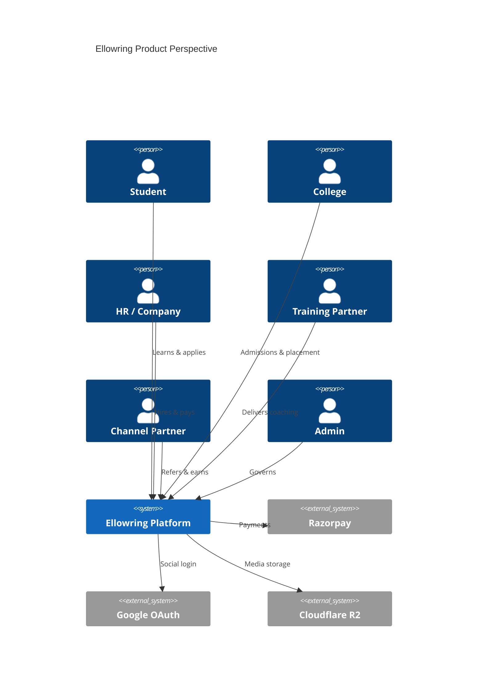

## 6.2 Relationship to Companion Documents

| Document | SRS Usage |
|---|---|
| `Ellowring_PRD.md` | Business intent, personas, revenue model |
| `Ellowring_System_Architecture.md` | Deployment, module boundaries, NFR targets |
| `Ellowring_Database_Design.md` | Table ownership, constraints, indexes |
| `schema.prisma` (Phase-4) | Entity names, enums, relationships for FR traceability |

---

# 7. Product Functions

| # | Function | Primary Roles | Module Reference |
|---|---|---|---|
| F-01 | Identity & session management | All | §20, §21 |
| F-02 | Student learning dashboard | Student | §23, §22 |
| F-03 | Career guidance & assessments | Student | §29 |
| F-04 | Competitive exam coaching | Student, Training | §30 |
| F-05 | Mock tests & PYQ | Student | §31 |
| F-06 | College discovery & admission | Student, College | §32, §24 |
| F-07 | Study abroad pathways | Student | §33 |
| F-08 | Skill courses (LMS) | Student, Training | §34, §26 |
| F-09 | Internship marketplace | Student, HR | §35, §25 |
| F-10 | Live projects | Student, HR | §36 |
| F-11 | Job portal & ATS | Student, HR | §37 |
| F-12 | Payroll for placed hires | HR | §38 |
| F-13 | Wallet & coupons | Student, Admin | §39 |
| F-14 | Certificate issuance & verification | Student, Training | §40 |
| F-15 | Multi-channel notifications | All | §41 |
| F-16 | Reports & analytics | All (scoped) | §42, §43 |
| F-17 | Channel partner referrals | Partner | §27 |
| F-18 | Platform administration | Admin | §28 |
| F-19 | Public marketing & SEO | Anonymous | §61, §3.1 |
| F-20 | Payments (Razorpay) | Student, B2B | §48 |

---

# 8. Stakeholders

| Stakeholder | Interest | Influence |
|---|---|---|
| Founder & CEO | Vision, revenue, market positioning | High |
| CTO / Engineering | Feasibility, architecture, delivery | High |
| Head of Product | Scope, prioritisation, acceptance | High |
| Students & parents | Usability, outcomes, affordability | High |
| Colleges & universities | Lead quality, placement ROI | Medium |
| Employers / HR | Candidate quality, hiring speed | Medium |
| Training institutes | Distribution, tooling | Medium |
| Channel partners | Commission fairness, payouts | Medium |
| Compliance / Legal | DPDP, contracts, payroll law | High |
| DevOps / SRE | Uptime, observability, cost | Medium |
| Investors / Board | Growth metrics, defensibility | Medium |

---

# 9. User Classes

| User Class | Description | Education Stage / Org Type |
|---|---|---|
| **Student — 11th/12th** | Stream selection, coaching, entrance prep | School |
| **Student — Diploma** | Skill + placement focus | Polytechnic |
| **Student — UG** | Courses, internships, campus placement | Undergraduate |
| **Student — PG** | Advanced courses, jobs, study abroad | Postgraduate |
| **Fresh Graduate** | Jobs, projects, payroll onboarding | Graduate |
| **School counsellor** | Career guidance referrals (future B2B) | K-12 |
| **College staff** | Admissions, placement, analytics | HEI |
| **HR / Recruiter** | Jobs, internships, ATS, payroll | Company |
| **Training institute admin** | Batches, trainers, revenue | Coaching centre |
| **Channel partner** | Referrals, commissions | Individual / agency |
| **Platform admin** | Verification, finance, moderation | Ellowring |
| **Anonymous visitor** | Marketing pages, lead forms | Public |

---

# 10. Operating Environment

## 10.1 Client Environment

| Requirement | Specification |
|---|---|
| Browsers | Chrome 120+, Firefox 120+, Safari 17+, Edge 120+ |
| Viewports | Mobile 360px+, Tablet 768px+, Desktop 1280px+ |
| Network | 3G minimum degraded mode; offline not supported V1 |

## 10.2 Server Environment

| Component | Specification |
|---|---|
| Frontend host | Vercel (Next.js 14+ App Router) |
| API host | Railway / AWS ECS (NestJS 10+) |
| Database | PostgreSQL 16+ (managed) |
| Cache | Redis 7+ |
| Object storage | Cloudflare R2 |
| Region | Primary: ap-south-1 (Mumbai); CDN global |

## 10.3 Development Environment

| Tool | Version |
|---|---|
| Node.js | 20 LTS |
| TypeScript | 5.x |
| Prisma | 5.x (Phase-4 schema) |
| Package managers | npm (frontend/backend) |

---

# 11. Assumptions

| ID | Assumption |
|---|---|
| ASM-001 | Users have valid email or Indian mobile for OTP |
| ASM-002 | Razorpay merchant account is approved before payment go-live |
| ASM-003 | Colleges and companies complete KYC before posting listings |
| ASM-004 | English is default UI language in Phase-4; Hindi follows Phase-5 |
| ASM-005 | Single PostgreSQL database suffices through Phase-5 scale targets |
| ASM-006 | Student consent captured at registration for data processing |
| ASM-007 | Marketing content managed by Admin CMS or static pages initially |
| ASM-008 | SMS/WhatsApp gateways available for OTP and transactional alerts |
| ASM-009 | SSL/TLS terminated at edge for all environments except local dev |
| ASM-010 | Phase-4 schema migration path from SQLite demo is documented |

---

# 12. Constraints

| ID | Constraint |
|---|---|
| CON-001 | Modular monolith — no microservice deployment in Phase-4 |
| CON-002 | INR primary currency; international billing deferred |
| CON-003 | DPDP Act compliance mandatory before production PII at scale |
| CON-004 | No storage of raw payment card data (PCI scope minimisation) |
| CON-005 | Role enum fixed: STUDENT, COLLEGE, COMPANY, TRAINING, PARTNER, ADMIN |
| CON-006 | API MUST remain REST JSON under `/api` global prefix |
| CON-007 | Frontend MUST NOT query database directly |
| CON-008 | Wallet balances MUST reconcile to append-only ledger |
| CON-009 | Ads MUST be labelled per PRD youth-safety rules |
| CON-010 | Root `/` currently login-first — marketing home delivery is a known gap |

---

# 13. Functional Requirements

## 13.1 Platform-Wide Functional Requirements

| ID | Requirement | Priority |
|---|---|---|
| FR-PLAT-001 | System MUST allow registration with email, password, role, and profile basics | P0 |
| FR-PLAT-002 | System MUST authenticate via JWT access token with configurable expiry | P0 |
| FR-PLAT-003 | System MUST route authenticated users to role-appropriate dashboard | P0 |
| FR-PLAT-004 | System MUST enforce RBAC on every protected API endpoint | P0 |
| FR-PLAT-005 | System MUST support OTP request and verify for passwordless flows | P0 |
| FR-PLAT-006 | System MUST paginate list endpoints (default 20, max 100) | P1 |
| FR-PLAT-007 | System MUST soft-delete catalogue entities where specified in DB design | P1 |
| FR-PLAT-008 | System MUST emit notifications on state transitions (application, payment) | P1 |
| FR-PLAT-009 | System MUST support bookmark/favourite on polymorphic entities | P2 |
| FR-PLAT-010 | Admin MUST be able to suspend user accounts with audit record | P1 |

## 13.2 Public Website Requirements

| ID | Requirement | Priority |
|---|---|---|
| FR-PUB-001 | Public pages MUST exist: Home, About, Coaching, Career Guidance, Colleges, Study Abroad, Courses, Internships, Projects, Jobs, Partner With Us, Contact | P0 |
| FR-PUB-002 | Each marketing page MUST include CTA to Register or Login | P0 |
| FR-PUB-003 | Contact form MUST capture name, email, phone, message | P1 |
| FR-PUB-004 | Partner page MUST capture organisation type and referral intent | P1 |
| FR-PUB-005 | Course detail slug pages MUST render catalogue metadata | P1 |
| FR-PUB-006 | Home page MUST be served at `/` for anonymous visitors (target state) | P0 |

## 13.3 Module Functional Requirements Summary

Detailed module FRs appear in Chapters 23–43. Traceability matrix:

| Module | Primary FR Prefix | Key Entities (Prisma) |
|---|---|---|
| Student | FR-STU- | `Student`, `EducationHistory` |
| Career | FR-CAR- | `CareerAssessment`, `CareerRecommendation` |
| Coaching | FR-CCH- | `CoachingProgram`, `CoachingEnrollment` |
| Mock Test | FR-MCK- | `MockTest`, `MockResult` |
| Admission | FR-ADM- | `College`, `AdmissionApplication` |
| Study Abroad | FR-ABR- | `AbroadProgram`, `AbroadApplication` |
| Course | FR-CRS- | `Course`, `CourseEnrollment` |
| Internship | FR-INT- | `Internship`, `InternshipApplication` |
| Project | FR-PRJ- | `Project`, `ProjectApplication` |
| Job | FR-JOB- | `Job`, `JobApplication`, `Interview` |
| Payroll | FR-PAY- | `PayrollRun`, `Payslip` |
| Wallet | FR-WLT- | `Wallet`, `WalletLedger`, `Coupon` |
| Certificate | FR-CERT- | `Certificate`, `CertificateTemplate` |
| Notification | FR-NOT- | `Notification`, `NotificationPreference` |

---

# 14. Non Functional Requirements

| ID | Category | Requirement | Target |
|---|---|---|---|
| NFR-SEC-001 | Security | All API traffic over TLS 1.2+ | 100% |
| NFR-SEC-002 | Security | Passwords hashed bcrypt/argon2 | Mandatory |
| NFR-PERF-001 | Performance | API p95 latency (read) | < 300 ms |
| NFR-PERF-002 | Performance | API p95 latency (write) | < 500 ms |
| NFR-PERF-003 | Performance | LCP on dashboard (4G) | < 2.5 s |
| NFR-SCAL-001 | Scalability | Stateless API horizontal scale | 10+ instances |
| NFR-AVAIL-001 | Availability | Production monthly uptime | 99.5% |
| NFR-AVAIL-002 | Availability | Planned maintenance window | ≤ 4 h/month |
| NFR-DATA-001 | Data | RPO for PostgreSQL | ≤ 15 min |
| NFR-DATA-002 | Data | RTO for API tier | ≤ 4 h |
| NFR-A11Y-001 | Accessibility | WCAG 2.1 AA for student flows | Phase-5 |
| NFR-I18N-001 | Localization | i18n key infrastructure | Phase-4 |
| NFR-OBS-001 | Observability | Structured JSON logs with request ID | Mandatory |
| NFR-OBS-002 | Observability | Error rate alerting | > 1% 5-min window |
| NFR-COMP-001 | Compliance | DPDP consent & deletion workflow | Phase-5 GA |

---

# 15. Business Rules

| ID | Rule | Applies To |
|---|---|---|
| BR-GEN-001 | One user account maps to exactly one primary application role | Auth |
| BR-GEN-002 | Minor users (under 18) require guardian consent flag | Student |
| BR-GEN-003 | All monetary amounts stored in INR with 2 decimal places | Wallet, Payment |
| BR-GEN-004 | Refunds MUST create ledger credit, never mutate historical debits | Wallet |
| BR-GEN-005 | Job/internship listings expire after configurable TTL unless renewed | HR |
| BR-GEN-006 | Partner commission accrues only on verified paid conversion | Partner |
| BR-GEN-007 | Certificate issuance requires completed enrollment or exam pass | Certificate |
| BR-GEN-008 | College admission applications are immutable after submission | Admission |
| BR-GEN-009 | Mock test attempts limited by plan (free vs premium) | Mock Test |
| BR-GEN-010 | Admin actions on user accounts MUST write audit log | Admin |

---

# 16. User Stories

## 16.1 Student

| ID | Story | Priority |
|---|---|---|
| US-STU-001 | As a Class 12 student, I want career guidance so I can choose the right stream | P0 |
| US-STU-002 | As a JEE aspirant, I want coaching batches and mock tests so I can prepare | P0 |
| US-STU-003 | As an applicant, I want to track college admission status in one place | P0 |
| US-STU-004 | As a learner, I want to enroll in courses and earn certificates | P1 |
| US-STU-005 | As a job seeker, I want to apply and track interviews | P0 |
| US-STU-006 | As a user, I want wallet credits and coupons for discounts | P1 |

## 16.2 College

| ID | Story | Priority |
|---|---|---|
| US-COL-001 | As college staff, I want admission leads with filters | P1 |
| US-COL-002 | As TPO, I want placement drive management | P2 |

## 16.3 HR / Company

| ID | Story | Priority |
|---|---|---|
| US-HR-001 | As HR, I want to post jobs and manage ATS pipeline | P0 |
| US-HR-002 | As HR, I want to schedule interviews | P1 |
| US-HR-003 | As HR, I want payroll for hired candidates | P2 |

## 16.4 Training / Partner / Admin

| ID | Story | Priority |
|---|---|---|
| US-TRN-001 | As training admin, I want batch and attendance management | P1 |
| US-PTR-001 | As partner, I want referral tracking and payouts | P1 |
| US-ADM-001 | As admin, I want user verification and platform settings | P0 |

---

# 17. Use Cases

| ID | Use Case | Actor | Precondition | Postcondition |
|---|---|---|---|---|
| UC-AUTH-001 | Register account | Any role | Valid email | User created, JWT issued |
| UC-AUTH-002 | Login with password | Registered user | Credentials valid | JWT issued, dashboard redirect |
| UC-AUTH-003 | Verify OTP | User with pending OTP | OTP not expired | Session established |
| UC-STU-001 | Complete career assessment | Student | Logged in | Recommendations stored |
| UC-STU-002 | Enroll in coaching batch | Student | Program open | Enrollment active |
| UC-STU-003 | Submit admission application | Student | College programme open | Application SUBMITTED |
| UC-STU-004 | Apply for internship | Student | Profile ≥ 60% | Application PENDING |
| UC-STU-005 | Redeem wallet coupon | Student | Valid code | Ledger credit posted |
| UC-HR-001 | Publish job listing | HR | Company verified | Job visible |
| UC-HR-002 | Move candidate pipeline stage | HR | Application exists | Status updated, notification sent |
| UC-PTR-001 | Attribute referral lead | Partner | Referral code used | Lead linked to partner |
| UC-ADM-001 | Suspend abusive account | Admin | Audit reason provided | User disabled |

---

# 18. User Flow

## 18.1 End-to-End Student Journey

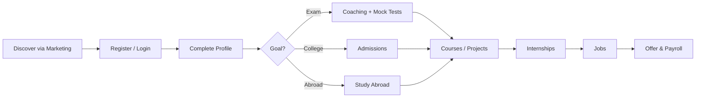

## 18.2 Registration & Onboarding Flow

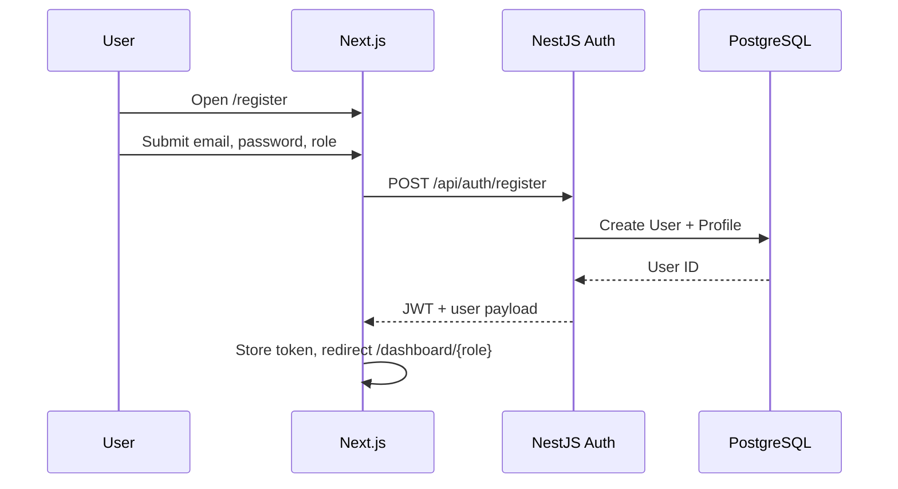

## 18.3 Application Submission Flow (Generic)

1. Student browses catalogue (jobs, internships, admissions).
2. Student opens detail page and clicks **Apply**.
3. System validates profile completeness and eligibility rules.
4. System creates application record in `PENDING` or module-specific status.
5. Notification sent to student and tenant owner.
6. Tenant updates pipeline; student sees status in dashboard.

---

# 19. RBAC

## 19.1 Role Model

Application roles (Prisma `Role` enum) are the primary access dimension. Fine-grained permissions via `RbacRole`, `Permission`, `RolePermission` support Admin delegation.

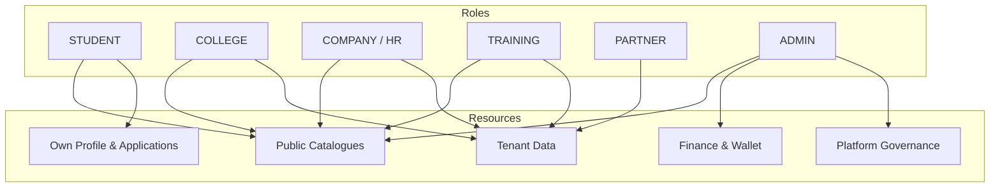

## 19.2 Permission Matrix (Summary)

| Resource / Action | Student | College | HR | Training | Partner | Admin |
|---|---|---|---|---|---|---|
| View own profile | ✓ | ✓ | ✓ | ✓ | ✓ | ✓ |
| Edit tenant profile | — | ✓ | ✓ | ✓ | ✓ | ✓ |
| Post jobs/internships | — | — | ✓ | — | — | ✓ |
| Manage coaching batches | — | — | — | ✓ | — | ✓ |
| View referral commissions | — | — | — | — | ✓ | ✓ |
| Suspend users | — | — | — | — | — | ✓ |
| Redeem coupons | ✓ | — | — | — | — | ✓ |
| Run payroll | — | — | ✓ | — | — | ✓ |
| Platform analytics | — | scoped | scoped | scoped | scoped | ✓ |

## 19.3 Requirements

| ID | Requirement |
|---|---|
| FR-RBAC-001 | Every protected route MUST declare required role(s) via `RolesGuard` |
| FR-RBAC-002 | Tenant-scoped data MUST filter by `companyId`, `collegeId`, `trainingCenterId`, or `partnerId` |
| FR-RBAC-003 | Admin elevation to act-as-user MUST be logged in audit trail |
| FR-RBAC-004 | API keys (Enterprise module) MUST map to scoped permissions distinct from user JWT |

---

# 20. Authentication

## 20.1 Mechanisms

| Mechanism | Status | Requirement ID |
|---|---|---|
| Email + password | Implemented | FR-AUTH-001 |
| JWT bearer token | Implemented | FR-AUTH-002 |
| OTP email | Implemented | FR-AUTH-003 |
| Google OAuth | Architecture-ready | FR-AUTH-004 |
| Refresh tokens | Phase-5 | FR-AUTH-005 |
| MFA | Phase-5 | FR-AUTH-006 |

## 20.2 Authentication Flow

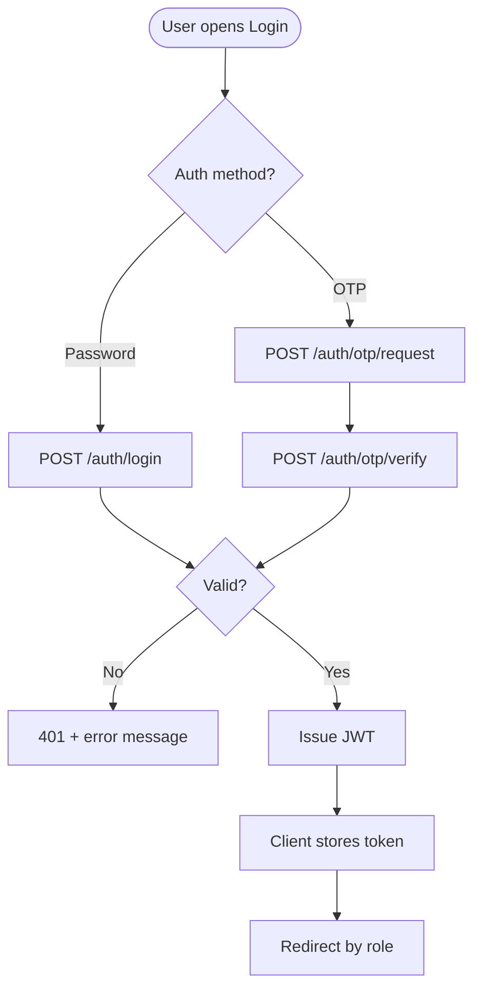

## 20.3 Requirements

| ID | Requirement |
|---|---|
| FR-AUTH-001 | Password MUST be ≥ 8 chars with complexity rules |
| FR-AUTH-002 | JWT MUST include `userId`, `role`, `email` claims |
| FR-AUTH-003 | OTP MUST expire within 10 minutes; max 5 attempts |
| FR-AUTH-004 | Failed login MUST rate-limit by IP + email (Redis) |
| FR-AUTH-005 | `/auth/me` MUST return current user with profile flags |
| NFR-AUTH-001 | Tokens MUST NOT be logged in plaintext |

---

# 21. Authorization

Authorization applies **after** authentication. NestJS `JwtAuthGuard` validates token; `RolesGuard` checks `@Roles()` decorator against JWT role claim.

| ID | Requirement |
|---|---|
| FR-AUTHZ-001 | Deny-by-default on missing guard |
| FR-AUTHZ-002 | Resource ownership verified in service layer (not controller alone) |
| FR-AUTHZ-003 | Cross-tenant access attempts return 403, not 404 |
| FR-AUTHZ-004 | Wallet and payment endpoints require authenticated owner or Admin |
| FR-AUTHZ-005 | Enterprise API routes use `ApiKeyGuard` separate from JWT |

---

# 22. Dashboard Requirements

## 22.1 Dashboard Inventory

| Role | Base Route | Shell Component | Implementation Status |
|---|---|---|---|
| Student | `/dashboard/student` | `StudentShell` | Home EXISTS; modules mixed |
| College | `/dashboard/college` | `CollegeShell` | SHELL |
| HR | `/dashboard/hr` | `HrShell` | SHELL |
| Training | `/dashboard/training` | `TrainingShell` | SHELL |
| Partner | `/dashboard/partner` | `PartnerShell` | SHELL |
| Admin | `/dashboard/admin` | `AdminShell` | SHELL |

## 22.2 Common Dashboard Elements

| Element | Requirement |
|---|---|
| Top bar | Logo, search, notifications bell, profile menu, logout |
| Side nav | Role-specific IA from PRD Ch.20 |
| KPI strip | Role-relevant metrics (Student home implemented) |
| Responsive | Collapsible sidebar on mobile |
| Auth gate | Redirect to `/login` if no valid token |

## 22.3 Student Dashboard Home (Reference)

FR-DASH-001: Student home MUST display KPIs: enrolled courses, mock tests, certificates, wallet balance, job applications.

FR-DASH-002: Student home MUST surface learning progress, upcoming events, recommended actions.

FR-DASH-003: Quick links MUST navigate to coaching, admissions, jobs, wallet, AI assistant.

## 22.4 Public Marketing Pages

| Page | Route (marketing group) | Status |
|---|---|---|
| Home | `/` (target); currently login | MISSING at root |
| About | `/about` | EXISTS (marketing) |
| Coaching | `/coaching` | EXISTS |
| Career Guidance | `/career-guidance` | EXISTS |
| Colleges | `/colleges` | EXISTS |
| Study Abroad | `/study-abroad` | EXISTS |
| Courses | `/courses` | EXISTS |
| Internships | `/internships` | EXISTS |
| Projects | `/projects` | EXISTS |
| Jobs | `/jobs` | EXISTS |
| Partner With Us | `/partner` | EXISTS |
| Contact | `/contact` | EXISTS |

---

# 23. Student Module

## Purpose

Provide the primary learner interface for profile management, module discovery, application tracking, and longitudinal progress from Class 11 through first job.

## Objectives

- Single student identity linked to `User` and `Student` models.
- Unified navigation across coaching, admissions, courses, jobs, wallet, and certificates.
- Profile completeness scoring to gate applications.
- Personalized dashboard home with KPIs and recommendations.

## Features

| ID | Feature |
|---|---|
| FR-STU-001 | Student profile CRUD (bio, education history, skills) |
| FR-STU-002 | Profile completeness meter with guided prompts |
| FR-STU-003 | Bookmark/favourite catalogues |
| FR-STU-004 | Application inbox across modules |
| FR-STU-005 | Messages centre (Phase-5) |
| FR-STU-006 | Settings: password, notifications, privacy |
| FR-STU-007 | Premium subscription upsell surface |
| FR-STU-008 | AI assistant entry point |
| FR-STU-009 | Insights / analytics for learner |
| FR-STU-010 | Previous year papers browser |

## Workflow

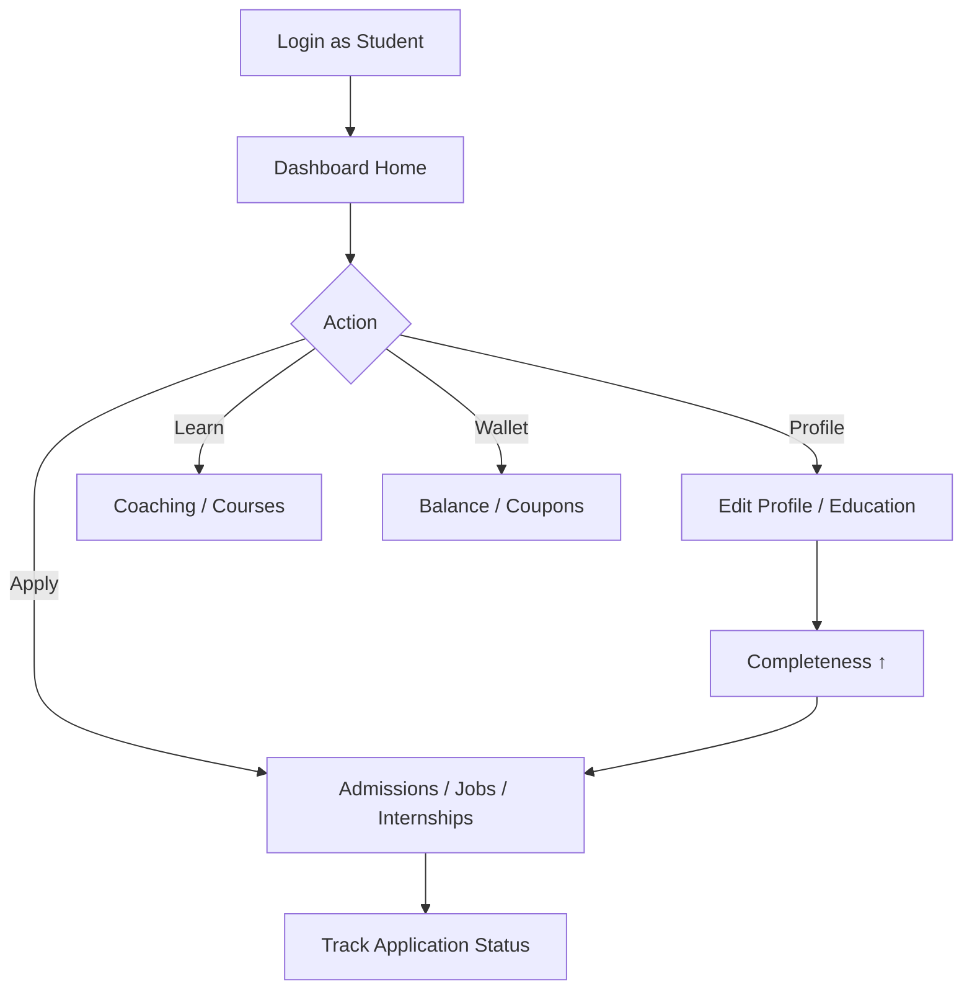

## User Journey

Priya (Class 12) registers as Student → completes profile → takes career assessment → enrolls in JEE coaching → attempts mock tests → applies to colleges → enrolls in Python course → applies for internship → lands job — all under one dashboard.

## Business Rules

- BR-STU-001: Applications blocked if profile completeness < threshold (default 60%).
- BR-STU-002: Education history MUST include current institution for admission modules.
- BR-STU-003: Student cannot hold multiple active primary roles.

## Validation Rules

- Email unique; phone E.164 format for India.
- Date of birth must indicate age ≥ 14.
- Skills limited to 50 tags per student.

## Success Criteria

- Dashboard home loads KPIs within NFR-PERF-003.
- Profile save reflects in `/auth/me` within 1 request.
- All student routes protected by STUDENT role guard.

## Error Scenarios

| Scenario | Response |
|---|---|
| Incomplete profile on apply | 422 with missing fields list |
| Invalid education year | 400 validation error |
| Token expired | 401 → redirect login |

## Acceptance Criteria

- **AC-STU-001:** Given registered student, when opening `/dashboard/student`, then KPI strip and learning cards render.
- **AC-STU-002:** Given profile < 60%, when applying to job, then application is rejected with guidance.
- **AC-STU-003:** Given valid token, when saving profile, then changes persist on reload.

---

# 24. College Module

## Purpose

Enable higher-education institutions to manage admission leads, applications, placement drives, events, and outcome reporting.

## Objectives

- Tenant-scoped college profile separate from catalogue `College` entity.
- Pipeline visibility for admission applications.
- Placement coordination with companies.
- Analytics on lead conversion.

## Features

| ID | Feature |
|---|---|
| FR-COL-001 | College profile and branding |
| FR-COL-002 | Admission leads inbox with filters |
| FR-COL-003 | Application review workflow |
| FR-COL-004 | Placement drive management |
| FR-COL-005 | Campus events calendar |
| FR-COL-006 | Reports export |
| FR-COL-007 | College analytics dashboard |

## Workflow

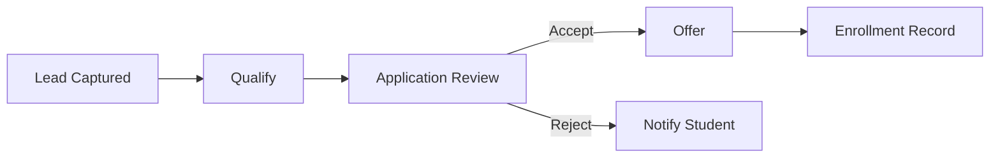

## User Journey

College TPO logs in → reviews new leads → shortlists applications → schedules interviews → publishes placement drive → tracks company participation → downloads semester report.

## Business Rules

- BR-COL-001: Only verified colleges may publish programmes.
- BR-COL-002: Application status transitions follow `AdmissionStatus` enum order.
- BR-COL-003: Lead SLA: first response within 48 h (SHOULD).

## Validation Rules

- Programme intake capacity ≥ 0.
- Application decision requires reviewer ID.

## Success Criteria

- College staff see only their institution's data.
- Status change triggers student notification.

## Error Scenarios

| Scenario | Response |
|---|---|
| Unverified college posts programme | 403 |
| Capacity exceeded on accept | 409 conflict |

## Acceptance Criteria

- **AC-COL-001:** College user can list applications scoped to their college.
- **AC-COL-002:** Status update from SUBMITTED to UNDER_REVIEW notifies student.

---

# 25. HR Module

## Purpose

Provide companies with job and internship posting, ATS pipeline, interview scheduling, resume review, and payroll initiation for hired candidates.

## Objectives

- Company tenant profile with verification badge.
- Full hiring funnel from post to offer.
- Integration with student applications module.
- Payroll handoff for accepted offers.

## Features

| ID | Feature |
|---|---|
| FR-HR-001 | Company profile management |
| FR-HR-002 | Job CRUD with employment type and work mode |
| FR-HR-003 | Internship CRUD |
| FR-HR-004 | Candidate pipeline board |
| FR-HR-005 | Interview scheduling |
| FR-HR-006 | Resume download / viewer |
| FR-HR-007 | Analytics on funnel metrics |
| FR-HR-008 | Payroll module entry |

## Workflow

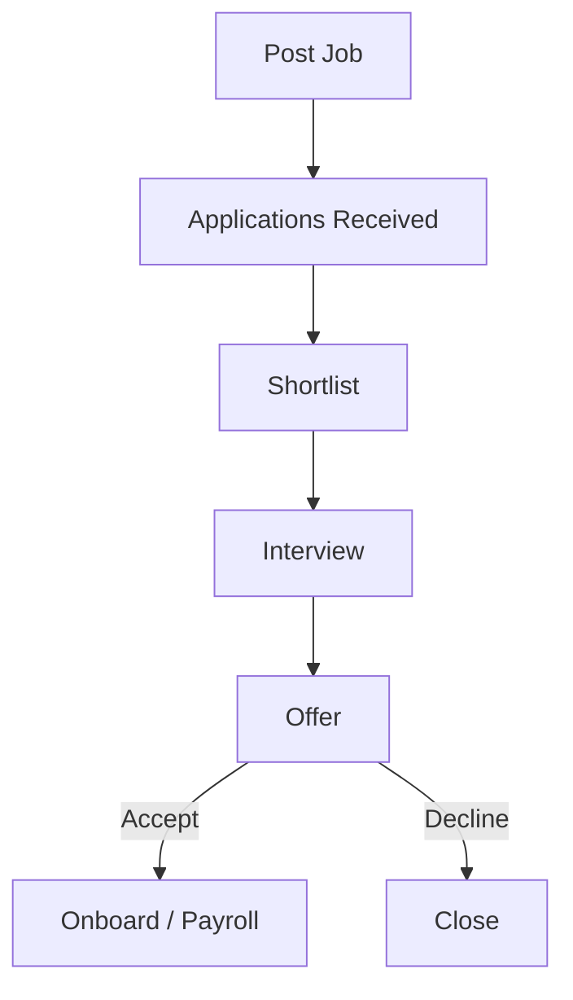

## User Journey

HR recruiter posts full-stack developer role → receives applications → shortlists 10 → schedules technical interviews → extends offer → candidate accepts → payroll profile created.

## Business Rules

- BR-HR-001: Verified company required to publish paid featured listings.
- BR-HR-002: Job expiry default 90 days.
- BR-HR-003: Offer acceptance triggers notification to student and college (if campus drive).

## Validation Rules

- Salary range min ≤ max.
- Required skills ≤ 20 per listing.
- Interview slot must be future datetime.

## Success Criteria

- Pipeline drag-and-drop updates status (Phase-5 UI).
- Application counts match database aggregates.

## Error Scenarios

| Scenario | Response |
|---|---|
| Post job unverified company | 403 |
| Schedule interview in past | 400 |

## Acceptance Criteria

- **AC-HR-001:** HR user creates job visible in student job catalogue.
- **AC-HR-002:** Moving application to INTERVIEW sends notification.

---

# 26. Training Module

## Purpose

Allow training institutes to manage courses, trainers, students, assignments, assessments, certificates, and revenue reporting.

## Objectives

- Training centre as tenant entity.
- Batch lifecycle management.
- Attendance and assessment tracking.
- Revenue share visibility.

## Features

| ID | Feature |
|---|---|
| FR-TRN-001 | Training centre profile |
| FR-TRN-002 | Course/batch management |
| FR-TRN-003 | Trainer roster |
| FR-TRN-004 | Student enrollment list |
| FR-TRN-005 | Assignments and submissions |
| FR-TRN-006 | Assessments / quizzes |
| FR-TRN-007 | Certificate issuance trigger |
| FR-TRN-008 | Revenue dashboard |
| FR-TRN-009 | Training reports |

## Workflow

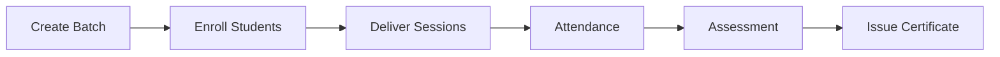

## User Journey

Training admin creates NEET batch → assigns trainer → enrolls 40 students → marks attendance → publishes weekly test → issues certificates to passers → views revenue split.

## Business Rules

- BR-TRN-001: Certificate requires attendance ≥ 75% AND assessment pass.
- BR-TRN-002: Batch capacity enforced at enrollment.

## Validation Rules

- Batch start date < end date.
- Trainer must belong to same training centre.

## Success Criteria

- Training dashboard shows active batches and headcount.
- Certificate triggers create verifiable records.

## Error Scenarios

| Scenario | Response |
|---|---|
| Enroll over capacity | 409 |
| Issue cert without pass | 422 |

## Acceptance Criteria

- **AC-TRN-001:** Training user lists only own centre batches.
- **AC-TRN-002:** Certificate issuance creates `Certificate` row linked to student.

---

# 27. Channel Partner

## Purpose

Enable referral partners to attribute leads, track commissions across product lines, and receive payouts.

## Objectives

- Unique referral codes per partner.
- Multi-product commission rules (coaching, courses, admissions).
- Transparent earnings and payout history.
- Marketing collateral access.

## Features

| ID | Feature |
|---|---|
| FR-PTR-001 | Partner profile and KYC |
| FR-PTR-002 | Referral link/code generation |
| FR-PTR-003 | Student referral tracking |
| FR-PTR-004 | College referral tracking |
| FR-PTR-005 | Course referral tracking |
| FR-PTR-006 | Commission ledger |
| FR-PTR-007 | Payout requests |
| FR-PTR-008 | Marketing assets page |
| FR-PTR-009 | Partner reports |

## Workflow

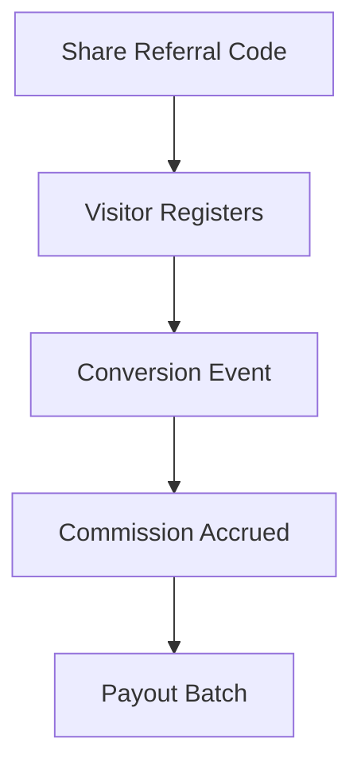

## User Journey

Partner shares code → student registers with attribution → student pays for coaching → commission moves PENDING → admin approves → payout to bank.

## Business Rules

- BR-PTR-001: Commission accrues on payment SUCCESS only.
- BR-PTR-002: Attribution window 30 days from first click.
- BR-PTR-003: Minimum payout threshold ₹500.

## Validation Rules

- Bank details required before payout.
- Referral code alphanumeric 6–12 chars.

## Success Criteria

- Partner dashboard totals match commission ledger.
- Payout status visible in real time.

## Error Scenarios

| Scenario | Response |
|---|---|
| Payout below minimum | 422 |
| Duplicate attribution | First-touch wins |

## Acceptance Criteria

- **AC-PTR-001:** Registration with referral code links lead to partner.
- **AC-PTR-002:** Successful payment creates PENDING commission row.

---

# 28. Admin

## Purpose

Govern platform integrity: user verification, content moderation, finance oversight, settings, analytics, and support.

## Objectives

- Superuser access with audit accountability.
- CMS for coaching, courses, colleges (Phase-5).
- Payment and refund oversight.
- Enterprise API key management.
- Ads marketplace moderation.

## Features

| ID | Feature |
|---|---|
| FR-ADM-001 | User search and suspend |
| FR-ADM-002 | Student/college/HR verification queue |
| FR-ADM-003 | Platform settings |
| FR-ADM-004 | Payment reconciliation |
| FR-ADM-005 | Global notifications broadcast |
| FR-ADM-006 | Analytics overview |
| FR-ADM-007 | Reports hub |
| FR-ADM-008 | Partner commission approval |
| FR-ADM-009 | Enterprise API keys |
| FR-ADM-010 | Ads moderation |

## Workflow

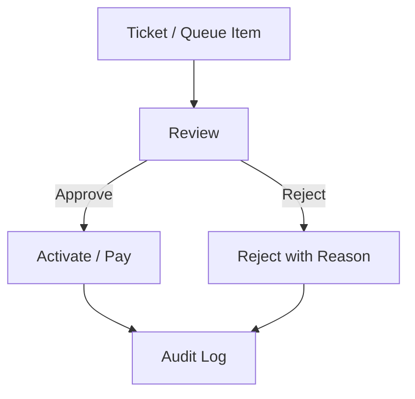

## User Journey

Admin reviews pending college verification → approves → college can publish programmes → monitors daily payments → approves partner payouts → broadcasts maintenance notice.

## Business Rules

- BR-ADM-001: All destructive actions require reason text ≥ 20 chars.
- BR-ADM-002: Two-person rule for refunds > ₹50,000 (Phase-5).

## Validation Rules

- Admin role required on all `/admin/*` API routes.
- Settings changes versioned in audit log.

## Success Criteria

- Admin actions appear in audit trail within 1 s.
- Suspended users cannot obtain JWT refresh.

## Error Scenarios

| Scenario | Response |
|---|---|
| Non-admin access | 403 |
| Refund without reason | 422 |

## Acceptance Criteria

- **AC-ADM-001:** Suspending user blocks login on next request.
- **AC-ADM-002:** Commission approval moves status to APPROVED.

---

# 29. Career Guidance

## Purpose

Deliver psychometric and aptitude assessments that recommend education streams, careers, and next-step modules on Ellowring.

## Objectives

- Standardised assessment battery.
- Explainable recommendations with confidence scores.
- Integration with coaching and course suggestions.
- Progress tracking over time.

## Features

| ID | Feature |
|---|---|
| FR-CAR-001 | Assessment catalogue |
| FR-CAR-002 | Timed questionnaire engine |
| FR-CAR-003 | Scoring and normalization |
| FR-CAR-004 | Recommendation report PDF |
| FR-CAR-005 | Suggested Ellowring modules |
| FR-CAR-006 | Re-assessment after 90 days |

## Workflow

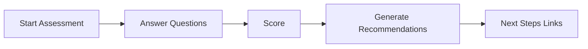

## User Journey

Student unsure of stream → completes 30-min assessment → receives STEM vs Commerce guidance → clicks recommended JEE coaching path.

## Business Rules

- BR-CAR-001: Free tier: 1 assessment / 90 days.
- BR-CAR-002: Recommendations MUST cite score factors (explainability).

## Validation Rules

- All required questions answered before submit.
- Assessment session timeout 120 minutes.

## Success Criteria

- Results persist in `CareerAssessment` / `CareerRecommendation`.
- API `/career/*` returns scoped student data.

## Error Scenarios

| Scenario | Response |
|---|---|
| Incomplete submission | 422 |
| Session timeout | 408 with resume option |

## Acceptance Criteria

- **AC-CAR-001:** Completed assessment stores score and recommendations.
- **AC-CAR-002:** Report links to at least one coaching or course module.

---

# 30. Coaching

## Purpose

Structured competitive exam preparation (NEET, JEE, CUET, UPSC, TNPSC, SSC, Banking, etc.) via programs, batches, subjects, and enrollments.

## Objectives

- Catalogue coaching programs by exam track.
- Enrollment with payment integration.
- Batch schedules and faculty assignment.
- Syllabus and resource attachments.

## Features

| ID | Feature |
|---|---|
| FR-CCH-001 | Program catalogue by exam |
| FR-CCH-002 | Batch enrollment |
| FR-CCH-003 | Live/recorded session links |
| FR-CCH-004 | Subject-wise progress |
| FR-CCH-005 | Doubt ticket (Phase-5) |
| FR-CCH-006 | Fee plans and discounts |

## Workflow

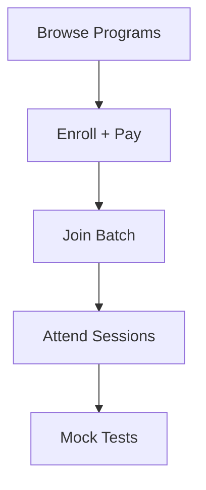

## User Journey

JEE aspirant filters coaching programs → enrolls in 2-year batch → pays via Razorpay → accesses schedule → linked mock tests unlock.

## Business Rules

- BR-CCH-001: Enrollment active only after payment SUCCESS.
- BR-CCH-002: Batch transfer allowed once per term.

## Validation Rules

- Program start date not in past for new enrollments.
- Payment amount matches program fee snapshot.

## Success Criteria

- Coaching API partial EXISTS; UI shell with catalogue hooks.
- Enrollment creates `CoachingEnrollment` row.

## Error Scenarios

| Scenario | Response |
|---|---|
| Payment failed | Enrollment stays DRAFT |
| Batch full | 409 |

## Acceptance Criteria

- **AC-CCH-001:** Student lists open coaching programs via API.
- **AC-CCH-002:** Successful payment activates enrollment.

---

# 31. Mock Test

## Purpose

Exam simulation engine with timed tests, scoring, analytics, and linkage to coaching programs.

## Objectives

- Question bank per exam pattern.
- Attempt tracking and leaderboards.
- Performance analytics by subject/topic.
- Premium gating for advanced tests.

## Features

| ID | Feature |
|---|---|
| FR-MCK-001 | Mock test catalogue |
| FR-MCK-002 | Timed attempt engine |
| FR-MCK-003 | Auto grading for MCQ |
| FR-MCK-004 | Result breakdown |
| FR-MCK-005 | Leaderboard (batch/global) |
| FR-MCK-006 | PYQ-linked practice sets |

## Workflow

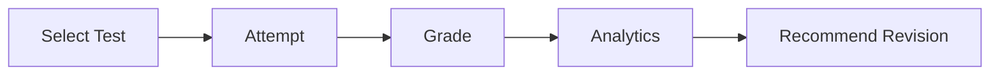

## User Journey

Student selects NEET full syllabus mock → completes 180 questions in 180 minutes → receives rank and weak topics → revisits biology module.

## Business Rules

- BR-MCK-001: One official attempt per mock unless premium retake purchased.
- BR-MCK-002: Tab-switch violations logged (anti-cheat Phase-5).

## Validation Rules

- All questions answered or explicitly skipped before submit.
- Timer enforced server-side.

## Success Criteria

- `MockResult` stores score, percentile, time taken.
- Student dashboard KPI reflects attempt count.

## Error Scenarios

| Scenario | Response |
|---|---|
| Timer expired | Auto-submit partial |
| Network loss | Resume if within grace period |

## Acceptance Criteria

- **AC-MCK-001:** Submitting attempt creates MockResult with correct score.
- **AC-MCK-002:** Dashboard mock test KPI updates after attempt.

---

# 32. College Admission

## Purpose

Connect students with college programmes, manage applications, scholarships, and admission decisions.

## Objectives

- Searchable college and programme catalogue.
- Multi-step application forms.
- Document upload for transcripts.
- Status tracking through `AdmissionStatus` lifecycle.

## Features

| ID | Feature |
|---|---|
| FR-ADM-001 | College/programme search |
| FR-ADM-002 | Application wizard |
| FR-ADM-003 | Document attachments |
| FR-ADM-004 | Application status timeline |
| FR-ADM-005 | Scholarship eligibility check |
| FR-ADM-006 | Offer acceptance |

## Workflow

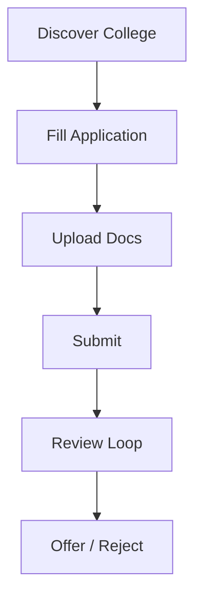

## User Journey

Student shortlists B.Tech CS programmes → submits application with 12th marksheet → tracks UNDER_REVIEW → receives ACCEPTED → pays seat confirmation fee.

## Business Rules

- BR-ADM-001: Submitted applications immutable except WITHDRAWN.
- BR-ADM-002: Seat offer expires in 7 days unless extended.

## Validation Rules

- Required documents by programme type.
- Percentage/CGPA within programme eligibility band.

## Success Criteria

- Admissions API EXISTS (`/admissions/*`).
- Applications visible to college and student.

## Error Scenarios

| Scenario | Response |
|---|---|
| Missing document | 422 |
| Past deadline | 403 |

## Acceptance Criteria

- **AC-ADM-001:** Submit transitions status to SUBMITTED.
- **AC-ADM-002:** College sees application in scoped inbox.

---

# 33. Study Abroad

## Purpose

Guide students through international education pathways: country/program selection, document checklist, visa milestones, and counsellor support.

## Objectives

- Abroad programme catalogue by country/university.
- Application workflow with `AbroadApplicationStatus`.
- Milestone tracker (documents, visa, approval).
- Richer student UI (IMPLEMENTED relative to peers).

## Features

| ID | Feature |
|---|---|
| FR-ABR-001 | Country/programme explorer |
| FR-ABR-002 | Application checklist |
| FR-ABR-003 | Document vault |
| FR-ABR-004 | Milestone timeline |
| FR-ABR-005 | Counsellor messaging (Phase-5) |
| FR-ABR-006 | Fee estimate calculator |

## Workflow

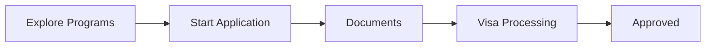

## User Journey

UG graduate explores MS in Canada → starts application → uploads IELTS, SOP → tracks VISA_PROCESSING → receives APPROVED notification.

## Business Rules

- BR-ABR-001: Counsellor assignment within 24 h of submit (SHOULD).
- BR-ABR-002: Document types validated per destination country ruleset.

## Validation Rules

- Passport expiry ≥ 6 months beyond intake.
- Required language test scores numeric within range.

## Success Criteria

- Study abroad API and student page richer than shell.
- Milestone updates trigger notifications.

## Error Scenarios

| Scenario | Response |
|---|---|
| Invalid document type | 422 |
| Withdraw after visa submit | Manual review flag |

## Acceptance Criteria

- **AC-ABR-001:** Application milestones persist and display in UI.
- **AC-ABR-002:** Status change to DOCUMENTS_PENDING notifies student.

---

# 34. Course

## Purpose

Skill-based LMS for industry certification courses with modules, lessons, enrollments, progress, and certificates.

## Objectives

- Course catalogue with categories and levels.
- Video/content delivery metadata.
- Enrollment and progress tracking.
- Ratings and reviews (Phase-5).

## Features

| ID | Feature |
|---|---|
| FR-CRS-001 | Course catalogue and detail |
| FR-CRS-002 | Module/lesson structure |
| FR-CRS-003 | Enrollment + payment |
| FR-CRS-004 | Progress percentage |
| FR-CRS-005 | Assignments (linked to Training) |
| FR-CRS-006 | Course completion certificate |

## Workflow

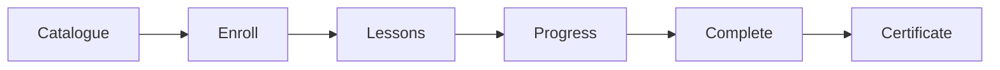

## User Journey

Student enrolls in Full Stack Web Development → completes 65% (shown on dashboard) → finishes capstone → receives certificate.

## Business Rules

- BR-CRS-001: Certificate at ≥ 90% progress AND final assessment pass.
- BR-CRS-002: Free preview: first module only.

## Validation Rules

- Lesson order enforced if sequential flag set.
- Enrollment unique per student per course.

## Success Criteria

- Courses API partial EXISTS.
- Dashboard learning card reflects enrollment progress.

## Error Scenarios

| Scenario | Response |
|---|---|
| Enroll twice | 409 |
| Access lesson without enroll | 403 |

## Acceptance Criteria

- **AC-CRS-001:** Enrollment creates active `CourseEnrollment`.
- **AC-CRS-002:** Progress updates after lesson completion event.

---

# 35. Internship

## Purpose

Marketplace connecting students with internship opportunities across companies with application and offer management.

## Objectives

- Searchable internship listings.
- Application with resume and cover letter.
- Company review pipeline.
- Offer accept/decline flow via `InternshipOfferStatus`.

## Features

| ID | Feature |
|---|---|
| FR-INT-001 | Internship catalogue |
| FR-INT-002 | Apply with profile snapshot |
| FR-INT-003 | Application status tracking |
| FR-INT-004 | Company shortlist/interview |
| FR-INT-005 | Internship offer management |
| FR-INT-006 | Stipend filter |

## Workflow

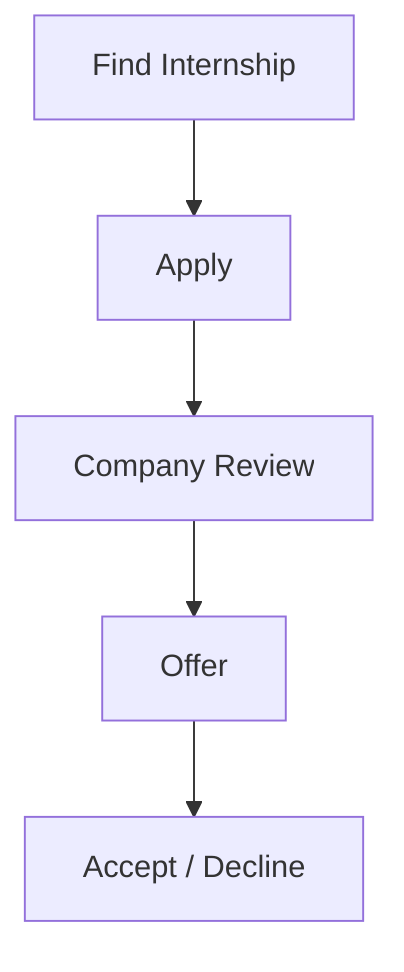

## User Journey

2nd-year student filters remote internships → applies → shortlisted → interview → receives offer → accepts → starts internship tracking.

## Business Rules

- BR-INT-001: Stipend amounts in INR/month.
- BR-INT-002: Offer expires in 5 business days default.

## Validation Rules

- Duration weeks ≥ 4.
- Application requires resume on file.

## Success Criteria

- Internships API EXISTS.
- HR internship page lists company postings.

## Error Scenarios

| Scenario | Response |
|---|---|
| Apply after deadline | 403 |
| Accept expired offer | 410 |

## Acceptance Criteria

- **AC-INT-001:** Application visible in HR pipeline.
- **AC-INT-002:** Offer acceptance updates status to ACCEPTED.

---

# 36. Project

## Purpose

Live industry projects with mentors, deliverables, and portfolio signal for hiring.

## Objectives

- Company-posted projects with skill tags.
- Team or individual applications.
- Milestone submissions and reviews.
- Portfolio linkage on student profile.

## Features

| ID | Feature |
|---|---|
| FR-PRJ-001 | Project catalogue |
| FR-PRJ-002 | Application with proposal |
| FR-PRJ-003 | Milestone submissions |
| FR-PRJ-004 | Mentor feedback |
| FR-PRJ-005 | Completion badge |
| FR-PRJ-006 | Rich student projects UI (EXISTS) |

## Workflow

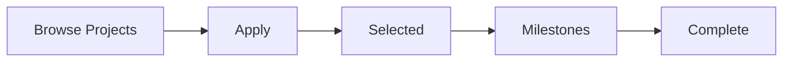

## User Journey

Student applies to ecommerce capstone → selected → submits 3 milestones → mentor approves → project shown on profile → HR views in candidate packet.

## Business Rules

- BR-PRJ-001: Max 2 concurrent active projects per student.
- BR-PRJ-002: Company must verify before posting paid projects.

## Validation Rules

- Milestone due dates chronological.
- Proposal min 200 characters.

## Success Criteria

- Projects API EXISTS; student UI richer implementation.
- Completed projects increment profile strength.

## Error Scenarios

| Scenario | Response |
|---|---|
| Exceed concurrent limit | 422 |
| Late milestone | Flagged LATE status |

## Acceptance Criteria

- **AC-PRJ-001:** Milestone submission stored with timestamp.
- **AC-PRJ-002:** Completed project visible on student profile.

---

# 37. Job Portal

## Purpose

Full-time and contract job marketplace with ATS, interviews, and offers integrated with student career journey.

## Objectives

- Job search with filters (location, mode, salary).
- One-click apply using Ellowring profile.
- HR pipeline management.
- Interview scheduling and feedback.

## Features

| ID | Feature |
|---|---|
| FR-JOB-001 | Job catalogue public + authenticated |
| FR-JOB-002 | Advanced search/filter |
| FR-JOB-003 | Application tracking |
| FR-JOB-004 | ATS stages |
| FR-JOB-005 | Interview module |
| FR-JOB-006 | Job offer workflow |
| FR-JOB-007 | Saved jobs |

## Workflow

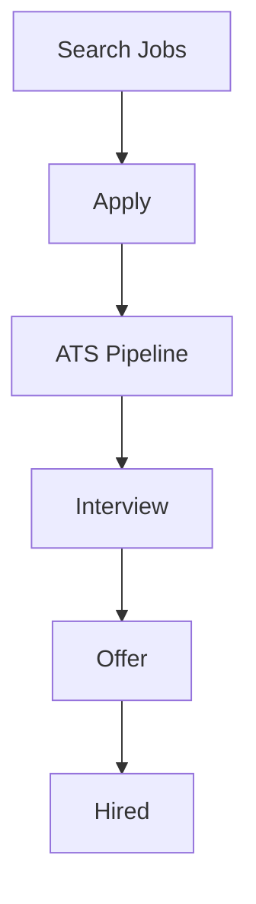

## User Journey

Fresh graduate searches Bengaluru remote React jobs → applies to 3 → 1 shortlisted → technical interview → offer → accepts.

## Business Rules

- BR-JOB-001: `ApplicationStatus` transitions logged.
- BR-JOB-002: Students may withdraw until SELECTED.

## Validation Rules

- Salary disclosure optional but min ≤ max if present.
- Job location required for ONSITE.

## Success Criteria

- Jobs API partial EXISTS.
- Student job applications KPI on dashboard.

## Error Scenarios

| Scenario | Response |
|---|---|
| Duplicate apply same job | 409 |
| Apply to expired job | 410 |

## Acceptance Criteria

- **AC-JOB-001:** Job application creates PENDING record.
- **AC-JOB-002:** HR moves candidate to INTERVIEW triggers notification.

---

# 38. Payroll

## Purpose

Employer payroll runs for candidates hired through Ellowring — payslips, tax metadata, and employee records.

## Objectives

- Employee roster linked to accepted job offers.
- Payroll run batch processing.
- Payslip generation and download.
- Integration hook for statutory compliance (Phase-5+).

## Features

| ID | Feature |
|---|---|
| FR-PAY-001 | Employee onboarding from offer |
| FR-PAY-002 | Payroll run creation |
| FR-PAY-003 | Payslip PDF generation |
| FR-PAY-004 | Payroll history |
| FR-PAY-005 | HR payroll dashboard |
| FR-PAY-006 | Admin oversight |

## Workflow

```mermaid
flowchart LR
  H[Hire Accepted] --> E[Employee Record]
  E --> RUN[Payroll Run]
  RUN --> SL[Payslips]
  SL --> D[Disbursement File Export]
```

## User Journey

HR confirms hire → employee added → monthly payroll run → payslips published → employee downloads from future employee portal.

## Business Rules

- BR-PAY-001: Payroll runs immutable after COMPLETED.
- BR-PAY-002: Net pay = gross − deductions; stored as Decimal.

## Validation Rules

- Pay period start < end.
- Employee must belong to company tenant.

## Success Criteria

- Payroll module API shell EXISTS.
- `PayrollRunStatus` state machine enforced.

## Error Scenarios

| Scenario | Response |
|---|---|
| Run without employees | 422 |
| Duplicate run same period | 409 |

## Acceptance Criteria

- **AC-PAY-001:** Completed payroll run generates payslip rows per employee.
- **AC-PAY-002:** HR sees only company-scoped payroll data.

---

# 39. Wallet

## Purpose

Internal ledger for credits, refunds, coupons, and checkout discounts across Ellowring modules.

## Objectives

- Append-only `WalletLedger` for auditability.
- Coupon redemption (e.g., ELLO500 demo).
- Top-up via Razorpay (Phase-5 production).
- Balance display on student dashboard.

## Features

| ID | Feature |
|---|---|
| FR-WLT-001 | Wallet balance read |
| FR-WLT-002 | Ledger transaction history |
| FR-WLT-003 | Coupon redeem |
| FR-WLT-004 | Hold/release for pending orders |
| FR-WLT-005 | Admin adjustment with audit |
| FR-WLT-006 | Checkout wallet debit |

## Workflow

```mermaid
flowchart TD
  T[Top-up / Coupon] --> CR[Ledger CREDIT]
  CR --> B[Balance Updated]
  B --> P[Purchase]
  P --> DB[Ledger DEBIT]
```

## User Journey

Student redeems ELLO500 coupon → balance increases → uses wallet partial pay on course → ledger shows debit → admin adjusts dispute with audited credit.

## Business Rules

- BR-WLT-001: Balance MUST equal sum of ledger entries.
- BR-WLT-002: Coupons single-use unless marked multi-use.
- BR-WLT-003: Debits cannot exceed available balance.

## Validation Rules

- Coupon code uppercase normalisation.
- Amounts positive Decimal with 2 places.

## Success Criteria

- Wallet API EXISTS; student wallet page functional.
- Redeem endpoint returns updated balance.

## Error Scenarios

| Scenario | Response |
|---|---|
| Invalid coupon | 404 |
| Insufficient balance | 422 |
| Expired coupon | 410 |

## Acceptance Criteria

- **AC-WLT-001:** Redeem valid coupon credits wallet and appears in history.
- **AC-WLT-002:** Debit rejected when balance insufficient.

---

# 40. Certificate

## Purpose

Issue, store, and verify completion certificates for courses, coaching, mock tests, and projects.

## Objectives

- Unique certificate ID and verification URL.
- PDF generation stored in R2.
- Student certificate gallery.
- Third-party verification endpoint.

## Features

| ID | Feature |
|---|---|
| FR-CERT-001 | Certificate issuance trigger |
| FR-CERT-002 | Template per program type |
| FR-CERT-003 | Student certificate list |
| FR-CERT-004 | Public verification page |
| FR-CERT-005 | Share to LinkedIn (Phase-5) |
| FR-CERT-006 | Revocation by admin |

## Workflow

```mermaid
flowchart LR
  EL[Eligibility Met] --> IS[Issue]
  IS --> PDF[Generate PDF]
  PDF --> ST[Store R2]
  ST --> VR[Verification URL]
```

## User Journey

Student completes course → system issues certificate → appears in dashboard gallery → shares verification link with employer.

## Business Rules

- BR-CERT-001: Certificate IDs globally unique (cuid).
- BR-CERT-002: Revoked certificates show REVOKED on verify.

## Validation Rules

- Issuance requires completed enrollment record.
- Template must exist for program type.

## Success Criteria

- Certificate models in Phase-4 schema.
- Student certificates page in dashboard IA.

## Error Scenarios

| Scenario | Response |
|---|---|
| Issue without completion | 422 |
| Verify unknown ID | 404 |

## Acceptance Criteria

- **AC-CERT-001:** Issuance creates verifiable certificate record.
- **AC-CERT-002:** Verification endpoint returns valid/invalid status.

---

# 41. Notification

## Purpose

Deliver timely, multi-channel notifications for application updates, payments, system alerts, and marketing (opt-in).

## Objectives

- In-app notification centre.
- Email/SMS/push channels per `NotificationChannel`.
- User preferences per type.
- Admin broadcast capability.

## Features

| ID | Feature |
|---|---|
| FR-NOT-001 | In-app notification list |
| FR-NOT-002 | Mark read / mark all read |
| FR-NOT-003 | Email dispatch |
| FR-NOT-004 | SMS OTP and alerts |
| FR-NOT-005 | Preference management |
| FR-NOT-006 | Admin broadcast |
| FR-NOT-007 | Deep links to entity |

## Workflow

```mermaid
flowchart TD
  E[Domain Event] --> N[Create Notification]
  N --> CH{Channel}
  CH --> APP[In-App]
  CH --> EM[Email]
  CH --> SMS[SMS]
```

## User Journey

Student application shortlisted → in-app bell badge increments → email summary sent → student clicks through to job application detail.

## Business Rules

- BR-NOT-001: Marketing notifications require explicit opt-in.
- BR-NOT-002: System ALERT type cannot be disabled.

## Validation Rules

- Notification payload includes entityType + entityId for deep link.
- Retention: in-app 90 days (configurable).

## Success Criteria

- Notifications API EXISTS; student notifications page implemented.
- Bell icon in role shells.

## Error Scenarios

| Scenario | Response |
|---|---|
| SMS gateway down | Queue retry 3x |
| Invalid preference | 422 |

## Acceptance Criteria

- **AC-NOT-001:** Application status change creates in-app notification.
- **AC-NOT-002:** Mark read decreases unread count.

---

# 42. Reporting

## Purpose

Provide exportable, role-scoped reports for operations, finance, admissions, and hiring metrics.

## Objectives

- Standard report templates per role.
- CSV/PDF export.
- Date range filters.
- Scheduled reports (Phase-5).

## Features

| ID | Feature |
|---|---|
| FR-RPT-001 | Student progress report |
| FR-RPT-002 | College admission funnel |
| FR-RPT-003 | HR hiring funnel |
| FR-RPT-004 | Partner commission report |
| FR-RPT-005 | Training revenue report |
| FR-RPT-006 | Admin financial summary |
| FR-RPT-007 | Custom date range export |

## Workflow

```mermaid
flowchart LR
  SEL[Select Report] --> FIL[Apply Filters]
  FIL --> GEN[Generate]
  GEN --> EXP[Export CSV/PDF]
```

## User Journey

College TPO runs placement report for AY 2025-26 → filters by department → exports CSV for accreditation.

## Business Rules

- BR-RPT-001: Reports scoped to tenant; Admin sees aggregated.
- BR-RPT-002: PII columns masked in partner reports.

## Validation Rules

- Date range max 366 days per export.
- Export rate limit 10/hour/user.

## Success Criteria

- Report pages exist as shells in each role dashboard.
- Export generates under 30 s for 10k rows.

## Error Scenarios

| Scenario | Response |
|---|---|
| Range too large | 422 |
| Unauthorized tenant | 403 |

## Acceptance Criteria

- **AC-RPT-001:** HR hiring report includes only company applications.
- **AC-RPT-002:** CSV export matches on-screen totals.

---

# 43. Analytics

## Purpose

Visual dashboards and KPIs for engagement, conversion, revenue, and learning outcomes.

## Objectives

- Role-specific analytics pages.
- Platform-wide admin analytics.
- Funnel and cohort views (Phase-5).
- Integration with predictive module (Phase-5).

## Features

| ID | Feature |
|---|---|
| FR-ANL-001 | Student insights page |
| FR-ANL-002 | College conversion dashboard |
| FR-ANL-003 | HR time-to-hire metrics |
| FR-ANL-004 | Training batch performance |
| FR-ANL-005 | Partner ROI |
| FR-ANL-006 | Admin MAU/revenue |
| FR-ANL-007 | Mock test performance trends |

## Workflow

```mermaid
flowchart LR
  RAW[Operational DB] --> AGG[Aggregates / Snapshots]
  AGG --> DASH[Dashboard Charts]
  DASH --> ACT[Action Recommendations]
```

## User Journey

Student views insights → sees mock test trend improving → admin views MAU spike after coaching campaign.

## Business Rules

- BR-ANL-001: Analytics snapshots refreshed hourly (batch).
- BR-ANL-002: No PII in admin aggregate exports without approval.

## Validation Rules

- Chart date ranges validated server-side.
- Metric definitions documented in tooltips.

## Success Criteria

- Analytics pages exist (mostly shells).
- Student insights page present in codebase.

## Error Scenarios

| Scenario | Response |
|---|---|
| Stale snapshot | Show last updated timestamp |
| Empty dataset | Empty state UX |

## Acceptance Criteria

- **AC-ANL-001:** Admin analytics displays user count metric.
- **AC-ANL-002:** Student insights renders without error for enrolled user.

---

# 44. Search

Cross-cutting full-text and faceted search across catalogues (courses, jobs, colleges, coaching, internships, projects).

| ID | Requirement | Priority |
|---|---|---|
| FR-SRCH-001 | Global search bar in role shells MUST query unified search API | P0 |
| FR-SRCH-002 | Search MUST support minimum 2-character query | P0 |
| FR-SRCH-003 | Results MUST group by entity type with counts | P1 |
| FR-SRCH-004 | Search MUST respect RBAC (tenant items only where applicable) | P0 |
| FR-SRCH-005 | Public marketing search MAY index public catalogues only | P1 |
| FR-SRCH-006 | Search MUST debounce client input 300 ms | P2 |
| FR-SRCH-007 | PostgreSQL full-text OR Redis cache for hot queries | P1 |
| FR-SRCH-008 | Typo tolerance (trigram) SHOULD be enabled Phase-5 | P2 |
| FR-SRCH-009 | Search analytics logged for query refinement | P2 |
| FR-SRCH-010 | Empty results MUST show suggestions | P1 |

---

# 45. Filter

| ID | Requirement | Priority |
|---|---|---|
| FR-FLT-001 | List endpoints MUST accept filter query params documented in OpenAPI | P0 |
| FR-FLT-002 | Filters MUST combine with AND semantics unless documented OR | P1 |
| FR-FLT-003 | UI filter chips MUST sync to URL query string | P1 |
| FR-FLT-004 | Date range filters MUST use ISO 8601 | P0 |
| FR-FLT-005 | Enum filters MUST validate against Prisma enums | P0 |
| FR-FLT-006 | Multi-select filters limited to 20 values per request | P2 |
| FR-FLT-007 | Saved filter presets for HR job pipeline Phase-5 | P2 |
| FR-FLT-008 | Filter state persists in session for dashboard lists | P2 |
| FR-FLT-009 | Clear-all filters control on every list view | P1 |
| FR-FLT-010 | Server returns filter facet counts where performant | P2 |

**Standard filters by module:**

| Module | Filters |
|---|---|
| Jobs | location, workMode, employmentType, salaryMin, skills |
| Courses | category, level, price, duration |
| Colleges | state, programme, fees |
| Coaching | exam, mode, batch start |
| Internships | stipend, remote, duration |

---

# 46. Sorting

| ID | Requirement | Priority |
|---|---|---|
| FR-SORT-001 | List endpoints MUST accept `sortBy` and `sortOrder` params | P0 |
| FR-SORT-002 | Default sort documented per resource (e.g., jobs: `createdAt desc`) | P1 |
| FR-SORT-003 | Sort fields MUST be whitelisted to prevent SQL injection | P0 |
| FR-SORT-004 | UI column headers MAY toggle sort where table UI exists | P2 |
| FR-SORT-005 | Relevance sort when search query present | P1 |
| FR-SORT-006 | Stable sort tie-breaker on `id` | P1 |
| FR-SORT-007 | Salary sort handles null salaries last | P2 |
| FR-SORT-008 | Client sort prohibited for paginated server lists | P0 |

---

# 47. File Upload

| ID | Requirement | Priority |
|---|---|---|
| FR-UPL-001 | Uploads MUST go to Cloudflare R2 via presigned URL | P0 |
| FR-UPL-002 | Max file size 10 MB documents; 500 MB video (admin) | P1 |
| FR-UPL-003 | Allowed MIME types whitelisted per context | P0 |
| FR-UPL-004 | Virus scan hook before marking file AVAILABLE Phase-5 | P2 |
| FR-UPL-005 | Upload metadata stored in DB with owner ID | P0 |
| FR-UPL-006 | Private files MUST NOT be public URL guessable | P0 |
| FR-UPL-007 | Resume upload PDF/DOCX only | P0 |
| FR-UPL-008 | Image uploads JPEG/PNG/WebP for avatars | P1 |
| FR-UPL-009 | Progress indicator in UI for uploads > 1 MB | P2 |
| FR-UPL-010 | Failed upload retries with exponential backoff | P2 |

---

# 48. Payment

| ID | Requirement | Priority |
|---|---|---|
| FR-PAY-001 | Razorpay checkout for INR transactions | P0 |
| FR-PAY-002 | Payment records use `PaymentStatus` state machine | P0 |
| FR-PAY-003 | Webhook signature verification mandatory | P0 |
| FR-PAY-004 | Idempotent payment creation via client order ID | P0 |
| FR-PAY-005 | Invoice generation on SUCCESS | P1 |
| FR-PAY-006 | Refund creates REFUND ledger + payment status | P1 |
| FR-PAY-007 | Wallet partial payment supported | P1 |
| FR-PAY-008 | Stripe international Phase-5 | P2 |
| FR-PAY-009 | GST invoice fields for B2B | P2 |
| FR-PAY-010 | Payment failure user messaging with retry | P0 |

**Payment flow:**

```mermaid
sequenceDiagram
  participant S as Student
  participant API as NestJS
  participant RZ as Razorpay
  S->>API: Create order
  API->>RZ: Order API
  RZ-->>API: order_id
  API-->>S: Checkout payload
  S->>RZ: Pay
  RZ->>API: Webhook payment.captured
  API->>API: Update Payment + Enrollment
```

---

# 49. Error Handling

| ID | Requirement | Priority |
|---|---|---|
| FR-ERR-001 | API errors return consistent JSON `{ statusCode, message, error, requestId }` | P0 |
| FR-ERR-002 | Validation errors include field-level details array | P0 |
| FR-ERR-003 | 500 errors MUST NOT leak stack traces to client | P0 |
| FR-ERR-004 | Frontend displays user-friendly toast/banner | P1 |
| FR-ERR-005 | Global Nest exception filter implemented | P0 |
| FR-ERR-006 | 404 for missing resources; 403 for forbidden | P0 |
| FR-ERR-007 | Rate limit returns 429 with Retry-After | P1 |
| FR-ERR-008 | Payment errors mapped to actionable codes | P1 |
| FR-ERR-009 | Client network errors show offline retry | P2 |
| FR-ERR-010 | Error boundary on Next.js route segments | P1 |

---

# 50. Logging

| ID | Requirement | Priority |
|---|---|---|
| NFR-LOG-001 | Structured JSON logs in production | P0 |
| NFR-LOG-002 | Each request MUST include correlation/request ID | P0 |
| NFR-LOG-003 | Log levels: error, warn, info, debug | P0 |
| NFR-LOG-004 | PII MUST NOT appear in info/debug logs | P0 |
| NFR-LOG-005 | Payment and auth failures logged at warn+ | P0 |
| NFR-LOG-006 | Log retention 30 days hot, 1 year cold archive | P1 |
| NFR-LOG-007 | Centralised log aggregation (Datadog/CloudWatch) | P1 |
| NFR-LOG-008 | Slow query logging > 500 ms | P2 |
| NFR-LOG-009 | Client error reporting optional Sentry | P2 |
| NFR-LOG-010 | Log sampling under high load configurable | P2 |

---

# 51. Audit Trail

| ID | Requirement | Priority |
|---|---|---|
| FR-AUD-001 | Admin actions on users MUST write `AuditLog` | P0 |
| FR-AUD-001a | Wallet admin adjustments audited | P0 |
| FR-AUD-002 | Audit entry: actorId, action, entityType, entityId, metadata, timestamp | P0 |
| FR-AUD-003 | Audit logs immutable (insert-only) | P0 |
| FR-AUD-004 | Audit viewer for Admin role | P1 |
| FR-AUD-005 | Retention minimum 7 years for finance-related | P1 |
| FR-AUD-006 | Export audit log CSV for compliance | P2 |
| FR-AUD-007 | Login failures logged (without password) | P1 |
| FR-AUD-008 | Role change events audited | P1 |
| FR-AUD-009 | Partner commission approval audited | P1 |
| FR-AUD-010 | DPDP deletion requests audited | P0 |

---

# 52. Security

| ID | Requirement | Priority |
|---|---|---|
| NFR-SEC-003 | OWASP Top 10 mitigations documented | P0 |
| NFR-SEC-004 | CSRF protection on cookie-based flows if used | P1 |
| NFR-SEC-005 | XSS prevention via React escaping + CSP headers | P0 |
| NFR-SEC-006 | SQL injection prevented via Prisma parameterisation | P0 |
| NFR-SEC-007 | Secrets in environment variables only | P0 |
| NFR-SEC-008 | Dependency vulnerability scanning in CI | P1 |
| NFR-SEC-009 | API rate limiting via Redis | P0 |
| NFR-SEC-010 | Enterprise API keys rotatable | P1 |
| NFR-SEC-011 | File upload content-type validation | P0 |
| NFR-SEC-012 | Session/JWT expiry enforced | P0 |
| NFR-SEC-013 | Penetration test before public launch | P1 |
| NFR-SEC-014 | Security headers: HSTS, X-Frame-Options, etc. | P0 |

---

# 53. Privacy

| ID | Requirement | Priority |
|---|---|---|
| NFR-PRIV-001 | Privacy policy and terms linked at registration | P0 |
| NFR-PRIV-002 | Consent checkbox for data processing | P0 |
| NFR-PRIV-003 | Data export request workflow Phase-5 | P1 |
| NFR-PRIV-004 | Account deletion with 30-day grace | P1 |
| NFR-PRIV-005 | PII encryption at rest for sensitive fields | P1 |
| NFR-PRIV-006 | Data minimisation in API responses | P0 |
| NFR-PRIV-007 | Partner data sharing disclosed in consent | P0 |
| NFR-PRIV-008 | Cookie banner for analytics cookies | P1 |
| NFR-PRIV-009 | Age gate for under-18 guardian email | P1 |
| NFR-PRIV-010 | DPDP grievance officer contact published | P0 |

---

# 54. Performance

| ID | Requirement | Target |
|---|---|---|
| NFR-PERF-004 | Dashboard TTI | < 3.5 s on 4G |
| NFR-PERF-005 | Search API p95 | < 400 ms |
| NFR-PERF-006 | File presign URL generation | < 100 ms |
| NFR-PERF-007 | Database connection pool sizing | Documented per env |
| NFR-PERF-008 | N+1 query prohibition in list endpoints | Enforced in review |
| NFR-PERF-009 | Image optimisation via Next.js Image | P1 |
| NFR-PERF-010 | Redis cache TTL for catalogues 5–15 min | P1 |
| NFR-PERF-011 | Pagination mandatory lists > 50 rows | P0 |
| NFR-PERF-012 | Lighthouse performance score marketing pages | > 80 |
| NFR-PERF-013 | Background jobs for PDF/report generation | P1 |

---

# 55. Scalability

| ID | Requirement | Priority |
|---|---|---|
| NFR-SCAL-002 | API tier horizontally scalable stateless | P0 |
| NFR-SCAL-003 | PostgreSQL read replica for reporting Phase-5 | P2 |
| NFR-SCAL-004 | Redis cluster for cache high availability | P2 |
| NFR-SCAL-005 | R2 unlimited object scale | P0 |
| NFR-SCAL-006 | Queue for async notifications (Bull/BullMQ) | P1 |
| NFR-SCAL-007 | Load test baseline 1k concurrent users | P1 |
| NFR-SCAL-008 | Module extraction boundaries documented | P1 |
| NFR-SCAL-009 | CDN for static assets | P0 |
| NFR-SCAL-010 | Database index strategy per DB design doc | P0 |

---

# 56. Availability

| ID | Requirement | Target |
|---|---|---|
| NFR-AVAIL-003 | API health endpoint `/health` | Mandatory |
| NFR-AVAIL-004 | Zero-downtime deploy strategy blue/green or rolling | P1 |
| NFR-AVAIL-005 | Multi-AZ database production | P1 |
| NFR-AVAIL-006 | Graceful degradation if Redis unavailable | P1 |
| NFR-AVAIL-007 | Status page for incidents | P2 |
| NFR-AVAIL-008 | SLO error budget policy | P2 |
| NFR-AVAIL-009 | Automated failover for managed DB | P1 |
| NFR-AVAIL-010 | Maintenance notifications 24 h advance | P1 |

---

# 57. Backup

| ID | Requirement | Priority |
|---|---|---|
| NFR-BKP-001 | PostgreSQL automated daily backups | P0 |
| NFR-BKP-002 | Point-in-time recovery enabled | P0 |
| NFR-BKP-003 | Backup retention 35 days minimum | P1 |
| NFR-BKP-004 | Monthly restore drill documented | P1 |
| NFR-BKP-005 | R2 versioning for critical assets | P1 |
| NFR-BKP-006 | Redis persistence AOF/RDB per env | P2 |
| NFR-BKP-007 | Backup encryption at rest | P0 |
| NFR-BKP-008 | Cross-region backup copy Phase-5 | P2 |
| NFR-BKP-009 | Prisma migration history in git | P0 |
| NFR-BKP-010 | Config backup excluding secrets | P1 |

---

# 58. Disaster Recovery

| ID | Requirement | Target |
|---|---|---|
| NFR-DR-001 | RPO | ≤ 15 minutes |
| NFR-DR-002 | RTO | ≤ 4 hours |
| NFR-DR-003 | DR runbook documented | Mandatory |
| NFR-DR-004 | Secondary region standby Phase-5 | P2 |
| NFR-DR-005 | Razorpay webhook replay procedure | P1 |
| NFR-DR-006 | Communication template for outage | P1 |
| NFR-DR-007 | Data integrity checks post-restore | P0 |
| NFR-DR-008 | Game day exercise annually | P2 |

---

# 59. Localization

| ID | Requirement | Priority |
|---|---|---|
| NFR-I18N-002 | i18n key infrastructure in frontend (`lib/i18n.tsx` EXISTS) | P0 |
| NFR-I18N-003 | English default Phase-4 | P0 |
| NFR-I18N-004 | Hindi UI Phase-5 priority | P1 |
| NFR-I18N-005 | Tamil UI Phase-5 | P2 |
| NFR-I18N-006 | Date/number formatting locale-aware | P1 |
| NFR-I18N-007 | RTL not required V1 | — |
| NFR-I18N-008 | User language preference stored in profile | P1 |
| NFR-I18N-009 | Email templates localisable | P2 |
| NFR-I18N-010 | CMS content translation workflow Phase-5 | P2 |

---

# 60. Accessibility

| ID | Requirement | Priority |
|---|---|---|
| NFR-A11Y-002 | Keyboard navigation for primary flows | P1 |
| NFR-A11Y-003 | Focus indicators visible | P1 |
| NFR-A11Y-004 | Color contrast WCAG AA | P1 |
| NFR-A11Y-005 | Form labels and ARIA on inputs | P1 |
| NFR-A11Y-006 | Screen reader tested login and dashboard | P2 |
| NFR-A11Y-007 | Skip to main content link | P2 |
| NFR-A11Y-008 | Alt text on marketing images | P1 |
| NFR-A11Y-009 | Error messages associated with fields | P0 |
| NFR-A11Y-010 | Accessibility audit before GA | P1 |

---

# 61. SEO

Public marketing pages MUST be indexable and optimised for Indian education/career keywords.

| ID | Requirement | Priority |
|---|---|---|
| FR-SEO-001 | Unique title and meta description per marketing page | P0 |
| FR-SEO-002 | Open Graph and Twitter card tags | P1 |
| FR-SEO-003 | Semantic HTML headings (single H1) | P0 |
| FR-SEO-004 | Sitemap.xml generation | P1 |
| FR-SEO-005 | robots.txt allows marketing, disallows /dashboard | P0 |
| FR-SEO-006 | Canonical URLs on duplicate content | P1 |
| FR-SEO-007 | Structured data JSON-LD for Course/Job where applicable | P2 |
| FR-SEO-008 | Core Web Vitals per NFR-PERF-012 | P1 |
| FR-SEO-009 | Marketing home at `/` indexable (GAP — currently login) | P0 |
| FR-SEO-010 | Localised slugs Phase-5 | P2 |

---

# 62. API

| ID | Requirement | Priority |
|---|---|---|
| FR-API-001 | REST JSON under global prefix `/api` | P0 |
| FR-API-002 | OpenAPI/Swagger documentation | P1 |
| FR-API-003 | Versioning via URL `/api/v1` when breaking changes | P2 |
| FR-API-004 | JWT Bearer auth header standard | P0 |
| FR-API-005 | Enterprise API key header `X-API-Key` | P1 |
| FR-API-006 | Consistent pagination `{ data, meta: { total, page, limit } }` | P1 |
| FR-API-007 | Idempotency-Key header for payments | P1 |
| FR-API-008 | CORS restricted to known frontend origins | P0 |
| FR-API-009 | Request validation via class-validator DTOs | P0 |
| FR-API-010 | Health and readiness probes | P0 |

**Implemented backend modules (Aug 2026):** auth, users, courses, coaching, jobs, internships, projects, career, admissions, study-abroad, wallet, notifications, dashboard, applications, admin, payroll, enterprise, ads, predictive.

---

# 63. Database

| ID | Requirement | Priority |
|---|---|---|
| FR-DB-001 | PostgreSQL 16 production database | P0 |
| FR-DB-002 | Phase-4 Prisma schema 122 models | P0 |
| FR-DB-003 | Migrations via Prisma Migrate only | P0 |
| FR-DB-004 | Money fields Decimal(14,2) | P0 |
| FR-DB-005 | Soft delete on catalogue entities | P1 |
| FR-DB-006 | Indexes per Database Design doc | P0 |
| FR-DB-007 | FK constraints enforced | P0 |
| FR-DB-008 | Seed strategy for dev/staging | P1 |
| FR-DB-009 | No direct frontend DB access | P0 |
| FR-DB-010 | Connection pooling in production | P0 |

Reference: `docs/Ellowring_Database_Design.md`, `backend/prisma/phase4/schema.prisma`.

---

# 64. Third Party Integrations

| Integration | Purpose | Phase | Requirement ID |
|---|---|---|---|
| **Razorpay** | INR payments, webhooks | 4 | FR-INT-RZP-001 |
| **Stripe** | International payments | 5 | FR-INT-STR-001 |
| **Google OAuth** | Social login | 4/5 | FR-INT-GOG-001 |
| **Cloudflare R2** | Object storage | 4 | FR-INT-R2-001 |
| **Email provider** | Transactional email | 4 | FR-INT-EML-001 |
| **SMS gateway** | OTP and alerts | 4 | FR-INT-SMS-001 |
| **WhatsApp Business** | Notifications | 5 | FR-INT-WA-001 |
| **Vercel** | Frontend hosting | 4 | FR-INT-VER-001 |
| **Railway/AWS** | API hosting | 4 | FR-INT-HOST-001 |
| **Redis Cloud** | Cache/rate limit | 4 | FR-INT-RED-001 |

| ID | Requirement |
|---|---|
| FR-INT-RZP-001 | Verify webhook HMAC; store raw payload for reconciliation |
| FR-INT-GOG-001 | OAuth state parameter CSRF protection |
| FR-INT-R2-001 | Presigned URLs expire ≤ 15 minutes |
| FR-INT-EML-001 | Bounce handling suppresses invalid emails |
| FR-INT-SMS-001 | OTP SMS delivery within 30 seconds p95 |

---

# 65. Acceptance Criteria

## 65.1 Release Gate Criteria (Phase-4 MVP)

| Gate | Criteria |
|---|---|
| G-01 | All P0 FRs implemented or waived with sign-off |
| G-02 | Auth flows pass security review |
| G-03 | Student dashboard home functional |
| G-04 | At least 3 domain modules end-to-end (wallet, notifications, study-abroad/projects) |
| G-05 | Razorpay test mode payment successful |
| G-06 | RBAC enforced on all protected routes |
| G-07 | No critical/high open security findings |
| G-08 | PostgreSQL Phase-4 migration applied staging |
| G-09 | Marketing pages reachable (except home at `/`) |
| G-10 | Appendix A statuses updated |

## 65.2 Module Acceptance Summary

Each module chapter defines AC-* items. QA MUST trace test cases to FR/NFR IDs.

---

# 66. Future Scope

| Item | Description | Phase |
|---|---|---|
| Native mobile apps | iOS/Android student app | 6+ |
| Microservices extraction | Jobs, Payments, Notifications services | 6+ |
| AI career copilot | LLM-guided planning with guardrails | 5 |
| Predictive placement | ML models in production | 5 |
| Video proctoring | Mock test integrity | 5 |
| Campus ERP integration | Timetable, attendance sync | 6+ |
| White-label college portals | B2B branding | 5 |
| Blockchain credentials | Optional certificate anchoring | 6+ |
| Voice accessibility | Regional language voice UI | 6+ |
| Gamification | Badges, streaks, leaderboards expansion | 5 |

---

# 67. Release Plan

| Phase | Timeline | Deliverables |
|---|---|---|
| **Phase 4** | Aug–Oct 2026 | PostgreSQL migration, auth hardening, student home, wallet/notifications, partial APIs, marketing pages (no root home) |
| **Phase 5** | Nov 2026–Mar 2027 | Marketing home, Razorpay prod, PYQ backend, role dashboard MVP (non-shell), Hindi i18n, OpenAPI, payment enrollments |
| **Phase 5 GA** | Apr 2027 | DPDP workflows, accessibility AA, payroll beta, enterprise API beta |
| **Phase 6** | 2027+ | Mobile apps, microservices evaluation, AI production |

**Sprint themes (Phase-4 remaining):**

1. Root marketing home + SEO
2. PYQ API and download
3. College/HR dashboard data wiring
4. Razorpay checkout integration
5. PostgreSQL production cutover

---

# 68. Risk Analysis

| ID | Risk | Impact | Likelihood | Mitigation |
|---|---|---|---|---|
| R-001 | Phase-4 schema migration data loss | High | Medium | Staged migration, backups, rehearsal |
| R-002 | Razorpay approval delays | Medium | Low | Test mode parallel; wallet fallback |
| R-003 | Scope creep across 16 modules | High | High | Appendix B prioritisation; shell-first |
| R-004 | DPDP non-compliance | High | Medium | Privacy chapter requirements; legal review |
| R-005 | Performance at college peak admissions | Medium | Medium | Cache, pagination, load tests |
| R-006 | Partner commission disputes | Medium | Medium | Audit trail, transparent ledger |
| R-007 | Security breach | High | Low | OWASP, pen test, rate limits |
| R-008 | Key person dependency | Medium | Medium | Documentation (this SRS, PRD, arch) |
| R-009 | Third-party SMS/email outage | Medium | Medium | Multi-provider failover Phase-5 |
| R-010 | Marketing home gap hurts SEO/acquisition | High | High | Priority backlog item #1 |

---

# 69. Conclusion

This Software Requirements Specification defines the complete, testable requirements baseline for **Ellowring v1.0 (Phase-4/5)** — India's unified Education, Career & Hiring ecosystem. It spans 69 chapters covering product context, functional and non-functional requirements, six role dashboards, sixteen domain modules, cross-cutting platform services, and release/risk planning.

Engineering SHOULD implement against requirement IDs with traceability to `docs/Ellowring_PRD.md`, `docs/Ellowring_System_Architecture.md`, `docs/Ellowring_Database_Design.md`, and `backend/prisma/phase4/schema.prisma`. Appendix A documents honest implementation status as of August 2026; Appendix B prioritises the next fifteen engineering investments.

**Approval:** This document is ready for Engineering intake, QA test planning, and stakeholder review upon sign-off by Head of Product and CTO.

---

# Appendix A — Implementation Status Matrix (Aug 2026)

| Requirement Area | Status | Notes |
|---|---|---|
| Authentication (email/password, JWT, OTP) | **EXISTS** | `auth` module; login, register, verify pages |
| RBAC role routing | **EXISTS** | `RolesGuard`, role shells, dashboard redirect |
| Student dashboard home | **EXISTS** | KPI strip, learning cards, quick links — reference UI |
| Student profile/settings | **SHELL** | Pages present; limited API wiring |
| Student coaching/courses/jobs pages | **SHELL** | UI placeholders; partial API |
| Student wallet | **EXISTS** | API + redeem coupon functional |
| Student notifications | **EXISTS** | API + in-app list richer than peers |
| Student study abroad | **EXISTS** | Richer UI + API module |
| Student projects | **EXISTS** | Richer UI + API module |
| Student mock tests | **SHELL** | Page exists; engine not wired |
| Student PYQ / previous papers | **SHELL** | Static mock data only; no backend |
| Student AI assistant / premium | **SHELL** | Placeholder pages |
| Student certificates | **SHELL** | Page exists; issuance flow incomplete |
| College dashboard (all pages) | **SHELL** | `CollegeShell` + nav; no live data |
| HR dashboard (all pages) | **SHELL** | `HrShell` + nav; jobs API partial |
| Training dashboard (all pages) | **SHELL** | `TrainingShell` + nav |
| Partner dashboard (all pages) | **SHELL** | `PartnerShell` + nav |
| Admin dashboard (all pages) | **SHELL** | `AdminShell` + nav; admin API partial |
| Public marketing Home at `/` | **MISSING** | Root is login (`app/page.tsx`) |
| Marketing About/Coaching/etc. | **EXISTS** | `(marketing)` route group 12 pages |
| Career guidance module API | **EXISTS** | `career` module; UI shell |
| Coaching module API | **EXISTS** | Partial endpoints |
| Admissions module API | **EXISTS** | Partial endpoints |
| Courses module API | **EXISTS** | Partial endpoints |
| Internships module API | **EXISTS** | Partial endpoints |
| Jobs module API | **EXISTS** | Partial endpoints |
| Projects module API | **EXISTS** | Endpoints present |
| Study abroad module API | **EXISTS** | Endpoints present |
| Wallet module API | **EXISTS** | Balance, redeem |
| Notifications module API | **EXISTS** | List, mark read |
| Payroll module API | **SHELL** | Controller present; minimal logic |
| Enterprise API / ads / predictive | **SHELL** | Phase-3 stubs |
| PostgreSQL Phase-4 schema | **EXISTS** | `phase4/schema.prisma` 122 models; migration path documented |
| SQLite demo DB (current local) | **EXISTS** | Prior `schema.prisma`; superseded by Phase-4 |
| Razorpay integration | **MISSING** | Architecture defined; checkout not wired |
| Redis cache | **MISSING** | Documented; not in local demo |
| Cloudflare R2 uploads | **MISSING** | Requirements defined |
| Google OAuth | **MISSING** | Architecture-ready only |
| Global search API | **MISSING** | Search UI in shells; no backend |
| Reporting exports | **MISSING** | Shell pages only |
| Analytics aggregates | **SHELL** | Pages exist; no snapshot pipeline |
| i18n infrastructure | **EXISTS** | `lib/i18n.tsx`; English only content |
| Audit log UI | **MISSING** | Schema support; no viewer |
| OpenAPI/Swagger | **MISSING** | Not generated yet |
| Email/SMS production | **MISSING** | OTP flow coded; provider TBD |

**Legend:** **EXISTS** = functional enough to demo; **SHELL** = UI/routes without full backend or static data; **MISSING** = not implemented.

---

# Appendix B — Priority Backlog Top 15

| Rank | Item | Rationale | Depends On |
|---|---|---|---|
| 1 | **Marketing Home at `/`** | Acquisition & SEO blocked; FR-PUB-006, FR-SEO-009 | Marketing layout |
| 2 | **PostgreSQL Phase-4 production migration** | Foundation for all modules; FR-DB-001 | DevOps, schema |
| 3 | **Razorpay checkout end-to-end** | Revenue enablement; FR-PAY-001 | Payments module |
| 4 | **PYQ backend + download API** | High student demand; currently static UI | R2 storage |
| 5 | **Coaching enrollment + payment flow** | Core B2C revenue line | Razorpay |
| 6 | **Job apply pipeline (student ↔ HR)** | Hiring loop closure | Applications module |
| 7 | **College admission application E2E** | Key student journey | Admissions API |
| 8 | **Course enrollment + progress tracking** | Dashboard KPI accuracy | Courses API |
| 9 | **Mock test engine (attempt + grade)** | Coaching attachment; KPI strip | Question bank seed |
| 10 | **HR dashboard data wiring (jobs, candidates)** | B2B value proof | Jobs API |
| 11 | **Global search API** | Cross-module discoverability | Index strategy |
| 12 | **File upload presigned R2** | Admissions, resume, certificates | R2 bucket |
| 13 | **Email/SMS provider integration** | OTP and notification delivery | Provider account |
| 14 | **OpenAPI documentation** | Partner and frontend contract | Nest swagger |
| 15 | **Redis cache + rate limiting** | Security and performance NFRs | Redis instance |

---

*End of Document — Ellowring SRS v1.0 (Phase-4/5), August 2026*
