# Ellowring — System Architecture Document

**Ellowring Software Solutions**  
**Learn. Prepare. Build. Get Hired.**  
**Vision:** From 11th Standard to First Job — Everything in One Platform.

| Field | Value |
|---|---|
| Document Type | Enterprise System Architecture |
| Product | Ellowring (Enterprise SaaS Web Application) |
| Version | 1.0 (Phase 3 baseline) |
| Date | August 2026 |
| Architecture Style | Modular Monolith (V1–V2) · Microservices-ready (V3+) |
| Classification | Internal / Confidential |
| Audience | Software Architects, Backend/Frontend Engineers, DevOps, Security, Product |

---

## Table of Contents

1. Executive Summary  
2. Architecture Goals  
3. Design Principles  
4. High Level Architecture  
5. Low Level Architecture  
6. System Context Diagram  
7. Component Diagram  
8. Service Diagram  
9. Module Architecture  
10. Frontend Architecture  
11. Backend Architecture  
12. API Architecture  
13. Database Architecture  
14. Authentication Architecture  
15. Authorization Architecture  
16. RBAC Architecture  
17. Notification Architecture  
18. Payment Architecture  
19. Wallet Architecture  
20. Analytics Architecture  
21. Logging Architecture  
22. Monitoring Architecture  
23. File Storage Architecture  
24. Search Architecture  
25. Cache Architecture  
26. Security Architecture  
27. Deployment Architecture  
28. CI/CD Architecture  
29. Backup Strategy  
30. Disaster Recovery  
31. Scalability Strategy  
32. High Availability  
33. Performance Optimization  
34. Rate Limiting  
35. API Gateway Design  
36. Event Driven Architecture (Future)  
37. Microservice Migration Plan  
38. Cloud Infrastructure  
39. Environment Configuration  
40. Production Architecture  

---

# 1. Executive Summary

Ellowring is a cloud-native Education, Career & Hiring SaaS platform that unifies student journeys from Class 11 to first job across coaching, admissions, study abroad, courses, internships, live projects, jobs, HR hiring and payroll.

**Architectural thesis:** Ship a **modular NestJS monolith** with a **Next.js** multi-role frontend for speed and coherence (Phases 1–2), while enforcing module boundaries, explicit APIs, and data ownership so Phase 3 can open a **Partner Enterprise API**, advertising marketplace, predictive intelligence, and eventual microservice extraction without a rewrite.

| Dimension | Decision |
|---|---|
| Frontend | Next.js (App Router) · React · TypeScript · Tailwind · shadcn/ui patterns |
| Backend | NestJS modular monolith · JWT + OTP + Google-ready auth |
| Data | PostgreSQL (production target) · Prisma ORM · SQLite acceptable for local demo |
| Cache | Redis (session secondary, rate limits, hot catalogues) |
| Storage | Cloudflare R2 (media, certificates, marketing assets) |
| Payments | Razorpay (INR) · Stripe (international / Phase 3) |
| Deploy | Vercel (web) · Railway/AWS (API) · AWS for scaled data plane |

This document is the authoritative architecture baseline for engineers building Ellowring without further planning workshops.

---

# 2. Architecture Goals

| ID | Goal | Measure |
|---|---|---|
| AG-1 | Continuity of student identity across all modules | Single `User`/`Student` longitudinal profile |
| AG-2 | Role isolation with shared platform spine | RBAC + tenant scoping |
| AG-3 | Time-to-market for Phases 1–2 | Modular monolith, shared Prisma schema |
| AG-4 | Open platform by Phase 3 | Versioned Enterprise API + webhooks |
| AG-5 | Security & DPDP compliance by design | Encryption, consent, audit logs |
| AG-6 | Horizontal scale path | Stateless API · Redis · R2 · read replicas |
| AG-7 | Observability | Structured logs, metrics, tracing, SLOs |
| AG-8 | Cost efficiency for India scale | Per-MAU infra budget targets |

---

# 3. Design Principles

1. **Module boundaries first** — each NestJS module owns its controllers, use-cases and DB tables where practical.  
2. **API as the contract** — UI never touches DB; Partner API mirrors domain APIs with reduced surface.  
3. **Explainable AI** — every predictive output carries confidence and intervention rationale.  
4. **Secure by default** — deny-by-default RBAC; secrets in env/vault; TLS everywhere.  
5. **Idempotent money** — payments and wallet ledgers are append-only.  
6. **Youth & sponsorship safety** — ads always labelled; no dark patterns.  
7. **Progressive localisation** — i18n keys from Phase 3; Hindi/Tamil first.  
8. **Extract when pain is proven** — microservices only after clear scale or ownership pressure.

---

# 4. High Level Architecture

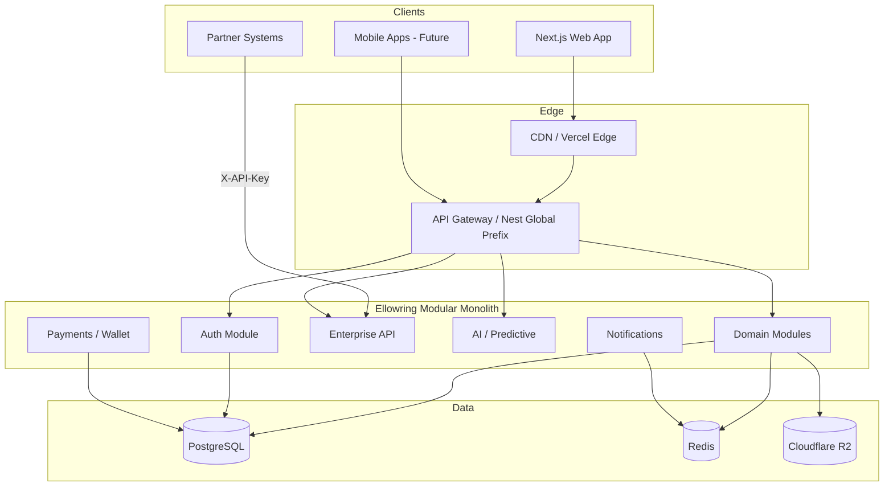

---

# 5. Low Level Architecture

| Layer | Responsibility | Tech |
|---|---|---|
| Presentation | Role dashboards, login, forms | Next.js App Router |
| BFF (light) | Browser calls Nest REST; few Next route handlers | Next.js |
| API | REST JSON under `/api` | NestJS Controllers |
| Domain | Use-cases per module | NestJS Services (growing) |
| Persistence | Prisma Client · migrations | Prisma · PostgreSQL |
| Integration | Razorpay, Stripe, SMS, WhatsApp, Google OAuth | Nest providers |
| Cross-cutting | Guards, interceptors, pipes, filters | NestJS |

**Request path:** Browser → TLS → Nest `JwtAuthGuard` / `RolesGuard` / `ApiKeyGuard` → Controller → Prisma/Redis/R2 → Response DTO.

---

# 6. System Context Diagram

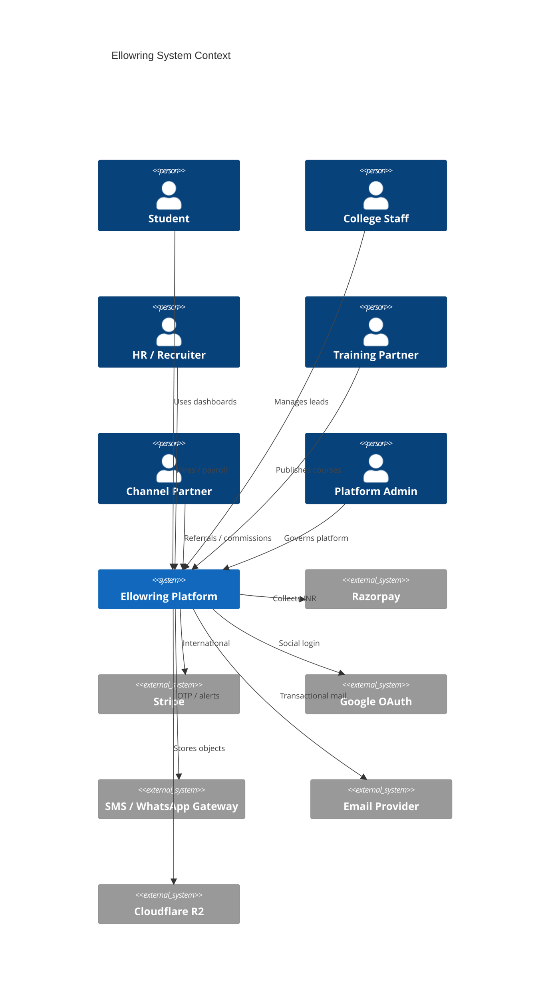

---

# 7. Component Diagram

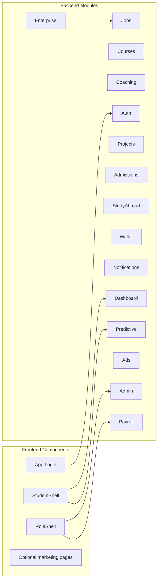

---

# 8. Service Diagram

**Current (modular monolith processes):**

| Process | Host | Notes |
|---|---|---|
| `frontend` | Vercel | SSR/CSR hybrid |
| `api` | Railway / AWS ECS | NestJS single deployable |
| `worker` (future) | AWS | Notifications, payroll batch, ML inference |
| `postgres` | Managed RDS / Railway | Primary store |
| `redis` | Managed Redis | Cache / limits |
| `r2` | Cloudflare | Object storage |

---

# 9. Module Architecture

For each domain module:

| Aspect | Pattern |
|---|---|
| **Purpose** | Deliver one ecosystem capability (e.g., Jobs, Wallet) |
| **Responsibilities** | HTTP API, validation, persistence, events emission |
| **Dependencies** | Auth guards, Prisma, shared DTOs; avoid cyclic imports |
| **Workflow** | Controller → Service → Prisma; money paths append ledger |
| **Technology** | NestJS · Prisma · Redis when hot |
| **Security** | JWT + Roles; Admin elevate only with audit |
| **Scalability** | Stateless handlers; paginate lists; cache catalogues |
| **Future** | Extract to service when team/scale warrants |

### Module inventory

| Module | Purpose |
|---|---|
| Authentication | Identity, OTP, JWT, Google-ready |
| Career Guidance | Assessments & recommendations |
| Coaching | NEET/JEE/competitive batches |
| Admissions | College programmes & applications |
| Study Abroad | Pathways & milestones |
| Courses | Skill LMS |
| Internships | Internship marketplace |
| Projects | Live projects |
| Jobs / HR Hiring | ATS surface |
| Payroll | Phase-2/3 payroll runs |
| Wallet / Coupons | Credits & redemptions |
| Certificates | Issuance & verification |
| Notifications | Multi-channel messaging |
| Analytics / Reports | Role dashboards |
| Enterprise API | Phase-3 partner access |
| Ads | Labelled sponsorships |
| Predictive | Placement / demand models |

---

# 10. Frontend Architecture

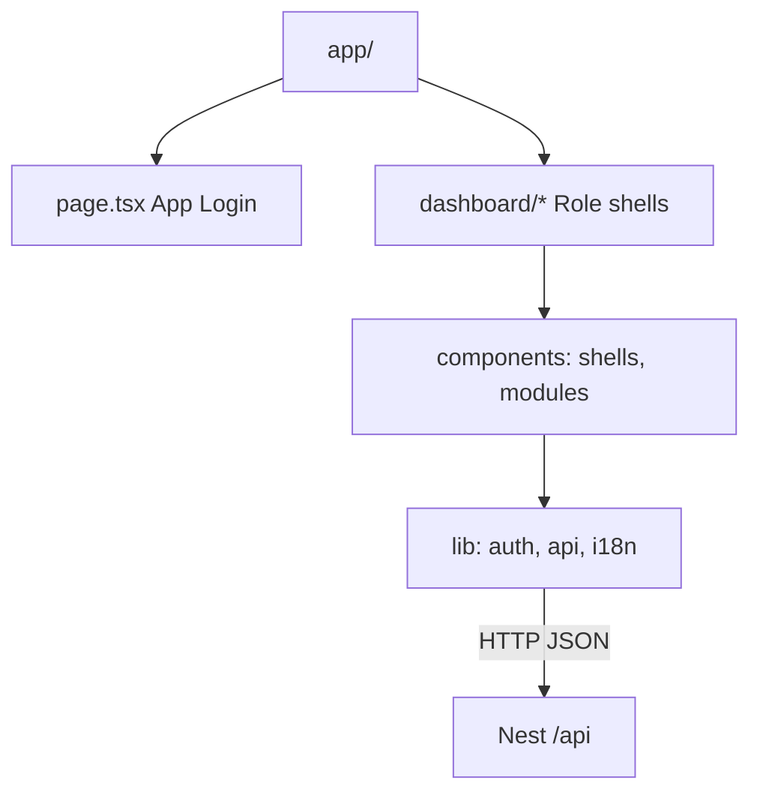

| Concern | Approach |
|---|---|
| Routing | Next.js App Router · role route prefixes |
| State | React context for auth & i18n; server fetch where needed |
| UI system | Tailwind + blue SaaS shells aligned to Student reference |
| Auth UX | Root `/` is app login (no marketing homepage) |
| i18n | `I18nProvider` en/hi/ta dictionary (Phase 3 hooks) |

---

# 11. Backend Architecture

| Concern | Approach |
|---|---|
| Framework | NestJS modules under `src/*` |
| Entry | `main.ts` global prefix `/api`, CORS from env |
| Cross-cutting | `JwtAuthGuard`, `RolesGuard`, `ApiKeyGuard` |
| Config | `@nestjs/config` · `.env` |
| ORM | PrismaService singleton module |

---

# 12. API Architecture

| API class | Auth | Consumers |
|---|---|---|
| Private app API | Bearer JWT | Web dashboards |
| Admin API | JWT + ADMIN role | Admin console |
| Enterprise API | `X-API-Key` | Partners (Phase 3) |
| Public verify | API key or signed public URL (future) | Employers |

**Conventions:** REST · JSON · plural resources · problem details on errors · pagination `?page&limit` (standardise in hardening).

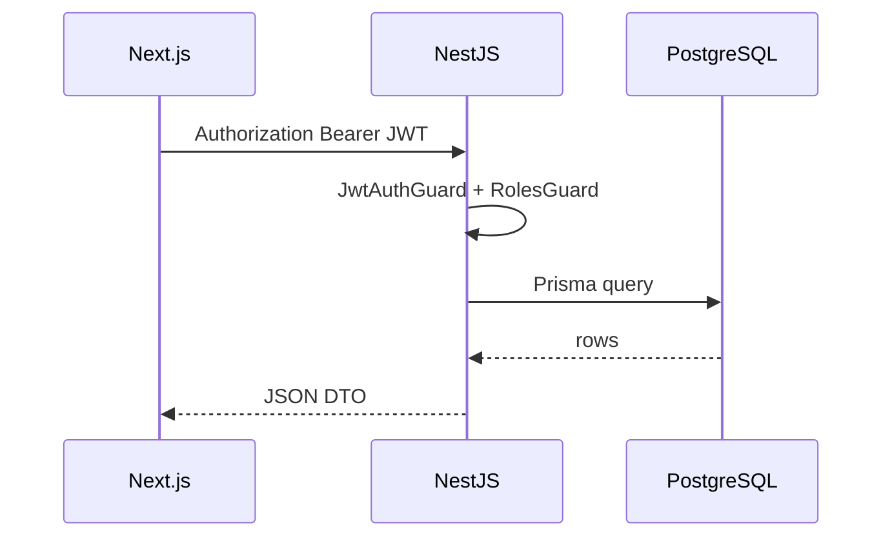

---

# 13. Database Architecture

| Environment | Engine |
|---|---|
| Local demo | SQLite via Prisma (`file:./dev.db`) |
| Staging/Production | PostgreSQL 15+ |

**Core entities:** `User`, role profiles (`Student`, `College`, `Company`, …), `Course`, `CoachingModule`, `Job`, `Internship`, `LiveProject`, `Application`, `Wallet`, `WalletTransaction`, `Certificate`, `Notification`, `Payment`.

**Principles:** soft delete where audit needs; monetary amounts as decimal/float with ledger; indexes on FKs and `email`; migrations backward-compatible.

---

# 14. Authentication Architecture

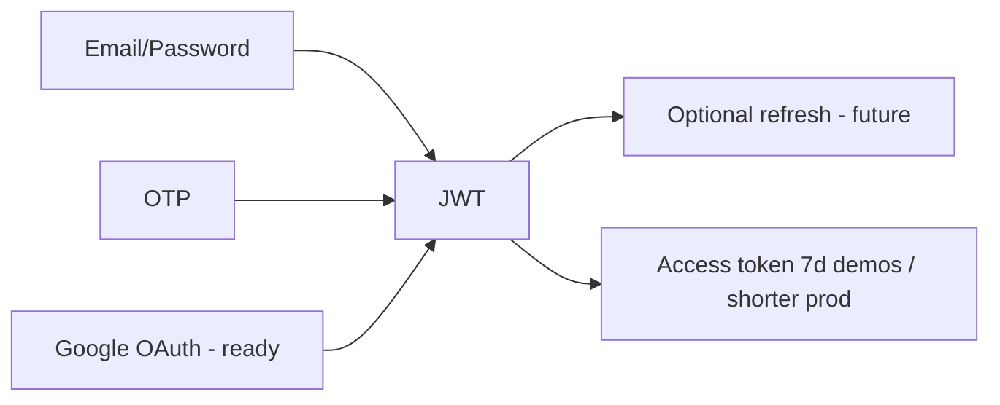

| Method | Status |
|---|---|
| Email + password (bcrypt) | Implemented |
| OTP (static/demo & provider-ready) | Implemented |
| Google Login | Designed; wire OAuth client IDs in prod |
| Enterprise API keys | Phase 3 implemented |

---

# 15. Authorization Architecture

Every protected route declares required roles. Missing role → `403 Forbidden`. Tenant objects scoped by `companyId` / `collegeId` / `partnerId` derived from the authenticated user.

---

# 16. RBAC Architecture

| Role | Access |
|---|---|
| STUDENT | Student dashboard & learning/opportunity modules |
| COLLEGE | Admission & placement cell |
| COMPANY | Jobs, ATS, payroll |
| TRAINING | Courses, trainers, assessments, revenue |
| PARTNER | Referrals, commissions, payouts |
| ADMIN | Full governance |

---

# 17. Notification Architecture

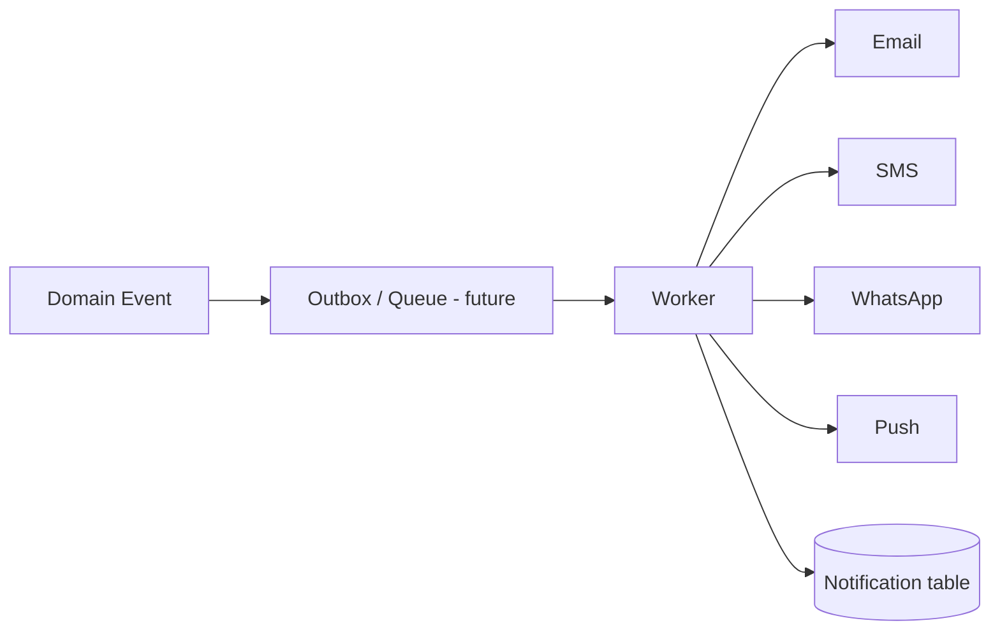

**Today:** In-app notifications persisted; email/SMS/WhatsApp channels specified for providers.  
**Security:** Templates reviewed; no secrets in payloads; quiet hours & preferences (PRD).

---

# 18. Payment Architecture

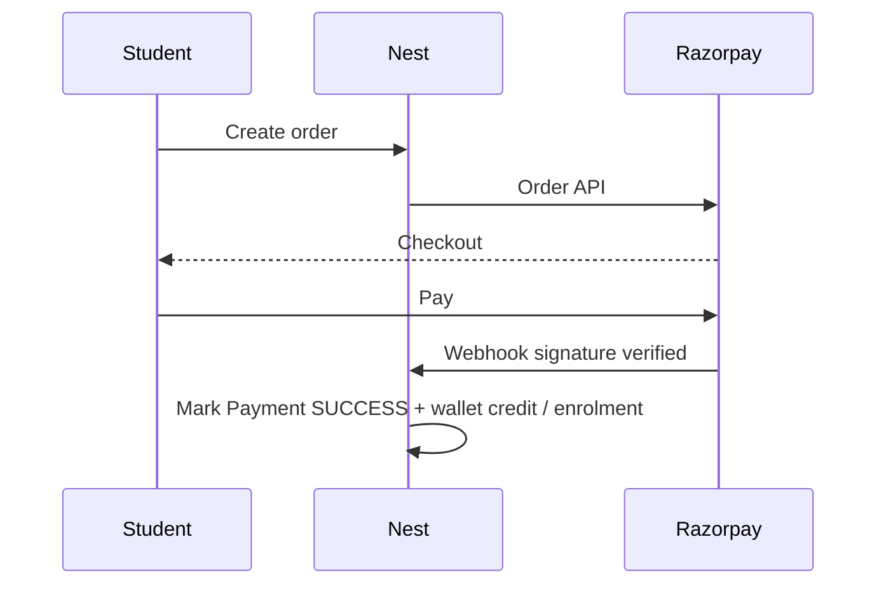

Stripe used for international Phase-3 corridors. Idempotency keys on webhooks mandatory in production.

---

# 19. Wallet Architecture

Append-only `WalletTransaction` ledger; balance derived and stored for read performance with transactional updates. Coupons redeem → credit. Partner commissions → partner wallet with clawback on refunds.

---

# 20. Analytics Architecture

| Layer | Use |
|---|---|
| Operational KPIs | Dashboard `/dashboard` aggregates |
| Phase-3 Predictive | `/predictive/*` model stubs |
| Future warehouse | Event stream → BigQuery/Redshift | Cohort & funnel builder |

---

# 21. Logging Architecture

Structured JSON logs with `requestId`, `userId`, `module`. Never log passwords, tokens, OTPs, full PANs. Retention: 30 days hot / 12 months cold.

---

# 22. Monitoring Architecture

| Signal | Tooling (target) |
|---|---|
| Uptime | Better Stack / CloudWatch |
| APM/traces | OpenTelemetry → Jaeger/Honeycomb |
| Errors | Sentry |
| Business | Registrations, payments, enrolments anomaly alerts |

SLO example: API availability 99.9% monthly; p95 dashboard &lt; 1.5s.

---

# 23. File Storage Architecture

Cloudflare R2 buckets: `public-assets`, `private-docs`, `certificates`. Private objects via short-lived signed URLs. Virus scan on upload in production.

---

# 24. Search Architecture

V1/V2: Postgres `ILIKE` / indexed fields.  
V3: OpenSearch/Elastic for cross-entity global search and candidate boolean search.

---

# 25. Cache Architecture

Redis keys: `catalogue:*`, `ratelimit:*`, `session:*` (if sticky sessions avoided). TTLs short for pricing; invalidate on admin publish.

---

# 26. Security Architecture

| Control | Implementation |
|---|---|
| Transport | TLS 1.2+ |
| Password | bcrypt |
| JWT | Signed HS256/RS256 (upgrade to RS256 in prod) |
| Headers | Helmet, CORS allowlist |
| Input | class-validator DTOs |
| Secrets | Env / AWS Secrets Manager |
| DPDP | Consent, export/delete hooks |
| Ads | Always labelled |

---

# 27. Deployment Architecture

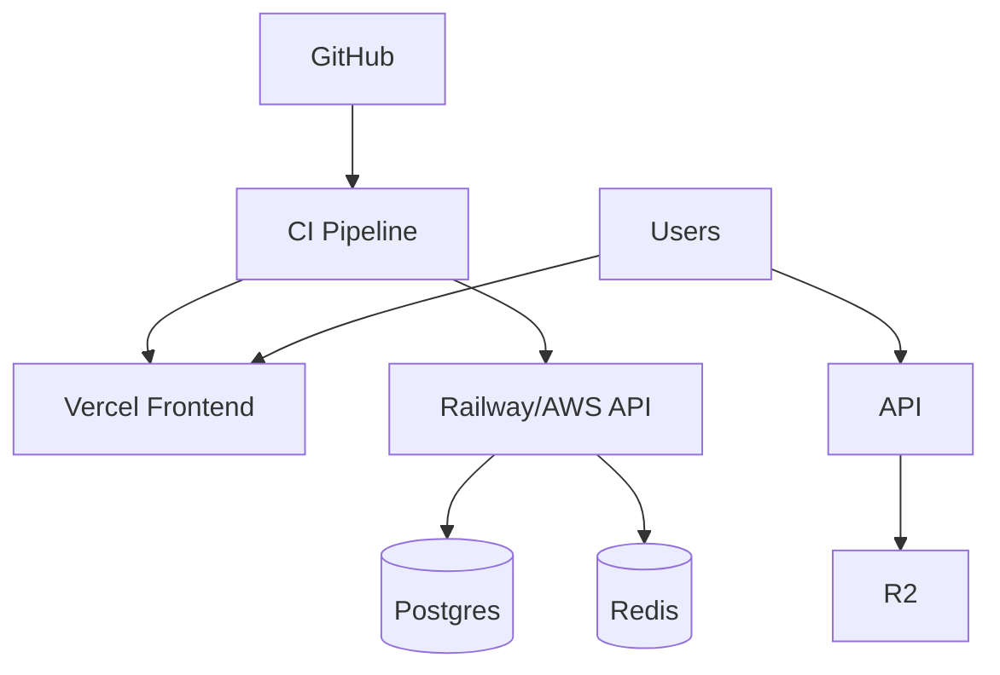

---

# 28. CI/CD Architecture

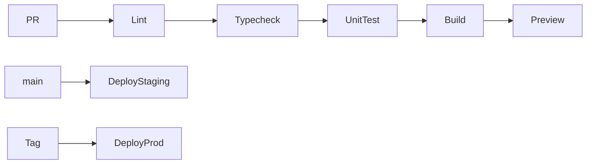

Checks: ESLint, `tsc`, Nest build, Prisma validate, smoke `/users/health`.

---

# 29. Backup Strategy

| Asset | Policy |
|---|---|
| PostgreSQL | Daily full + continuous WAL · 30-day retention |
| Redis | AOF or accept ephemeral |
| R2 | Versioning on certificates bucket |
| Secrets | Encrypted backup of vault metadata |

Monthly restore drill.

---

# 30. Disaster Recovery

| Tier | RTO | RPO |
|---|---|---|
| Critical API + DB | 4h | 15m |
| Analytics | 24h | 24h |

Multi-AZ Postgres; documented runbooks; status page.

---

# 31. Scalability Strategy

1. Horizontal API replicas behind LB  
2. Read replicas for heavy GET catalogues  
3. Redis cache for courses/jobs  
4. Async workers for notifications & payroll  
5. CDN for Next static assets  

---

# 32. High Availability

- Stateless API  
- Health checks `/api/users/health`  
- Zero-downtime deploys  
- Queue retries with DLQ  

---

# 33. Performance Optimization

- Prisma select minimization  
- Pagination defaults  
- Image optimization via Next/Image + R2 CDN  
- Avoid N+1 with `include` carefully  

---

# 34. Rate Limiting

| Surface | Limit (starting) |
|---|---|
| Auth login/OTP | 5 / 10 min / IP |
| App API | 120 / min / user |
| Enterprise API | Per-key quota (e.g., 1k / hour) |

Enforce at gateway/Nest throttler + Redis.

---

# 35. API Gateway Design

Current: Nest global prefix + reverse proxy.  
Target: AWS API Gateway / Cloudflare Worker for TLS, WAF, key validation, routing to monolith then to extracted services.

---

# 36. Event Driven Architecture (Future)

Domain events: `PaymentSucceeded`, `EnrollmentCreated`, `OfferAccepted`. Outbox pattern → Kafka/SQS → consumers (notifications, analytics, partner webhooks).

---

# 37. Microservice Migration Plan

| Order | Extract when |
|---|---|
| 1 Notifications | High volume async |
| 2 Payments/Wallet | PCI & blast-radius |
| 3 Search | OpenSearch team |
| 4 Predictive | GPU/latency isolation |
| 5 Jobs/ATS | Employer-scale traffic |

Strangler pattern: keep Prisma schema shared initially; introduce service DB only with sync strategy.

---

# 38. Cloud Infrastructure

| Component | Primary | Alternate |
|---|---|---|
| Web | Vercel | Cloudflare Pages |
| API | Railway | AWS ECS/Fargate |
| DB | Railway Postgres / AWS RDS | |
| Cache | Upstash / ElastiCache | |
| Objects | Cloudflare R2 | S3 |
| DNS/WAF | Cloudflare | |

---

# 39. Environment Configuration

| Variable | Purpose |
|---|---|
| `DATABASE_URL` | Prisma connection |
| `JWT_SECRET` | Token signing |
| `JWT_EXPIRES_IN` | Token TTL |
| `PORT` | API port (4001 local) |
| `CORS_ORIGIN` | Allowed web origin |
| `OTP_STATIC` | Dev OTP |
| `ENTERPRISE_API_KEY` | Partner API |
| `REDIS_URL` | Cache (prod) |
| `R2_*` | Object storage |
| `RAZORPAY_*` / `STRIPE_*` | Payments |
| `NEXT_PUBLIC_API_URL` | Frontend API base |

Environments: `local` · `staging` · `production`.

---

# 40. Production Architecture

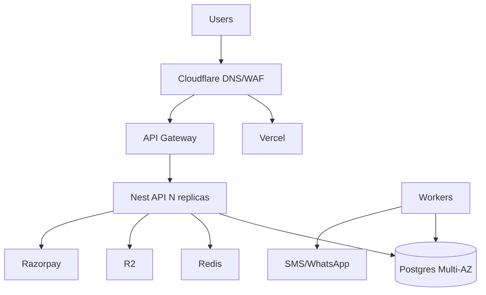

**Production musts:** RS256 JWT or rotating secrets, webhook signature verification, Redis rate limits, R2 private certs, PagerDuty on-call, encrypted backups, DPDP DPIA complete.

---

## Appendix A — Architecture Decision Records (selected)

| ADR | Decision | Reason |
|---|---|---|
| ADR-001 | Modular monolith first | Speed + shared transactions for wallet/payments |
| ADR-002 | Next.js App Router | Role dashboards + SEO optionality |
| ADR-003 | Prisma | Productive schema & type-safety |
| ADR-004 | API keys for Enterprise V3 | Fast partner onboarding; OAuth later |
| ADR-005 | Labelled ads only | Trust & youth safety |

## Appendix B — Phase Mapping

| Phase | Architecture emphasis |
|---|---|
| 1 MVP | Auth, core modules, student UI canon |
| 2 | Training/Partner/HR Payroll shells, live projects, study abroad |
| 3 | Enterprise API, ads, predictive, i18n hooks, HA/DR readiness |
| 4 | Full PostgreSQL enterprise schema (122 models), Prisma Phase-4 pack — see `docs/Ellowring_Database_Design.md` |

---

*End of Ellowring System Architecture Document v1.0 — Ellowring Software Solutions*
