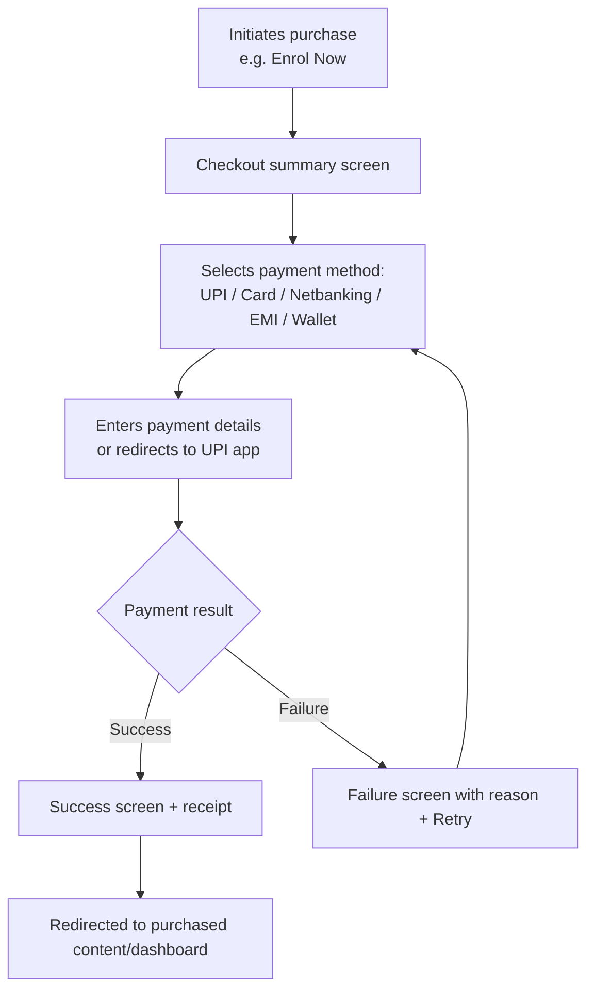

# Ellowring Phase 6 — Enterprise UI/UX Design System

**Company:** Ellowring Software Solutions
**Product:** Ellowring — Learn. Prepare. Build. Get Hired.
**Vision:** From 11th Standard to First Job — Everything in One Platform.

---

## Document Control

| Field | Value |
|---|---|
| Document Title | Ellowring Phase 6 — Enterprise UI/UX Design System |
| Document Type | Design System Specification (Design + Engineering Handoff) |
| Owner | Head of Design, Ellowring Software Solutions |
| Audience | Product Designers (Figma), Frontend Engineers (Next.js/React/Tailwind), QA, Product Managers |
| Status | Approved for Phase 6 Implementation |
| Related Documents | `docs/Ellowring_PRD.md` · `docs/Ellowring_API_Design.md` · `docs/Ellowring_Database_Design.md` |
| Companion Code Artifacts | `frontend/src/app/globals.css` · `frontend/src/lib/design-tokens.ts` |

### Purpose of This Document

This document is the single source of truth for every visual, interaction, and structural decision in the Ellowring platform — the public marketing website and all six role-based dashboards (Student, College, HR/Company, Training Institute, Channel Partner, Admin). It is written so that a Figma designer can build a complete, consistent file **without asking a single clarifying question**, and so that a frontend engineer can implement every screen **pixel-accurately** using the tokens, components, and specifications defined here.

Nothing in this document is a suggestion. Every rule marked with **MUST** is mandatory. Every rule marked with **SHOULD** is a strong default that requires design-lead sign-off to override.

### How to Read This Document

| Chapter Range | Content |
|---|---|
| 1 – 19 | Foundations: brand, philosophy, color, type, icons, grid, spacing, radius, shadow, elevation, gradient, motion, responsive rules, accessibility, dark/light mode, naming, tokens |
| 20 | UI Component Library — every reusable component with anatomy, variants, states, tokens, accessibility, do/don't |
| 21 | Dashboard Chrome — header, sidebar, quick actions, stats, analytics, tables, notifications, profile menu, settings for all six roles |
| 22 | Roles & Navigation — exact menu structures per role |
| 23 | Public Website — full page inventory and navigation |
| 24 | Screen Designs — purpose, user flow, wireframe, hi-fi notes, components, tokens, responsive/a11y/animation for every key screen |
| 25 | Figma Guidelines — file structure, naming, auto layout, variants, tokens, prototyping, dev handoff |
| 26 | Implementation Mapping — how this spec maps onto the Ellowring Next.js codebase |

---

# Table of Contents

1. Brand Guidelines
2. Design Philosophy
3. Color System
4. Typography
5. Icon System
6. Grid System
7. Spacing System
8. Border Radius
9. Shadows
10. Elevation
11. Gradient System
12. Animation Guidelines
13. Motion Design
14. Responsive Design
15. Accessibility (WCAG 2.2 AA)
16. Dark Mode
17. Light Mode
18. Component Naming Conventions
19. Design Tokens
20. UI Component Library
21. Dashboard Chrome (All Six Roles)
22. Roles & Navigation
23. Public Website — Page Inventory
24. Screen Designs
25. Figma Guidelines
26. Implementation Mapping Note

---

# 1. Brand Guidelines

## 1.1 Brand Essence

| Attribute | Statement |
|---|---|
| Company | Ellowring Software Solutions |
| Product tagline | Learn. Prepare. Build. Get Hired. |
| Vision statement | From 11th Standard to First Job — Everything in One Platform. |
| Brand personality | Trustworthy, intelligent, premium, calm, outcome-driven, inclusive |
| Brand tone of voice | Clear, encouraging, precise — never hype-driven or gimmicky |
| Positioning | The single verified ecosystem spanning education, career guidance, hiring, and study abroad — built with the visual polish of a premium SaaS product, not a generic ed-tech portal |

Ellowring's brand must feel like it belongs in the same visual tier as Stripe, Linear, Notion, and Vercel — because the platform competes for trust with colleges, HR departments, and channel partners who evaluate B2B software daily. Every screen is a trust signal.

## 1.2 Logo System

The Ellowring mark is a five-segment ring (representing the five stages of the learner-to-hire journey merging into one ecosystem), rendered in the five secondary brand colors, wrapping a white/negative-space core. It pairs with the wordmark **ELLOWRING** and the sub-mark **SOFTWARE SOLUTIONS**.

| Lockup | Usage | Minimum Size | Clear Space |
|---|---|---|---|
| **Horizontal lockup** (mark + wordmark side-by-side) | Default for headers, navbars, business documents | 96px width | 0.5× mark height on all sides |
| **Stacked lockup** (mark above wordmark, centered) | Splash screens, login/register hero panels, certificates, print | 72px height | 0.5× mark height on all sides |
| **Mark only** (ring, no text) | Favicons, app icons, collapsed sidebar, avatar fallback, loading spinners | 24px | 4px |
| **Monochrome mark** | Watermarks, single-color print, fax/legal documents | 24px | 4px |

### 1.2.1 Logo Placement Rule (Mandatory, Every Page)

**`FR-BR-001`** — The Ellowring logo **MUST** appear on every single page of the platform, public or authenticated, with zero exceptions:

| Surface | Logo Placement | Variant |
|---|---|---|
| Public marketing pages | Top-left of the sticky header | Horizontal, full color, on white |
| Login / Register / Forgot Password | Top-left of the split-screen panel + centered on the brand panel | Horizontal (form side) + Stacked, dark (brand side) |
| All 6 dashboards | Top-left of the fixed top bar | Horizontal, full color, on white (light mode) / horizontal, light, on navy (dark mode) |
| Collapsed sidebar (icon-only) | Top of sidebar | Mark only |
| Certificates & PDFs | Header of the document | Horizontal, full color |
| Emails | Header of the email template | Horizontal, full color, on white |
| Payment receipts / invoices | Header | Horizontal, full color |
| 404 / 500 / maintenance pages | Centered above the message | Stacked |
| Browser tab | Favicon | Mark only, 32×32 and 16×16 |
| Loading / splash states | Centered, animated ring-draw | Mark only |

### 1.2.2 Logo Construction

```
        ┌─────────────────────────────────────────┐
        │   ╭───╮                                  │
        │  ╱ ◜◝ ╲     ELLOWRING                    │
        │ │  ●●   │   SOFTWARE SOLUTIONS            │
        │  ╲ ◟◞ ╱                                  │
        │   ╰───╯                                  │
        └─────────────────────────────────────────┘
          5-segment ring      Wordmark (bold, tight
          (Yellow, Red,       tracking) + sub-label
          Indigo, Sky,        (uppercase, wide
          Green segments)     tracking, muted)
```

| Element | Specification |
|---|---|
| Ring outer radius : inner radius | 30 : 12.5 (on a 64×64 viewBox) — ratio ≈ 2.4 : 1 |
| Segment sweep | 68° per segment with 4° gaps, 5 segments |
| Segment colors (clockwise from top) | `#F5C518` (Yellow) → `#E53935` (Red) → `#3F2B96` (Purple/Indigo) → `#1BA7C8` (Sky Blue) → `#43A047` (Green) |
| Core | Negative space / white circle |
| Wordmark typeface | Plus Jakarta Sans, ExtraBold (800), tracking +2% |
| Sub-label typeface | Plus Jakarta Sans, SemiBold (600), uppercase, tracking +20% |
| Wordmark-to-mark gap | 0.28× mark width |

### 1.2.3 Logo Do / Don't

| Do | Don't |
|---|---|
| Use the horizontal lockup on light backgrounds with sufficient contrast | Never stretch, skew, or rotate the mark |
| Use the dark/light variant matched to the surface behind it | Never recolor the ring segments to a single brand color |
| Maintain minimum clear space equal to 0.5× the mark's height | Never place the logo on a busy photographic background without a scrim |
| Scale the lockup proportionally | Never separate the wordmark from the mark by more than 0.5× mark width |
| Use the mark-only variant below 96px lockup width | Never recreate the wordmark in a different typeface |

## 1.3 Brand Voice in UI Copy

| Context | Voice Example |
|---|---|
| Empty state | "No mock tests yet. Start your first one — it takes 3 minutes." |
| Error | "That didn't go through. Check your connection and try again." |
| Success | "You're enrolled. Your first class starts Monday at 6 PM." |
| Upsell | "Go Premium to unlock unlimited mock tests." (never "Upgrade NOW!!!" with urgency gimmicks) |

**`FR-BR-002`** — UI copy MUST be written in sentence case (not Title Case) for body copy, buttons, and menu items, except for proper nouns and the wordmark itself.

---

# 2. Design Philosophy

## 2.1 Reference Systems and What Ellowring Borrows From Each

| Inspiration | What Ellowring Adopts | Design Rationale |
|---|---|---|
| **Stripe** | Confident use of gradient mesh backgrounds behind hero/marketing sections; dense, well-organized data tables in dashboards; monospace tabular numerals for financial data | Stripe is the gold standard for making complex B2B data feel simple. Ellowring's wallet, payroll, and commission ledgers borrow this clarity. |
| **Linear** | Keyboard-first interaction model, subtle 1px hairline borders instead of heavy drop shadows, fast micro-animations (120–180ms), dark mode as a first-class citizen | Linear proves that "premium" often means *restraint* — fewer colors, tighter motion, higher information density without clutter. Ellowring's admin and HR dashboards borrow this density. |
| **Notion** | Flexible card-based content blocks, soft neutral canvas colors, friendly rounded icons, calm typography hierarchy | Notion is approachable to non-technical users (students, college admins) without feeling unprofessional. |
| **Vercel** | High-contrast black/white core palette accented by a single vivid brand color, geometric sans-serif type, glow/gradient accents on dark backgrounds, generous whitespace on marketing pages | Vercel demonstrates how a technical product can look aspirational. Ellowring's marketing site and Admin dark-mode surfaces borrow this. |
| **Apple (Human Interface Guidelines)** | Physically plausible motion (ease curves that mimic real-world deceleration), glassmorphism (frosted translucent surfaces), generous touch targets, content-first layouts that never let chrome compete with content | Apple's rigor around motion and clarity sets the bar for "it just feels right" — critical for a platform used by first-time smartphone users in Tier 2/3 India as well as enterprise HR teams. |

## 2.2 Core Design Principles

| # | Principle | In Practice |
|---|---|---|
| 1 | **Clarity over decoration** | Every visual element must earn its place by aiding comprehension or hierarchy — never purely ornamental. |
| 2 | **One primary action per screen** | Each screen has exactly one visually dominant primary button; all other actions are secondary or tertiary. |
| 3 | **Consistency compounds trust** | The same component must look and behave identically wherever it appears, across all six roles and the public site. |
| 4 | **Progressive disclosure** | Complex data (analytics, payroll, verification) is revealed in layers — summary first, drill-down on demand. |
| 5 | **Motion communicates, never decorates** | Every animation either orients the user (where did this come from/go to), gives feedback (it worked), or adds delight in a low-frequency moment (onboarding, certificate unlock) — never in high-frequency, high-volume UI (tables, lists). |
| 6 | **Accessible by default, not by request** | WCAG 2.2 AA compliance is a baseline requirement for every component, not an afterthought. |
| 7 | **Design for the slowest device and the least confident user** | Ellowring serves Tier 2/3 India on 4G Android alongside enterprise HR teams on 27" monitors — every screen must degrade gracefully. |

## 2.3 Visual Language

### 2.3.1 Glassmorphism — Where and How

Ellowring uses glassmorphism **sparingly and purposefully** — for elevated, secondary-layer surfaces that float above content, never for primary reading surfaces (body text on frosted glass fails contrast checks).

| Approved Use | Not Approved |
|---|---|
| Marketing hero overlays on gradient/photo backgrounds | Data tables |
| Login/Register brand panel decorative cards | Body paragraphs of long-form content |
| Floating "AI Assistant" launcher panel | Form inputs |
| Dashboard top bar (subtle, on scroll) | Primary CTA buttons |
| Modal backdrops (the scrim, not the modal itself) | Sidebar navigation (must stay opaque for legibility) |

**Glass surface recipe:**

```css
.glass-surface {
  background: rgba(255, 255, 255, 0.62);        /* light mode */
  backdrop-filter: blur(16px) saturate(140%);
  -webkit-backdrop-filter: blur(16px) saturate(140%);
  border: 1px solid rgba(255, 255, 255, 0.35);
  box-shadow: 0 8px 32px rgba(11, 31, 58, 0.12);
}

.glass-surface.dark {
  background: rgba(15, 23, 42, 0.55);            /* dark mode */
  border: 1px solid rgba(255, 255, 255, 0.08);
}
```

### 2.3.2 Rounded Cards

All content containers use consistent, generous corner radii (see Chapter 8) to feel soft and modern rather than clinical. Sharp 0px corners are reserved exclusively for data tables and code blocks.

### 2.3.3 Soft Shadows

Shadows are large, diffuse, and low-opacity (never a hard 1–2px drop shadow). They simulate a soft studio light source from above, reinforcing the "physical card floating above a canvas" metaphor. See Chapter 9.

### 2.3.4 Gradients

Gradients are used deliberately at three intensities: **subtle mesh backgrounds** (marketing hero, empty states), **brand gradient accents** (primary buttons on marketing pages, premium/upsell surfaces), and **data-viz gradients** (chart fills). See Chapter 11.

### 2.3.5 Premium Animation

Animation is fast (120–320ms), uses physically plausible easing, and is always interruptible. See Chapters 12–13.

## 2.4 Design Non-Goals

To keep the system disciplined, the following are explicitly **out of scope** / disallowed:

- Skeuomorphic textures (leather, paper grain, faux-3D bevels) — except the intentional subtle `.grain` noise texture reserved for marketing hero backgrounds only.
- Neumorphism (soft-embossed UI) — fails accessibility contrast rules.
- Auto-playing video or audio anywhere.
- More than one animated hero element per screen.
- Comic/rounded "friendly" illustration styles inconsistent with the premium SaaS tone — Ellowring uses geometric, editorial-style illustrations only (flat vector, brand palette, no outlines).

---

# 3. Color System

## 3.1 Brand Color Rationale

Ellowring's palette is built on **Royal Blue** as the primary trust color (the color of the platform's UI chrome, primary actions, and data visualization anchor), **White** and **Dark Navy** as the neutral canvas pair for light/dark mode, and **five secondary colors lifted directly from the logo ring segments** — Yellow, Red, Purple, Sky Blue, and Green — used exclusively for semantic meaning, categorization, and data visualization, never as dominant UI chrome colors.

| Role | Color Family | Rationale |
|---|---|---|
| Primary / Brand | Royal Blue `#2563EB` family | Blue is the highest-trust color in enterprise SaaS (see Stripe, LinkedIn, Meta Business, most banking apps); it reads as calm, competent, and safe for a platform handling personal data, payments, and career decisions |
| Neutral canvas | White `#FFFFFF` (light mode) / Dark Navy `#0B1F3A` (dark mode) | A true neutral pair lets the brand and semantic colors carry all the visual weight without competing backgrounds |
| Secondary (from logo) | Red, Yellow, Green, Sky Blue, Purple | Reused directly from the five logo ring segments so the brand feels cohesive from mark to UI; each is assigned one semantic job (see 3.4) so they never clash |

## 3.2 Primary Palette — Royal Blue Family

| Token | Hex | RGB | Usage |
|---|---|---|---|
| `blue-50` | `#EFF6FF` | 239, 246, 255 | Lightest tint — subtle info backgrounds, hover states on white |
| `blue-100` | `#DBEAFE` | 219, 234, 254 | Selected row backgrounds, badge backgrounds |
| `blue-200` | `#BFDBFE` | 191, 219, 254 | Chart gridlines on brand surfaces, disabled primary button border |
| `blue-300` | `#93C5FD` | 147, 197, 253 | Icon accents on dark surfaces |
| `blue-400` | `#60A5FA` | 96, 165, 250 | Hover state for links on dark backgrounds |
| `blue-500` | `#3B82F6` | 59, 130, 246 | Dashboard active-nav highlight (matches canonical Student Dashboard reference); secondary data-viz series |
| **`blue-600`** | **`#2563EB`** | **37, 99, 235** | **Primary brand color** — primary buttons, links, focus rings, active states, primary chart series |
| `blue-700` | `#1D4ED8` | 29, 78, 216 | Primary button hover/pressed state |
| `blue-800` | `#1E40AF` | 30, 64, 175 | Primary button active/depressed state, dark-mode primary accent |
| `blue-900` | `#1E3A8A` | 30, 58, 138 | Deep accents on light backgrounds, text-on-blue-50 |
| `blue-950` | `#172554` | 23, 37, 84 | Rarely used; deep gradient stops |

## 3.3 Neutral Palette — White / Dark Navy

| Token | Hex | RGB | Usage |
|---|---|---|---|
| `white` | `#FFFFFF` | 255, 255, 255 | Light-mode surface (cards, modals, inputs) |
| `navy-950` | `#0B1F3A` | 11, 31, 58 | **Dark mode canvas** — page background; light-mode text for headings (`navy-950` doubles as ink) |
| `navy-900` | `#102A4C` | 16, 42, 76 | Dark-mode surface (cards, sidebar) |
| `navy-800` | `#16345E` | 22, 52, 94 | Dark-mode elevated surface (modals, popovers) |
| `navy-700` | `#1D4270` | 29, 66, 112 | Dark-mode borders, dividers |
| `slate-600` | `#475569` | 71, 85, 105 | Body text secondary (light mode) |
| `slate-500` | `#64748B` | 100, 116, 139 | Placeholder text, captions |
| `slate-400` | `#94A3B8` | 148, 163, 184 | Disabled text, icon default (light mode) |
| `slate-300` | `#CBD5E1` | 203, 213, 225 | Borders, dividers (light mode) |
| `slate-200` | `#E2E8F0` | 226, 232, 240 | Subtle backgrounds, skeleton loaders |
| `slate-100` | `#F1F5F9` | 241, 245, 249 | Canvas background (light mode dashboards) |
| `slate-50` | `#F8FAFC` | 248, 250, 252 | Lightest canvas tint, table row stripe |

## 3.4 Secondary Palette — From the Logo (Semantic Assignment)

Each secondary color is **assigned exactly one semantic role** across the entire product so meaning stays consistent regardless of context.

| Color | Hex (500) | RGB | Logo Segment | Assigned Semantic Role | Full Ramp |
|---|---|---|---|---|---|
| **Red** | `#EF4444` | 239, 68, 68 | Yes (`#E53935`) | **Danger / Error / Destructive** — errors, failed payments, rejections, negative deltas | 50 `#FEF2F2` · 100 `#FEE2E2` · 300 `#FCA5A5` · 500 `#EF4444` · 700 `#B91C1C` · 900 `#7F1D1D` |
| **Yellow** | `#F59E0B` | 245, 158, 11 | Yes (`#F5C518`) | **Warning / Pending / Premium accent** — pending verification, SLA-at-risk, "Go Premium" crown accents | 50 `#FFFBEB` · 100 `#FEF3C7` · 300 `#FCD34D` · 500 `#F59E0B` · 700 `#B45309` · 900 `#78350F` |
| **Green** | `#22C55E` | 34, 197, 94 | Yes (`#43A047`) | **Success / Positive / Verified** — success toasts, placed/hired status, positive deltas, verified badges | 50 `#F0FDF4` · 100 `#DCFCE7` · 300 `#86EFAC` · 500 `#22C55E` · 700 `#15803D` · 900 `#14532D` |
| **Sky Blue** | `#0EA5E9` | 14, 165, 233 | Yes (`#1BA7C8`) | **Informational** — tips, AI Assistant accents, info banners, secondary data-viz series | 50 `#F0F9FF` · 100 `#E0F2FE` · 300 `#7DD3FC` · 500 `#0EA5E9` · 700 `#0369A1` · 900 `#0C4A6E` |
| **Purple** | `#8B5CF6` | 139, 92, 246 | Yes (`#3F2B96`) | **Premium / AI / Special features** — AI-generated content markers, premium tier badges, study-abroad accent | 50 `#F5F3FF` · 100 `#EDE9FE` · 300 `#C4B5FD` · 500 `#8B5CF6` · 700 `#6D28D9` · 900 `#4C1D95` |

## 3.5 Color Usage Matrix

| Use Case | Light Mode Token | Dark Mode Token |
|---|---|---|
| Page canvas | `slate-100` (`#F1F5F9`) | `navy-950` (`#0B1F3A`) |
| Card / surface | `white` | `navy-900` |
| Elevated surface (modal, popover) | `white` + shadow | `navy-800` + border |
| Primary text | `navy-950` (`#0B1F3A`) | `slate-50` (`#F8FAFC`) |
| Secondary text | `slate-600` | `slate-400` |
| Placeholder / disabled text | `slate-400` | `slate-500` |
| Border / divider | `slate-200` | `navy-700` |
| Primary action | `blue-600` | `blue-500` |
| Primary action hover | `blue-700` | `blue-400` |
| Focus ring | `blue-600` @ 40% opacity, 3px | `blue-400` @ 45% opacity, 3px |
| Success | `green-500` | `green-500` (unchanged; verified against dark navy at AA) |
| Warning | `yellow-500` on `yellow-50` bg | `yellow-400` on `navy-800` bg |
| Danger | `red-500` | `red-400` |
| Info | `sky-500` | `sky-400` |
| Premium/AI | `purple-500` | `purple-400` |

## 3.6 Contrast Compliance Table (WCAG 2.2 AA)

| Foreground | Background | Ratio | Pass AA (4.5:1 text / 3:1 large) |
|---|---|---|---|
| `navy-950` (#0B1F3A) | `white` | 15.8 : 1 | ✅ Pass (AAA) |
| `slate-600` (#475569) | `white` | 7.1 : 1 | ✅ Pass (AAA body) |
| `white` | `blue-600` (#2563EB) | 4.6 : 1 | ✅ Pass AA (buttons ≥ 14px bold) |
| `white` | `blue-700` (#1D4ED8) | 5.9 : 1 | ✅ Pass AA |
| `slate-50` (#F8FAFC) | `navy-950` (#0B1F3A) | 15.1 : 1 | ✅ Pass (AAA) |
| `slate-400` (#94A3B8) | `navy-900` (#102A4C) | 4.6 : 1 | ✅ Pass AA (large text/icons only) |
| `red-500` (#EF4444) | `white` | 4.0 : 1 | ⚠️ Use `red-700` (#B91C1C) for small error text (6.3:1) |
| `green-500` (#22C55E) | `white` | 2.6 : 1 | ⚠️ Use `green-700` (#15803D) for small text (5.1:1); `green-500` OK for icons/large badges only |
| `yellow-500` (#F59E0B) | `white` | 2.4 : 1 | ⚠️ Never use for text on white; pair with `navy-950` text on `yellow-50` background |

**`FR-COL-001`** — Any color combination not listed above **MUST** be verified against WCAG 2.2 AA before use and logged in the Figma "Contrast Audit" page (see Chapter 25).

## 3.7 CSS Variable Reference (Preview — Full Tokens in Chapter 19)

```css
:root {
  --color-primary: #2563EB;
  --color-primary-hover: #1D4ED8;
  --color-primary-active: #1E40AF;
  --color-canvas: #F1F5F9;
  --color-surface: #FFFFFF;
  --color-ink: #0B1F3A;
  --color-ink-muted: #475569;
  --color-border: #E2E8F0;
  --color-success: #22C55E;
  --color-warning: #F59E0B;
  --color-danger: #EF4444;
  --color-info: #0EA5E9;
  --color-premium: #8B5CF6;
}

[data-theme="dark"] {
  --color-canvas: #0B1F3A;
  --color-surface: #102A4C;
  --color-ink: #F8FAFC;
  --color-ink-muted: #94A3B8;
  --color-border: #1D4270;
}
```

---

# 4. Typography

## 4.1 Typeface Selection Rationale

| Typeface | Role | Why |
|---|---|---|
| **Plus Jakarta Sans** | Primary — display, headings, marketing, buttons, logo wordmark companion | A geometric-humanist sans with distinctive rounded terminals and a confident, premium character at large sizes — reads as "modern SaaS" without being generic (avoids Inter/Roboto sameness at hero scale). Excellent Devanagari/Latin pairing behavior for future regional-language expansion. |
| **Inter** | Secondary — body copy, dense UI, tables, forms, dashboards | Purpose-built for UI legibility at small sizes, near-universal variable font support, exceptional tabular numeral support for financial/analytics tables. Used wherever information density is high. |

Both are loaded via `next/font/google` as variable fonts (see Chapter 26) — no external font requests, no FOIT/FOUT flash.

## 4.2 Type Scale

All sizes use a **1.25 (major third-adjacent) modular scale** rounded to clean pixel values, based on a 16px root. Line-heights are expressed as unitless ratios per Tailwind convention.

| Token | Font | Size (px / rem) | Weight | Line Height | Tracking | Usage |
|---|---|---|---|---|---|---|
| `display-2xl` | Plus Jakarta Sans | 72px / 4.5rem | 800 ExtraBold | 1.05 | −0.02em | Marketing hero headline (desktop only) |
| `display-xl` | Plus Jakarta Sans | 56px / 3.5rem | 800 ExtraBold | 1.08 | −0.02em | Marketing hero headline (tablet), section hero |
| `display-lg` | Plus Jakarta Sans | 44px / 2.75rem | 700 Bold | 1.1 | −0.015em | Marketing section headline |
| `h1` | Plus Jakarta Sans | 36px / 2.25rem | 700 Bold | 1.15 | −0.01em | Page titles (dashboard, detail pages) |
| `h2` | Plus Jakarta Sans | 28px / 1.75rem | 700 Bold | 1.2 | −0.01em | Section titles |
| `h3` | Plus Jakarta Sans | 22px / 1.375rem | 600 SemiBold | 1.25 | 0 | Card group titles, modal titles |
| `h4` | Plus Jakarta Sans | 18px / 1.125rem | 600 SemiBold | 1.3 | 0 | Card titles, widget titles |
| `h5` | Inter | 16px / 1rem | 600 SemiBold | 1.35 | 0 | Sub-card titles, table section headers |
| `h6` | Inter | 14px / 0.875rem | 600 SemiBold | 1.4 | +0.01em | Overline-adjacent headers, dense panel titles |
| `body-lg` | Inter | 18px / 1.125rem | 400 Regular | 1.6 | 0 | Marketing lead paragraphs |
| `body-md` (base) | Inter | 16px / 1rem | 400 Regular | 1.55 | 0 | Default body copy, form inputs |
| `body-sm` | Inter | 14px / 0.875rem | 400 Regular | 1.5 | 0 | Dashboard body copy, table cells |
| `caption` | Inter | 12px / 0.75rem | 500 Medium | 1.4 | +0.01em | Helper text, timestamps, metadata |
| `label` | Inter | 13px / 0.8125rem | 600 SemiBold | 1.3 | +0.02em | Form field labels, input labels |
| `overline` | Inter | 11px / 0.6875rem | 700 Bold | 1.3 | +0.12em (uppercase) | Section eyebrows, badge text, table column headers |
| `button-lg` | Plus Jakarta Sans | 16px / 1rem | 600 SemiBold | 1 | 0 | Large buttons |
| `button-md` | Plus Jakarta Sans | 14px / 0.875rem | 600 SemiBold | 1 | 0 | Default buttons |
| `button-sm` | Plus Jakarta Sans | 13px / 0.8125rem | 600 SemiBold | 1 | 0 | Small/compact buttons |
| `numeral-tabular` | Inter (tabular-nums) | Inherits context size | 600 SemiBold | 1.2 | 0 | All monetary values, KPI numerals, table numeric columns |

## 4.3 Responsive Type Scaling

| Token | Desktop (≥1280px) | Tablet (768–1279px) | Mobile (<768px) |
|---|---|---|---|
| `display-2xl` | 72px | 52px | 36px |
| `display-xl` | 56px | 42px | 32px |
| `display-lg` | 44px | 34px | 28px |
| `h1` | 36px | 30px | 26px |
| `h2` | 28px | 24px | 22px |
| `h3` | 22px | 20px | 18px |
| Body sizes | Unchanged across breakpoints | Unchanged | Unchanged |

**`FR-TYPE-001`** — Body text (`body-sm`/`body-md`) MUST NOT scale down below 14px on any breakpoint; only display/heading tokens scale down.

## 4.4 Font Weight Reference

| Weight Name | Numeric | Plus Jakarta Sans Available | Inter Available |
|---|---|---|---|
| Regular | 400 | ✅ | ✅ |
| Medium | 500 | ✅ | ✅ |
| SemiBold | 600 | ✅ | ✅ |
| Bold | 700 | ✅ | ✅ |
| ExtraBold | 800 | ✅ | — (fallback to 700) |

## 4.5 Typography Do / Don't

| Do | Don't |
|---|---|
| Use Plus Jakarta Sans for anything a user reads as a "headline" or a button label | Never use Plus Jakarta Sans for paragraphs longer than 2 lines |
| Use Inter + `tabular-nums` for all numeric/financial data | Never mix a third typeface into the product |
| Left-align body text always (never justify) | Never center-align paragraphs longer than one line |
| Keep line length between 45–75 characters for body copy | Never let a single line of body text exceed 90 characters on desktop |
| Use sentence case for UI labels | Never use ALL CAPS except `overline` tokens at ≤12px with letter-spacing |

---

# 5. Icon System

## 5.1 Icon Library

**Lucide** is the exclusive icon library across web and dashboard surfaces (via `lucide-react`), chosen for its consistent 24×24 grid, 2px default stroke, permissive license, and the largest coverage of education/HR/finance-relevant icon concepts of any open icon set.

## 5.2 Size Scale

| Token | Size | Stroke Width | Usage |
|---|---|---|---|
| `icon-2xs` | 12px | 1.5px | Inline badge icons, dense table meta icons |
| `icon-xs` | 16px | 1.75px | Input adornments, inline text icons, breadcrumb chevrons, tag icons |
| `icon-sm` | 20px | 1.75px | Buttons (default size), list-item leading icons, nav icons (collapsed sidebar) |
| `icon-md` | 24px | 2px | Sidebar navigation icons (expanded), card header icons, default toolbar icons |
| `icon-lg` | 32px | 2px | Empty-state icons, module grid tiles, feature highlight icons |
| `icon-xl` | 48px+ | 2px (scale stroke proportionally above 40px to 1.5px) | Onboarding illustrations, success/error state hero icons |

## 5.3 Stroke & Style Rules

| Rule | Specification |
|---|---|
| Stroke style | Round line caps, round joins (Lucide default) — never sharp/miter joins |
| Fill | Icons are stroke-only by default; filled variants (`fill-current` at low opacity) permitted only for active/selected states (e.g., filled bell when notifications exist) |
| Color | Icons inherit `currentColor`; never hard-code icon colors outside the semantic tokens in Chapter 3 |
| Optical alignment | Icons paired with text MUST be optically centered on the text's cap-height, not its full line-height box |
| Consistency | The same concept MUST always use the same icon across the entire product (e.g., "Wallet" is always the `wallet` icon, never swapped for `credit-card` in one screen and `wallet` in another) |

## 5.4 Canonical Icon Mapping (Selected)

| Concept | Lucide Icon | Concept | Lucide Icon |
|---|---|---|---|
| Dashboard | `layout-dashboard` | Notifications | `bell` |
| Career Guidance | `compass` | Messages | `message-circle` |
| Coaching | `graduation-cap` | Wallet | `wallet` |
| Mock Tests | `clipboard-check` | Certificates | `award` |
| Colleges | `building-2` | Settings | `settings` |
| Admissions | `file-check-2` | Profile | `circle-user` |
| Courses | `book-open` | Search | `search` |
| Internships | `briefcase` | Filter | `sliders-horizontal` |
| Projects | `layers` | Calendar | `calendar` |
| Jobs | `search-code` (fallback `briefcase-business`) | Chevron/expand | `chevron-down` |
| Study Abroad | `globe` | Success | `circle-check` |
| Analytics | `bar-chart-3` | Warning | `triangle-alert` |
| Verification | `shield-check` | Danger/Error | `circle-x` |
| Payroll | `banknote` | Info | `info` |
| AI Assistant | `sparkles` | Premium | `crown` |

## 5.5 Icon Do / Don't

| Do | Don't |
|---|---|
| Use one icon library end-to-end | Never mix Lucide with Font Awesome/Material Icons/emoji as functional icons |
| Keep a 1:1 icon-to-concept mapping | Never reuse one icon for two unrelated concepts within the same role's UI |
| Size icons per the token scale | Never use arbitrary custom pixel sizes (e.g., 18px, 22px) |
| Use `aria-hidden="true"` on purely decorative icons paired with visible text | Never ship an icon-only button without an `aria-label` |

---

# 6. Grid System

## 6.1 Column Grids by Breakpoint

| Breakpoint | Viewport | Columns | Gutter | Margin |
|---|---|---|---|---|
| Desktop (primary) | ≥1280px | 12 | 24px | 64px (marketing) / 32px (dashboard) |
| Laptop | 1024–1279px | 12 | 20px | 40px (marketing) / 24px (dashboard) |
| Tablet | 768–1023px | 8 | 16px | 24px |
| Mobile | <768px | 4 | 12px | 16px |

## 6.2 Max Widths

| Context | Max Width |
|---|---|
| Marketing content container | 1280px |
| Marketing wide sections (hero backgrounds) | 100vw (background) / 1440px (inner content) |
| Dashboard content column | 1600px (fluid within sidebar-adjusted canvas) |
| Reading content (blog, legal pages) | 720px |
| Modal (default) | 480px |
| Modal (large / data-dense) | 720px |
| Drawer (default) | 420px |

## 6.3 Grid Diagram

```
Desktop — 12 columns, 24px gutter, 32px margin (dashboard)
┌────┬───┬───┬───┬───┬───┬───┬───┬───┬───┬───┬───┬────┐
│ M  │ 1 │ 2 │ 3 │ 4 │ 5 │ 6 │ 7 │ 8 │ 9 │10 │11 │ M  │
└────┴───┴───┴───┴───┴───┴───┴───┴───┴───┴───┴───┴────┘
 32px  ← 24px gutters between each of the 12 columns →  32px

Tablet — 8 columns                Mobile — 4 columns
┌───┬─┬─┬─┬─┬─┬─┬─┬───┐          ┌──┬───┬───┬───┬──┐
│ M │1│2│3│4│5│6│7│ M │          │M │ 1 │ 2 │ 3 │ M │
└───┴─┴─┴─┴─┴─┴─┴─┴───┘          └──┴───┴───┴───┴──┘
```

## 6.4 Common Layout Compositions

| Layout | Columns Used | Applies To |
|---|---|---|
| Full-bleed hero | 12 / 12 | Marketing hero, dashboard banners |
| 2:1 split | 8 + 4 | Main content + right rail (Student Dashboard reference layout) |
| 3-up cards | 4 + 4 + 4 | KPI cards (desktop) |
| 4-up cards | 3 + 3 + 3 + 3 | KPI cards (wide desktop), module grid |
| Sidebar + content | Fixed 260px + fluid remainder | All dashboard shells |
| Two-column form | 6 + 6 | Register, profile edit forms |

---

# 7. Spacing System

## 7.1 Base Unit

Ellowring uses a **4px base scale**. All margin, padding, and gap values are multiples of 4px, ensuring pixel-perfect alignment across every component and breakpoint.

| Token | Value | Common Usage |
|---|---|---|
| `space-0` | 0px | Reset |
| `space-1` | 4px | Icon-to-text gap, tight badge padding |
| `space-2` | 8px | Compact button padding, chip gaps |
| `space-3` | 12px | Input vertical padding, form field gaps |
| `space-4` | 16px | Default component padding, card inner padding (mobile) |
| `space-5` | 20px | Section-internal spacing |
| `space-6` | 24px | Card inner padding (desktop), grid gutter |
| `space-8` | 32px | Section spacing (dashboard), dashboard margin |
| `space-10` | 40px | Sub-section spacing (marketing) |
| `space-12` | 48px | Section spacing (marketing, mobile) |
| `space-16` | 64px | Section spacing (marketing, desktop) |
| `space-20` | 80px | Large hero padding |
| `space-24` | 96px | Marketing section vertical rhythm (desktop) |
| `space-32` | 128px | Hero top padding (desktop) |

## 7.2 Spacing Application Rules

| Rule | Specification |
|---|---|
| Card padding | 24px desktop / 16px mobile, always symmetric |
| Stack spacing (vertical rhythm inside a card) | 16px between distinct elements, 8px between tightly related elements (label + input) |
| Button internal padding | `lg`: 12px/24px (v/h) · `md`: 10px/18px · `sm`: 8px/14px |
| Section-to-section spacing (marketing) | 96px desktop, 64px tablet, 48px mobile |
| Sidebar item padding | 10px vertical, 16px horizontal |
| Table cell padding | 12px vertical, 16px horizontal (comfortable) / 8px vertical (compact density) |

---

# 8. Border Radius

| Token | Value | Usage |
|---|---|---|
| `radius-none` | 0px | Tables, code blocks, dividers |
| `radius-xs` | 4px | Tags, small chips, checkboxes |
| `radius-sm` | 8px | Inputs, small buttons, tooltips |
| `radius-md` | 12px | **Default card radius** (matches canonical dashboard reference), buttons (default) |
| `radius-lg` | 16px | Modals, drawers, feature cards |
| `radius-xl` | 24px | Marketing hero cards, premium/upsell cards, glass panels |
| `radius-2xl` | 32px | Large marketing illustration containers |
| `radius-full` | 999px | Avatars, pills, badges, toggle track, FAB |

**`FR-RAD-001`** — A single screen MUST NOT mix more than three radius tokens; the standard triad for dashboards is `radius-md` (cards), `radius-sm` (inputs/buttons), `radius-full` (avatars/badges/pills).

---

# 9. Shadows

Shadows simulate a soft, diffuse light source positioned above and slightly in front of the surface — never a hard, tight shadow that implies a sharp point light.

| Token | CSS Value | Usage |
|---|---|---|
| `shadow-none` | `none` | Flat elements, table rows |
| `shadow-xs` | `0 1px 2px rgba(11, 31, 58, 0.04)` | Inputs (resting), chips |
| `shadow-sm` | `0 2px 8px rgba(11, 31, 58, 0.06)` | Cards (resting), buttons (resting) |
| `shadow-md` | `0 8px 24px rgba(11, 31, 58, 0.08)` | Cards (hover), dropdown menus |
| `shadow-lg` | `0 16px 40px rgba(11, 31, 58, 0.10)` | Popovers, floating panels, sticky headers on scroll |
| `shadow-xl` | `0 24px 60px rgba(11, 31, 58, 0.14)` | Modals, drawers |
| `shadow-2xl` | `0 32px 80px rgba(11, 31, 58, 0.18)` | Command palette, AI Assistant floating panel |
| `shadow-focus` | `0 0 0 3px rgba(37, 99, 235, 0.35)` | Focus ring (all interactive elements) |
| `shadow-glow-primary` | `0 8px 24px rgba(37, 99, 235, 0.35)` | Primary CTA hover on marketing/premium surfaces |

Dark mode shadows use a higher-opacity, cooler-toned shadow plus a 1px hairline border (since shadows read poorly on dark backgrounds):

```css
[data-theme="dark"] {
  --shadow-md: 0 8px 24px rgba(0, 0, 0, 0.45);
  --border-elevated: 1px solid rgba(255, 255, 255, 0.08);
}
```

---

# 10. Elevation

Elevation is a discrete z-index + shadow + (dark-mode) surface-lightening system that communicates stacking order unambiguously.

| Level | Z-Index | Shadow Token | Surface Treatment (Dark Mode) | Examples |
|---|---|---|---|---|
| 0 — Base canvas | 0 | none | `navy-950` | Page background |
| 1 — Resting surface | 10 | `shadow-sm` | `navy-900` | Cards, table containers, sidebar |
| 2 — Raised surface | 20 | `shadow-md` | `navy-900` + hairline border | Hovered card, dropdown menu, tooltip |
| 3 — Overlay surface | 30 | `shadow-lg` | `navy-800` | Popover, date picker panel, mega-menu |
| 4 — Modal layer | 40 | `shadow-xl` | `navy-800` | Modals, drawers, dialogs |
| 5 — System layer | 50 | `shadow-2xl` | `navy-800` | Toasts, command palette, AI Assistant launcher |
| 6 — Critical layer | 60 | `shadow-2xl` + red-tinted glow | `navy-800` | Session-expiry warning, destructive confirmation |

**`FR-ELV-001`** — Each elevation level MUST lighten the dark-mode surface by one step relative to the level beneath it, because shadows alone are insufficient to convey depth on dark backgrounds — this is why elevation combines z-index, shadow, AND surface-color stepping.

---

# 11. Gradient System

## 11.1 Gradient Categories

| Category | Purpose | Where |
|---|---|---|
| **Brand gradient** | Primary CTA emphasis, premium surfaces | Buttons on marketing hero, "Go Premium" card, pricing highlight tier |
| **Mesh background** | Ambient depth on hero/empty-state canvases | Marketing hero, login/register brand panel, empty states |
| **Data-viz gradient** | Chart fills (area charts, donut centers) | Analytics widgets across all dashboards |
| **Text gradient** | Rare, high-impact headline emphasis (max one phrase per page) | Marketing hero headline keyword |

## 11.2 Gradient Definitions

| Token | CSS | Usage |
|---|---|---|
| `gradient-brand` | `linear-gradient(135deg, #2563EB 0%, #1D4ED8 50%, #1E40AF 100%)` | Primary button on dark/marketing surfaces, premium CTA |
| `gradient-brand-soft` | `linear-gradient(135deg, #EFF6FF 0%, #DBEAFE 100%)` | Info banners, selected states |
| `gradient-mesh-marketing` | `radial-gradient(at 20% 20%, rgba(37,99,235,0.25) 0px, transparent 50%), radial-gradient(at 80% 0%, rgba(139,92,246,0.18) 0px, transparent 50%), radial-gradient(at 50% 100%, rgba(14,165,233,0.15) 0px, transparent 50%), #0B1F3A` | Marketing hero background, login/register brand panel |
| `gradient-premium` | `linear-gradient(135deg, #F59E0B 0%, #EF4444 100%)` | "Go Premium" crown card accent border/badge |
| `gradient-success` | `linear-gradient(135deg, #22C55E 0%, #0EA5E9 100%)` | Certificate unlock celebration, success confetti tint |
| `gradient-chart-blue` | `linear-gradient(180deg, rgba(37,99,235,0.35) 0%, rgba(37,99,235,0) 100%)` | Area chart fill under primary line series |
| `gradient-text-brand` | `linear-gradient(90deg, #2563EB, #8B5CF6)` (applied via `background-clip: text`) | One accent phrase per marketing hero headline, maximum |

## 11.3 Gradient Do / Don't

| Do | Don't |
|---|---|
| Use gradients on large, low-detail surfaces (buttons, hero backgrounds, chart fills) | Never apply a gradient behind body text smaller than 18px |
| Limit each screen to one dominant gradient moment | Never stack more than one visible gradient in the same viewport fold |
| Always pair gradient text with a solid-color fallback for unsupported browsers | Never use gradients on data tables, form inputs, or navigation |

---

# 12. Animation Guidelines

## 12.1 Timing Scale

| Token | Duration | Usage |
|---|---|---|
| `duration-instant` | 80ms | Checkbox/radio toggle, icon color swap |
| `duration-fast` | 120ms | Button hover/press, tab underline slide |
| `duration-base` | 180ms | Dropdown open/close, tooltip fade, accordion expand |
| `duration-moderate` | 240ms | Modal/drawer enter, card hover lift |
| `duration-slow` | 320ms | Page transition cross-fade, mega-menu open |
| `duration-celebratory` | 600–900ms | Certificate unlock, milestone confetti, onboarding completion (used at most once per flow) |

## 12.2 Easing Curves

| Token | Cubic-Bezier | Character | Usage |
|---|---|---|---|
| `ease-standard` | `cubic-bezier(0.4, 0.0, 0.2, 1)` | Balanced accelerate/decelerate | Default for all UI transitions |
| `ease-decelerate` | `cubic-bezier(0.0, 0.0, 0.2, 1)` | Fast start, gentle stop | Elements entering the screen (modal, toast, drawer) |
| `ease-accelerate` | `cubic-bezier(0.4, 0.0, 1, 1)` | Gentle start, fast exit | Elements leaving the screen |
| `ease-spring` | `cubic-bezier(0.34, 1.56, 0.64, 1)` | Slight overshoot | Success checkmarks, toggle switches, celebratory moments only |

## 12.3 Animation Principles

| # | Rule |
|---|---|
| 1 | Every animation MUST have a purpose: orientation, feedback, or (rarely) delight — never decoration alone. |
| 2 | Animations MUST respect `prefers-reduced-motion: reduce` — fall back to opacity-only crossfades at `duration-fast`. |
| 3 | List/table row animations (sort, filter, add/remove) MUST NOT exceed `duration-base` (180ms) to keep dense UIs feeling snappy, not sluggish. |
| 4 | No animation may block user input — all transitions are interruptible and skippable via a subsequent user action. |
| 5 | Loading states use skeleton shimmer, never spinners, for any content region visible for longer than 400ms. |

## 12.4 Standard Motion Patterns

| Pattern | Spec |
|---|---|
| **Button press** | `scale(0.98)` over `duration-instant`, `ease-standard` |
| **Card hover lift** | `translateY(-2px)` + shadow step-up over `duration-moderate`, `ease-standard` |
| **Modal enter** | Backdrop fade 0→1 over `duration-base`; panel `scale(0.96)→scale(1)` + `translateY(8px)→0` over `duration-moderate`, `ease-decelerate` |
| **Modal exit** | Reverse of enter, `duration-fast`, `ease-accelerate` |
| **Toast enter** | Slide from `translateY(16px)` + fade, `duration-moderate`, `ease-decelerate`; auto-dismiss after 5s with an 8px progress bar countdown |
| **Dropdown/menu open** | Fade + `scale(0.98)→1` + `translateY(-4px)→0`, `duration-base`, `ease-decelerate`, transform-origin at trigger |
| **Tab switch** | Underline/pill slides to new position over `duration-fast`; content cross-fades over `duration-fast` |
| **Skeleton shimmer** | Linear gradient sweep, 1.5s loop, `ease-standard`, left-to-right |
| **Page route transition** | 8px upward fade-in of new content, `duration-slow`, staggered 40ms per major section |

---

# 13. Motion Design

## 13.1 Motion Purpose Taxonomy

| Purpose | Definition | Example |
|---|---|---|
| **Orientation** | Shows the user where an element came from or is going | Drawer sliding in from the right edge it will occupy |
| **Feedback** | Confirms an action succeeded, failed, or is in progress | Button loading spinner replacing label; success checkmark draw-on |
| **Continuity** | Preserves object identity across a state or layout change | Card expanding into a modal (shared-element transition) for course/job detail previews |
| **Delight** (rate-limited) | Rewards a milestone without interrupting flow | Confetti burst on certificate issuance; animated ring-draw on the logo at first app load only |

## 13.2 Signature Ellowring Motion Moments

| Moment | Motion Description | Frequency Limit |
|---|---|---|
| App/splash load | Logo ring draws on (stroke-dashoffset animation, 900ms) then crossfades to app shell | Once per session |
| Certificate issued | Award icon scales in with `ease-spring`, followed by a brief confetti burst (particles in the 5 secondary colors) | Once per certificate, never repeats on revisit |
| AI Assistant launcher | Floating action button gently pulses (scale 1→1.03→1, 3s loop, opacity-linked) when a new suggestion is available; stops pulsing after first interaction | Continuous until first click, then stops |
| KPI counter | Numeral count-up animation from 0 to value over 600ms `ease-decelerate` on first viewport entry only | Once per page load, on scroll-into-view |
| Mock test submission | Progress ring fills to 100%, then cross-fades to the results summary card | Once per submission |

## 13.3 Motion Do / Don't

| Do | Don't |
|---|---|
| Animate transform and opacity only (GPU-accelerated) | Never animate `width`, `height`, `top`, or `left` directly — animate `transform` instead |
| Stagger related items by 20–40ms for a natural cascade | Never stagger more than 8 items — cap stagger group size to avoid slow-feeling lists |
| Use `will-change: transform` sparingly on actively-animating elements only | Never leave `will-change` applied permanently on static elements |
| Test every animation at `prefers-reduced-motion: reduce` | Never ship an animation that cannot be disabled |

---

# 14. Responsive Design

## 14.1 Breakpoint Table

| Token | Min-Width | Target Devices | Design Priority |
|---|---|---|---|
| `xs` | 0px | Small phones (360–479px) | Must work, not primary |
| `sm` | 640px | Large phones | Must work, not primary |
| `md` | 768px | Tablets (portrait), small laptops | Secondary |
| `lg` | 1024px | Tablets (landscape), laptops | Secondary |
| `xl` | 1280px | **Desktop — primary design target** | **Primary** |
| `2xl` | 1536px | Large/external monitors | Primary (verify no excessive whitespace) |

**`FR-RESP-001`** — Ellowring is a **desktop-primary** product (HR, College, Admin, Training, and Channel Partner roles overwhelmingly work on desktop; Students split desktop/mobile). Every dashboard screen MUST be designed desktop-first in Figma, then adapted down to tablet and mobile. Public marketing pages MUST be designed mobile-first (majority of organic traffic is mobile), then scaled up.

## 14.2 Responsive Behavior by Surface

| Surface | Desktop (≥1280px) | Tablet (768–1279px) | Mobile (<768px) |
|---|---|---|---|
| Dashboard sidebar | Persistent, 260px expanded / 72px collapsed | Off-canvas drawer, opens via hamburger, 280px | Off-canvas drawer, full-height, 88% viewport width |
| Dashboard top bar | Full search bar centered, all icons visible | Search collapses to icon-triggered overlay | Search collapses to icon; profile/notification icons only |
| KPI cards | 4-up row | 2×2 grid | Stacked, full width, horizontally swipeable optional |
| Data tables | Full columns visible | Horizontal scroll with sticky first column | Card-per-row transformation (label:value stacked list) |
| Right rail widgets (Student Dashboard) | Persistent 300px column | Moves below main content, full width | Moves below main content, full width, collapsible accordions |
| Modals | Centered, fixed max-width (480/720px) | Centered, 90vw | Full-screen sheet, slides up from bottom |
| Mega-menus (marketing nav) | Full dropdown panel | Converts to accordion in drawer | Converts to accordion in drawer |

## 14.3 Layout Wireframe — Breakpoint Comparison (Dashboard Shell)

```
DESKTOP (≥1280px)                      TABLET (768–1279px)              MOBILE (<768px)
┌──────────────────────────────┐       ┌───────────────────────┐        ┌──────────────┐
│ TOPBAR                       │       │ ☰  Logo   🔔 👤        │        │☰ Logo    🔔 👤│
├────────┬─────────────┬───────┤       ├───────────────────────┤        ├──────────────┤
│Sidebar │   Main       │ Right │       │      Main             │        │    Main      │
│260px   │   content    │ 300px │       │      (full width)     │        │ (full width) │
│        │   (fluid)    │ rail  │       │                       │        │              │
│        │              │       │       ├───────────────────────┤        ├──────────────┤
│        │              │       │       │  Right-rail widgets   │        │ Right-rail   │
│        │              │       │       │  (stacked below main) │        │ (accordions) │
└────────┴─────────────┴───────┘       └───────────────────────┘        └──────────────┘
```

---

# 15. Accessibility (WCAG 2.2 AA)

## 15.1 Compliance Baseline

**`FR-A11Y-001`** — Every screen, component, and flow in Ellowring MUST conform to **WCAG 2.2 Level AA** at minimum. This is a release-blocking requirement, verified via automated (axe-core, Lighthouse) and manual (keyboard, screen reader) testing before every production deploy.

## 15.2 Requirements by Category

| Category | Requirement |
|---|---|
| **Color contrast** | Text ≥ 4.5:1 (normal), ≥ 3:1 (large/bold ≥24px); UI component boundaries ≥ 3:1 against adjacent colors |
| **Non-text contrast** | Focus indicators, form field borders, and icon-only buttons MUST meet ≥ 3:1 against background |
| **Target size (WCAG 2.2 §2.5.8)** | Interactive targets MUST be ≥ 24×24px, with 44×44px as the SHOULD target for primary mobile actions |
| **Keyboard operability** | Every interactive element MUST be reachable and operable via `Tab`/`Shift+Tab`/`Enter`/`Space`/arrow keys; no keyboard traps |
| **Focus visibility** | A visible 3px focus ring (`shadow-focus` token) MUST appear on every focusable element; never `outline: none` without a replacement |
| **Focus order** | Tab order MUST follow visual/logical reading order; modals MUST trap focus and return it to the trigger on close |
| **Skip links** | Every page MUST expose a "Skip to main content" link as the first focusable element |
| **Landmarks** | Semantic HTML5 landmarks (`header`, `nav`, `main`, `aside`, `footer`) or equivalent ARIA roles MUST wrap every dashboard region |
| **Form labels** | Every input MUST have a programmatically associated `<label>`; placeholder text is never a substitute for a label |
| **Error identification (§3.3.1)** | Form errors MUST be announced via `aria-live="polite"`, linked to the field via `aria-describedby`, and described in text (not color alone) |
| **Redundant entry (§3.3.7)** | Previously entered information (e.g., during multi-step registration) MUST NOT be re-requested unless required for verification |
| **Consistent help (§3.2.6)** | A help/support entry point MUST appear in the same location across all dashboards |
| **Motion sensitivity** | `prefers-reduced-motion: reduce` MUST disable all non-essential animation (see Chapter 12) |
| **Text resize** | Layouts MUST remain functional and non-clipped at 200% browser zoom |
| **Alt text** | All meaningful images MUST have descriptive `alt`; decorative images MUST have `alt=""` |
| **Language** | `<html lang="en">` set; language changes within content MUST be marked with `lang` attributes |
| **Status messages** | Toasts, saved-state confirmations, and async results MUST use `role="status"` or `aria-live` regions |

## 15.3 Component-Level Accessibility Quick Reference

| Component | Key A11y Requirement |
|---|---|
| Buttons | `<button>` element; icon-only buttons require `aria-label`; disabled state uses `aria-disabled` (not just visual dimming) when the action should remain announced |
| Modals/Dialogs | `role="dialog"`, `aria-modal="true"`, labeled via `aria-labelledby`, focus trapped, `Esc` closes |
| Tabs | `role="tablist"/"tab"/"tabpanel"`, arrow-key navigation, `aria-selected` |
| Dropdown/Select | `role="listbox"/"option"` or native `<select>` where possible, `aria-expanded`, `aria-activedescendant` |
| Data tables | `<table>` with `<th scope>`; sortable headers expose `aria-sort` |
| Toggle/Switch | `role="switch"`, `aria-checked` |
| Charts | Every chart MUST have a text-equivalent data table or summary available via a "View as table" toggle |
| Progress bars | `role="progressbar"` with `aria-valuenow/min/max` |

## 15.4 Testing Matrix

| Test Type | Tooling | Cadence |
|---|---|---|
| Automated scan | axe-core in CI on every PR touching `frontend/src` | Every PR |
| Lighthouse accessibility score | CI budget: ≥ 95 | Every PR |
| Keyboard-only walkthrough | Manual QA | Every release, every new screen |
| Screen reader spot-check (NVDA + VoiceOver) | Manual QA | Every release for critical flows (auth, application, payment) |
| Color-blindness simulation | Figma plugin (Stark) | At design review, before dev handoff |

---

# 16. Dark Mode

## 16.1 Dark Mode Philosophy

Dark mode is a **first-class, fully designed theme** — not an auto-inverted filter. It is available across the public marketing site (opt-in via toggle) and all six dashboards (opt-in, persisted per user, respects `prefers-color-scheme` on first visit).

## 16.2 Dark Mode Token Table

| Token | Light Value | Dark Value |
|---|---|---|
| `color-canvas` | `#F1F5F9` | `#0B1F3A` |
| `color-surface` | `#FFFFFF` | `#102A4C` |
| `color-surface-elevated` | `#FFFFFF` | `#16345E` |
| `color-ink` | `#0B1F3A` | `#F8FAFC` |
| `color-ink-muted` | `#475569` | `#94A3B8` |
| `color-border` | `#E2E8F0` | `#1D4270` |
| `color-primary` | `#2563EB` | `#3B82F6` |
| `color-primary-hover` | `#1D4ED8` | `#60A5FA` |
| `color-success` | `#15803D` (text) / `#22C55E` (icon) | `#22C55E` |
| `color-warning` | `#B45309` (text) / `#F59E0B` (icon) | `#FBBF24` |
| `color-danger` | `#B91C1C` (text) / `#EF4444` (icon) | `#F87171` |
| `color-info` | `#0369A1` (text) / `#0EA5E9` (icon) | `#38BDF8` |
| `shadow-md` | `0 8px 24px rgba(11,31,58,0.08)` | `0 8px 24px rgba(0,0,0,0.45)` |

## 16.3 Dark Mode Rules

| Rule | Specification |
|---|---|
| Elevation via lightening | Higher elevation = lighter navy surface, per Chapter 10 (never rely on shadow alone) |
| Never pure black | Canvas is `#0B1F3A` (dark navy), never `#000000` — pure black causes excessive contrast halation with white text |
| Reduce saturation of secondary colors | Secondary palette (Red/Yellow/Green/Sky/Purple) shifts one step lighter (e.g., 500→400) in dark mode to avoid vibrating against the dark canvas while retaining AA contrast |
| Images/logos | Use the light/white logo lockup variant; product screenshots in marketing get a 1px light border to separate from dark canvas |
| Charts | Gridlines drop to 8% white opacity; data-series colors use the dark-mode secondary ramp |
| Glass surfaces | Reduce blur to 12px and use white-alpha border (`rgba(255,255,255,0.08)`) instead of the light-mode white-alpha fill |

## 16.4 Theme Toggle Placement

| Surface | Location |
|---|---|
| Public marketing | Header, right of nav, sun/moon icon toggle |
| Dashboards | Profile menu → "Appearance" (Light / Dark / System) |

---

# 17. Light Mode

## 17.1 Light Mode as Default

Light mode is the **default theme** for all first-time visitors and the canonical reference for the Student Dashboard (matches `docs/assets/student-dashboard-reference.png`).

## 17.2 Light Mode Token Table

| Token | Value | Notes |
|---|---|---|
| `color-canvas` | `#F1F5F9` (dashboards) / `#FFFFFF` (marketing) | Dashboards use a soft gray canvas so white cards visibly "float"; marketing uses pure white with gradient section breaks |
| `color-surface` | `#FFFFFF` | Cards, modals, tables, inputs |
| `color-ink` | `#0B1F3A` | Primary text — reuses the dark-navy brand color as ink, unifying brand and text color families |
| `color-border` | `#E2E8F0` | 1px hairline on all cards in comfortable density; tables use `#F1F5F9` row dividers |
| `color-primary` | `#2563EB` | Buttons, links, active nav |

## 17.3 Light Mode Surface Hierarchy

```
Canvas (#F1F5F9) — Sidebar (#FFFFFF, hairline right border)
   └── Card (#FFFFFF, radius-md, shadow-sm)
         └── Nested surface / table header (#F8FAFC)
               └── Hover row (#EFF6FF — blue-50)
```

---

# 18. Component Naming Conventions

## 18.1 Figma Layer & Component Naming

Ellowring uses a **strict, machine-parseable naming grammar** so components map 1:1 to code and remain searchable at scale.

```
[Category]/[ComponentName]/[Variant]/[State]

Examples:
Button/Primary/Default
Button/Primary/Hover
Button/Primary/Disabled
Button/Secondary/Default
Input/TextField/Default/Focused
Input/TextField/Error/Filled
Card/StatCard/Default
Badge/Status/Success
Nav/SidebarItem/Active
```

## 18.2 Category Prefixes

| Prefix | Component Types |
|---|---|
| `Button/` | All button variants |
| `Input/` | Text fields, textareas, search, date picker |
| `Select/` | Dropdown, multi-select |
| `Control/` | Checkbox, Radio, Toggle |
| `Card/` | All card types (Stat, Profile, Notification, Content) |
| `Nav/` | Navbar, Sidebar, Breadcrumb, Pagination, Tabs |
| `Overlay/` | Modal, Dialog, Drawer, Popover, Tooltip |
| `DataViz/` | Charts, Progress, Timeline, Calendar |
| `Feedback/` | Toast, Badge, Tag, Alert |
| `Layout/` | Grid, Container, Divider, Section |

## 18.3 Code Naming Conventions (Frontend)

| Artifact | Convention | Example |
|---|---|---|
| React component files | `PascalCase.tsx` | `StatCard.tsx`, `SidebarNavItem.tsx` |
| Component export name | `PascalCase`, matches file | `export function StatCard()` |
| CSS variable | `kebab-case` with `--` prefix | `--color-primary-hover` |
| Tailwind custom token | `kebab-case`, prefixed by category | `bg-canvas`, `text-ink-muted`, `shadow-focus` |
| Design token JSON key | `camelCase`, dot-nested | `color.primary.hover` |
| Boolean prop | `is`/`has` prefix | `isActive`, `hasError` |
| Event handler prop | `on` prefix | `onSubmit`, `onDismiss` |
| Variant prop | `variant` | `variant="primary" | "secondary" | "ghost" | "destructive"` |
| Size prop | `size` | `size="sm" | "md" | "lg"` |

## 18.4 State Suffixes (Applied Consistently Across All Components)

| Suffix | Meaning |
|---|---|
| `Default` | Resting state |
| `Hover` | Pointer over, no press |
| `Focused` | Keyboard focus or active input |
| `Active`/`Pressed` | Mid-interaction (mouse down, selected nav item) |
| `Disabled` | Non-interactive, reduced opacity (40%) |
| `Loading` | Async in-flight, skeleton or spinner substitution |
| `Error` | Validation failed, red accent |
| `Empty` | No data to display |
| `Success` | Confirmed positive outcome |

---

# 19. Design Tokens

## 19.1 Token Architecture

Tokens are defined once as the **source of truth** in two synchronized places:

1. **`frontend/src/app/globals.css`** — raw CSS custom properties consumed by Tailwind v4's `@theme inline` block, so every token is available as a Tailwind utility (`bg-primary`, `text-ink-muted`, `rounded-md`, `shadow-focus`, etc.).
2. **`frontend/src/lib/design-tokens.ts`** — a typed TypeScript export of the same values, for use in JS-driven styling (charts, canvas/SVG drawing, dynamic inline styles, and Storybook/Figma token sync via the Tokens Studio JSON format).

Both files MUST stay numerically identical; CI includes a token-parity check that fails the build if `globals.css` and `design-tokens.ts` diverge.

## 19.2 Full CSS Variable Token Set

```css
/* frontend/src/app/globals.css */
@import "tailwindcss";

:root {
  /* ---- Brand & Neutral ---- */
  --color-primary-50:  #EFF6FF;
  --color-primary-100: #DBEAFE;
  --color-primary-200: #BFDBFE;
  --color-primary-300: #93C5FD;
  --color-primary-400: #60A5FA;
  --color-primary-500: #3B82F6;
  --color-primary-600: #2563EB; /* brand primary */
  --color-primary-700: #1D4ED8;
  --color-primary-800: #1E40AF;
  --color-primary-900: #1E3A8A;
  --color-primary-950: #172554;

  --color-white: #FFFFFF;
  --color-navy-950: #0B1F3A;
  --color-navy-900: #102A4C;
  --color-navy-800: #16345E;
  --color-navy-700: #1D4270;
  --color-slate-600: #475569;
  --color-slate-500: #64748B;
  --color-slate-400: #94A3B8;
  --color-slate-300: #CBD5E1;
  --color-slate-200: #E2E8F0;
  --color-slate-100: #F1F5F9;
  --color-slate-50:  #F8FAFC;

  /* ---- Secondary (from logo) ---- */
  --color-red-500:    #EF4444;  --color-red-700:    #B91C1C;
  --color-yellow-500: #F59E0B;  --color-yellow-700:  #B45309;
  --color-green-500:  #22C55E;  --color-green-700:  #15803D;
  --color-sky-500:    #0EA5E9;  --color-sky-700:    #0369A1;
  --color-purple-500: #8B5CF6;  --color-purple-700: #6D28D9;

  /* ---- Semantic (Light mode default) ---- */
  --color-canvas: var(--color-slate-100);
  --color-surface: var(--color-white);
  --color-surface-elevated: var(--color-white);
  --color-ink: var(--color-navy-950);
  --color-ink-muted: var(--color-slate-600);
  --color-border: var(--color-slate-200);
  --color-primary: var(--color-primary-600);
  --color-primary-hover: var(--color-primary-700);
  --color-primary-active: var(--color-primary-800);
  --color-success: var(--color-green-700);
  --color-success-icon: var(--color-green-500);
  --color-warning: var(--color-yellow-700);
  --color-warning-icon: var(--color-yellow-500);
  --color-danger: var(--color-red-700);
  --color-danger-icon: var(--color-red-500);
  --color-info: var(--color-sky-700);
  --color-info-icon: var(--color-sky-500);
  --color-premium: var(--color-purple-500);

  /* ---- Typography ---- */
  --font-display: var(--font-plus-jakarta), system-ui, sans-serif;
  --font-body: var(--font-inter), system-ui, sans-serif;

  /* ---- Radius ---- */
  --radius-xs: 4px;
  --radius-sm: 8px;
  --radius-md: 12px;
  --radius-lg: 16px;
  --radius-xl: 24px;
  --radius-2xl: 32px;
  --radius-full: 999px;

  /* ---- Spacing (4px base) ---- */
  --space-1: 4px;  --space-2: 8px;   --space-3: 12px;  --space-4: 16px;
  --space-5: 20px; --space-6: 24px;  --space-8: 32px;  --space-10: 40px;
  --space-12: 48px; --space-16: 64px; --space-20: 80px; --space-24: 96px;

  /* ---- Shadow ---- */
  --shadow-xs: 0 1px 2px rgba(11, 31, 58, 0.04);
  --shadow-sm: 0 2px 8px rgba(11, 31, 58, 0.06);
  --shadow-md: 0 8px 24px rgba(11, 31, 58, 0.08);
  --shadow-lg: 0 16px 40px rgba(11, 31, 58, 0.10);
  --shadow-xl: 0 24px 60px rgba(11, 31, 58, 0.14);
  --shadow-2xl: 0 32px 80px rgba(11, 31, 58, 0.18);
  --shadow-focus: 0 0 0 3px rgba(37, 99, 235, 0.35);

  /* ---- Motion ---- */
  --duration-instant: 80ms;
  --duration-fast: 120ms;
  --duration-base: 180ms;
  --duration-moderate: 240ms;
  --duration-slow: 320ms;
  --ease-standard: cubic-bezier(0.4, 0.0, 0.2, 1);
  --ease-decelerate: cubic-bezier(0.0, 0.0, 0.2, 1);
  --ease-accelerate: cubic-bezier(0.4, 0.0, 1, 1);
  --ease-spring: cubic-bezier(0.34, 1.56, 0.64, 1);
}

[data-theme="dark"] {
  --color-canvas: var(--color-navy-950);
  --color-surface: var(--color-navy-900);
  --color-surface-elevated: var(--color-navy-800);
  --color-ink: var(--color-slate-50);
  --color-ink-muted: var(--color-slate-400);
  --color-border: var(--color-navy-700);
  --color-primary: var(--color-primary-500);
  --color-primary-hover: #60A5FA;
  --shadow-md: 0 8px 24px rgba(0, 0, 0, 0.45);
  --shadow-lg: 0 16px 40px rgba(0, 0, 0, 0.5);
}

@theme inline {
  --color-canvas: var(--color-canvas);
  --color-surface: var(--color-surface);
  --color-ink: var(--color-ink);
  --color-ink-muted: var(--color-ink-muted);
  --color-border: var(--color-border);
  --color-primary: var(--color-primary);
  --color-success: var(--color-success);
  --color-warning: var(--color-warning);
  --color-danger: var(--color-danger);
  --color-info: var(--color-info);
  --color-premium: var(--color-premium);
  --font-sans: var(--font-body);
  --font-display: var(--font-display);
  --radius-DEFAULT: var(--radius-md);
}
```

## 19.3 JSON Design Token Format (Figma Tokens Studio Sync)

```json
{
  "color": {
    "primary": {
      "50": { "value": "#EFF6FF" },
      "600": { "value": "#2563EB", "type": "color", "description": "Brand primary" },
      "700": { "value": "#1D4ED8" }
    },
    "secondary": {
      "red": { "500": { "value": "#EF4444" } },
      "yellow": { "500": { "value": "#F59E0B" } },
      "green": { "500": { "value": "#22C55E" } },
      "sky": { "500": { "value": "#0EA5E9" } },
      "purple": { "500": { "value": "#8B5CF6" } }
    },
    "neutral": {
      "white": { "value": "#FFFFFF" },
      "navy": { "950": { "value": "#0B1F3A" } }
    }
  },
  "typography": {
    "h1": {
      "fontFamily": { "value": "Plus Jakarta Sans" },
      "fontWeight": { "value": "700" },
      "fontSize": { "value": "36" },
      "lineHeight": { "value": "1.15" },
      "letterSpacing": { "value": "-0.01em" }
    }
  },
  "radius": { "md": { "value": "12" } },
  "spacing": { "4": { "value": "16" } },
  "shadow": {
    "md": {
      "value": {
        "x": 0, "y": 8, "blur": 24, "spread": 0,
        "color": "rgba(11, 31, 58, 0.08)"
      },
      "type": "boxShadow"
    }
  }
}
```

## 19.4 TypeScript Token Export (Preview)

```ts
// frontend/src/lib/design-tokens.ts
export const colors = {
  primary: {
    50: "#EFF6FF", 100: "#DBEAFE", 200: "#BFDBFE", 300: "#93C5FD",
    400: "#60A5FA", 500: "#3B82F6", 600: "#2563EB", 700: "#1D4ED8",
    800: "#1E40AF", 900: "#1E3A8A", 950: "#172554",
  },
  secondary: {
    red: "#EF4444", yellow: "#F59E0B", green: "#22C55E",
    sky: "#0EA5E9", purple: "#8B5CF6",
  },
  neutral: { white: "#FFFFFF", navy950: "#0B1F3A" },
} as const;

export const radius = {
  xs: 4, sm: 8, md: 12, lg: 16, xl: 24, "2xl": 32, full: 999,
} as const;

export const spacing = {
  1: 4, 2: 8, 3: 12, 4: 16, 5: 20, 6: 24, 8: 32, 10: 40, 12: 48, 16: 64, 20: 80, 24: 96,
} as const;

export const typography = {
  displayXl: { fontFamily: "var(--font-display)", size: 56, weight: 800, lineHeight: 1.08 },
  h1: { fontFamily: "var(--font-display)", size: 36, weight: 700, lineHeight: 1.15 },
  body: { fontFamily: "var(--font-body)", size: 16, weight: 400, lineHeight: 1.55 },
} as const;
```

---

# 20. UI Component Library

> Every component below is specified to a level sufficient for a Figma component build and a corresponding React/Tailwind implementation without further design discussion. Tokens referenced use the names defined in Chapters 3–19.

## 20.1 Button

**Purpose:** The primary mechanism for triggering actions. Communicates hierarchy of importance through variant, never through size alone.

**Anatomy:** `[Leading Icon (optional)] Label [Trailing Icon (optional)] [Loading Spinner (replaces label area when loading)]`

| Variant | Background | Text | Border | Usage |
|---|---|---|---|---|
| Primary | `color-primary` | `white` | none | One per screen/section — the single most important action |
| Secondary | `transparent` | `color-primary` | 1.5px `color-primary` | Secondary actions alongside a primary button |
| Ghost | `transparent` | `color-ink` | none | Tertiary actions, toolbar buttons, table row actions |
| Destructive | `color-danger-icon` (`red-500`) | `white` | none | Delete, reject, revoke — always paired with a confirmation dialog |
| Link | `transparent` | `color-primary` | none, underline on hover | Inline text-level actions |

| Size | Height | Padding (h) | Font Token | Icon Size |
|---|---|---|---|---|
| `lg` | 48px | 24px | `button-lg` | `icon-sm` (20px) |
| `md` (default) | 40px | 18px | `button-md` | `icon-sm` (20px) |
| `sm` | 32px | 14px | `button-sm` | `icon-xs` (16px) |
| `icon` (square) | 40×40 / 32×32 | — | — | `icon-md`/`icon-sm` |

**States:** Default · Hover (`color-primary-hover`, `translateY(-1px)`) · Active/Pressed (`scale(0.98)`, `color-primary-active`) · Focused (`shadow-focus`) · Disabled (40% opacity, `cursor: not-allowed`, no hover/press transforms) · Loading (spinner replaces label, button width locked to prevent layout shift)

**Tokens:** `color-primary`, `radius-sm`/`radius-full` (pill option for marketing CTAs), `shadow-sm` (resting), `shadow-glow-primary` (hover on dark surfaces), `duration-fast`, `ease-standard`

**Accessibility:** `<button>` element (never a styled `<div>`); icon-only buttons require `aria-label`; loading state sets `aria-busy="true"` and disables the button; disabled state MUST still be programmatically announced.

**Do / Don't**

| Do | Don't |
|---|---|
| Use exactly one Primary button per view/section | Never use two Primary buttons side by side |
| Keep labels to 1–3 words, verb-led ("Save changes", "Apply now") | Never use vague labels like "Submit" or "OK" alone when a specific verb is available |
| Lock button width during loading state | Never let the button shrink/grow when the spinner replaces the label |

## 20.2 Input (Text Field)

**Purpose:** Captures single-line free text (name, email, phone, amount).

**Anatomy:** `Label → [Helper text] → Field container [Leading icon] [Input text] [Trailing icon/clear button] → Helper/Error text`

| Variant | Container | Usage |
|---|---|---|
| Default | 1.5px `color-border`, `radius-sm`, `color-surface` bg | Standard forms |
| Filled | No border, `slate-100` bg | Dense dashboard filter bars |
| Error | 1.5px `color-danger-icon` border, error text below in `color-danger` | Validation failure |

**States:** Default · Hover (border → `slate-400`) · Focused (border → `color-primary`, `shadow-focus`) · Filled · Error · Disabled (`slate-50` bg, `slate-400` text) · Read-only

**Tokens:** `radius-sm`, `space-3` (vertical padding), `space-4` (horizontal padding), `label` typography for the field label, `caption` for helper/error text

**Accessibility:** `<label for>` bound to `id`; error text linked via `aria-describedby`; `aria-invalid="true"` when in error state.

**Do / Don't**

| Do | Don't |
|---|---|
| Always show a persistent label above the field | Never rely on placeholder-as-label (disappears on input, fails a11y) |
| Show inline validation on blur, not on every keystroke | Never validate and show errors while the user is still typing the first pass |

## 20.3 Dropdown (Select)

**Purpose:** Choose one (or many) values from a bounded list.

**Anatomy:** `Label → Trigger [Selected value or placeholder] [Chevron icon] → Panel (Overlay elevation 3) [Search (if >8 items)] [Option list] [Option: icon, label, checkmark if selected]`

**Variants:** Single-select · Multi-select (checkboxes + selected-count chip in trigger) · Searchable · Grouped (section headers within the panel)

**States:** Default · Open · Hover (option row → `blue-50` bg) · Selected (checkmark + `blue-600` text) · Disabled option (grayed, non-interactive) · Empty (no matches for search)

**Tokens:** `shadow-lg`, `radius-md` (panel), `radius-sm` (trigger), `duration-base`/`ease-decelerate` (open animation)

**Accessibility:** `aria-haspopup="listbox"`, `aria-expanded`, roving `aria-activedescendant`; full arrow-key + type-ahead navigation; `Esc` closes without selection change.

**Do / Don't**

| Do | Don't |
|---|---|
| Add a search field once options exceed 8 | Never force scrolling through 20+ un-searchable options |
| Show the current selection in the trigger at all times | Never leave the trigger showing a placeholder when a value is already selected |

## 20.4 Checkbox

**Purpose:** Binary or multi-select choice within a group; supports an indeterminate state for "select all" patterns.

**Anatomy:** `Box (16×16, radius-xs) [Checkmark icon when checked] + Label (optional)`

**States:** Unchecked · Checked (`color-primary` fill, white check icon) · Indeterminate (horizontal dash) · Disabled · Focused (`shadow-focus`) · Error (red border, used in required-consent contexts)

**Tokens:** `radius-xs`, `color-primary`, `duration-instant`

**Accessibility:** Native `<input type="checkbox">` or `role="checkbox"` with `aria-checked="true|false|mixed"`.

**Do / Don't**

| Do | Don't |
|---|---|
| Use for multi-select lists and "I agree to Terms" consent | Never use a checkbox for a single, mutually-exclusive on/off setting — use Toggle |

## 20.5 Radio

**Purpose:** Mutually exclusive single choice within a visible group of 2–6 options.

**Anatomy:** `Circle (16×16, radius-full) [Filled inner dot when selected] + Label`

**States:** Unchecked · Checked (`color-primary` ring + filled center dot) · Disabled · Focused

**Tokens:** `radius-full`, `color-primary`

**Accessibility:** Grouped via `role="radiogroup"` with a visible/associated group label (`fieldset`/`legend` in HTML forms); arrow keys move selection within the group.

**Do / Don't**

| Do | Don't |
|---|---|
| Show all options at once (2–6 items) | Never use radios for 7+ options — use a Dropdown instead |

## 20.6 Toggle (Switch)

**Purpose:** Immediate on/off setting that takes effect without a separate "Save" action.

**Anatomy:** `Track (pill, 44×24) [Thumb (circle, 20×20) sliding left/right]`

**States:** Off (`slate-300` track) · On (`color-primary` track, thumb slides right) · Disabled · Focused (`shadow-focus` around track)

**Tokens:** `radius-full`, `duration-fast`, `ease-standard` (thumb slide)

**Accessibility:** `role="switch"`, `aria-checked`; label sits adjacent and is click-activating.

**Do / Don't**

| Do | Don't |
|---|---|
| Apply the change immediately on toggle | Never pair a Toggle with a separate "Save" button — that's a Checkbox pattern, not a Toggle pattern |

## 20.7 Date Picker

**Purpose:** Select a single date or date range (exam dates, joining date, DOB, payroll cycle).

**Anatomy:** `Input trigger [Calendar icon] [Formatted date text] → Panel (Overlay elevation 3): Month/Year header with prev/next chevrons → 7-column day grid → Today indicator → (range mode) start/end highlight band → Footer: Clear / Apply`

**Variants:** Single date · Range · With quick presets ("Today", "Next 7 days", "This month") — used in Admin/Analytics filters

**States:** Closed · Open · Hover (day cell → `blue-50`) · Selected (day cell → `color-primary` fill, white text) · In-range (light `blue-50` band) · Disabled dates (past dates for future-only fields, grayed, non-interactive) · Today (outlined ring, not filled)

**Tokens:** `radius-md` (panel), `radius-full` (day cell), `shadow-lg`

**Accessibility:** `role="dialog"` or `grid` per APG date-picker pattern; arrow keys move by day, `PageUp`/`PageDown` move by month; announces the selected date on change via `aria-live`.

**Do / Don't**

| Do | Don't |
|---|---|
| Always show the current date's cell with a distinct (unfilled) indicator | Never let "today" and "selected" look identical |
| Disable out-of-range dates visually and functionally | Never allow selecting a date that will trigger a validation error |

## 20.8 Search

**Purpose:** Global or scoped content discovery (courses, colleges, exams, candidates, jobs).

**Anatomy:** `[Search icon] Input field [Clear (x) button when filled] [Optional: Filter icon trigger] → Results panel/dropdown (Overlay elevation 3): grouped results by type, recent searches (empty state), "View all results for '{query}'" footer link`

**Variants:** Global header search (marketing + dashboard top bar) · Inline list-filter search (tables, dropdowns) · Command-palette search (`⌘K`/`Ctrl+K`, Admin + power-user dashboards)

**States:** Empty (shows recent searches / suggestions) · Typing (debounced 250ms) · Loading (skeleton result rows) · Results · No results (empty state illustration + "Try different keywords")

**Tokens:** `radius-full` (header search bar, matches reference "Search for courses, colleges, exams..." pill) or `radius-sm` (inline table search), `shadow-md` (results panel)

**Accessibility:** `role="combobox"` with `aria-controls` pointing to the results listbox; results announce count via `aria-live="polite"` ("12 results found").

**Do / Don't**

| Do | Don't |
|---|---|
| Debounce input by 250ms before firing a search request | Never fire a network request on every keystroke |
| Show recent/trending searches in the empty state | Never show a blank dropdown before the user types |

## 20.9 Card

**Purpose:** The base content container across the entire product — the fundamental unit of visual grouping.

**Anatomy:** `Container (radius-md, shadow-sm, color-surface) → [Header: icon/title/action] → Body → [Footer: actions/meta]`

**Variants:** Basic card (generic content) · Interactive card (hover lift, clickable, used for course/job/college listing cards) · Stat card (see 20.30) · Outlined card (1px border, no shadow — used in dense list contexts to reduce visual weight)

**States:** Default · Hover (interactive only: `translateY(-2px)`, `shadow-md`) · Selected (2px `color-primary` border) · Loading (skeleton) · Disabled

**Tokens:** `radius-md`, `shadow-sm`→`shadow-md` (hover), `space-6` (desktop padding) / `space-4` (mobile), `duration-moderate`

**Accessibility:** Interactive cards are `<a>` or `<button>` wrapped (never a `<div onClick>` with no keyboard handler); the entire card shares one accessible name, not duplicated links inside.

**Do / Don't**

| Do | Don't |
|---|---|
| Keep card padding consistent within a given grid of cards | Never mix padding values across cards in the same row |
| Make the entire card clickable when it represents a single navigable entity | Never nest multiple independent links inside a card without clear visual/functional separation |

## 20.10 Table

**Purpose:** Display and act on structured, multi-record data (students, applications, transactions, listings).

**Anatomy:** `Toolbar [Search, Filters, Column visibility, Export, Bulk-action bar (on selection)] → Header row [sortable column labels, select-all checkbox] → Body rows [select checkbox, cells, row actions menu] → Footer [pagination]`

**Variants:** Comfortable density (48px row height) · Compact density (36px row height, institutional/admin power views) · Expandable rows (nested detail) · Sticky header + sticky first column (horizontal scroll contexts)

**States:** Default · Row hover (`slate-50` bg) · Row selected (`blue-50` bg + checked checkbox) · Sorted column (arrow indicator, bold header) · Loading (skeleton rows) · Empty (illustration + primary action) · Error (inline retry banner above the table)

**Tokens:** `radius-md` (container), `color-border` (row dividers), `caption`/`overline` (column headers), `numeral-tabular` (numeric cells)

**Accessibility:** Semantic `<table>` with `<th scope="col">`; sortable headers use `aria-sort="ascending|descending|none"` and are operable via `Enter`/`Space`; row selection announces the count of selected rows.

**Do / Don't**

| Do | Don't |
|---|---|
| Right-align numeric columns, left-align text columns | Never center-align table columns |
| Freeze the first column and header row on horizontal/vertical scroll for wide tables | Never let users lose track of which row/column they're reading in a large table |

## 20.11 Chart

**Purpose:** Visualize trends, distributions, and comparisons (revenue, funnel, placement %, progress).

**Anatomy:** `Header [Title, period selector, legend] → Plot area [axes, gridlines, series] → Legend/Tooltip on hover → Footer [text-equivalent "View as table" link]`

**Variants:** Line/area chart (trends over time) · Bar chart (comparisons across categories) · Donut/pie (composition, e.g., "Your Progress" 75%) · Funnel chart (hiring/admission pipelines) · Sparkline (compact trend inside a Stat Card)

**Color Assignment for Series:** Series 1 = `blue-600`, Series 2 = `sky-500`, Series 3 = `purple-500`, Series 4 = `green-500`, Series 5 = `yellow-500` — this fixed order MUST be used across every chart so recurring categories keep a stable color.

**States:** Loading (skeleton bars/shimmer) · Empty (illustration + explanatory text, no fabricated zero-data charts) · Hover (tooltip with exact values) · Error (inline retry)

**Tokens:** `gradient-chart-blue` (area fill), `color-border` @ 8–15% opacity (gridlines), `numeral-tabular` (axis labels/tooltips)

**Accessibility:** Every chart exposes a "View as table" toggle rendering the same data as an accessible `<table>`; colors are never the sole differentiator — series also differ by line style (solid/dashed) or pattern fill where compliance-critical (financial reports).

**Do / Don't**

| Do | Don't |
|---|---|
| Cap a single chart at 5 data series | Never plot more than 5 series on one chart — split into small multiples instead |
| Always label axes and units | Never ship an axis without a unit label (%, ₹, count) |

## 20.12 Progress (Bar / Ring)

**Purpose:** Communicate completion state of a bounded process (course progress, profile completeness, mock test submission, upload).

**Anatomy — Bar:** `Track (full width, radius-full, slate-200) → Fill (radius-full, color-primary, width = %) → [Label: percentage or fraction]`
**Anatomy — Ring:** `Circular track (stroke, slate-200) → Progress arc (stroke, color-primary, stroke-dashoffset = 100% − value) → Centered numeral`

**Variants:** Determinate bar/ring (known %) · Indeterminate bar (unknown duration — animated sweeping segment, used for file uploads with unknown total time) · Segmented (multi-stage, e.g., hiring funnel steps)

**States:** In progress · Complete (100%, fill turns `color-success-icon` momentarily with a checkmark) · Error (fill turns `color-danger-icon`)

**Tokens:** `radius-full`, `color-primary`, `duration-moderate` (fill animation), `ease-decelerate`

**Accessibility:** `role="progressbar"`, `aria-valuenow/min/max`, `aria-valuetext` for non-numeric context ("3 of 5 steps complete").

**Do / Don't**

| Do | Don't |
|---|---|
| Animate the fill from its previous value, never reset to 0 and replay on every re-render | Never show a progress indicator without a numeric or textual value nearby |

## 20.13 Badge

**Purpose:** Small, non-interactive status or count indicator attached to another element (nav item, avatar, card).

**Anatomy:** `Pill or dot (radius-full) [Icon (optional)] [Count or short label]`

**Variants:** Status badge (colored pill with text: "Verified", "Pending", "Rejected") · Count badge (numeral, e.g., unread notifications) · Dot badge (unread indicator, no text)

| Semantic | Background | Text/Icon |
|---|---|---|
| Success | `green-100` (light) / `green-900` (dark) | `green-700` / `green-400` |
| Warning | `yellow-100` / `yellow-900` | `yellow-700` / `yellow-400` |
| Danger | `red-100` / `red-900` | `red-700` / `red-400` |
| Info | `sky-100` / `sky-900` | `sky-700` / `sky-400` |
| Neutral | `slate-100` / `navy-800` | `slate-600` / `slate-400` |

**States:** Static (no hover/focus — badges are not interactive); count badges suppress entirely at zero (`FR-SDB-005`).

**Tokens:** `radius-full`, `overline` typography, `space-1`/`space-2` padding

**Accessibility:** Count badges include visually-hidden text for screen readers ("3 unread notifications"), not just the numeral.

**Do / Don't**

| Do | Don't |
|---|---|
| Suppress count badges at zero | Never show a "0" badge |
| Keep badge text to one or two words | Never make a badge clickable — wrap the parent element instead |

## 20.14 Tag

**Purpose:** Interactive, removable label representing a filter, skill, or category — distinct from a Badge in that Tags are user-manipulable.

**Anatomy:** `Pill (radius-full) [Label] [Remove (x) icon, if removable]`

**Variants:** Filter tag (in active-filter bars above tables) · Skill tag (candidate/course skill lists) · Input tag (multi-value tag input, e.g., "Add skills")

**States:** Default · Hover (background darkens one step) · Removable (x icon visible) · Selected/active (filled `color-primary` bg, used for single-select tag groups like exam category filters)

**Tokens:** `radius-full`, `slate-100` bg default, `caption` typography

**Accessibility:** Remove icon has `aria-label="Remove {tag label}"`; tag input supports `Backspace` to remove the last tag and arrow keys to navigate between tags.

**Do / Don't**

| Do | Don't |
|---|---|
| Show an active filter bar of Tags above any filtered table/list | Never silently apply a filter without a visible, removable Tag confirming it |

## 20.15 Tabs

**Purpose:** Switch between mutually exclusive views of related content within the same context (e.g., candidate profile: Overview / Education / Certificates / Applications).

**Anatomy:** `Tab list [Tab item: label, optional count badge, optional icon] → Active indicator (underline or pill) → Tab panel (content)`

**Variants:** Underline tabs (default, dashboards) · Pill/segmented tabs (compact toggles, e.g., "Monthly / Yearly" on pricing) · Vertical tabs (settings pages with many sections)

**States:** Default · Hover · Active/selected (`color-primary` underline or filled pill) · Disabled · Focused

**Tokens:** `color-primary` (indicator), `duration-fast` (indicator slide), `h6`/`label` typography

**Accessibility:** `role="tablist"/"tab"/"tabpanel"`; `Left`/`Right` arrow keys move focus and selection; `aria-selected` on the active tab.

**Do / Don't**

| Do | Don't |
|---|---|
| Limit visible tabs to 6 on desktop, 4 on mobile (overflow into a "More" dropdown) | Never let tabs wrap to a second line |

## 20.16 Accordion

**Purpose:** Progressive disclosure of secondary content (FAQ, syllabus modules, settings groups, mobile nav sections).

**Anatomy:** `Header row [Chevron icon, Title, optional badge] → Expand/collapse → Content panel (animated height)`

**Variants:** Single-expand (only one section open at a time — FAQ) · Multi-expand (settings groups, course curriculum)

**States:** Collapsed · Expanded (chevron rotates 180°) · Hover · Disabled (e.g., a locked course module)

**Tokens:** `duration-base`, `ease-standard` (height animation via `max-height` or, preferably, the CSS `interpolate-size`/`grid-template-rows` technique to avoid animating `height` directly per Chapter 13)

**Accessibility:** Header is a `<button>` with `aria-expanded`; content panel has `role="region"` labeled by the header.

**Do / Don't**

| Do | Don't |
|---|---|
| Rotate the chevron smoothly on toggle | Never abruptly snap content open/closed without any transition |

## 20.17 Breadcrumbs

**Purpose:** Show hierarchical location within a deep content tree (colleges → state → college profile; courses → category → course detail).

**Anatomy:** `Home icon → Chevron → Level 1 → Chevron → Level 2 → Chevron → Current page (non-link, bold)`

**States:** Default link · Hover (underline) · Current (non-interactive, `color-ink`, bold)

**Tokens:** `caption`/`body-sm` typography, `icon-xs` chevrons, `slate-400` separators

**Accessibility:** `<nav aria-label="Breadcrumb">` wrapping an ordered list; current page marked `aria-current="page"`.

**Do / Don't**

| Do | Don't |
|---|---|
| Truncate the middle of very long breadcrumb trails with an ellipsis dropdown | Never let breadcrumbs wrap and push content down on mobile — collapse to "‹ Back" instead |

## 20.18 Pagination

**Purpose:** Navigate large paged result sets (search results, tables) as an alternative to infinite scroll where users need to reference a specific position.

**Anatomy:** `Prev chevron → Page number buttons [1] [2] [3] ... [N] → Next chevron → [Results-per-page selector] → "Showing 1–20 of 248"`

**States:** Default page button · Current page (filled `color-primary`) · Disabled (prev on page 1, next on last page) · Hover

**Tokens:** `radius-full` (page buttons), `numeral-tabular`

**Accessibility:** `<nav aria-label="Pagination">`; current page has `aria-current="page"`; prev/next have descriptive `aria-label`s ("Previous page").

**Do / Don't**

| Do | Don't |
|---|---|
| Use pagination for data tables where row position matters (admin, finance) | Never use pagination for casual browsing feeds (jobs, courses) — use infinite scroll or "Load more" there instead |

## 20.19 Avatar

**Purpose:** Represent a person or organization visually across the product (profile menu, tables, comments, candidate cards).

**Anatomy:** `Circle (radius-full) [Photo image OR initials fallback OR org logo] [Status dot (optional, bottom-right)] [Verified badge (optional, bottom-right, overrides status dot)]`

| Size | Dimension | Usage |
|---|---|---|
| `xs` | 24px | Dense table rows, comment threads |
| `sm` | 32px | List items, compact cards |
| `md` | 40px | Top bar profile menu, standard cards |
| `lg` | 56px | Profile Card header |
| `xl` | 96px | Profile page hero |

**States:** Image loaded · Initials fallback (generated from name, deterministic background color from a fixed 8-color rotation keyed by user ID hash) · Loading (skeleton circle) · With status dot (online/offline — internal chat contexts only)

**Tokens:** `radius-full`, `shadow-xs` (optional ring on hover in lists)

**Accessibility:** `alt` text = person's full name; decorative status dots are `aria-hidden` with the status conveyed in adjacent text for screen readers.

**Do / Don't**

| Do | Don't |
|---|---|
| Always provide an initials fallback before the image loads or if it fails | Never show a broken image icon |

## 20.20 Profile Card

**Purpose:** Summarize a person or organization's identity and key stats in a compact, reusable format (candidate search results, college directory, partner directory).

**Anatomy:** `Cover/accent strip (optional) → Avatar (lg, overlapping the strip) → Name (h4) → Role/subtitle (body-sm, muted) → Verified badge → Key stat row (2–4 stats) → Tag row (skills/categories) → Primary action button → Secondary action (icon button, e.g., message)`

**Variants:** Candidate profile card (HR search) · College profile card (directory) · Student peer card (leaderboard) · Partner profile card (channel partner directory)

**States:** Default · Hover (lift) · Shortlisted/saved (filled bookmark icon, `color-primary`) · Loading (skeleton)

**Tokens:** `radius-lg`, `shadow-sm`→`shadow-md` (hover), `space-6` padding

**Accessibility:** Card wraps as a single `<article>` with one primary accessible name (person/org name); action buttons have explicit labels distinguishing them from the card-level link ("View {name}'s profile" vs. generic "View").

**Do / Don't**

| Do | Don't |
|---|---|
| Show the Verified badge prominently next to the name, never buried in the stat row | Never display unverified stats without an "Institution Declared" / "Self-reported" label |

## 20.21 Notification Card

**Purpose:** Represent a single notification within the notification panel/list (application update, message, system alert, payment confirmation).

**Anatomy:** `[Icon or avatar, colored by category] → Content [Title (bold), description (muted), timestamp] → [Unread dot] → [Action buttons, if actionable, e.g., "Accept" / "View"]`

**Variants:** Informational (blue icon accent) · Success (green) · Warning (yellow) · Danger/urgent (red) · Actionable (includes inline buttons)

**States:** Unread (bold title + left-edge `color-primary` bar + dot) · Read (regular weight, no bar) · Hover (`slate-50` bg) · Dismissed (slide-out + fade, `duration-moderate`)

**Tokens:** `radius-md`, `caption` (timestamp), `body-sm` (description)

**Accessibility:** New notifications announce via `aria-live="polite"` on the bell icon's associated live region; each card is keyboard-focusable and actionable via `Enter`.

**Do / Don't**

| Do | Don't |
|---|---|
| Group notifications by day ("Today", "Yesterday", "This week") | Never show an undifferentiated flat list beyond 20 items without grouping |

## 20.22 Dialog

**Purpose:** A lightweight, focused overlay requiring a single decision (confirm, cancel, acknowledge) — distinct from a Modal in that Dialogs never contain complex forms.

**Anatomy:** `Icon (contextual: warning/info/success, lg size) → Title (h4) → Body text (body-sm, muted) → Action row [Secondary "Cancel"] [Primary or Destructive confirm button]`

**Variants:** Confirmation (neutral icon) · Destructive confirmation (red warning icon, destructive button, requires typing the entity name for high-risk actions per `FR-DASH-004`) · Informational (single "OK" acknowledgment button)

**States:** Open · Closing · (No "loading" state on the dialog itself — the triggering button shows its own loading state)

**Tokens:** `radius-lg`, `shadow-xl`, elevation level 4, max-width 400px

**Accessibility:** `role="alertdialog"` for destructive confirmations (interrupts and demands immediate attention), `role="dialog"` otherwise; focus moves to the dialog title on open and returns to the trigger on close.

**Do / Don't**

| Do | Don't |
|---|---|
| Name the exact entity being affected in the body text ("Delete 'JEE Main Batch — July'?") | Never use a generic "Are you sure?" without naming the entity |

## 20.23 Modal

**Purpose:** A focused overlay for a self-contained task that requires more space/complexity than a Dialog (create/edit forms, detail previews, multi-field workflows).

**Anatomy:** `Backdrop (scrim, 60% `navy-950` opacity + optional blur) → Panel [Header: title + close (x)] → Body (scrollable if tall) → Footer [action buttons, sticky]`

**Variants:** Standard (480px) · Large/data-dense (720px, e.g., job posting wizard steps) · Full-screen (mobile default for all modal sizes)

**States:** Open · Scrolled (header/footer gain a hairline shadow to separate from scrolling body) · Loading (skeleton body) · Closing

**Tokens:** `radius-lg`, `shadow-xl`, elevation level 4, `duration-moderate` enter / `duration-fast` exit

**Accessibility:** `role="dialog"`, `aria-modal="true"`, labeled via `aria-labelledby` referencing the header title; focus trapped inside; `Esc` closes (with an "unsaved changes" Dialog interception if the form is dirty).

**Do / Don't**

| Do | Don't |
|---|---|
| Keep the footer action row sticky when body content scrolls | Never let primary/cancel buttons scroll out of view in a long form |
| Warn before closing a modal with unsaved changes | Never silently discard in-progress form input on backdrop click |

## 20.24 Drawer

**Purpose:** A side-anchored overlay for contextual detail or navigation that benefits from spatial persistence relative to its trigger (row detail preview, filter panel, mobile navigation, comparison tray).

**Anatomy:** `Backdrop (scrim) → Panel (slides from right by default, left for navigation drawers) [Header: title + close] → Body (scrollable) → [Footer: actions]`

**Variants:** Detail drawer (right, 420px — e.g., candidate quick-view from a table row) · Navigation drawer (left, mobile sidebar) · Compare drawer (bottom-anchored, full-width, up to 4 items — college/course comparison) · Filter drawer (right, mobile filter panel)

**States:** Open · Closing · Resizable (detail drawers on desktop MAY support a drag handle to widen, 420px–720px)

**Tokens:** `radius-lg` (left corners for right-drawer, right corners for left-drawer), `shadow-xl`, `duration-moderate` (`ease-decelerate` enter, `ease-accelerate` exit)

**Accessibility:** Same as Modal (`role="dialog"`, focus trap, `Esc` to close) plus directional entrance MUST match the logical origin of the trigger (row → right drawer expected).

**Do / Don't**

| Do | Don't |
|---|---|
| Use a Drawer (not a Modal) when the user needs to reference the underlying list while viewing detail | Never use a full-screen Modal for a quick "peek" interaction — that breaks context |

## 20.25 Sidebar

**Purpose:** Primary, persistent navigation for all authenticated dashboard experiences.

**Anatomy:** `Logo header → Primary nav list [icon + label, grouped by section for institutional roles] → [Pinned promotional card, e.g., "Go Premium"] → Collapse toggle`

**Variants:** Flat list (Student — see Chapter 22.1) · Grouped-by-section list with `overline` group headers (College, HR, Training, Channel Partner, Admin — see Chapter 22.2–22.6) · Collapsed (icon-only, 72px, tooltips on hover)

**States:** Expanded (260px) · Collapsed (72px) · Item default · Item hover (`slate-50` bg) · Item active (`color-primary` fill, white text/icon — matches canonical reference) · Item with unread badge

**Tokens:** `radius-sm` (item hover/active background), `color-primary` (active state), `space-4` item padding, `duration-base` (collapse/expand width transition)

**Accessibility:** `<nav aria-label="Main">`; current route marked `aria-current="page"`; collapse toggle has `aria-label="Collapse sidebar"`/`"Expand sidebar"` and its state is announced.

**Do / Don't**

| Do | Don't |
|---|---|
| Persist the collapsed/expanded preference per user across sessions | Never reset sidebar state on every page load |
| Group institutional-role sidebars by clear `overline` section headers | Never present 15+ ungrouped flat items for institutional roles — only the Student sidebar uses a flat list, matching its canonical reference |

## 20.26 Navbar (Public Site Header)

**Purpose:** Primary navigation and conversion surface for the public marketing website.

**Anatomy:** `Logo → Primary nav items [dropdown/mega-menu triggers] → Search icon → Theme toggle → Login (secondary button) → Get Started Free (primary button)`

**Variants:** Default (transparent-to-solid on scroll, marketing homepage) · Solid (always-on white background, inner marketing pages) · Mobile (hamburger + drawer)

**States:** Top-of-page (transparent/blended with hero on homepage only) · Scrolled (solid white, `shadow-sm`, `duration-base` transition) · Mega-menu open (backdrop dims page content to 92% opacity)

**Tokens:** height 72px, `shadow-sm` (scrolled), elevation level 3 (mega-menu panel)

**Accessibility:** Mega-menu triggers use `aria-haspopup="true"`/`aria-expanded`; entire header is a `<header>` landmark with `<nav aria-label="Primary">` inside.

**Do / Don't**

| Do | Don't |
|---|---|
| Keep "Get Started Free" visually dominant over "Login" at all times | Never give Login and Register equal visual weight — Register is the primary growth action |

## 20.27 Footer

**Purpose:** Secondary navigation, trust signals, and legal compliance surface — present on every public page.

**Anatomy:** `Column grid [Product / For Students / For Partners / Company] → Newsletter signup (optional) → Divider → Bottom bar [Legal name, copyright, social icons, "Made in India" mark, trust badges (payment security, data protection, verified-partner count)]`

**Tokens:** `navy-950` background (footer is always dark, even in light mode, to visually "ground" the page), `slate-400` link color, `white` on hover

**Accessibility:** `<footer role="contentinfo">`; link columns each wrapped in a `<nav aria-label="{Column name}">`.

**Do / Don't**

| Do | Don't |
|---|---|
| Always show trust badges and grievance-redressal link in the bottom bar | Never omit the legal entity name and grievance officer link — required for Indian IT Rules compliance |

## 20.28 Timeline

**Purpose:** Represent a chronological sequence of events or stages (application status history, admission process steps, order/payment history, audit log).

**Anatomy:** `Vertical rail (2px line) → Node (circle, colored by status) → [Connector line to next node] → Content [Title, timestamp, description, actor]`

**Variants:** Status timeline (fixed stages, e.g., Applied → Screened → Interviewed → Offered, with future stages shown grayed/dashed) · Activity timeline (open-ended log, audit trail)

**States:** Completed node (filled `color-success-icon`) · Current node (filled `color-primary`, pulsing ring) · Upcoming node (outline only, `slate-300`) · Failed/rejected node (filled `color-danger-icon`)

**Tokens:** `radius-full` (nodes), `color-border` (rail), `caption` (timestamps)

**Accessibility:** Rendered as an ordered list (`<ol>`); current stage announced via visually-hidden text ("Current stage: Interviewed").

**Do / Don't**

| Do | Don't |
|---|---|
| Always show upcoming/future stages in a visually muted state, not omitted | Never hide future pipeline stages — users need to see the full journey ahead |

## 20.29 Calendar

**Purpose:** Full date-grid view for scheduling and awareness contexts (Student Dashboard mini-calendar, Training batch schedule, HR interview calendar).

**Anatomy:** `Header [Month/Year, prev/next, "Today" button, view toggle (Month/Week/Day for scheduling contexts)] → Day-of-week row → Date grid [cells with date numeral, event dots/chips, overflow "+N more"]`

**Variants:** Mini calendar (right-rail widget, no event chips, just dot indicators — matches Student Dashboard reference) · Full scheduling calendar (Training/HR interview scheduling, event chips with title/time, drag-to-reschedule)

**States:** Today (outlined ring) · Has events (colored dot(s), one dot per event category color) · Selected date · Weekend (subtly muted numeral) · Out-of-month date (grayed, non-interactive in month view)

**Tokens:** `radius-sm` (cells), `color-primary` (today/selected), secondary palette (event category dots)

**Accessibility:** `role="grid"` with `role="gridcell"` per day; arrow-key navigation between days; screen readers announce date + event count per cell.

**Do / Don't**

| Do | Don't |
|---|---|
| Cap visible event chips per day cell at 3, with a "+N more" overflow | Never let a busy day visually break the grid row height |

## 20.30 Statistics Card (Stat Card / KPI Card)

**Purpose:** Surface a single, glanceable key metric with enough context to be actionable — the primary building block of every dashboard home screen.

**Anatomy:** `Icon (colored accent chip, top-left or top-right) → Numeral (large, `numeral-tabular`, count-up animated on first view) → Label (body-sm, muted) → [Delta indicator: ↑/↓ + % + comparison period] → [Sparkline (optional, bottom edge)]`

**Variants:** Simple KPI (numeral + label only — matches canonical Student Dashboard KPI cards) · Trend KPI (adds delta indicator, used in College/HR/Admin analytics) · Sparkline KPI (adds a mini trend chart, used in Channel Partner earnings, Training revenue)

| Accent Color | Assigned To (example, Student Dashboard) |
|---|---|
| Blue | Enrolled Courses |
| Green | Mock Tests |
| Yellow/Orange | Certificates |
| Purple | Wallet Balance |

**States:** Default · Loading (skeleton: gray block numeral + label) · Positive delta (`color-success-icon` up-arrow) · Negative delta (`color-danger-icon` down-arrow, or neutral `slate-500` if the metric has no inherent "good/bad" direction) · Clickable (hover lift, navigates to the relevant module)

**Tokens:** `radius-md`, `shadow-sm`, `space-6` padding, `h1`/`display-lg`-scale numeral at card size (typically 28–32px within the card, not full `h1` scale), `duration-moderate` (count-up)

**Accessibility:** The numeral and label form one accessible text string via `aria-label` (e.g., "Enrolled Courses: 8, Active Courses") so screen reader users get the full context, not just the bare number.

**Do / Don't**

| Do | Don't |
|---|---|
| Animate the numeral counting up from 0 only on first scroll-into-view, never on every re-render | Never re-trigger the count-up animation on unrelated page interactions (causes distracting flicker) |
| Make the whole card a link when it maps to exactly one destination module | Never bury the only actionable link inside a tiny "View" text at the card's corner |

---

# 21. Dashboard Chrome (All Six Roles)

## 21.1 Shared Chrome Foundations

Every dashboard — regardless of role — is built from the same structural chrome, only the navigation content and widget mix differ. This consistency is what lets a College admin, an HR recruiter, and a Platform Admin all feel instantly at home in the product.

```
┌──────────────────────────────────────────────────────────────────────────┐
│ TOP BAR (64px) — Logo · Tenant/Role label · Global Search · Quick        │
│ Actions (+) · Notifications 🔔 · Messages 💬 · Theme toggle · Profile ▾  │
├───────────────┬────────────────────────────────────────────┬─────────────┤
│ SIDEBAR       │ MAIN CONTENT                                │ RIGHT RAIL  │
│ 260px expanded│ Page header (title + breadcrumb + primary   │ (contextual,│
│ / 72px        │ action) → KPI/Stat row → Analytics/Charts   │ role-       │
│ collapsed     │ → Tables/Lists → Pending actions            │ dependent)  │
│               │                                              │             │
│ [Pinned CTA / │                                              │             │
│  tier status] │                                              │             │
└───────────────┴────────────────────────────────────────────┴─────────────┘
```

| Chrome Element | Specification (applies to all 6 roles) |
|---|---|
| **Header** | Fixed, 64px, `color-surface` bg, `shadow-sm` on scroll only (flat at rest), contains logo + global search + notification bell + messages + theme toggle + profile menu |
| **Sidebar** | Persistent on desktop (≥1024px), off-canvas drawer below; expanded 260px / collapsed 72px; icon+label rows; active state = `color-primary` fill per `FR-SDB-002` |
| **Quick Actions** | A single `+` button in the top bar (or a role-specific primary button in the page header) opening a dropdown/modal of the role's most common creation actions (e.g., HR: "Post a Job", "Post an Internship"; College: "Create Drive", "Add Student") |
| **Stats** | Row of 4 Stat Cards (Chapter 20.30) directly below the page header on every dashboard home |
| **Analytics/Charts** | 1–2 chart widgets (Chapter 20.11) below the stat row — funnel, trend line, or distribution depending on role |
| **Tables** | Primary data table/list below or beside analytics — role's most important record type |
| **Notifications** | Bell icon in top bar opens a Drawer (right, 420px) listing Notification Cards (Chapter 20.21), grouped by day |
| **Profile Menu** | Avatar + name + role label + chevron in top bar → Dropdown: Profile · Settings · Appearance (Light/Dark/System) · Help & Support · Log out |
| **Settings** | Always reachable from the Profile Menu and (for institutional roles) also from the sidebar's ACCOUNT group |

## 21.2 Per-Role Chrome Summary

| Role | Header Tenant Label | Sidebar Style | Right Rail Content | Primary Quick Action |
|---|---|---|---|---|
| **Student** | "Student" role label next to avatar | Flat list (no section groups), "Go Premium" pinned card at bottom | Upcoming Classes → Calendar → Announcements → Your Progress | "Ask AI Assistant" |
| **College** | College name (multi-tenant safe, `FR-DASH-006`) | Grouped by section (OVERVIEW/STUDENTS/ADMISSIONS/PLACEMENTS/INSTITUTION/REPORTS/ACCOUNT) | Upcoming drives, pending verification items | "Create Placement Drive" |
| **HR / Company** | Company name | Grouped by section (OVERVIEW/HIRING/CAMPUS/PAYROLL*/COMPANY/ACCOUNT) | Recommended candidates, interview schedule (today) | "Post a Job" |
| **Training Institute** | Institute name | Grouped by section (OVERVIEW/TEACHING/ASSESSMENT/STUDENTS/FACULTY/REVENUE/ACCOUNT) | Today's schedule, pending grading | "Schedule Live Class" |
| **Channel Partner** | Partner name + tier badge | Grouped by section (OVERVIEW/SALES/EARNINGS/RESOURCES/NETWORK/ACCOUNT) | Tier progress, payout status, leaderboard | "Share Referral Link" |
| **Admin** | "Platform Admin" | Grouped by section (OVERVIEW/USERS/VERIFICATION/CONTENT/MARKETPLACE/FINANCE/OPERATIONS/ANALYTICS/SYSTEM), dark-mode-default | Real-time transaction feed, system health, fraud signals | "Review Verification Queue" |

## 21.3 Header Anatomy (Pixel Spec)

```
┌────────────────────────────────────────────────────────────────────────────────┐
│ [Logo 32px] [Tenant/Role · 14px muted]   [Search pill, 420px, centered]        │
│                                            🔔(badge) 💬(badge) 🌗  [Avatar ▾]  │
└────────────────────────────────────────────────────────────────────────────────┘
  16px margin        24px gap                    24px gap between icons  16px margin
```

| Zone | Width | Content |
|---|---|---|
| Left | Fluid, min 200px | Logo (32px mark + wordmark, hidden wordmark below `lg`) + tenant/role label |
| Center | 420px fixed (desktop), hidden below `md` (icon-triggered overlay instead) | Global search pill, `radius-full`, placeholder scoped to role (e.g., Admin: "Search users, transactions, tickets...") |
| Right | Fluid, right-aligned | Notification bell (badge) → Messages (badge) → Theme toggle → Profile menu |

## 21.4 Sidebar Anatomy (Pixel Spec)

```
┌────────────────────┐
│ [Logo]             │  ← 64px header zone, matches top bar height
├────────────────────┤
│ OVERVIEW           │  ← overline group header (grouped roles only), 12px top pad
│  ▣ Dashboard        │  ← active: color-primary fill, white icon+text, radius-sm
│  ▢ Analytics        │  ← default: transparent, slate-600 text
├────────────────────┤
│ [SECTION 2]         │
│  ▢ ...              │
├────────────────────┤
│         ⋮           │
├────────────────────┤
│ ┌────────────────┐ │  ← pinned bottom card (role-dependent):
│ │ 👑 Go Premium   │ │    Student = "Go Premium"
│ │ Upgrade Now →   │ │    Channel Partner = Tier status
│ └────────────────┘ │    Others = collapse toggle only
└────────────────────┘
```

| Element | Spec |
|---|---|
| Item height | 40px |
| Item padding | `space-3` vertical / `space-4` horizontal |
| Icon | `icon-md` (24px) expanded / `icon-md` centered when collapsed |
| Active indicator | Full-row `color-primary` fill, `radius-sm`, white text/icon (matches canonical reference, `FR-SDB-002`) |
| Group header (`overline`) | 11px, `slate-400`, uppercase, +0.12em tracking, `space-3` top padding, only in grouped-role sidebars |
| Collapse breakpoint | Auto-collapses below `lg` (1024px) into an off-canvas drawer per `FR-SDB-004` |

## 21.5 Quick Actions Pattern

**`FR-QA-001`** — Every role's dashboard home MUST expose its single most common creation action as a visually prominent primary button in the page header (top-right of the "Dashboard Home" title), in addition to (not instead of) the deeper creation flows inside each module.

| Role | Page-Header Primary Action | Secondary Quick Actions (in a `+` dropdown) |
|---|---|---|
| Student | "Ask AI Assistant" | Take a Mock Test · Browse Courses · Apply to Jobs |
| College | "Create Placement Drive" | Add Student · Import Students (Bulk) · Publish Announcement |
| HR/Company | "Post a Job" | Post an Internship · Search Candidates · Schedule Interview |
| Training | "Schedule Live Class" | Create Batch · Add Question to Bank · Grade Assignments |
| Channel Partner | "Share Referral Link" | View Commission Ledger · Request Payout · Download Collateral |
| Admin | "Review Verification Queue" | Create Coupon Campaign · View Audit Log · Broadcast Notification |

## 21.6 Notifications Panel (Shared Across Roles)

Opens as a right-anchored Drawer (Chapter 20.24) — never a tiny header dropdown — because notification content (application updates, payment confirmations, verification results) frequently requires reading full context and taking an action.

```
┌───────────────────────────────┐
│ Notifications           [x]   │
│ [All] [Unread] [Mentions]     │  ← filter tabs
├───────────────────────────────┤
│ TODAY                         │
│ ● 🟢 Application shortlisted  │
│   "TCS — SDE Intern" · 2h ago │
│ ○ 💬 New message from Priya   │
│   "Regarding your..." · 5h    │
├───────────────────────────────┤
│ YESTERDAY                     │
│ ○ 🟡 Verification pending     │
│   "Upload Aadhaar" · 1d ago   │
└───────────────────────────────┘
  ● = unread   ○ = read
```

## 21.7 Profile Menu (Shared Across Roles)

```
┌───────────────────────────┐
│ [Avatar] Priya Sharma     │
│ priya@example.com          │
│ Role: Student · Free Tier  │
├───────────────────────────┤
│ 👤 Profile                 │
│ ⚙️  Settings                │
│ 🌗 Appearance        ▸     │  ← Light / Dark / System submenu
│ ❓ Help & Support          │
├───────────────────────────┤
│ 🚪 Log out                 │
└───────────────────────────┘
```

**`FR-PM-001`** — The profile menu structure above (identity block → Profile/Settings/Appearance/Help → divider → Log out) MUST be identical across all six roles; only the identity block's role/tenant text and (for institutional roles) an added "Switch Organization" item (multi-location colleges/companies) vary.

---

# 22. Roles & Navigation

This chapter defines the **exact, mandatory navigation structure** for each of the six Ellowring roles, sourced from and consistent with `docs/Ellowring_PRD.md` Chapter 20. Figma designers and frontend engineers MUST build sidebars matching these structures exactly — no items added, removed, or reordered without a product sign-off.

## 22.1 Student — Navigation (Flat List, Canonical)

> The Student Dashboard sidebar is a **flat list** (no section grouping) per the canonical reference design (`docs/assets/student-dashboard-reference.png`), unlike the five institutional roles which use grouped navigation (22.2–22.6).

| # | Item | Icon | Route |
|---|---|---|---|
| 1 | Dashboard | `layout-dashboard` | `/dashboard/student` |
| 2 | Career Guidance | `compass` | `/dashboard/student/career` |
| 3 | Coaching | `graduation-cap` | `/dashboard/student/coaching` |
| 4 | Mock Tests | `clipboard-check` | `/dashboard/student/mock-tests` |
| 5 | Colleges | `building-2` | `/dashboard/student/colleges` |
| 6 | Admissions | `file-check-2` | `/dashboard/student/admissions` |
| 7 | Courses | `book-open` | `/dashboard/student/courses` |
| 8 | Internships | `briefcase` | `/dashboard/student/internships` |
| 9 | Projects | `layers` | `/dashboard/student/projects` |
| 10 | Jobs | `search-code` | `/dashboard/student/jobs` |
| 11 | Study Abroad | `globe` | `/dashboard/student/study-abroad` |
| 12 | Certificates | `award` | `/dashboard/student/certificates` |
| 13 | Wallet | `wallet` | `/dashboard/student/wallet` |
| 14 | Messages | `message-circle` | `/dashboard/student/messages` |
| 15 | Notifications | `bell` | `/dashboard/student/notifications` |
| 16 | Profile | `circle-user` | `/dashboard/student/profile` |
| 17 | Settings | `settings` | `/dashboard/student/settings` |
| **Pinned** | **Go Premium** | `crown` | `/dashboard/student/premium` — gold crown card, "Upgrade Now" CTA, hidden if already premium |

## 22.2 College — Navigation (Grouped)

| Group | Items |
|---|---|
| **OVERVIEW** | Dashboard · Analytics |
| **STUDENTS** | Student Directory · Bulk Import · Student Progress · Readiness Tracker |
| **ADMISSIONS** | Admission Leads · Applications · Programmes · Seat Management · Admission Analytics |
| **PLACEMENTS** | Placement Drives · Companies · Job Postings · Shortlists · Interview Schedule · Offers · Placement Analytics |
| **INSTITUTION** | College Profile · Departments · Staff Management · Verification Status |
| **REPORTS** | Placement Reports · Admission Reports · Accreditation Reports · Custom Reports |
| **ACCOUNT** | Subscription & Billing · Notifications · Settings · Support |

## 22.3 HR / Company — Navigation (Grouped)

| Group | Items |
|---|---|
| **OVERVIEW** | Dashboard · Hiring Analytics |
| **HIRING** | Job Postings · Internship Postings · Live Projects · Candidate Search · Applications · Shortlists · Assessments · Interviews · Offers |
| **CAMPUS** | Campus Drives · Partner Colleges · Drive Calendar |
| **PAYROLL** *(V2)* | Employees · Onboarding · Attendance · Leave · Salary Structures · Payroll Runs · Payslips · Statutory Compliance · Payroll Reports |
| **COMPANY** | Company Profile · Employer Brand Page · Team Management · Verification Status |
| **ACCOUNT** | Subscription & Billing · Credits · Notifications · Settings · Support |

## 22.4 Training Institute — Navigation (Grouped, V2)

| Group | Items |
|---|---|
| **OVERVIEW** | Dashboard · Analytics |
| **TEACHING** | Batches · Courses · Content Library · Live Classes · Schedule |
| **ASSESSMENT** | Question Bank · Tests · Assignments · Grading · Results |
| **STUDENTS** | Enrolled Students · Attendance · Progress · Doubts · Feedback |
| **FACULTY** | Trainers · Assignments · Performance |
| **REVENUE** | Enrolments · Revenue Share · Payouts · Invoices |
| **ACCOUNT** | Institute Profile · Verification · Settings · Support |

## 22.5 Channel Partner — Navigation (Grouped, V2)

| Group | Items |
|---|---|
| **OVERVIEW** | Dashboard · Performance |
| **SALES** | My Referral Links · Leads · Conversions · Products & Pricing |
| **EARNINGS** | Commission Ledger · Wallet · Payout Requests · Statements |
| **RESOURCES** | Marketing Collateral · Product Training · Certification · Announcements |
| **NETWORK** | Sub-Partners *(V3)* · Team Performance *(V3)* |
| **ACCOUNT** | Profile & KYC · Tier Status · Settings · Support |

## 22.6 Admin — Navigation (Grouped)

| Group | Items |
|---|---|
| **OVERVIEW** | Platform Dashboard · Real-Time Monitor |
| **USERS** | Students · Colleges · Companies · Training Institutes · Channel Partners · Internal Users · RBAC |
| **VERIFICATION** | Verification Queue · Institution Verification · Employer Verification · Document Review · Rejection History |
| **CONTENT** | Courses · Coaching Batches · Question Banks · CMS Pages · Blog · Moderation Queue |
| **MARKETPLACE** | Job Listings · Internship Listings · Project Listings · College Listings · Reported Content |
| **FINANCE** | Transactions · Revenue · Refunds · Payouts · Commission Ledger · Reconciliation · Invoices · Tax Reports |
| **OPERATIONS** | Support Tickets · Disputes · Escalations · SLA Monitor |
| **ANALYTICS** | Business Analytics · Product Analytics · Cohort Analysis · Funnel Analysis · Custom Reports |
| **SYSTEM** | Configuration · Feature Flags · Notification Templates · Coupon Campaigns · Audit Logs · System Health · Integrations |

## 22.7 Navigation Group Header Style (Grouped Roles)

For the five institutional roles (22.2–22.6), each group header renders as an `overline`-styled label (Chapter 4) with 24px top spacing from the previous group, establishing clear visual chapters within a long sidebar:

```
  Dashboard              ← item, 40px height
  Analytics              ← item

  STUDENTS               ← overline group header, 24px top margin
  Student Directory      ← item
  Bulk Import            ← item
  ...
```

**`FR-NAV-001`** — Sidebar item order within each role MUST match the tables in 22.1–22.6 exactly; reordering requires Head of Product sign-off since navigation order reflects the intended task priority for that role.

---

# 23. Public Website — Page Inventory

## 23.1 Primary Header Navigation (Desktop)

| Position | Item | Type | Contents |
|---|---|---|---|
| 1 | **Logo** | Link | → `/` |
| 2 | **Coaching** | Mega-menu | Three columns: School Exams (NEET, JEE Main, JEE Advanced, CUET) · Government Exams (UPSC, TNPSC, SSC, Banking, Railway, Defence, Police, TET, TRB) · Career Skills (Placement Prep, Coding Prep, Communication, Interview Prep) |
| 3 | **Career** | Dropdown | Career Guidance · Career Assessment · Career Library · AI Career Assistant |
| 4 | **Colleges** | Dropdown | Search Colleges · Compare Colleges · Colleges by Exam · Admission Guidance |
| 5 | **Study Abroad** | Dropdown | Countries · Universities · Cost Calculator · Scholarships · Visa Guidance |
| 6 | **Courses** | Mega-menu | By category (Technology, Data, Business, Design, Finance, Healthcare, Communication) · Career Tracks · Certifications |
| 7 | **Opportunities** | Dropdown | Internships · Live Projects · Jobs · Campus Drives |
| 8 | **Partner With Us** | Dropdown | For Colleges · For Companies · For Training Institutes · For Channel Partners |
| 9 | **Search** | Icon | Global search overlay |
| 10 | **Login** | Button (secondary) | → `/login` |
| 11 | **Get Started Free** | Button (primary) | → `/register` |

## 23.2 Mobile Navigation

| Element | Behaviour |
|---|---|
| Header | Logo · Search icon · Hamburger |
| Drawer | Accordion sections mirroring desktop menu; Login and Get Started pinned at bottom |
| Sticky bottom bar | "Get Started Free" CTA persists on scroll on all marketing pages |

## 23.3 Footer Structure

| Column 1 — Product | Column 2 — For Students | Column 3 — For Partners | Column 4 — Company |
|---|---|---|---|
| Coaching | Career Guidance | For Colleges | About Us |
| Courses | Career Assessment | For Companies | Careers at Ellowring |
| Colleges | Scholarships | For Training Institutes | Contact |
| Study Abroad | Success Stories | For Channel Partners | Blog |
| Internships | Student Pricing | Partner Login | Press |
| Live Projects | Verify Certificate | Partner Resources | Grievance Redressal |
| Jobs | Help Centre | | Terms · Privacy · Refunds |

Footer bottom bar: Company legal name, copyright, social links, "Made in India" mark, trust badges (payment security, data protection, verified-partner count).

## 23.4 Full Public Page Inventory

| # | Page | Route | Type |
|---|---|---|---|
| 1 | Home | `/` | Static + dynamic counters |
| 2 | About | `/about` | Static |
| 3 | Coaching Hub | `/coaching` | Dynamic listing |
| 4 | Exam Landing (template ×18) | `/coaching/[exam]` | Dynamic, SEO template |
| 5 | Career Guidance | `/career-guidance` | Static + assessment CTA |
| 6 | Career Detail (template) | `/career-guidance/careers/[slug]` | Dynamic, SEO template |
| 7 | Colleges (search/listing) | `/colleges` | Dynamic listing + filters |
| 8 | College Profile (template) | `/colleges/[slug]` | Dynamic, SEO template |
| 9 | Study Abroad | `/study-abroad` | Static + calculator |
| 10 | Courses (search/listing) | `/courses` | Dynamic listing + filters |
| 11 | Course Detail (template) | `/courses/[slug]` | Dynamic, SEO template |
| 12 | Internships (search/listing) | `/internships` | Dynamic listing + filters |
| 13 | Internship Detail (template) | `/internships/[slug]` | Dynamic, SEO template |
| 14 | Live Projects | `/projects` | Dynamic listing |
| 15 | Jobs (search/listing) | `/jobs` | Dynamic listing + filters |
| 16 | Job Detail (template) | `/jobs/[slug]` | Dynamic, SEO template |
| 17 | Partner With Us — hub | `/partner-with-us` | Static |
| 18 | Partner — For Colleges | `/partner-with-us/colleges` | Static + lead form |
| 19 | Partner — For Companies | `/partner-with-us/companies` | Static + lead form |
| 20 | Partner — For Training Institutes | `/partner-with-us/training-institutes` | Static + lead form |
| 21 | Partner — For Channel Partners | `/partner-with-us/channel-partners` | Static + lead form |
| 22 | Contact | `/contact` | Static + form |
| 23 | Certificate Verification | `/verify` | Public utility, rate-limited |
| 24 | Blog index | `/blog` | Dynamic |
| 25 | Blog category | `/blog/[category]` | Dynamic |
| 26 | Blog article | `/blog/[slug]` | Dynamic, SEO template |
| 27 | Login | `/login` | Auth |
| 28 | Register | `/register` | Auth |
| 29 | Forgot Password | `/forgot-password` | Auth |
| 30 | Terms of Service | `/terms` | Legal |
| 31 | Privacy Policy | `/privacy` | Legal |
| 32 | Refund Policy | `/refund-policy` | Legal |
| 33 | Cookie Policy | `/cookie-policy` | Legal |
| 34 | Grievance Redressal | `/grievance-redressal` | Legal |

## 23.5 SEO Page-Type Priority (Design Implication)

| Page Type | Design Priority | Implication for Templates |
|---|---|---|
| Exam landing pages, College profiles, College listing pages | P0 | These templates must be the most rigorously designed and load-optimized (LCP < 2.0s); every content block in Chapter 24 (College Profile) is mandatory, not optional |
| Career detail, Course pages, Job/Internship category pages, Blog | P1 | Full template fidelity required, slightly more tolerance for below-the-fold complexity |
| University pages (abroad) | P2 | Simpler template acceptable at launch |

## 23.6 Conversion Design Requirements (Design Implication)

| Rule | Design Implication |
|---|---|
| Every marketing page has ≥1 primary CTA above the fold | Every hero/header composition in Figma MUST include a visible primary button without scrolling, at the 1280×800 desktop reference viewport |
| Registration reachable in one click from every page | The Navbar's "Get Started Free" button (23.1) MUST persist across all public templates, including error pages |
| Anonymous browsing allowed everywhere except application/enrolment | Detail templates (Course/Job/Internship/College) MUST render fully for anonymous users; only the "Apply"/"Enrol" button triggers the auth-gate modal |
| Final payable amount shown inclusive of tax | Every pricing component MUST display the GST-inclusive figure as the primary numeral, with a breakdown disclosure below/beside it |

---

# 24. Screen Designs

> Format for every screen: **Purpose · User Flow · Wireframe · High-Fidelity Design Notes · Component List · Color Usage · Typography · Spacing · Icons · Buttons · Responsive Behaviour · Accessibility · Animation · Interaction.**

## 24.1 Landing Page (`/`)

**Purpose:** Convert an anonymous visitor into a registered user (or a partner lead) by communicating the full breadth of the Ellowring ecosystem within the first two scrolls, while establishing enterprise-grade credibility.

**User Flow:**

```mermaid
flowchart LR
    A[Visitor arrives via SEO/Ads/Direct] --> B{Scans hero}
    B -->|Interested| C[Scrolls: Trust strip -> The Path -> Modules]
    B -->|Immediate intent| D[Clicks primary CTA:\nStart Free Career Assessment]
    C --> E[Explores Exam catalogue / AI Assistant demo]
    E --> F[Reads Outcomes + Success Stories]
    F --> G[Reaches Final CTA]
    D --> H[/register]
    G --> H
    H --> I[Auth-gated action preserved,\ncompletes automatically post-registration]
```

**Wireframe (Desktop):**

```
┌──────────────────────────────────────────────────────────────────┐
│ NAVBAR: Logo  Coaching▾ Career▾ Colleges▾ StudyAbroad▾ Courses▾  │
│         Opportunities▾ Partner▾   🔍  Login  [Get Started Free] │
├──────────────────────────────────────────────────────────────────┤
│                     HERO (gradient-mesh bg)                      │
│   "From 11th Standard to First Job —                             │
│    Everything in One Platform."                                  │
│   [Start Free Career Assessment]  [Explore Coaching]              │
│              (animated path illustration, right)                 │
├──────────────────────────────────────────────────────────────────┤
│  TRUST STRIP: 2.1M+ students | 5,000+ colleges | 800+ employers  │
├──────────────────────────────────────────────────────────────────┤
│  THE PATH — 8-stage horizontal journey with connecting line      │
│  ①Class11 ②Coaching ③Career ④College ⑤Courses ⑥Intern ⑦Job ⑧Grow │
├──────────────────────────────────────────────────────────────────┤
│  MODULES GRID — 12 cards, 4 cols x 3 rows                        │
│  [Coaching][Career][Colleges][StudyAbroad] ...                   │
├──────────────────────────────────────────────────────────────────┤
│  EXAM CATALOGUE — chip row, horizontally scrollable                │
├──────────────────────────────────────────────────────────────────┤
│  AI CAREER ASSISTANT — chat demo panel + "Try the AI Assistant"  │
├──────────────────────────────────────────────────────────────────┤
│  OUTCOMES — stat band (placements, packages, admissions)         │
├──────────────────────────────────────────────────────────────────┤
│  SUCCESS STORIES — carousel, 6 student cards                     │
├──────────────────────────────────────────────────────────────────┤
│  FOR INSTITUTIONS — 3 cards (Colleges/Companies/Training)        │
├──────────────────────────────────────────────────────────────────┤
│  WHY ELLOWRING — 6-icon differentiator grid                      │
├──────────────────────────────────────────────────────────────────┤
│  PRICING PREVIEW  |  FAQ accordion (8 items)                     │
├──────────────────────────────────────────────────────────────────┤
│  FINAL CTA band (gradient-brand bg) — "Get Started Free"          │
├──────────────────────────────────────────────────────────────────┤
│  FOOTER (4 columns + bottom trust bar)                           │
└──────────────────────────────────────────────────────────────────┘
```

**High-Fidelity Design Notes:** Hero background uses `gradient-mesh-marketing` at 12% opacity over white, plus the `.grain` noise texture at 15% for tactility. The 8-stage "Path" uses a hand-drawn-feel SVG connector line that animates its `stroke-dashoffset` on scroll-into-view (once). Module grid icons are duotone (`color-primary` + one secondary accent per card, rotating through the 5 secondary colors). Success story cards use the Profile Card component (20.20).

**Component List:** Navbar (20.26), Button (Primary/Secondary), Card (Module, Success Story), Badge (trust counters), Accordion (FAQ), Footer (20.27).

**Color Usage:** White canvas throughout; `gradient-mesh-marketing` confined to hero; `color-primary` for all primary CTAs and the Path connector; secondary palette used only for module-grid icon accents and differentiator icons — never as background fills.

**Typography:** `display-2xl` hero headline (desktop) / `display-lg` (mobile); `h2` for each section title; `body-lg` for hero sub-headline; `body-md` elsewhere.

**Spacing:** `space-24` (96px) between major sections desktop, `space-12` (48px) mobile; hero top padding `space-32` (128px) desktop accounting for the fixed navbar.

**Icons:** `icon-lg` (32px) duotone icons in the module grid and differentiator grid; `icon-sm` inline in trust-strip counters.

**Buttons:** Primary "Start Free Career Assessment" (lg, pill radius on marketing) is the single dominant action in the hero; "Explore Coaching" is Secondary, same row.

**Responsive Behaviour:** Hero illustration hides below `md`; The Path collapses from horizontal to a vertical stepper below `md`; Modules grid goes 4→2→1 columns; Success Stories carousel becomes swipeable single-card below `sm`.

**Accessibility:** Hero headline is an `<h1>`; The Path stages are a `<ol>` with each stage as a link; carousel has visible prev/next controls plus keyboard arrow support and is not auto-advancing without a pause control.

**Animation:** Path line draws on scroll-into-view once (`duration-slow`); Module grid cards stagger-fade-in (24ms stagger, capped at 12 items); KPI counters in the trust strip count up once.

**Interaction:** Sticky navbar transitions from transparent-on-hero to solid-white with `shadow-sm` after 80px scroll (`duration-base`); exit-intent prompt (once per session, dismissible) may offer the free career assessment.

## 24.2 Login (`/login`)

**Purpose:** Authenticate an existing user as quickly and reassuringly as possible, with a clear path to registration and password recovery.

**User Flow:**

```mermaid
flowchart TD
    A[Arrives at /login] --> B[Enters email/phone + password]
    B --> C{Valid credentials?}
    C -->|No| D[Inline error, field-level + summary]
    D --> B
    C -->|Yes| E{Role?}
    E -->|Student| F[/dashboard/student]
    E -->|College/HR/Training/Partner| G[/dashboard/role-home]
    E -->|Admin| H[/dashboard/admin]
    A --> I[Clicks "Forgot password?"]
    I --> J[/forgot-password]
    A --> K[Clicks "Create account"]
    K --> L[/register]
```

**Wireframe (Desktop, split-screen):**

```
┌───────────────────────────┬──────────────────────────────────┐
│  BRAND PANEL (dark navy,  │  FORM PANEL (white)               │
│  gradient-mesh-marketing) │                                    │
│                           │  [Logo — horizontal]               │
│  [Logo — stacked, light]  │                                    │
│                           │  Welcome back                      │
│  "From 11th Standard to   │  Log in to continue your journey   │
│   First Job."             │                                    │
│                           │  Email or phone                    │
│  (floating module icons,  │  [_____________________]           │
│   .login-float animation) │                                    │
│                           │  Password              [Forgot?]   │
│                           │  [_____________________] 👁         │
│                           │                                    │
│                           │  [ ] Remember me                   │
│                           │                                    │
│                           │  [        Log in        ]  Primary │
│                           │                                    │
│                           │  ── or continue with ──            │
│                           │  [Google]  [LinkedIn]               │
│                           │                                    │
│                           │  New to Ellowring? [Create account]│
└───────────────────────────┴──────────────────────────────────┘
```

**High-Fidelity Design Notes:** Brand panel occupies 42% width on desktop, uses `gradient-mesh-marketing`, and includes 3–4 slow-floating (`.login-float`, 5.5s loop) module icon chips representing Coaching/Colleges/Jobs/Certificates to visually preview the ecosystem without text clutter. Form panel content is vertically centered, max-width 400px, entrance animation `.login-rise` (translateY 18px → 0, 550ms).

**Component List:** Input (email, password with show/hide toggle), Checkbox (Remember me), Button (Primary "Log in", Secondary/Ghost social buttons), Link ("Forgot password?", "Create account").

**Color Usage:** Brand panel `navy-950` base with `gradient-mesh-marketing`; form panel pure `white`; primary button `color-primary`; error state `color-danger`.

**Typography:** `h1` "Welcome back" (28–32px in this compact context); `body-md` sub-headline; `label` for field labels; `caption` for helper/error text.

**Spacing:** Form fields stacked with `space-4` (16px) gaps; `space-8` between the field group and the primary button.

**Icons:** `icon-xs` eye/eye-off toggle inside password field; brand logos (Google/LinkedIn) at 20px in social buttons.

**Buttons:** One Primary ("Log in", full-width, `lg`); two equal-weight Secondary social buttons below a "or continue with" divider.

**Responsive Behaviour:** Brand panel hides entirely below `md`; form panel becomes full-width with the stacked logo shown at the top instead.

**Accessibility:** Form uses a single `<form>` with associated `<label>`s; password visibility toggle has `aria-label="Show password"/"Hide password"`; login error summary uses `role="alert"` and is announced immediately; autofocus on the email field on page load.

**Animation:** Form panel content uses `.login-rise` (550ms) and `.login-fade` (700ms) on mount; brand panel icons use `.login-float` continuous loop; button shows an inline spinner (replacing label) during the auth request, never a full-page loader.

**Interaction:** Pressing `Enter` in either field submits the form; failed login shakes the form panel subtly (`translateX` ±4px, 2 cycles, 200ms) in addition to the text error, respecting `prefers-reduced-motion`.

## 24.3 Register (`/register`)

**Purpose:** Onboard a new user with the minimum friction necessary to establish a role-appropriate account, while capturing role selection early so subsequent steps (and eventual dashboard) are correctly tailored.

**User Flow:**

```mermaid
flowchart TD
    A[Arrives at /register] --> B[Step 1: Choose role\nStudent / College / Company / Training / Channel Partner]
    B --> C[Step 2: Basic details\nName, email/phone, password]
    C --> D[Step 3: Role-specific detail\ne.g. Student: class/exam target;\nCollege: institution name]
    D --> E[Accepts Terms & Privacy]
    E --> F[Submits]
    F --> G{Verification required?}
    G -->|Student| H[Email/OTP verification] --> I[/dashboard/student]
    G -->|Institutional role| J[Account created,\npending verification] --> K[/dashboard/role-home\nwith verification banner]
```

**Wireframe (Desktop, split-screen with stepper):**

```
┌───────────────────────────┬──────────────────────────────────┐
│  BRAND PANEL              │  [Logo]     Step 2 of 3           │
│  (same as Login)          │  ●━━●━━○  (progress stepper)      │
│                           │                                    │
│                           │  Create your account                │
│                           │                                    │
│                           │  Full name                          │
│                           │  [_____________________]            │
│                           │  Email                Phone         │
│                           │  [________]  [________]            │
│                           │  Password                            │
│                           │  [_____________________]  strength ▓▓▓░│
│                           │                                    │
│                           │  [ ] I agree to Terms & Privacy      │
│                           │                                    │
│                           │  [ ← Back ]      [ Continue → ]     │
│                           │                                    │
│                           │  Already have an account? [Log in]  │
└───────────────────────────┴──────────────────────────────────┘
```

**High-Fidelity Design Notes:** Role selection (Step 1) uses large, illustrated selectable Cards (one per role, icon + one-line description) rather than a dropdown, since role fundamentally changes the rest of the flow and deserves visual prominence. A password-strength meter (segmented bar, red→yellow→green) appears the moment the user starts typing a password.

**Component List:** Stepper/progress indicator (segmented Progress, 20.12), Selectable role Cards (Step 1), Input (text/email/phone/password), Checkbox (consent), Button (Primary "Continue"/"Create account", Secondary "Back").

**Color Usage:** Role selection cards use a 2px `color-border` default, `color-primary` border + `blue-50` fill when selected; password-strength segments use `red-500`→`yellow-500`→`green-500`.

**Typography:** `h1` step title; `label` for every field; `caption` for password requirements checklist ("At least 8 characters", "One number") which updates live with a checkmark/cross icon per rule.

**Spacing:** Identical field rhythm to Login (`space-4` between fields); stepper sits `space-6` below the logo, `space-6` above the form title.

**Icons:** `icon-sm` checkmark/cross next to each live password rule; role cards use `icon-lg` (32px) per role (graduation-cap, building-2, briefcase, book-open, users).

**Buttons:** "Continue" (Primary) advances the stepper; "Back" (Secondary/Ghost) is disabled on Step 1.

**Responsive Behaviour:** Role cards go from a 5-column row (desktop) to a 2-column grid (mobile); stepper simplifies to a 3-dot indicator (no labels) below `sm`.

**Accessibility:** Stepper announces "Step 2 of 3: Basic details" via `aria-live` on step change; role selection cards are a `radiogroup`; password requirement checklist items use `aria-live="polite"` to announce newly satisfied rules without being intrusive.

**Animation:** Step transitions cross-fade + slide (`duration-slow`, content shifts 16px horizontally in the direction of travel); password-strength bar animates fill width on each keystroke (`duration-instant`).

**Interaction:** Form state persists across Back/Continue (no data loss); an anonymous user who was mid-action pre-registration (per `FR-WEB-025`) is redirected to complete that action automatically after account creation, with a toast confirming "Welcome! Continuing where you left off."

## 24.4 Forgot Password (`/forgot-password`)

**Purpose:** Let a locked-out user regain access with minimal anxiety and a clearly communicated timeline.

**User Flow:**

```mermaid
flowchart LR
    A[/forgot-password] --> B[Enter email/phone]
    B --> C[Submit]
    C --> D[Success screen:\n"Check your email/SMS"]
    D --> E[User opens reset link/OTP]
    E --> F[/reset-password?token=...]
    F --> G[Enter new password x2]
    G --> H[Submit] --> I[Success toast] --> J[/login]
```

**Wireframe (Desktop, single centered card, no split-screen):**

```
┌──────────────────────────────────────────┐
│                [Logo]                     │
│                                            │
│           Reset your password             │
│   Enter the email or phone linked to      │
│   your account and we'll send a reset     │
│   link.                                   │
│                                            │
│   Email or phone                           │
│   [______________________________]        │
│                                            │
│   [        Send reset link        ]       │
│                                            │
│   [← Back to log in]                      │
└──────────────────────────────────────────┘
```

**High-Fidelity Design Notes:** This screen intentionally omits the brand split-panel (unlike Login/Register) to keep the recovery moment calm, minimal, and free of visual noise — the user is likely mildly stressed; the design responds with maximum simplicity. On submission, the form cross-fades into a confirmation state in-place (not a new page) showing a mail/message icon, the masked destination ("s•••••@gmail.com"), and a "Resend in 00:60" countdown-disabled resend link.

**Component List:** Input (email/phone), Button (Primary "Send reset link"), Link ("Back to log in"), inline success confirmation panel (icon + text + countdown).

**Color Usage:** Neutral white canvas, `color-primary` button, `slate-600` body copy; confirmation state icon uses `color-info` (sky) — recovery is informational, not a "success" (green) or "danger" (red) moment.

**Typography:** `h2` title (smaller than Login/Register since this is a narrower, single-task screen); `body-sm` instructional copy.

**Spacing:** Card max-width 420px, `space-8` internal padding, centered both axes on the viewport.

**Icons:** `icon-lg` mail icon in the confirmation state.

**Buttons:** Single Primary action; no secondary button competes with it — "Back to log in" is a text Link, not a button.

**Responsive Behaviour:** Card remains centered and simply narrows to `92vw` with `space-4` side margins below `sm`; no structural change needed.

**Accessibility:** Success confirmation is announced via `aria-live="polite"`; the resend countdown updates are visually live but only the final "You can now resend" state is announced (avoiding a live region spamming every second).

**Animation:** Form-to-confirmation transition cross-fades in place (`duration-moderate`) without navigating to a new URL, preserving back-button expectations.

**Interaction:** Resend link is disabled with a visible countdown for 60 seconds to prevent abuse, then re-enables with a subtle color change from `slate-400` to `color-primary`.

## 24.5 Student Dashboard (`/dashboard/student`)

**Purpose:** Give a student a single, motivating home screen that surfaces their progress, upcoming commitments, and the fastest path to their next action across every module they've engaged with.

**User Flow:**

```mermaid
flowchart TD
    A[Logs in] --> B[/dashboard/student]
    B --> C{Reviews KPI cards}
    C --> D[Clicks a module tile\ne.g. Mock Tests]
    D --> E[/dashboard/student/mock-tests]
    B --> F[Clicks Continue Learning card]
    F --> G[Resumes course player]
    B --> H[Clicks AI Assistant banner]
    H --> I[/dashboard/student/ai-assistant]
```

**Wireframe:** See the canonical four-zone layout in Chapter 21.1 and the detailed reference breakdown in `docs/Ellowring_PRD.md` §20.2 (Top Bar → Left Sidebar (flat, 22.1) → Main: Greeting, 4 KPI cards, AI Assistant banner, 8-tile Explore Modules grid, Continue Learning cards → Right Rail: Upcoming Classes, Calendar, Announcements, Your Progress donut → Value bar + Footer).

```
┌──────────────────────────────────────────────────────────────────────┐
│ TOPBAR: Logo | 🔍 Search for courses, colleges, exams... | 🔔 💬 👤 │
├──────────┬──────────────────────────────────────┬────────────────────┤
│ SIDEBAR  │ Good Morning, Priya! 👋                │ Upcoming Classes   │
│ (flat,   │ ┌────┐┌────┐┌────┐┌────┐              │ 6PM JEE Physics ▶  │
│ 17 items)│ │ 08 ││ 24 ││ 03 ││₹2,450              │ ───────────────    │
│          │ │Crs ││Mock││Cert││Wallet│              │ Calendar (mini)    │
│          │ └────┘└────┘└────┘└────┘              │ ───────────────    │
│          │ ┌──────────────────────────────────┐  │ Announcements      │
│          │ │ 🤖 Ask AI Assistant banner        │  │ ───────────────    │
│          │ └──────────────────────────────────┘  │ Your Progress      │
│          │ Explore Modules: ⊙⊙⊙⊙⊙⊙⊙⊙ (8 tiles)  │  (donut 75%)       │
│          │ Continue Learning: [card][card][card] │                    │
│ [Go      │                                        │                    │
│ Premium] │ Value bar: AI Powered·Secure·All-In-One│                    │
└──────────┴──────────────────────────────────────┴────────────────────┘
```

**High-Fidelity Design Notes:** This screen is the **canonical, pixel-locked** reference (`FR-UI-001`) — deviation requires Head of Design + Head of Product approval. Primary blue `#3B82F6` for active sidebar state; canvas `#F3F6FB` family; white cards, ~12px radius, light shadow.

**Component List:** Sidebar (flat, 20.25), Top bar with Search, Stat Card ×4 (20.30), AI Assistant banner (custom, `gradient-brand-soft` bg), Explore Modules grid (8 circular tiles), Continue Learning course cards (Progress bar, 20.12), Calendar (mini, 20.29), Notification-style Announcements list (20.21 pattern), Progress donut chart (20.11/20.12).

**Color Usage:** `blue-500` (`#3B82F6`) active nav + KPI accents; Green/Orange/Purple KPI accents per Chapter 20.30 table; soft-gray canvas; white surfaces.

**Typography:** `h2` greeting; `h4` widget titles; `numeral-tabular` for all KPI values; `body-sm` for widget content.

**Spacing:** `space-6` card padding; `space-6` grid gutters between KPI cards and module tiles.

**Icons:** `icon-md` sidebar icons; `icon-lg` module-grid tile icons (duotone, multi-color per reference); `icon-sm` KPI card icons.

**Buttons:** "Ask AI Assistant" (Primary, inside banner); "Join" buttons on Upcoming Classes (Secondary, small); module tiles and Continue Learning cards are themselves fully-clickable Cards (no separate button).

**Responsive Behaviour:** Right rail moves below main content on tablet; KPI cards go 4→2×2 on tablet →1-column stack on mobile; module grid 8→4→2 columns; sidebar becomes an off-canvas drawer below `lg`.

**Accessibility:** Greeting is an `<h1>`; each KPI card exposes a combined `aria-label`; module grid is a `<nav>` list of links; progress donut exposes a "View as table" toggle per Chapter 20.11.

**Animation:** KPI numerals count up once on load; AI Assistant banner icon has a subtle idle float; progress donut arc animates from 0 to value on first render.

**Interaction:** Clicking any KPI card, module tile, or Continue Learning card navigates to the corresponding module; the Go Premium sidebar card is hidden entirely once the student holds an active Premium subscription.

## 24.6 College Dashboard (`/dashboard/college`)

**Purpose:** Give a college placement/admissions officer immediate visibility into pipeline health (admissions leads and placement funnel) and a fast path to the day's operational tasks.

**User Flow:**

```mermaid
flowchart TD
    A[Logs in] --> B[/dashboard/college]
    B --> C[Reviews KPI: Students / Placement% / Leads / Active Drives]
    B --> D[Inspects Placement Funnel]
    D --> E[Drills into a stage\ne.g. Shortlisted] --> F[/placements/shortlists]
    B --> G[Clicks Create Placement Drive] --> H[Drive creation Modal/wizard]
    B --> I[Reviews Pending Actions] --> J[Verification / Approval screen]
```

**Wireframe:**

```
┌──────────────────────────────────────────────────────────────────────┐
│ TOPBAR: Logo | "St. Xavier's College" | 🔍 | 🔔 💬 👤               │
├───────────────┬────────────────────────────────────────┬─────────────┤
│ SIDEBAR       │ Dashboard         [+ Create Drive]      │ Upcoming    │
│ OVERVIEW      │ ┌────┐┌────┐┌────┐┌────┐               │ Drives (5)  │
│  Dashboard    │ │2,4 ││78% ││ 42 ││  6  │               │ ─────────── │
│  Analytics    │ │Stud││Plcd││Lead││Drive│               │ Admission   │
│ STUDENTS      │ └────┘└────┘└────┘└────┘               │ Leads       │
│  Directory    │ Placement Funnel (horizontal bar chart) │ (recent)    │
│  Bulk Import  │ Eligible→Registered→Shortlisted→        │ ─────────── │
│  ...          │ Interviewed→Offered→Placed              │ Pending     │
│ ADMISSIONS    │ ┌───────────────┐ ┌───────────────┐     │ Actions     │
│  ...          │ │Top Recruiters │ │Dept Performance│     │             │
│ PLACEMENTS    │ └───────────────┘ └───────────────┘     │             │
│ INSTITUTION   │ Student Readiness Distribution (histo)   │             │
│ REPORTS       │                                          │             │
│ ACCOUNT       │                                          │             │
└───────────────┴────────────────────────────────────────┴─────────────┘
```

**High-Fidelity Design Notes:** Institutional dashboards switch from the Student Dashboard's flat sidebar to the grouped sidebar pattern (Chapter 21.4/22.2) since colleges need to navigate many more distinct record types. The Placement Funnel uses a horizontal step-bar chart (widening/narrowing segments) rather than a vertical bar chart, since funnel shape is the primary insight.

**Component List:** Grouped Sidebar, Top bar with tenant label, Stat Card ×4, Funnel chart (20.11 variant), Table (Top Recruiters, Department Performance as mini-tables or bar lists), Histogram chart, Notification Card list (Pending Actions), Drawer (Create Drive wizard entry point).

**Color Usage:** `color-primary` for the primary funnel stage bars and Placement % KPI; `color-success-icon` for "Placed" the funnel's terminal stage; neutral slate for intermediate stages.

**Typography:** `h1` "Dashboard"; `overline` sidebar group headers; `numeral-tabular` KPI and funnel-stage counts.

**Spacing:** Standard dashboard rhythm — `space-8` between the KPI row and the funnel widget; `space-6` card padding throughout.

**Icons:** `building-2` (Institution group), `file-check-2` (Admissions), `users`/`graduation-cap` (Students), `bar-chart-3` (Analytics/Reports).

**Buttons:** "Create Placement Drive" (Primary, page header, per `FR-QA-001`); "View all" links (Ghost) on each widget footer.

**Responsive Behaviour:** Two-widget rows (Top Recruiters / Department Performance) stack to full-width below `lg`; funnel chart becomes vertically stacked labeled bars below `md` (horizontal funnel visualization is desktop-primary per `FR-RESP-001`).

**Accessibility:** Funnel stages are keyboard-focusable and expose exact counts via tooltip and `aria-label`, not color alone.

**Animation:** Funnel bars animate their width from 0 on first load (`duration-moderate`, staggered 40ms per stage); KPI counters count up once.

**Interaction:** Clicking a funnel stage navigates to the filtered Shortlist/Interview/Offer screen pre-filtered to that stage.

## 24.7 HR / Company Dashboard (`/dashboard/company`)

**Purpose:** Give a recruiter a command-center view of active hiring pipelines, today's interview load, and AI-recommended candidates, minimizing time-to-first-action each morning.

**User Flow:**

```mermaid
flowchart TD
    A[Logs in] --> B[/dashboard/company]
    B --> C[Reviews Hiring Funnel]
    B --> D[Clicks Post a Job] --> E[Job Posting Wizard Modal]
    B --> F[Reviews Recommended Candidates]
    F --> G[Opens candidate Drawer] --> H[Shortlist / Reject / Schedule Interview]
    B --> I[Checks Interview Schedule today] --> J[/hiring/interviews]
```

**Wireframe:**

```
┌──────────────────────────────────────────────────────────────────────┐
│ TOPBAR: Logo | "Tata Consultancy Services" | 🔍 | Credits: 240 🔔 👤│
├───────────────┬────────────────────────────────────────┬─────────────┤
│ SIDEBAR       │ Dashboard              [+ Post a Job]   │ Interview   │
│ OVERVIEW      │ ┌────┐┌────┐┌────┐┌────┐               │ Schedule    │
│ HIRING        │ │ 18 ││612 ││ 9  ││ 5  │               │ Today (4)   │
│  Job Postings │ │Post││Appl││Intw││Offr│               │ ─────────── │
│  Candidate Srch│ └────┘└────┘└────┘└────┘               │ Recommended │
│  Applications  │ Hiring Funnel: Applied→Screened→        │ Candidates  │
│  Shortlists    │ Shortlisted→Assessed→Interviewed→       │ (AI-ranked) │
│  Interviews    │ Offered→Joined                          │ ─────────── │
│  Offers        │ Time-to-Hire Trend (line chart)          │ Credit      │
│ CAMPUS         │ Source Effectiveness (bar chart)         │ Balance     │
│ PAYROLL (V2)   │                                          │             │
│ COMPANY        │                                          │             │
│ ACCOUNT        │                                          │             │
└───────────────┴────────────────────────────────────────┴─────────────┘
```

**High-Fidelity Design Notes:** Recommended Candidates widget uses Profile Card (mini variant, avatar `sm`) with a match-score Badge (`green` ≥80%, `yellow` 50–79%, `slate` <50%) — reusing the same match-score semantics as the public Job Detail page for consistency.

**Component List:** Grouped Sidebar, Stat Card ×4, Funnel chart, Line chart (Time-to-Hire), Bar chart (Source Effectiveness), Profile Card (mini, Recommended Candidates), Timeline (Interview Schedule today), Credit balance Stat.

**Color Usage:** `color-primary` for funnel/primary metrics; `purple-500` reserved for AI-recommended/match-score elements (per the Chapter 3.4 semantic assignment — Purple = AI/Premium).

**Typography:** Identical scale to College Dashboard for consistency across institutional roles.

**Spacing:** Identical dashboard rhythm (`space-8` section gaps, `space-6` card padding).

**Icons:** `briefcase` (Job Postings), `search` (Candidate Search), `calendar` (Interviews), `banknote` (Payroll group icon).

**Buttons:** "Post a Job" (Primary, header); candidate Drawer footer has "Shortlist" (Primary), "Reject" (Destructive/Ghost), "Schedule Interview" (Secondary).

**Responsive Behaviour:** Right rail (Interview Schedule + Recommended Candidates) stacks below main content on tablet/mobile; funnel and trend charts stack vertically below `lg`.

**Accessibility:** Match-score badges include a text equivalent ("87% match") never color-only; candidate Drawer traps focus and returns it to the triggering row on close.

**Animation:** Recommended Candidates list fades in with a 30ms stagger per card (max 6 visible); funnel/charts animate identically to the College Dashboard pattern for cross-role consistency.

**Interaction:** Clicking a Recommended Candidate opens the Detail Drawer (right, 420px, per Chapter 20.24) rather than navigating away, so the recruiter can rapidly triage multiple candidates without losing dashboard context.

## 24.8 Training Institute Dashboard (`/dashboard/training`) — V2

**Purpose:** Give a training institute operator a daily-operations view of live teaching activity, student progress, and revenue share — the three things that most directly affect their business that week.

**User Flow:**

```mermaid
flowchart TD
    A[Logs in] --> B[/dashboard/training]
    B --> C[Reviews Today's Schedule] --> D[Joins/starts a Live Class]
    B --> E[Clicks Schedule Live Class] --> F[Creation Modal]
    B --> G[Reviews Pending Actions:\nungraded assignments, unanswered doubts]
    G --> H[/assessment/grading]
    B --> I[Reviews Revenue Summary] --> J[/revenue/payouts]
```

**Wireframe:**

```
┌──────────────────────────────────────────────────────────────────────┐
│ TOPBAR: Logo | "Bright Future Academy" | 🔍 | 🔔 👤                 │
├───────────────┬────────────────────────────────────────┬─────────────┤
│ SIDEBAR       │ Dashboard        [+ Schedule Live Class]│ Today's     │
│ OVERVIEW      │ ┌────┐┌────┐┌────┐┌────┐               │ Schedule    │
│ TEACHING      │ │ 14 ││1,86││₹4.2││4.7★ │               │ 5 classes   │
│  Batches      │ │Btch││Stud││L Rev│Rate │               │ ─────────── │
│  Live Classes │ └────┘└────┘└────┘└────┘               │ Pending     │
│  Schedule     │ Enrolment Trend (line, by course)        │ Actions     │
│ ASSESSMENT    │ Revenue Summary: Gross|Platform|Institute│ (grading,   │
│  Grading      │ Student Progress Distribution (histogram)│ doubts)     │
│ STUDENTS      │                                          │ ─────────── │
│ FACULTY       │                                          │ Ratings &   │
│ REVENUE       │                                          │ Feedback    │
│ ACCOUNT       │                                          │             │
└───────────────┴────────────────────────────────────────┴─────────────┘
```

**High-Fidelity Design Notes:** "Today's Schedule" reuses the Timeline component (20.28) in a compact horizontal-chip variant for same-day classes, each chip showing time, batch, trainer avatar, and a "Join" button that activates 10 minutes before start time.

**Component List:** Grouped Sidebar, Stat Card ×4 (one using a star-rating display for "Average Rating"), Line chart (Enrolment Trend), Revenue breakdown Stat group, Histogram (Progress Distribution), compact Timeline (Today's Schedule), Notification Card list (Pending Actions), Feedback list (mini Profile Card + comment).

**Color Usage:** `color-primary` for enrolment trend; `green-500` for revenue-positive figures; `yellow-500` star rating icons.

**Typography:** Consistent with other institutional dashboards; star rating uses `numeral-tabular` for the "4.7" figure.

**Spacing:** Standard institutional dashboard rhythm.

**Icons:** `graduation-cap` (Teaching), `clipboard-check` (Assessment), `banknote` (Revenue), `star` (rating).

**Buttons:** "Schedule Live Class" (Primary, header); "Join" (Primary, small) on active schedule chips; "Grade now" (Secondary) on pending-action cards.

**Responsive Behaviour:** Today's Schedule chip row becomes horizontally scrollable on tablet/mobile rather than wrapping.

**Accessibility:** "Join" buttons that are not yet active (>10 min before start) are `aria-disabled` with a tooltip explaining "Available 10 minutes before start."

**Animation:** Revenue Summary values count up once; Join buttons pulse subtly (`ease-spring`, low-frequency) only during the 10-minute pre-class window to draw attention without being annoying earlier.

**Interaction:** Clicking any Pending Action navigates directly into the specific grading/doubt-resolution screen filtered to that item — never a generic unfiltered list.

## 24.9 Channel Partner Dashboard (`/dashboard/partner`) — V2

**Purpose:** Motivate and inform a channel partner about their earnings trajectory, tier progress, and lead pipeline health, framed to encourage continued referral activity.

**User Flow:**

```mermaid
flowchart TD
    A[Logs in] --> B[/dashboard/partner]
    B --> C[Reviews Earnings + Tier Progress]
    B --> D[Clicks Share Referral Link] --> E[Copy/Share Modal\nWhatsApp, Email, Copy Link]
    B --> F[Reviews Lead Pipeline] --> G[Drills into a lead] --> H[Lead Detail Drawer]
    B --> I[Checks Payout Status] --> J[/earnings/payout-requests]
```

**Wireframe:**

```
┌──────────────────────────────────────────────────────────────────────┐
│ TOPBAR: Logo | "Rajesh Kumar · Gold Tier" | 🔍 | 🔔 👤              │
├───────────────┬────────────────────────────────────────┬─────────────┤
│ SIDEBAR       │ Dashboard      [+ Share Referral Link]  │ Tier        │
│ OVERVIEW      │ ┌────┐┌────┐┌────┐┌────┐               │ Progress    │
│ SALES         │ │₹42K││ 18 ││ 34 ││Gold │               │ ▓▓▓▓▓▓░░ 78%│
│  Referral Lnk │ │Earn││Conv││Lead││Tier │               │ ₹8K to Plat.│
│  Leads        │ └────┘└────┘└────┘└────┘               │ ─────────── │
│  Conversions  │ Earnings Trend (bar, by product)         │ Payout      │
│ EARNINGS      │ Lead Pipeline: Clicked→Registered→       │ Status      │
│  Commission   │  Engaged→Converted (funnel)              │ ─────────── │
│  Wallet       │ Top Products (list) | Leaderboard (opt-in)│ Collateral  │
│  Payouts      │                                          │ Highlights  │
│ RESOURCES     │                                          │             │
│ NETWORK (V3)  │                                          │             │
│ ACCOUNT       │                                          │             │
└───────────────┴────────────────────────────────────────┴─────────────┘
```

**High-Fidelity Design Notes:** Tier Progress uses a distinctive `gradient-premium` (Yellow→Red) filled progress bar with a tier badge (Bronze/Silver/Gold/Platinum) rendered as a small icon-and-label chip — this is the one dashboard where a gradient fill on a progress bar is explicitly permitted (Chapter 11.2), because the tier-gamification moment benefits from extra visual energy.

**Component List:** Grouped Sidebar, Stat Card ×4, Progress bar (Tier), Bar chart (Earnings Trend), Funnel chart (Lead Pipeline), List (Top Products), Leaderboard (ranked Profile Card list, opt-in), Payout status Stat group, Collateral Card grid.

**Color Usage:** `gradient-premium` for tier progress; `color-primary` for earnings/conversion metrics; tier badge colors — Bronze `#B45309`-tinted, Silver `slate-400`, Gold `yellow-500`, Platinum `sky-500` gradient accent.

**Typography:** `numeral-tabular` for all currency figures, formatted in Indian numbering (`₹42,000` not `₹42000`) per `FR-DASH-009`.

**Spacing:** Standard institutional rhythm; Tier Progress card given extra visual weight via `space-8` padding (vs. standard `space-6`) to signal its importance.

**Icons:** `link` (Referral Links), `trending-up` (Performance), `wallet` (Earnings), `award`/`crown` (Tier).

**Buttons:** "Share Referral Link" (Primary, header) opens a Modal with copy-link, WhatsApp, and email share options; "Request Payout" (Secondary, in Payout Status widget, disabled until minimum threshold met).

**Responsive Behaviour:** Tier Progress and Payout Status move to the top of the stacked layout on mobile (highest-motivation content prioritized when space is constrained).

**Accessibility:** Tier progress bar's `aria-valuetext` states the exact gap ("78% to Platinum — ₹8,000 more in referred sales needed"); leaderboard opt-in toggle is clearly labeled and off by default (privacy-respecting).

**Animation:** Tier progress bar fill animates on load with `ease-decelerate`; reaching a new tier triggers the Chapter 13.2 confetti celebration moment (once per tier-up event).

**Interaction:** "Share Referral Link" modal auto-generates a UTM-tagged link per product category selected; copy action shows a toast confirmation ("Link copied!") rather than an intrusive modal.

## 24.10 Admin Dashboard (`/dashboard/admin`)

**Purpose:** Give platform operators a real-time, high-density command center for monitoring platform health, revenue, verification workload, and risk signals across the entire Ellowring ecosystem.

**User Flow:**

```mermaid
flowchart TD
    A[Logs in] --> B[/dashboard/admin]
    B --> C[Reviews Platform KPIs + System Health]
    B --> D[Reviews Verification Queue] --> E[/verification/queue] --> F[Approve/Reject with reason]
    B --> G[Reviews Transaction Monitor] --> H[Flags anomaly] --> I[/finance/disputes]
    B --> J[Reviews Fraud Signals] --> K[Escalates to Ops]
    B --> L[Clicks Review Verification Queue] --> E
```

**Wireframe:**

```
┌──────────────────────────────────────────────────────────────────────┐
│ TOPBAR (dark): Logo | "Platform Admin" | 🔍 Search users, tx...| 🔔👤│
├───────────────┬────────────────────────────────────────┬─────────────┤
│ SIDEBAR       │ Platform Dashboard  [Review Verif. Q.]  │ Real-Time   │
│ (dark, dense) │ ┌────┐┌────┐┌────┐┌────┐               │ Transaction │
│ OVERVIEW      │ │184K││62K ││₹8.4││●99.9│               │ Feed        │
│ USERS         │ │User││ MAU││L Rev│Uptime│               │ (live list) │
│ VERIFICATION  │ └────┘└────┘└────┘└────┘               │ ─────────── │
│ CONTENT       │ Revenue Dashboard: Today|MTD|YTD (chart) │ System      │
│ MARKETPLACE   │ User Growth (stacked bar, by role)       │ Health      │
│ FINANCE       │ Verification Queue (SLA-flagged list)     │ (latency,   │
│ OPERATIONS    │                                          │ error rate) │
│ ANALYTICS     │                                          │ ─────────── │
│ SYSTEM        │                                          │ Fraud       │
│               │                                          │ Signals     │
└───────────────┴────────────────────────────────────────┴─────────────┘
```

**High-Fidelity Design Notes:** The Admin Dashboard defaults to **dark mode** (Chapter 16) even when the rest of the platform defaults to light — this is a deliberate design decision: Admin users work long monitoring sessions, often on secondary monitors, where a dark, Linear-inspired dense UI reduces eye strain and visually signals "this is the control room," distinct from every other role's light, friendly canvas. Data density is maximized: compact table rows (36px), tighter card padding (`space-4` instead of `space-6`), smaller base type where safe (`body-sm` default instead of `body-md`).

**Component List:** Grouped Sidebar (dark), Stat Card ×4 (dark variant), multi-series Line/Area chart (Revenue), Stacked Bar chart (User Growth), SLA-flagged List (Verification Queue, uses Badge for SLA status: `green` on-time / `yellow` at-risk / `red` breached), live-updating Table (Transaction Feed, new rows insert with a brief highlight-fade), System Health mini-Stat group with sparkageklines, Fraud Signal Notification Cards (danger variant).

**Color Usage:** `navy-950` canvas by default; `blue-500` primary accents (dark-mode primary token); `red-400`/`yellow-400`/`green-400` (dark-mode secondary ramp per Chapter 16.3) for SLA and fraud signal states.

**Typography:** `body-sm` as the effective base size for this role's dense tables (still ≥14px per `FR-TYPE-001`); `numeral-tabular` everywhere financial/count data appears.

**Spacing:** Reduced rhythm — `space-4` card padding, `space-6` section gaps — reflecting the "control room" density goal, while still respecting minimum touch-target and line-height accessibility rules.

**Icons:** `shield-check` (Verification), `bar-chart-3` (Analytics), `triangle-alert` (Fraud Signals), `activity`/`heart-pulse` (System Health).

**Buttons:** "Review Verification Queue" (Primary, header); row-level "Approve"/"Reject" (Secondary/Destructive) inline in the Verification Queue list, opening a Dialog with mandatory reason capture on Reject.

**Responsive Behaviour:** Admin Dashboard is explicitly desktop-only for full functionality (`FR-RESP-001`); on tablet/mobile it renders a simplified read-only summary (KPIs + top alerts only) with a banner recommending desktop for full operations — this is the one dashboard permitted to degrade this aggressively, given its operational, non-field-work nature.

**Accessibility:** Live-updating Transaction Feed uses `aria-live="polite"` but throttles announcements to at most one summary per 10 seconds to avoid overwhelming screen reader users; SLA badges always pair color with text ("Breached", "At risk", "On time").

**Animation:** New transaction rows fade in with a brief `blue-50`-equivalent dark-mode highlight (`rgba(59,130,246,0.15)`) that decays over 1.2s; System Health sparklines update smoothly via path interpolation, never a hard redraw jump.

**Interaction:** Clicking any Verification Queue item opens the full-screen Verification Detail view (document viewer + checklist, Chapter 20 patterns) rather than a Drawer, since document review requires maximum screen real estate.

## 24.11 Course Details (`/courses/[slug]`)

**Purpose:** Give a prospective learner (public, anonymous-browsable) everything needed to decide to enroll — outcome clarity, job-demand proof, curriculum depth, and instructor credibility — within one scroll-length page.

**User Flow:**

```mermaid
flowchart LR
    A[Arrives from /courses listing or search] --> B[Reads outcome statement + job-demand panel]
    B --> C[Expands curriculum modules]
    C --> D{Logged in?}
    D -->|No| E[Clicks Enrol] --> F[Auth-gate modal] --> G[/register] --> H[Auto-completes enrolment]
    D -->|Yes| I[Clicks Enrol] --> J[Payment or Free-enrol confirmation] --> K[/dashboard/student/courses/player]
```

**Wireframe:**

```
┌──────────────────────────────────────────────────────────────────┐
│ NAVBAR                                                            │
├──────────────────────────────────────────────────────────────────┤
│ Breadcrumb: Courses / Technology / Full Stack Web Development     │
├───────────────────────────────────────┬──────────────────────────┤
│ [Course thumbnail/video preview]      │  ┌────────────────────┐  │
│ Full Stack Web Development             │  │ ₹4,999  [40% off]  │  │
│ ★4.7 (2,340) · 12,400 enrolled · 8 wks │  │ [   Enrol Now   ]  │  │
│                                        │  │ 30-day refund      │  │
│ Outcome statement (3-6 bullets)        │  │ Certificate incl.  │  │
├────────────────────────────────────────┤  │ Skill level: Interm│  │
│ 💼 Job Demand Panel                    │  └────────────────────┘  │
│ "148 jobs on Ellowring require this"   │                          │
│ Median salary ₹6.2L                    │                          │
├────────────────────────────────────────┤                          │
│ Curriculum (accordion, 12 modules)     │                          │
├────────────────────────────────────────┤                          │
│ Instructor profile card                │                          │
├────────────────────────────────────────┤                          │
│ Certificate preview + verification note│                          │
├────────────────────────────────────────┤                          │
│ Reviews (verified learners)            │                          │
├────────────────────────────────────────┤                          │
│ FAQ accordion · Related courses strip  │                          │
├──────────────────────────────────────────────────────────────────┤
│ FOOTER                                                             │
└──────────────────────────────────────────────────────────────────┘
```

**High-Fidelity Design Notes:** The Job Demand Panel is visually distinct (light `blue-50` background, `briefcase` icon) and placed directly below the outcome statement — above the curriculum — because it is Ellowring's key differentiator versus generic course marketplaces (demand-linked curriculum) and must not be buried.

**Component List:** Breadcrumbs (20.17), Card (sticky enrol card, right rail), Badge (discount, skill level), Accordion (Curriculum, FAQ), Profile Card (Instructor), Rating display, Tag (skills), Button (Primary "Enrol Now").

**Color Usage:** `blue-50` Job Demand Panel background; `color-primary` Enrol button; `yellow-500` star ratings; `green-700` discount badge text on `green-100`.

**Typography:** `h1` course title; `h3` section titles (Curriculum, Reviews); `numeral-tabular` for price, rating count, salary figures.

**Spacing:** Two-column layout (8+4 grid per Chapter 6.4) desktop; `space-8` between major content sections.

**Icons:** `briefcase` (Job Demand), `award` (Certificate), `star` (rating), `clock` (duration), `bar-chart-3` (skill level).

**Buttons:** "Enrol Now" (Primary, sticky within the right-rail card as the page scrolls, per a sticky-on-scroll behavior capped at the footer).

**Responsive Behaviour:** Right-rail enrol card collapses to a sticky bottom bar on mobile (price + "Enrol Now" button, full width, `shadow-lg`, fixed to viewport bottom) rather than disappearing.

**Accessibility:** Video preview has captions/transcript available; curriculum accordion items are keyboard-operable; price and discount are never conveyed by strikethrough alone — "was ₹8,299, now ₹4,999" text accompanies the strikethrough style.

**Animation:** Job Demand Panel's numeral count-up on scroll-into-view; curriculum accordion expand/collapse per Chapter 20.16.

**Interaction:** Anonymous users see the full page (per `FR-WEB-024`); clicking "Enrol Now" while anonymous opens the auth-gate modal, and intent is preserved so enrolment completes automatically post-registration (`FR-WEB-025`).

## 24.12 College Details (`/colleges/[slug]`)

**Purpose:** Provide a comprehensive, trust-labeled profile of an institution so a student/parent can evaluate fit and either apply or request guidance, while giving colleges a template that showcases their verified strengths.

**User Flow:**

```mermaid
flowchart TD
    A[Arrives from /colleges listing, search, or SEO] --> B[Reviews header + quick facts]
    B --> C[Reviews Courses Offered table]
    C --> D[Reviews Placements section]
    D --> E{Interested?}
    E -->|Yes| F[Clicks Apply Now] --> G[Auth-gate if needed] --> H[/dashboard/student/admissions/apply]
    E -->|Unsure| I[Clicks Get Admission Guidance] --> J[Lead form -> counsellor follow-up]
    E -->|Comparing| K[Adds to Compare] --> L[Compare Drawer, up to 4 colleges]
```

**Wireframe:**

```
┌──────────────────────────────────────────────────────────────────┐
│ NAVBAR                                                             │
├──────────────────────────────────────────────────────────────────┤
│ [College logo] St. Xavier's College of Engineering                │
│ Chennai, Tamil Nadu · Est. 1995 · Private · NAAC A+ ✅Verified    │
│ [Apply Now]  [Get Admission Guidance]  [+ Compare]                │
├───────────────────────────┬────────────────────────────────────────┤
│ Quick Facts (campus size,  │  Tabs: Courses | Fees | Admissions |  │
│ students, faculty, hostel, │  Placements | Infrastructure |        │
│ ranking)                   │  Scholarships | Reviews | Location    │
├───────────────────────────┴────────────────────────────────────────┤
│  [Active tab content — e.g. Courses Offered table:                │
│   Course | Duration | Seats | Eligibility | Exams | Fee]           │
├──────────────────────────────────────────────────────────────────┤
│ Placements: Placement % · Highest/Avg/Median package · Top         │
│ recruiters logo strip · 3-year trend chart                         │
├──────────────────────────────────────────────────────────────────┤
│ Similar Colleges (card strip)                                      │
├──────────────────────────────────────────────────────────────────┤
│ FOOTER                                                              │
└──────────────────────────────────────────────────────────────────┘
```

**High-Fidelity Design Notes:** Every quantitative claim (fees, placement %, package figures) MUST carry a small inline source Badge — "Ellowring Verified" (`green`, `shield-check` icon) or "Institution Declared" (`slate`, `info` icon) — plus a "last verified" tooltip on hover, per `FR-COL-021`. This is a non-negotiable trust element unique to Ellowring's college data model.

**Component List:** Breadcrumbs, Badge (Verified, source labels), Tabs (20.15) for the content sections, Table (Courses Offered), Chart (3-year placement trend), Card (Similar Colleges strip, Profile Card variant), Drawer (Compare, up to 4).

**Color Usage:** `green-700`/`green-100` "Ellowring Verified" badge; `slate-600`/`slate-100` "Institution Declared" badge; `color-primary` Apply Now button.

**Typography:** `h1` college name; `h3` tab section titles; `numeral-tabular` for all fee/package/percentage figures.

**Spacing:** Header block `space-8` bottom margin before the Quick Facts/Tabs two-column split (4+8 grid).

**Icons:** `shield-check` (verified), `map-pin` (location), `building-2` (campus), `users` (student count).

**Buttons:** "Apply Now" (Primary), "Get Admission Guidance" (Secondary), "+ Compare" (Ghost with icon, toggles to "✓ Added" state).

**Responsive Behaviour:** Tabs convert to an Accordion on mobile (all sections stacked, expandable) rather than a horizontally-scrolling tab bar, since college-profile tab content is long-form and benefits from a linear scroll-to-read pattern on small screens.

**Accessibility:** Source badges ("Verified"/"Declared") always include visible text, never an icon-only indicator; comparison Drawer announces the count of colleges added ("3 of 4 colleges added to comparison").

**Animation:** Placement trend chart line draws on scroll-into-view; tab switch content cross-fades per Chapter 20.15.

**Interaction:** "+ Compare" persists across navigation (stored in a lightweight client-side comparison tray visible as a floating bottom bar once ≥1 college is added), letting users browse multiple colleges before opening the full Compare Drawer.

## 24.13 Study Abroad (`/study-abroad`)

**Purpose:** Demystify the international education journey with transparent cost modeling and an explicit commission-disclosure statement, converting interest into a guided package selection.

**User Flow:**

```mermaid
flowchart TD
    A[Arrives at /study-abroad] --> B[Browses Country Cards]
    B --> C[Uses Cost Calculator:\nCountry + Course + City]
    C --> D[Views total cost breakdown]
    D --> E{Ready to proceed?}
    E -->|Yes| F[Selects a Package tier] --> G[Auth-gate if needed] --> H[/dashboard/student/study-abroad]
    E -->|Needs more info| I[Browses University Search] --> J[Reviews Process Timeline]
```

**Wireframe:**

```
┌──────────────────────────────────────────────────────────────────┐
│ NAVBAR                                                             │
├──────────────────────────────────────────────────────────────────┤
│ HERO: "Study abroad without the guesswork — or the hidden          │
│ commissions."                                                      │
├──────────────────────────────────────────────────────────────────┤
│ Country Cards (10, grid): 🇺🇸USA 🇬🇧UK 🇨🇦Canada 🇩🇪Germany ...      │
│  each: cost range · popular courses · visa difficulty · PR path    │
├──────────────────────────────────────────────────────────────────┤
│ COST CALCULATOR (interactive card)                                 │
│ Country [▾]  Course [▾]  City [▾]   →  ₹42.8L total estimate       │
│ Tuition ₹28L | Living ₹9L | Visa ₹1.2L | Travel ₹1.5L | + fees     │
├──────────────────────────────────────────────────────────────────┤
│ University Search (filterable database)                            │
├──────────────────────────────────────────────────────────────────┤
│ Process Timeline (12-month horizontal timeline)                    │
├──────────────────────────────────────────────────────────────────┤
│ Packages: [Self-Guided] [Essential] [Premium] [Elite] comparison   │
├──────────────────────────────────────────────────────────────────┤
│ ⚠️ Transparency Statement: commission disclosure (always visible,  │
│ non-collapsible, plain language)                                   │
├──────────────────────────────────────────────────────────────────┤
│ Scholarships · Success Stories · FAQ                                │
├──────────────────────────────────────────────────────────────────┤
│ FOOTER                                                              │
└──────────────────────────────────────────────────────────────────┘
```

**High-Fidelity Design Notes:** The Transparency Statement is treated as a **first-class content block**, not fine print — set in `body-sm` (not `caption`), on a `yellow-50` background with an `info` icon, positioned directly below the Packages comparison (the moment of highest purchase intent) so the disclosure is read exactly when it matters most.

**Component List:** Card (Country, illustrated with flag + accent), Card (Cost Calculator, interactive form embedded), Table/List (University Search results), Timeline (Process, horizontal variant), Card ×4 (Package tiers, one highlighted as "Most Popular" with `color-primary` border), Alert-style banner (Transparency Statement).

**Color Usage:** `purple-500` accents on Study Abroad-specific UI (per Chapter 3.4, Purple = Premium/Study Abroad association carried from the secondary palette assignment); `yellow-50` transparency banner.

**Typography:** `h1` hero; `numeral-tabular` for every currency figure in the calculator; `body-sm` transparency statement (deliberately readable size).

**Spacing:** Calculator card given generous internal padding (`space-8`) to feel like a "tool," not just another content card.

**Icons:** Country flags (as images, not icons); `calculator` (Cost Calculator); `globe` (section header); `info` (Transparency Statement).

**Buttons:** Package tier cards each have a "Choose {Package}" (Primary on the highlighted "Most Popular" tier, Secondary on others).

**Responsive Behaviour:** Country Cards grid 5→3→2 columns; Package comparison collapses from a 4-column table-like layout to a swipeable single-card carousel on mobile with a sticky tier-switcher tab bar.

**Accessibility:** Cost Calculator result updates are announced via `aria-live="polite"` ("Estimated total: ₹42.8 lakh"); Transparency Statement is never dismissible/collapsible, ensuring it cannot be accidentally hidden from any user.

**Animation:** Calculator total figure animates (count-up) on every recalculation, capped at `duration-moderate` so it feels responsive, not sluggish, when a user changes dropdowns quickly.

**Interaction:** Calculator recalculates live on every dropdown change (no separate "Calculate" button required) for a tool-like, immediate feel.

## 24.14 Mock Test (`/dashboard/student/mock-tests/[testId]`)

**Purpose:** Deliver a focused, distraction-free exam-taking environment that accurately simulates real test conditions, then transitions into an actionable performance breakdown.

**User Flow:**

```mermaid
flowchart TD
    A[Selects a mock test] --> B[Instructions screen:\nduration, marking scheme, sections]
    B --> C[Starts test] --> D[Question-by-question interface\nwith timer + navigator]
    D --> E{Time up or\nuser submits?}
    E -->|Submit| F[Confirmation Dialog:\n"X unanswered questions"]
    F --> G[Final submit]
    E -->|Time up| G
    G --> H[Results Summary:\nscore, percentile, section breakdown]
    H --> I[Detailed Review:\nper-question explanation]
```

**Wireframe (Test-taking screen — intentionally minimal chrome):**

```
┌──────────────────────────────────────────────────────────────────┐
│ [Logo·sm] NEET Mock Test #14 — Physics    ⏱ 42:18   [Submit Test] │
├───────────────────────────────────────────┬──────────────────────┤
│  Q17 of 90                                 │  Question Navigator  │
│                                             │  ┌─┬─┬─┬─┬─┬─┬─┬─┐   │
│  A charged particle moves through a         │  │✓│✓│○│✗│✓│●│○│○│…  │
│  uniform magnetic field...                  │  └─┴─┴─┴─┴─┴─┴─┴─┘   │
│                                             │  ✓Answered ○Skipped  │
│  ○ A) ...                                  │  ✗Marked  ●Current   │
│  ○ B) ...                                  │  ─────────────────   │
│  ○ C) ...                                  │  Section: Physics ▾  │
│  ○ D) ...                                  │                      │
│                                             │                      │
│  [🚩 Mark for review]  [← Prev]  [Next →]  │                      │
└───────────────────────────────────────────┴──────────────────────┘
```

**Wireframe (Results Summary screen):**

```
┌──────────────────────────────────────────────────────────────────┐
│  Your Score                                                       │
│  ┌─────────────┐   642 / 720        Percentile: 94.2              │
│  │  Ring 89%   │   Correct: 178   Wrong: 12   Skipped: 10          │
│  └─────────────┘                                                  │
│  Section-wise breakdown (bar chart: Physics/Chem/Bio)             │
│  [ Review Answers ]   [ Retake Similar Test ]   [ View Analytics ]│
└──────────────────────────────────────────────────────────────────┘
```

**High-Fidelity Design Notes:** The test-taking screen deliberately strips the sidebar, top-bar search, and all non-essential chrome to eliminate exam-time distraction — only a compact logo mark, timer, and Submit button remain in the header. The timer turns from `color-ink` to `color-warning` at 10% time remaining, and to `color-danger` (with a gentle pulse, not jarring) at 2% remaining.

**Component List:** Progress ring (timer, optional visual companion to the numeric countdown), Question Navigator grid (custom, button-grid with status colors), Radio group (answer options), Badge (question status dots), Dialog (submit confirmation, unanswered count), Progress ring (Results — score), Bar chart (section breakdown).

**Color Usage:** Navigator grid: `green-500` answered, `slate-300` skipped, `yellow-500` marked-for-review, `color-primary` current question, per a fixed legend always visible.

**Typography:** `h4` question number/section label; `body-md` question text (never smaller, for readability under exam pressure); `numeral-tabular` timer and all results figures.

**Spacing:** Generous `space-8` around the question text specifically (reduces visual crowding during high-focus reading).

**Icons:** `flag` (mark for review), `clock` (timer), `chevron-left`/`chevron-right` (navigation).

**Buttons:** "Submit Test" (Destructive-leaning styling — uses a `yellow-500`-bordered Secondary, not full Destructive red, since submitting isn't inherently "bad," just consequential) always visible in the header; "Next"/"Prev" (Secondary); "Mark for review" (Ghost with flag icon).

**Responsive Behaviour:** Question Navigator collapses into a collapsible bottom drawer on mobile (toggled via a "Q17/90 ▾" chip) so the question text retains maximum width on small screens.

**Accessibility:** Timer updates are visually live but only announce via `aria-live` at threshold crossings (50%, 10%, 2% remaining) — not every second — to avoid overwhelming screen reader users; leaving/refreshing the tab during an active test triggers a native browser "unsaved changes" confirmation.

**Animation:** Results score ring fills from 0 on the results screen (`duration-celebratory`, 900ms) since this is a meaningful, infrequent milestone moment; timer pulse at critical thresholds uses `ease-spring` at low amplitude.

**Interaction:** Auto-saves the selected answer immediately on selection (no explicit "save" step per question); test auto-submits when the timer reaches zero, with a 10-second "Time's up, submitting..." Dialog rather than an abrupt cutoff.

## 24.15 Job Details (`/jobs/[slug]`)

**Purpose:** Give a candidate (student or general job seeker) complete role and company context plus a personalized match assessment, enabling a fast, informed one-click apply.

**User Flow:**

```mermaid
flowchart TD
    A[Arrives from /jobs listing, search, or SEO] --> B[Reviews header + Match Panel]
    B --> C[Reads Job Description + Requirements]
    C --> D[Reviews About the Company]
    D --> E{Meets requirements /\ninterested?}
    E -->|Yes| F[Clicks Apply]
    F --> G{Logged in?}
    G -->|No| H[Auth-gate] --> I[/register] --> J[Auto-applies post-registration]
    G -->|Yes| K[Resume selection + optional cover note] --> L[Application submitted\nconfirmation + tracking added]
```

**Wireframe:**

```
┌──────────────────────────────────────────────────────────────────┐
│ NAVBAR                                                             │
├──────────────────────────────────────────────────────────────────┤
│ [Company logo] Senior Frontend Engineer  ✅Verified Employer       │
│ Tata Consultancy Services · Chennai (Hybrid) · 3–5 yrs · ₹12–18L  │
│ Posted 3 days ago · Apply by 30 Aug                                │
│ [        Apply Now        ]  [♡ Save]                              │
├───────────────────────────────────────┬──────────────────────────┤
│ 🎯 Match Panel (logged-in only)        │  About the Company        │
│ 82% Match                              │  TCS · IT Services        │
│ ✅ Matched: React, TypeScript, Node     │  10,000+ employees         │
│ ⚠️ Missing: GraphQL → [Take Course]     │  Hired 340 via Ellowring   │
├────────────────────────────────────────┤  Avg time-to-decision: 9d │
│ Job Description                        │  ─────────────────────    │
│ Responsibilities · Requirements ·       │  Selection Process         │
│ Preferred Qualifications                │  Screen→Assign.→2 Rounds  │
├────────────────────────────────────────┴──────────────────────────┤
│ Similar Jobs (card strip)                                           │
├──────────────────────────────────────────────────────────────────┤
│ FOOTER                                                              │
└──────────────────────────────────────────────────────────────────┘
```

**High-Fidelity Design Notes:** The Match Panel's "missing skill" line links directly to the exact course that closes the gap — this closed-loop "skill gap → course → re-apply-ready" mechanic is a core Ellowring differentiator and MUST be visually prominent (not buried as plain text) with its own mini-card treatment and a `sparkles` (AI-generated insight) accent.

**Component List:** Badge (Verified Employer, Match %), Card (Match Panel — `purple-500` accent since match scoring is an AI feature), Tag (matched/missing skills), Card (About the Company), Timeline (Selection Process, compact horizontal), Button (Apply Now, Save).

**Color Usage:** `green-500` matched-skill tags; `yellow-500` missing-skill tags; `purple-500` Match Panel accent border/icon (AI semantic assignment); `color-primary` Apply button.

**Typography:** `h1` job title; `h4` "About the Company"/"Job Description" section titles; `numeral-tabular` salary range and match percentage.

**Spacing:** Two-column (8+4) layout desktop; Match Panel and About-Company share the right rail with `space-6` gap between them.

**Icons:** `target` (Match Panel), `shield-check` (Verified Employer), `heart`/`bookmark` (Save), `calendar` (apply-by date).

**Buttons:** "Apply Now" (Primary, also present as a sticky mobile bottom bar per the Course Details pattern); "Save" (Ghost, icon toggles filled/outline); "Take Course" (Secondary, small, inline within the missing-skill row).

**Responsive Behaviour:** Match Panel moves above the Job Description on mobile (highest-value personalized content first when vertical space is constrained, rather than following the desktop's right-rail position).

**Accessibility:** Match percentage always paired with the word "Match" and the exact figure, never a bare colored ring with no text; "Verified Employer" badge always includes visible text.

**Animation:** Match Panel percentage ring/numeral counts up on first view; "Apply Now" button shows an inline spinner during submission, replaced by a success checkmark morph (`ease-spring`) on confirmation.

**Interaction:** Anonymous users see the job fully (per `FR-WEB-024`) but the Match Panel is replaced with a "Log in to see your match score" prompt Card, since match scoring inherently requires the user's profile data.

## 24.16 Internship Details (`/internships/[slug]`)

**Purpose:** Mirror the Job Details experience with internship-specific context (stipend, duration, PPO possibility, eligibility by year of study) to help students evaluate fit quickly.

**User Flow:** Identical structural flow to Job Details (24.15) — Arrives → Reviews header/match → Reads responsibilities/requirements → Reviews company → Applies → Auth-gate if needed → Confirmation.

**Wireframe:**

```
┌──────────────────────────────────────────────────────────────────┐
│ NAVBAR                                                             │
├──────────────────────────────────────────────────────────────────┤
│ [Company logo] Frontend Development Intern ✅Verified Employer     │
│ Zoho Corporation · Chennai · 6 months · ₹15,000/month stipend      │
│ Apply by 20 Aug · 340 applicants                                    │
│ [        Apply Now        ]                                        │
├───────────────────────────────────────┬──────────────────────────┤
│ 🎯 Match Panel                         │  Perks                     │
│ 76% Match                              │  ✓ Certificate  ✓ LOR      │
├────────────────────────────────────────┤  ✓ PPO possible  ✓ Flexible│
│ About the Company                      │  hours                     │
├────────────────────────────────────────┤  ─────────────────────    │
│ Responsibilities                       │  Selection Process         │
│ Requirements: Skills, eligibility,      │  Apply→Assessment→Interview│
│ year of study, min CGPA                │  ─────────────────────    │
├────────────────────────────────────────┴──────────────────────────┤
│ Similar Internships (card strip)                                    │
├──────────────────────────────────────────────────────────────────┤
│ FOOTER                                                               │
└──────────────────────────────────────────────────────────────────┘
```

**High-Fidelity Design Notes:** The "Perks" block (Certificate, LOR, PPO possibility, flexible hours) is unique to this template versus Job Details and uses a 2×2 checklist-style mini-grid with `circle-check` icons in `green-500`, since these perks are frequently the deciding factor for students choosing between similar internships.

**Component List:** Same core set as Job Details (24.15) plus a Perks checklist grid; eligibility requirements rendered as Tags (year of study, minimum CGPA).

**Color Usage:** Identical semantic mapping to Job Details; Perks checkmarks in `green-500`.

**Typography:** Identical scale to Job Details for template consistency (`h1` role title, `h4` section titles, `numeral-tabular` stipend/applicant counts).

**Spacing:** Identical two-column rhythm to Job Details.

**Icons:** `award` (Certificate), `file-text` (LOR), `repeat` (PPO possible), `clock` (Flexible hours).

**Buttons:** "Apply Now" (Primary) — no "Save" button on internships in V1 (lower consideration-cycle length than jobs; may be added in V2 if data supports it).

**Responsive Behaviour:** Identical pattern to Job Details — Match Panel and Perks move above Responsibilities on mobile.

**Accessibility:** Eligibility Tags (year of study, min CGPA) are programmatically distinguishable from skill Tags via an `aria-label` prefix ("Eligibility requirement: 3rd year or above").

**Animation:** Identical to Job Details (Match Panel count-up, Apply button state morph).

**Interaction:** Applications from students below the stated minimum year/CGPA show a non-blocking inline warning below the Apply button ("You may not meet the minimum eligibility — you can still apply") rather than disabling the button outright, preserving user agency while setting expectations.

## 24.17 Wallet (`/dashboard/student/wallet`)

**Purpose:** Give any role (Student primary; also used by Channel Partner earnings and Training payouts under the same pattern) full transparency and control over their Ellowring wallet balance, transaction history, and redemption options.

**User Flow:**

```mermaid
flowchart TD
    A[/dashboard/*/wallet] --> B[Reviews Balance + breakdown]
    B --> C{Action?}
    C -->|Add money| D[Add Money Modal -> Payment flow]
    C -->|Redeem| E[Redeem Modal:\nCourse credit / Cashback / Coupon]
    C -->|Review history| F[Scrolls Transaction Ledger table]
    F --> G[Clicks a transaction] --> H[Transaction Detail Drawer]
```

**Wireframe:**

```
┌──────────────────────────────────────────────────────────────────┐
│ Wallet                                          [+ Add Money]     │
├───────────────────────────┬────────────────────────────────────────┤
│ ┌─────────────────────┐   │  Ledger                                │
│ │  Available Balance   │   │  Filter: [All ▾] [Date range ▾]  🔍   │
│ │     ₹2,450           │   │  ┌──────────────────────────────┐    │
│ │  Locked: ₹300        │   │  │Date  Description   Type  Amt │    │
│ │  [Redeem]            │   │  │08Aug Course cashback +  ₹150 │    │
│ └─────────────────────┘   │  │07Aug Mock test purch. −  ₹99  │    │
│  This Month: ▲₹450        │  │06Aug Referral bonus  +  ₹200 │    │
│  (mini sparkline chart)   │  └──────────────────────────────┘    │
│                            │  Pagination: 1 2 3 ... 12              │
└───────────────────────────┴────────────────────────────────────────┘
```

**High-Fidelity Design Notes:** "Locked" balance (funds pending clearance — e.g., a referral bonus awaiting the referred user's cooling-off period) is always shown as a distinct, smaller sub-figure beneath "Available Balance," never combined into one ambiguous total, to prevent user confusion about spendable funds.

**Component List:** Stat Card (Balance, large variant with sparkline), Button (Add Money, Redeem), Table (Ledger, with Filter/Search toolbar per Chapter 20.10), Drawer (Transaction Detail), Pagination (20.18 — used here deliberately over infinite scroll since financial record position matters, per the Table Do/Don't rule).

**Color Usage:** `green-700` for credit ("+") rows/amounts; `red-700` for debit ("−") rows/amounts (both meet AA text contrast per Chapter 3.6); `color-primary` Add Money button.

**Typography:** `display-lg`-scale numeral for the main balance figure (this is the one dashboard context where a numeral gets near-marketing-scale prominence, reflecting its importance); `numeral-tabular` throughout the ledger.

**Spacing:** Balance card given `space-8` padding (extra prominence); ledger table follows standard Table spacing (Chapter 20.10).

**Icons:** `wallet` (page icon), `plus-circle` (Add Money), `gift` (Redeem), `arrow-up-right`/`arrow-down-right` (credit/debit row indicators).

**Buttons:** "Add Money" (Primary, header); "Redeem" (Secondary, inside Balance card).

**Responsive Behaviour:** Balance card and Ledger stack vertically on tablet/mobile (Balance card first, full width); Ledger table converts to the card-per-row pattern (Chapter 14.2) on mobile.

**Accessibility:** Credit/debit direction is conveyed by icon + sign + color together, never color alone; balance figure has a full `aria-label` including the word "available" and "locked" context.

**Animation:** Balance numeral counts up/down smoothly when it changes due to a new transaction (not just on page load); new ledger rows (e.g., after Add Money) insert with a brief highlight-fade consistent with the Admin Transaction Feed pattern (24.10).

**Interaction:** Clicking any ledger row opens a Detail Drawer showing the full transaction context (linked order/application/referral, payment method, invoice download if applicable) rather than navigating away from the wallet page.

## 24.18 Payment (`/checkout` / in-flow payment step)

**Purpose:** Complete a monetary transaction (course purchase, coaching batch fee, premium subscription, study-abroad package) with maximum trust signaling and minimum friction, in full compliance with Indian payment norms.

**User Flow:**



**Wireframe:**

```
┌──────────────────────────────────────────────────────────────────┐
│ [Logo]                                        🔒 Secure Checkout  │
├───────────────────────────┬────────────────────────────────────────┤
│ Order Summary              │  Payment Method                       │
│ Full Stack Web Dev Course  │  ○ UPI        [Google Pay|PhonePe|...]│
│ ₹4,999 → ₹4,999 (incl GST) │  ○ Card       [Card number] [MM/YY][CVV]│
│                            │  ○ Netbanking [Bank ▾]                │
│ Subtotal      ₹4,236       │  ○ EMI        [3mo|6mo|9mo] from ₹555/mo│
│ GST (18%)     ₹  763       │  ○ Wallet Balance (₹2,450 available)  │
│ ─────────────────────      │                                        │
│ Total         ₹4,999       │  [    Pay ₹4,999    ]  Primary        │
│                            │                                        │
│ [Apply Coupon ▾]           │  🔒 256-bit encrypted · PCI-DSS        │
│                            │  compliant · Powered by Razorpay       │
└───────────────────────────┴────────────────────────────────────────┘
```

**Wireframe (Success screen):**

```
┌──────────────────────────────────────────────┐
│              ✅ (checkmark draw-on)            │
│           Payment Successful                   │
│      ₹4,999 paid for Full Stack Web Dev         │
│      Transaction ID: ELW-PAY-2026-084213        │
│  [ Download Receipt ]   [ Go to Course → ]      │
└──────────────────────────────────────────────┘
```

**High-Fidelity Design Notes:** The GST breakdown (Subtotal → GST → Total) is always shown expanded by default, never collapsed behind a "view breakdown" toggle, per `FR-WEB-026` and general trust-building practice for a platform whose users increasingly compare it to consumer fintech apps. Security/trust badges (encryption, PCI-DSS, payment gateway logo) are placed directly beside the Pay button — the exact moment of maximum purchase anxiety.

**Component List:** Radio group (payment method selection), Input (card fields, with auto-formatting and card-network icon detection), Select (bank, EMI tenure), Badge (security/trust), Button (Primary "Pay ₹X"), success/failure state Dialogs, Tag (Coupon applied).

**Color Usage:** `color-primary` Pay button; `green-500` success checkmark; `red-500` failure icon; `slate-500` trust-badge text/icons (deliberately understated, not attention-grabbing — trust badges should reassure quietly, not shout).

**Typography:** `numeral-tabular` for every currency figure, Indian-format (`₹4,999` not `₹4999.00`); `h2` "Payment Successful"/"Payment Failed" headlines.

**Spacing:** Two-column (5+7 grid) layout desktop; Order Summary and Payment Method columns each `space-6` internal padding.

**Icons:** `lock` (Secure Checkout header), card-network icons (Visa/Mastercard/RuPay, auto-detected from card number prefix), `tag` (Coupon).

**Buttons:** Single Primary "Pay ₹{amount}" button, label dynamically reflecting the exact payable amount so the user never has ambiguity about what will be charged; "Download Receipt" (Secondary) and "Go to Course" (Primary) on the success screen.

**Responsive Behaviour:** Two-column layout stacks to Order Summary (collapsed, shown as a summary strip) above Payment Method (full focus) on mobile — the reverse priority of Course Details, since at checkout the payment action itself deserves the primary screen space.

**Accessibility:** Card number/expiry/CVV inputs use `autocomplete` attributes (`cc-number`, `cc-exp`, `cc-csc`) for password-manager/autofill support; payment result (success/failure) is announced immediately via `aria-live="assertive"` given its critical, blocking nature.

**Animation:** Success checkmark draws on via a stroke-path animation (`duration-celebratory`, `ease-spring`), consistent with the certificate-unlock moment (Chapter 13.2) — payment success and certificate issuance are Ellowring's two most emotionally significant confirmation moments and intentionally share this animation signature.

**Interaction:** The Pay button locks (shows spinner, disables re-click) immediately on tap to prevent duplicate-charge double-submission; failed payments preserve all entered details (except CVV, which is always cleared for security) so the user doesn't have to re-enter everything on retry.

## 24.19 Certificates (`/dashboard/student/certificates`)

**Purpose:** Showcase every credential a student has earned as a portfolio-worthy, verifiable, shareable asset — reinforcing the platform's core "verified only" trust promise.

**User Flow:**

```mermaid
flowchart TD
    A[/dashboard/student/certificates] --> B[Views certificate grid]
    B --> C{Action?}
    C -->|View| D[Opens certificate Modal, full preview]
    C -->|Download| E[PDF download]
    C -->|Share| F[Share Modal:\nLinkedIn / Copy verify-link / Download image]
    C -->|Verify| G[Opens /verify?code=... in new tab]
```

**Wireframe:**

```
┌──────────────────────────────────────────────────────────────────┐
│ Certificates                                    Filter: [All ▾]   │
├──────────────────┬──────────────────┬──────────────────┬─────────┤
│ [Cert thumbnail] │ [Cert thumbnail] │ [Cert thumbnail] │ [+2 more│
│ Full Stack Web   │ NEET Mock Series │ UI/UX Design      │ locked, │
│ Dev — Course     │ — Achievement    │ Masterclass       │ preview │
│ Issued 12 Jul 26 │ Issued 02 Jun 26 │ In progress (70%) │ blurred]│
│ [View][Share][↓] │ [View][Share][↓] │ Continue course → │         │
└──────────────────┴──────────────────┴──────────────────┴─────────┘
```

**High-Fidelity Design Notes:** In-progress (not-yet-earned) certificates remain visible in the grid but rendered with a subtle blur/lock overlay and a "Continue course to unlock" CTA — this leverages loss-aversion/goal-gradient motivation without being manipulative, since the underlying achievement is genuinely in-progress, not fabricated.

**Component List:** Card grid (Certificate Card variant — thumbnail, title, issue date, action row), Modal (full certificate preview), Dialog/Modal (Share options), Badge ("Verified" watermark on the certificate artwork itself).

**Color Usage:** `color-primary`/secondary-palette accent border matching the credential category (e.g., coaching achievements in `sky-500`, course completions in `blue-600`); locked/in-progress certificates rendered at 100% grayscale with a `slate-400` lock icon overlay.

**Typography:** `h4` certificate title; `caption` issue date; `numeral-tabular` progress percentage on locked cards.

**Spacing:** Grid gutter `space-6`; certificate card padding `space-4`.

**Icons:** `award` (page icon), `download` , `share-2`, `lock` (locked state), `external-link` (Verify).

**Buttons:** "View" (Ghost), "Share" (Ghost), "Download" (Ghost, icon-only with `aria-label`) — all equal-weight tertiary actions since no single action dominates on an already-earned certificate; "Continue course" (Primary) on locked/in-progress cards.

**Responsive Behaviour:** Grid 4→3→2→1 columns across breakpoints; certificate Modal becomes full-screen on mobile.

**Accessibility:** Locked certificate cards' grayscale/blur treatment is accompanied by explicit text ("70% complete — continue to unlock"), never relying on the visual treatment alone to convey lock status.

**Animation:** The Chapter 13.2 signature certificate-unlock celebration (scale-in + confetti) plays exactly once, the moment a certificate transitions from locked to unlocked (typically triggered by a redirect into this page immediately after course completion) — never replayed on subsequent visits.

**Interaction:** "Share" opens a Modal offering a pre-formatted LinkedIn share (with an Ellowring-branded certificate image attachment), a copyable public verification link, and a downloadable PNG/PDF — giving students a genuine portfolio-building tool, not just a static download.

## 24.20 Profile (`/dashboard/*/profile`)

**Purpose:** Provide a single, comprehensive, role-appropriate representation of the user's identity, credentials, and completeness status — serving both as a self-view and (for Students) as the data source HR recruiters see in Candidate Search.

**User Flow:**

```mermaid
flowchart TD
    A[/dashboard/*/profile] --> B[Reviews Completeness meter]
    B --> C{Completeness < 100%?}
    C -->|Yes| D[Clicks incomplete section prompt] --> E[Inline edit or Modal form]
    C -->|No| F[Reviews full profile read-view]
    B --> G[Clicks Edit on any section] --> H[Section-level edit mode]
    H --> I[Saves] --> J[Toast confirmation + completeness meter updates]
```

**Wireframe (Student variant):**

```
┌──────────────────────────────────────────────────────────────────┐
│ Profile                                          [Edit Profile]   │
├───────────────────────────┬────────────────────────────────────────┤
│ [Avatar xl]                │  Profile Completeness  ▓▓▓▓▓▓▓░░░ 78% │
│ Priya Sharma               │  Missing: Add work sample, verify     │
│ 11th Std · Chennai         │  phone number  [Complete now →]       │
│ priya@example.com          │  ─────────────────────────────────    │
│ [Verified Student ✅]      │  Education                             │
│                            │  School, class, target exams           │
│ Skills (tags)              │  ─────────────────────────────────    │
│ Resume [↓ Download]        │  Career Interests                      │
│                            │  ─────────────────────────────────    │
│ [Preview as HR sees it]    │  Projects · Certificates · Applications│
│                            │  (summary lists linking to full pages) │
└───────────────────────────┴────────────────────────────────────────┘
```

**High-Fidelity Design Notes:** For the Student role, a distinctive **"Preview as HR sees it"** button opens a read-only Modal rendering the exact Candidate Profile Card (Chapter 20.20) that recruiters view — this transparency mechanic is unique to Ellowring and builds trust by demystifying what data is shared and how it's presented externally.

**Component List:** Progress bar (Completeness, with a "Complete now" contextual CTA per Chapter 20.12), Avatar (xl), Badge (Verified Student/Verified Employer/Verified Institution per role), Tag (Skills), Card (Education, Career Interests, sectioned edit blocks), Button (Edit Profile, Complete now, Preview as HR sees it).

**Color Usage:** `color-primary` completeness fill; `green-700` Verified badge; role-specific accent (e.g., HR profile uses `slate` neutral tones for company details, no special accent needed since companies aren't "graded" on completeness the same competitive way students are).

**Typography:** `h1` name; `body-sm` role/location subtitle; `label` section headers within the profile.

**Spacing:** Two-column (4+8) layout desktop — identity/avatar column narrower, content column wider; `space-6` between profile sections.

**Icons:** `circle-user` (page icon), `shield-check` (Verified), `pencil` (Edit), `eye` (Preview as HR sees it).

**Buttons:** "Edit Profile" (Primary, header) — for institutional roles this opens the full Company/College/Institute Profile editor; "Complete now" (Secondary, inline in the completeness banner) deep-links to the specific missing field; "Preview as HR sees it" (Ghost, Student only).

**Responsive Behaviour:** Two-column layout stacks to single-column on tablet/mobile with the Completeness banner pinned directly below the identity block (highest-priority content first).

**Accessibility:** Completeness percentage exposes `aria-valuetext` naming the specific missing items, not just the bare number; section edit forms follow the same Input/Label accessibility rules as Chapter 20.2 throughout.

**Animation:** Completeness bar fill animates smoothly whenever it changes value after a save action; Verified badge, if newly granted during the session, plays a brief scale-in + `ease-spring` pop.

**Interaction:** Every profile section supports inline "Edit" without navigating to a separate page (Modal or in-place expand, per section complexity) so users never lose their place; unsaved section edits show a small "Unsaved changes" indicator and prompt confirmation before navigating away.

---

# 25. Figma Guidelines

## 25.1 Page Structure

The Ellowring Figma file(s) MUST use the following top-level page structure, in this exact order, so any team member can navigate the file without a guide:

| Page | Contents |
|---|---|
| `📘 Cover & Changelog` | File cover, version history, links to this document and the PRD |
| `🎨 Foundations` | Color styles, type styles, spacing/radius/shadow annotations, icon library sheet, contrast-audit log (Chapter 3.6) |
| `🧩 Components` | All Chapter 20 components as published Figma components with full variant sets |
| `🖥️ Dashboard Chrome` | Header, Sidebar (all 6 role variants), Notification Panel, Profile Menu master components |
| `🌐 Public Website` | One frame-group per public page (Chapter 23), organized by the navigation order in 23.1 |
| `🎓 Student Dashboard` | All Student screens (24.5 + full screen inventory) |
| `🏫 College Dashboard` | All College screens |
| `🏢 HR / Company Dashboard` | All HR screens |
| `📚 Training Dashboard` | All Training screens (marked V2) |
| `🤝 Channel Partner Dashboard` | All Channel Partner screens (marked V2) |
| `🛠️ Admin Dashboard` | All Admin screens |
| `📱 Responsive Specs` | Tablet/mobile variants for every screen above, mirrored 1:1 by frame name |
| `🌗 Dark Mode` | Dark-mode variants for every screen (mirrored frame names with a `/Dark` suffix) |
| `🧪 Prototype Flows` | Dedicated prototyping copies wired for click-through demos (kept separate from the source-of-truth design frames to avoid link clutter) |
| `🗑️ Archive` | Deprecated/superseded frames — never delete, always archive |

## 25.2 Frame Naming Convention

```
[Role]/[Screen Name]/[Breakpoint]/[Theme]

Examples:
Student/Dashboard Home/Desktop/Light
Student/Dashboard Home/Mobile/Dark
Public/Job Detail/Desktop/Light
Public/Job Detail/Tablet/Light
Admin/Verification Queue/Desktop/Dark
```

| Segment | Allowed Values |
|---|---|
| Role | `Public` · `Student` · `College` · `HR` · `Training` · `Partner` · `Admin` |
| Breakpoint | `Desktop` (1440 canvas, content per Chapter 6 max-widths) · `Tablet` (834) · `Mobile` (390) |
| Theme | `Light` · `Dark` |

**`FR-FIG-001`** — Every shipped screen MUST have, at minimum, a `Desktop/Light` and `Mobile/Light` frame; `Dark` variants and `Tablet` are required for all dashboard screens (desktop-primary roles still need tablet fallback) and SHOULD be produced for high-traffic public pages (Landing, Login, Register, Course/Job/College detail templates).

## 25.3 Auto Layout Standards

| Rule | Specification |
|---|---|
| Every component and screen frame | MUST use Auto Layout (never manual absolute positioning) so resizing behavior is testable directly in Figma and translates predictably to Flexbox/Grid in code |
| Padding | MUST use the Chapter 7 spacing tokens exclusively (4/8/12/16/20/24/32...px) — no arbitrary padding values |
| Gap | MUST use spacing tokens; nested Auto Layout groups for multi-level gap control (e.g., card gap vs. internal element gap) |
| Resizing | Components MUST set "Fill container" for elements meant to be responsive (button labels, card bodies) and "Hug contents" for icons/badges |
| Alignment | Explicitly set on every Auto Layout frame (never left as an untested default) — matches the intended CSS `align-items`/`justify-content` |

## 25.4 Variant Standards (Component Properties)

Every component in the `🧩 Components` page MUST expose its variants as **Figma Component Properties** (not just visually similar duplicate frames), matching the variant/state tables in Chapter 20:

| Property Type | Example (Button component) |
|---|---|
| Variant (enum) | `Variant`: Primary / Secondary / Ghost / Destructive / Link |
| Variant (enum) | `Size`: lg / md / sm / icon |
| Boolean | `Has Icon Leading`, `Has Icon Trailing`, `Loading`, `Disabled` |
| Instance swap | `Icon` (swappable Lucide instance) |
| Text | `Label` (editable text property) |

**`FR-FIG-002`** — Every interactive component MUST include all states from its Chapter 20 states table (Default/Hover/Focused/Active/Disabled/Loading/Error as applicable) as either variant properties or documented interactive states in the prototype layer — no component ships with only its "Default" state designed.

## 25.5 Design Token Sync

| Token Type | Figma Mechanism |
|---|---|
| Color | Figma Variables (Color collection), one collection per theme mode (`Light`/`Dark`) with mode switching enabled at the frame level, mirroring the `[data-theme]` CSS mechanism in Chapter 16/19 |
| Typography | Figma Text Styles, named identically to the tokens in Chapter 4.2 (`h1`, `body-md`, `label`, etc.) |
| Spacing/Radius | Figma Variables (Number collection), named identically to Chapter 7/8 tokens |
| Effects (Shadow) | Figma Effect Styles, named identically to Chapter 9 tokens |
| Sync to code | Tokens Studio for Figma plugin exports the JSON format shown in Chapter 19.3, which is diffed against `frontend/src/lib/design-tokens.ts` in CI (`FR-TOK-001`, see Chapter 26) |

## 25.6 Prototype Flow Guidelines

| Rule | Specification |
|---|---|
| Connection type | Use "Navigate to" for full page transitions, "Open overlay" for Modals/Drawers/Dialogs/Dropdowns |
| Transition | Match the Chapter 12–13 motion tokens as closely as Figma's easing curves allow (Smart Animate with "Ease Out" ≈ `ease-decelerate`) |
| Interactive components | Build key components (Button, Input, Tabs, Accordion) as Figma Interactive Components with built-in hover/press states so prototype testers experience realistic feedback without manual overlay wiring |
| Flow starting points | Mark one flow-start per major user journey (Login, Register, Apply to Job, Take Mock Test, Complete Payment) so stakeholders can present each journey independently via Figma's Present mode |
| Click-through fidelity | Every primary/secondary button in a prototype MUST be wired to its real destination frame — no dead-end buttons in a shipped prototype review |

## 25.7 Dev Handoff Standards

| Requirement | Detail |
|---|---|
| Inspect-ready frames | Every shipped frame MUST have zero "detached" instances of shared components — engineers rely on the component name (matching Chapter 18 naming) appearing in Figma's Inspect panel |
| Redlines | Not manually drawn — engineers use Figma's native Inspect (spacing/sizing on hover) plus the token names surfaced via the Variables panel; manual redline annotations are only added for truly bespoke, non-tokenized layouts (rare, requires a documented exception) |
| Asset export | Icons exported as React components via the `lucide-react` package directly in code (never exported as static SVG from Figma) since Lucide is already the shared source; illustrations/photography exported as optimized SVG/WebP at 1x/2x |
| Handoff checklist | Before marking a frame "Ready for Dev": (1) Auto Layout applied, (2) all tokens linked (no raw hex/px overrides), (3) all states designed, (4) responsive variants present, (5) prototype wired, (6) accessibility notes added as a comment thread |
| Comment-based clarification | Engineering questions are logged as Figma comments (not Slack threads) so design decisions stay attached to the artifact permanently |

## 25.8 Responsive Constraints

| Element Type | Figma Constraint Setting |
|---|---|
| Sidebar (fixed width) | `Left & Right: Left`, fixed width, `Top & Bottom: Top and Bottom` (stretches full height) |
| Main content column | `Left & Right: Left and Right` (scales with frame width) |
| Fixed top bar | `Left & Right: Left and Right`, `Top & Bottom: Top` |
| Cards within a responsive grid | Set via Auto Layout "Wrap" + `Fill container` on each card, not manual constraints |
| Modal/Dialog panel | `Horizontal: Center`, `Vertical: Center`, fixed max-width per Chapter 6.2 |
| Sticky mobile bottom bar (Enrol/Apply CTA) | `Left & Right: Left and Right`, `Top & Bottom: Bottom` |

---

# 26. Implementation Mapping Note

This design system is implemented in the Ellowring Next.js frontend as follows, and this mapping is the binding contract between design and engineering:

| Design Artifact | Code Location | Notes |
|---|---|---|
| CSS design tokens (Chapters 3–19) | `frontend/src/app/globals.css` | Raw CSS custom properties under `:root` and `[data-theme="dark"]`, exposed to Tailwind v4 via the `@theme inline` block, per the full listing in Chapter 19.2 |
| TypeScript design tokens | `frontend/src/lib/design-tokens.ts` | Typed, importable token values for JS-driven styling (charts, canvas/SVG, dynamic inline styles) and for Figma↔code token-parity verification, per Chapter 19.4 |
| Primary typeface — Plus Jakarta Sans | Loaded via `next/font/google` in `frontend/src/app/layout.tsx` as `Plus_Jakarta_Sans`, exposed as the `--font-plus-jakarta` CSS variable and mapped to `--font-display` | Replaces the current `Syne` variable font per this Phase 6 system; weights 500/600/700/800 loaded, matching Chapter 4.4 |
| Secondary typeface — Inter | Loaded via `next/font/google` in `frontend/src/app/layout.tsx` as `Inter`, exposed as the `--font-inter` CSS variable and mapped to `--font-body` | Replaces the current `DM_Sans` variable font per this Phase 6 system; weights 400/500/600/700 loaded |
| Component library | `frontend/src/components/` | Built on shadcn/ui primitives + Tailwind CSS utility classes consuming the tokens above; component/prop naming follows Chapter 18.3 |
| Lucide icons | `lucide-react` package, imported per-icon in component files | No custom SVG icon set is maintained outside brand/logo assets |
| Logo component | `frontend/src/components/ellowring-logo.tsx` | Existing `EllowringLogo`/`EllowringMark` components implement the lockups defined in Chapter 1.2; continue to extend this file for any new lockup variant rather than creating a parallel logo component |

## 26.1 Migration Notes from Current Implementation

**`FR-IMPL-001`** — At the time of writing, `frontend/src/app/globals.css` and `frontend/src/app/layout.tsx` implement an earlier green/forest-toned brand system (`Syne` + `DM_Sans`, forest/canopy/mint color tokens) used by the pre-Phase-6 marketing site. Phase 6 implementation work MUST:

1. Introduce `Plus_Jakarta_Sans` and `Inter` via `next/font/google` in `layout.tsx`, replacing `Syne`/`DM_Sans`, and update the `--font-display`/`--font-body` CSS variable mapping in `globals.css` accordingly.
2. Replace the forest/canopy/mint/leaf/sun/ember token set in `globals.css` with the Royal Blue + Dark Navy + White + five-secondary-color system defined in Chapter 3 and tokenized in full in Chapter 19.2, preserving the existing `@theme inline` Tailwind-mapping pattern already in place.
3. Introduce the `[data-theme="dark"]` selector block (Chapter 16/19.2) alongside the existing `:root` block; wire the theme toggle described in Chapter 16.4 into `frontend/src/lib/` (a new `theme-context.tsx`, following the existing `auth-context.tsx`/`i18n.tsx` provider pattern already used in `layout.tsx`).
4. Create `frontend/src/lib/design-tokens.ts` per Chapter 19.4 and add a CI check (`FR-TOK-001`) that fails the build if the numeric values in `design-tokens.ts` and the CSS variables in `globals.css` diverge.
5. Rebuild `.btn-primary`, `.btn-secondary`, `.input`, `.surface` utility classes in `globals.css` to reference the new token names (`var(--color-primary)`, `var(--radius-sm)`, etc.) instead of the current forest-palette variables, preserving class names so existing component call-sites in `frontend/src/components/` and `frontend/src/app/` continue to work without a mass find-and-replace.
6. Retain and restyle (do not delete) the existing motion keyframes (`floaty`, `drawring`, `loginRise`, `loginFade`, `loginFloat`) in `globals.css` — they already implement several Chapter 12–13 motion moments (logo ring-draw, login panel entrance) and only need duration/easing alignment to the tokens in Chapter 12.1–12.2, not a rewrite.

## 26.2 Token Parity CI Check (Recommended Implementation)

```ts
// scripts/check-token-parity.ts (recommended addition)
// Fails CI if globals.css custom properties and design-tokens.ts diverge numerically.
import { colors, radius, spacing } from "../frontend/src/lib/design-tokens";
import fs from "node:fs";

const css = fs.readFileSync("frontend/src/app/globals.css", "utf-8");
function assertTokenInCss(name: string, value: string) {
  if (!css.includes(value)) {
    throw new Error(`Token mismatch: ${name} (${value}) not found in globals.css`);
  }
}
assertTokenInCss("color.primary.600", colors.primary[600]);
assertTokenInCss("radius.md", `${radius.md}px`);
assertTokenInCss("spacing.6", `${spacing[6]}px`);
```

---

## Document Sign-Off

| Role | Sign-Off Required Before Implementation |
|---|---|
| Head of Design | Full document (Chapters 1–25) |
| Head of Product | Chapters 22 (Roles & Navigation), 23 (Public Website), 24 (Screen Designs) |
| Head of Engineering | Chapter 26 (Implementation Mapping) |
| Accessibility Lead | Chapter 15 (Accessibility) and the a11y subsection of every Chapter 20 component |

**End of Document — Ellowring Phase 6 — Enterprise UI/UX Design System**

